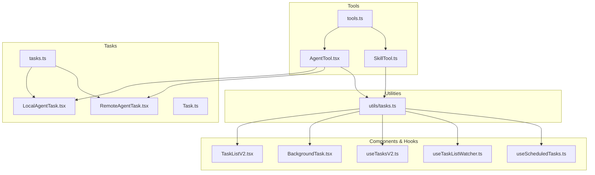
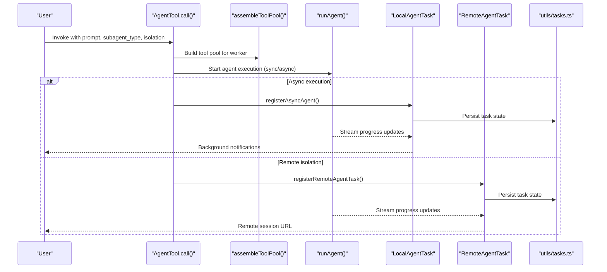
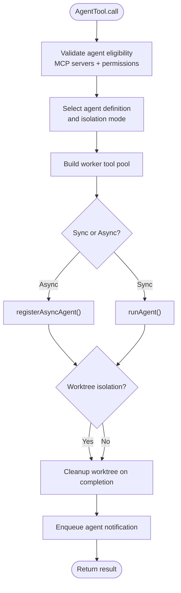
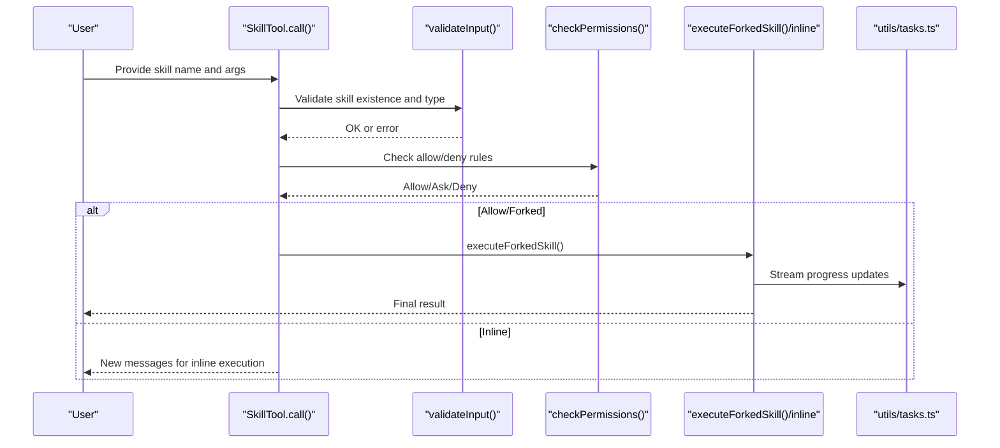
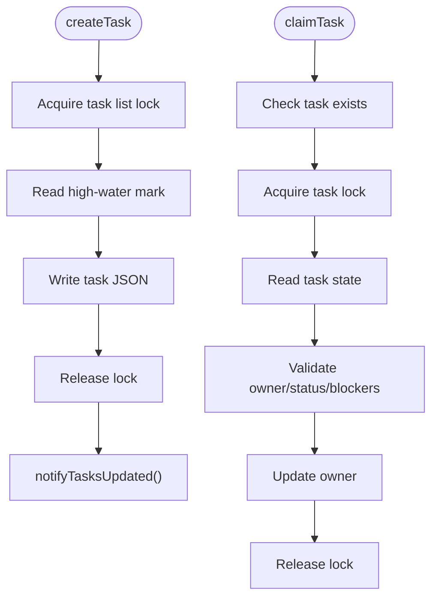
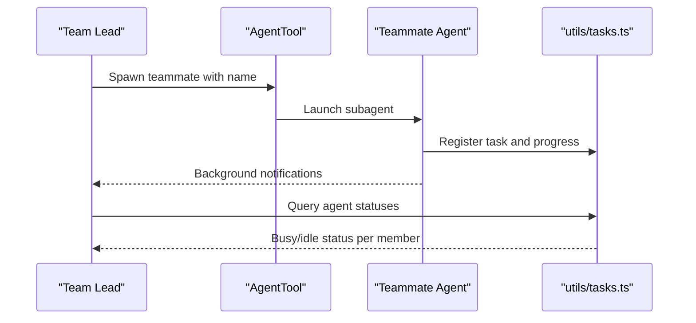
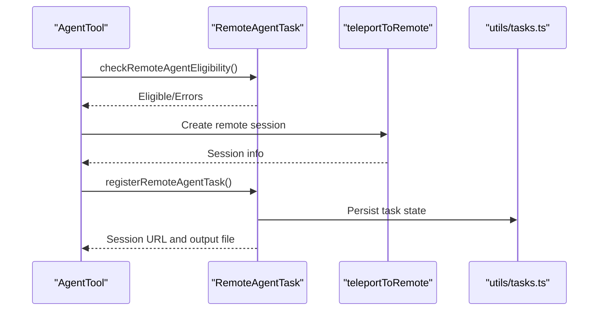
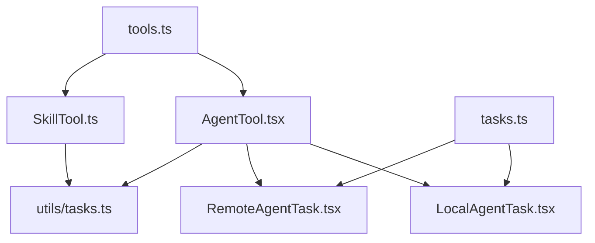

# Agent and Task Management Tools

<cite>
**Referenced Files in This Document**
- [AgentTool.tsx](file://restored-src/src/tools/AgentTool/AgentTool.tsx)
- [SkillTool.ts](file://restored-src/src/tools/SkillTool/SkillTool.ts)
- [tools.ts](file://restored-src/src/tools.ts)
- [tasks.ts](file://restored-src/src/utils/tasks.ts)
- [Task.ts](file://restored-src/src/tasks.ts)
- [LocalAgentTask.tsx](file://restored-src/src/tasks/LocalAgentTask/LocalAgentTask.tsx)
- [RemoteAgentTask.tsx](file://restored-src/src/tasks/RemoteAgentTask/RemoteAgentTask.tsx)
- [TaskListV2.tsx](file://restored-src/src/components/TaskListV2.tsx)
- [BackgroundTask.tsx](file://restored-src/src/components/tasks/BackgroundTask.tsx)
- [useTasksV2.ts](file://restored-src/src/hooks/useTasksV2.ts)
- [useTaskListWatcher.ts](file://restored-src/src/hooks/useTaskListWatcher.ts)
- [useScheduledTasks.ts](file://restored-src/src/hooks/useScheduledTasks.ts)
</cite>

## Table of Contents
1. [Introduction](#introduction)
2. [Project Structure](#project-structure)
3. [Core Components](#core-components)
4. [Architecture Overview](#architecture-overview)
5. [Detailed Component Analysis](#detailed-component-analysis)
6. [Dependency Analysis](#dependency-analysis)
7. [Performance Considerations](#performance-considerations)
8. [Troubleshooting Guide](#troubleshooting-guide)
9. [Conclusion](#conclusion)

## Introduction
This document provides comprehensive documentation for the agent and task management tools within the Claude Code system. It covers AgentTool for orchestrating autonomous agents, SkillTool for executing reusable skills, and the underlying task management infrastructure that powers asynchronous execution, progress tracking, and team collaboration. The guide explains agent orchestration, task lifecycle management, team collaboration patterns, permissions, scheduling, and distributed execution, with practical examples and diagrams.

## Project Structure
The agent and task management functionality spans several modules:
- Tools: AgentTool and SkillTool implementations
- Tasks: Task registry and task-specific implementations
- Utilities: Task persistence, synchronization, and status tracking
- Components and Hooks: UI integration and reactive task state management

**Diagram sources**
- [AgentTool.tsx:196-1387](file://restored-src/src/tools/AgentTool/AgentTool.tsx#L196-L1387)
- [SkillTool.ts:331-869](file://restored-src/src/tools/SkillTool/SkillTool.ts#L331-L869)
- [tools.ts:193-390](file://restored-src/src/tools.ts#L193-L390)
- [tasks.ts:22-40](file://restored-src/src/tasks.ts#L22-L40)
- [utils/tasks.ts:1-800](file://restored-src/src/utils/tasks.ts#L1-L800)
- [Task.ts](file://restored-src/src/Task.ts)

**Section sources**
- [AgentTool.tsx:1-1398](file://restored-src/src/tools/AgentTool/AgentTool.tsx#L1-L1398)
- [SkillTool.ts:1-1109](file://restored-src/src/tools/SkillTool/SkillTool.ts#L1-L1109)
- [tools.ts:1-390](file://restored-src/src/tools.ts#L1-L390)
- [tasks.ts:1-40](file://restored-src/src/tasks.ts#L1-L40)
- [utils/tasks.ts:1-800](file://restored-src/src/utils/tasks.ts#L1-L800)

## Core Components
This section introduces the primary building blocks for agent orchestration and task management.

- AgentTool: Launches and manages subagents with support for synchronous and asynchronous execution, isolation modes (worktree/remote), permission modes, and multi-agent spawning.
- SkillTool: Executes reusable skills (slash commands) either inline or in a forked sub-agent context, with permission checks and telemetry.
- Task Registry: Centralized task discovery and retrieval for the system.
- Task Utilities: File-backed task storage, atomic operations, task claims, and agent status computation for team contexts.

**Section sources**
- [AgentTool.tsx:196-1387](file://restored-src/src/tools/AgentTool/AgentTool.tsx#L196-L1387)
- [SkillTool.ts:331-869](file://restored-src/src/tools/SkillTool/SkillTool.ts#L331-L869)
- [tasks.ts:22-40](file://restored-src/src/tasks.ts#L22-L40)
- [utils/tasks.ts:284-798](file://restored-src/src/utils/tasks.ts#L284-L798)

## Architecture Overview
The system integrates tools, tasks, and utilities to enable robust agent orchestration and task lifecycle management. AgentTool coordinates agent spawning and execution, leveraging LocalAgentTask and RemoteAgentTask for execution contexts. SkillTool encapsulates skill execution with permission gating and telemetry. Task utilities provide persistent, concurrent-safe storage and status tracking.

**Diagram sources**
- [AgentTool.tsx:567-765](file://restored-src/src/tools/AgentTool/AgentTool.tsx#L567-L765)
- [LocalAgentTask.tsx](file://restored-src/src/tasks/LocalAgentTask/LocalAgentTask.tsx)
- [RemoteAgentTask.tsx](file://restored-src/src/tasks/RemoteAgentTask/RemoteAgentTask.tsx)
- [utils/tasks.ts:284-308](file://restored-src/src/utils/tasks.ts#L284-L308)

## Detailed Component Analysis

### AgentTool: Agent Orchestration and Execution
AgentTool is responsible for launching subagents, managing their lifecycle, and coordinating execution across local and remote environments. It supports:
- Subagent selection and filtering based on permissions and MCP requirements
- Isolation modes (worktree for filesystem isolation, remote for distributed execution)
- Permission modes (plan approval, accept edits)
- Synchronous and asynchronous execution with progress tracking
- Multi-agent spawning within team contexts

Key behaviors:
- Validates agent eligibility against MCP server availability and permission rules
- Builds a worker tool pool with appropriate permission mode
- Supports worktree-based isolation and cleanup
- Handles backgrounding and notifications for long-running agents
- Integrates with task utilities for persistent state and progress

**Diagram sources**
- [AgentTool.tsx:367-765](file://restored-src/src/tools/AgentTool/AgentTool.tsx#L367-L765)
- [utils/tasks.ts:284-308](file://restored-src/src/utils/tasks.ts#L284-L308)

**Section sources**
- [AgentTool.tsx:196-1387](file://restored-src/src/tools/AgentTool/AgentTool.tsx#L196-L1387)
- [utils/tasks.ts:284-308](file://restored-src/src/utils/tasks.ts#L284-L308)

### SkillTool: Skill Execution and Permission Management
SkillTool executes reusable skills (slash commands) with:
- Validation against available commands (local and MCP)
- Permission checks with allow/deny rules and auto-allow for safe properties
- Forked vs inline execution modes
- Telemetry and usage tracking
- Remote skill loading (experimental)

Key behaviors:
- Validates skill existence and type
- Applies permission rules and suggests additions
- Executes skills either inline or in a forked sub-agent
- Tracks skill usage and logs telemetry

**Diagram sources**
- [SkillTool.ts:580-841](file://restored-src/src/tools/SkillTool/SkillTool.ts#L580-L841)
- [utils/tasks.ts:284-308](file://restored-src/src/utils/tasks.ts#L284-L308)

**Section sources**
- [SkillTool.ts:331-869](file://restored-src/src/tools/SkillTool/SkillTool.ts#L331-L869)
- [utils/tasks.ts:284-308](file://restored-src/src/utils/tasks.ts#L284-L308)

### Task Lifecycle Management and Persistence
The task system provides:
- Persistent task storage with atomic operations and file locking
- Task creation, update, deletion, and listing
- Task blocking relationships and claim mechanisms
- Agent status computation for team contexts
- Support for scheduled and background tasks

**Diagram sources**
- [utils/tasks.ts:284-308](file://restored-src/src/utils/tasks.ts#L284-L308)
- [utils/tasks.ts:541-692](file://restored-src/src/utils/tasks.ts#L541-L692)

**Section sources**
- [utils/tasks.ts:284-308](file://restored-src/src/utils/tasks.ts#L284-L308)
- [utils/tasks.ts:541-692](file://restored-src/src/utils/tasks.ts#L541-L692)
- [utils/tasks.ts:763-798](file://restored-src/src/utils/tasks.ts#L763-L798)

### Team Collaboration and Task Coordination
Team collaboration features include:
- Team-aware task list resolution and sharing
- Agent status computation per team member
- Multi-agent spawning with named teammates
- Permission modes for plan approval and delegation

**Diagram sources**
- [AgentTool.tsx:284-316](file://restored-src/src/tools/AgentTool/AgentTool.tsx#L284-L316)
- [utils/tasks.ts:763-798](file://restored-src/src/utils/tasks.ts#L763-L798)

**Section sources**
- [AgentTool.tsx:284-316](file://restored-src/src/tools/AgentTool/AgentTool.tsx#L284-L316)
- [utils/tasks.ts:763-798](file://restored-src/src/utils/tasks.ts#L763-L798)

### Distributed Task Execution and Remote Agents
Remote agent execution leverages:
- Eligibility checks for remote environments
- Teleportation to remote sessions
- Registration of remote tasks with persistent state
- Progress streaming and completion notifications

**Diagram sources**
- [AgentTool.tsx:435-482](file://restored-src/src/tools/AgentTool/AgentTool.tsx#L435-L482)
- [RemoteAgentTask.tsx](file://restored-src/src/tasks/RemoteAgentTask/RemoteAgentTask.tsx)

**Section sources**
- [AgentTool.tsx:435-482](file://restored-src/src/tools/AgentTool/AgentTool.tsx#L435-L482)
- [RemoteAgentTask.tsx](file://restored-src/src/tasks/RemoteAgentTask/RemoteAgentTask.tsx)

## Dependency Analysis
The following diagram shows key dependencies among tools, tasks, and utilities:

**Diagram sources**
- [AgentTool.tsx:1-1398](file://restored-src/src/tools/AgentTool/AgentTool.tsx#L1-L1398)
- [SkillTool.ts:1-1109](file://restored-src/src/tools/SkillTool/SkillTool.ts#L1-L1109)
- [tools.ts:193-390](file://restored-src/src/tools.ts#L193-L390)
- [tasks.ts:22-40](file://restored-src/src/tasks.ts#L22-L40)
- [utils/tasks.ts:1-800](file://restored-src/src/utils/tasks.ts#L1-L800)

**Section sources**
- [tools.ts:193-390](file://restored-src/src/tools.ts#L193-L390)
- [tasks.ts:22-40](file://restored-src/src/tasks.ts#L22-L40)

## Performance Considerations
- Asynchronous execution reduces main-thread blocking and improves responsiveness for long-running agents.
- Worktree isolation provides filesystem isolation but may incur overhead; cleanup logic removes unused worktrees to minimize disk usage.
- File locking and atomic operations ensure consistency under concurrent access; backoff retries reduce contention in swarm scenarios.
- Progress streaming and telemetry help monitor resource usage and optimize agent behavior.

## Troubleshooting Guide
Common issues and resolutions:
- Agent spawning fails due to MCP server requirements: Ensure required MCP servers are connected and authenticated before invoking AgentTool.
- Permission denials: Review allow/deny rules for AgentTool and SkillTool; use suggested rule additions to grant access.
- Task claim conflicts: Use claimTask with atomic locks; avoid simultaneous claims by multiple agents.
- Remote agent eligibility errors: Verify prerequisites and network connectivity for remote execution.
- Background task not appearing: Confirm background task registration and notification queue.

**Section sources**
- [AgentTool.tsx:367-410](file://restored-src/src/tools/AgentTool/AgentTool.tsx#L367-L410)
- [SkillTool.ts:432-578](file://restored-src/src/tools/SkillTool/SkillTool.ts#L432-L578)
- [utils/tasks.ts:541-692](file://restored-src/src/utils/tasks.ts#L541-L692)

## Conclusion
The agent and task management system provides a robust foundation for autonomous agent orchestration, skill execution, and collaborative task management. AgentTool and SkillTool integrate tightly with task utilities to support synchronous and asynchronous workflows, permission enforcement, isolation, and distributed execution. The architecture balances flexibility, safety, and performance, enabling scalable agent-driven automation and team collaboration.