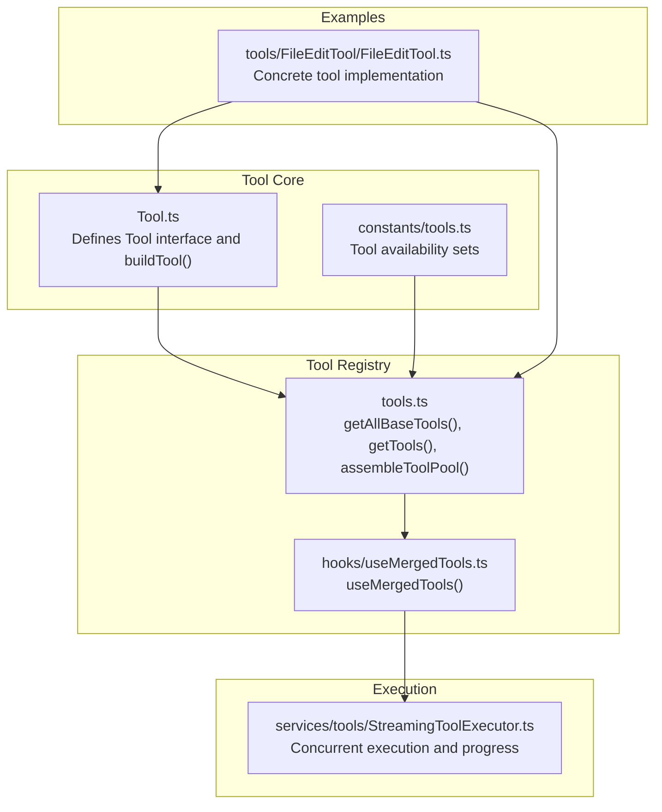
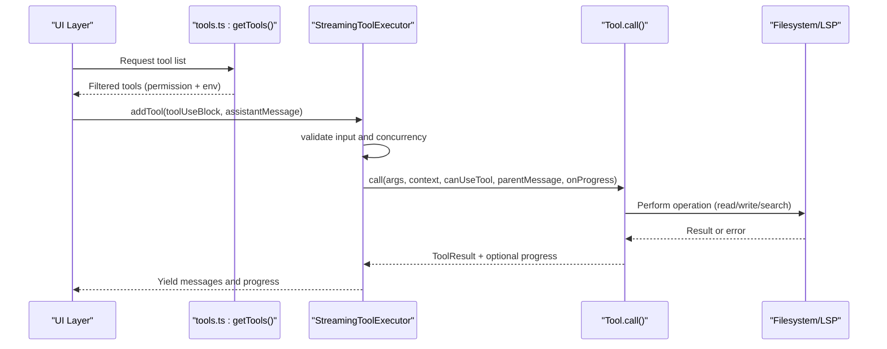
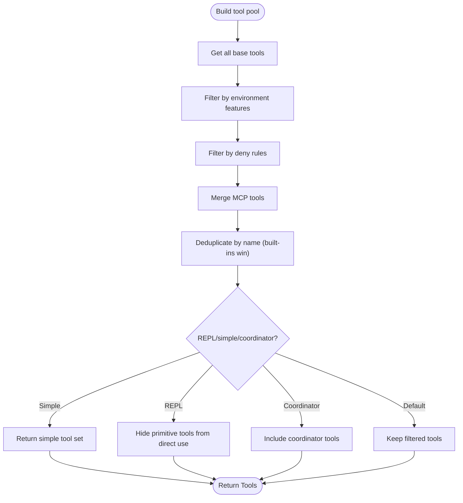
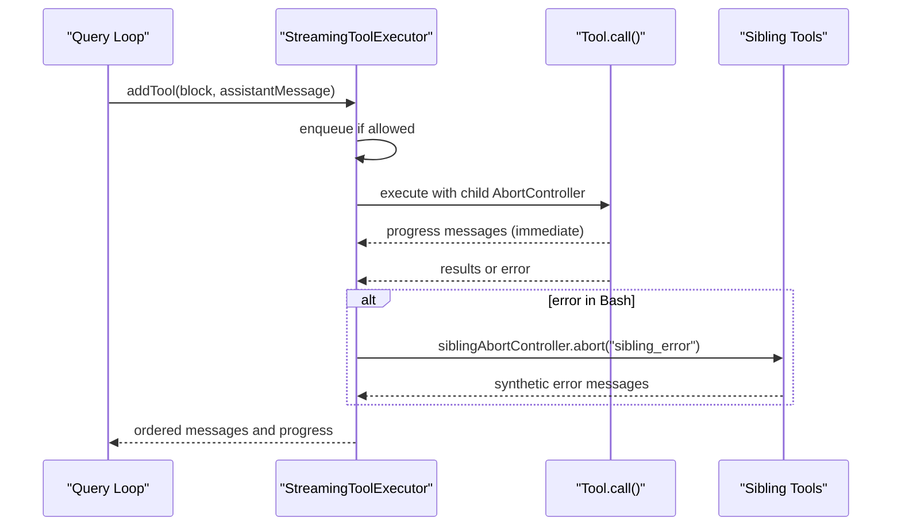
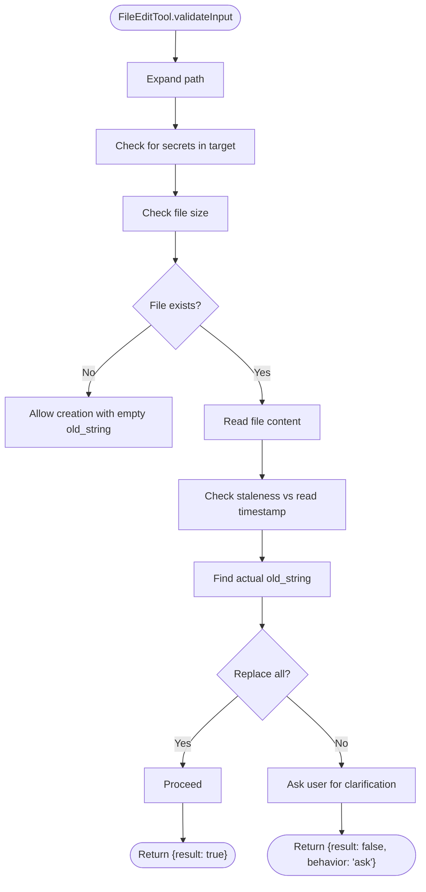
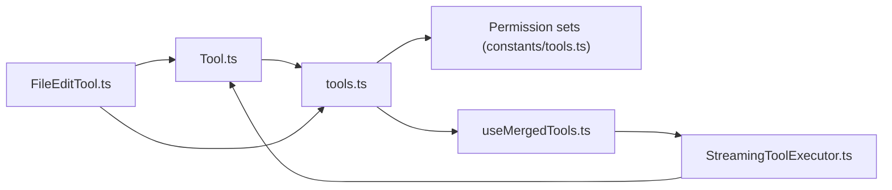

# Custom Tool Development

<cite>
**Referenced Files in This Document**
- [Tool.ts](file://claude_code_src/restored-src/src/Tool.ts)
- [tools.ts](file://claude_code_src/restored-src/src/tools.ts)
- [tools.ts (constants)](file://claude_code_src/restored-src/src/constants/tools.ts)
- [useMergedTools.ts](file://claude_code_src/restored-src/src/hooks/useMergedTools.ts)
- [StreamingToolExecutor.ts](file://claude_code_src/restored-src/src/services/tools/StreamingToolExecutor.ts)
- [FileEditTool.ts](file://claude_code_src/restored-src/src/tools/FileEditTool/FileEditTool.ts)
</cite>

## Table of Contents
1. [Introduction](#introduction)
2. [Project Structure](#project-structure)
3. [Core Components](#core-components)
4. [Architecture Overview](#architecture-overview)
5. [Detailed Component Analysis](#detailed-component-analysis)
6. [Dependency Analysis](#dependency-analysis)
7. [Performance Considerations](#performance-considerations)
8. [Troubleshooting Guide](#troubleshooting-guide)
9. [Conclusion](#conclusion)
10. [Appendices](#appendices)

## Introduction
This document explains how to develop custom tools for the system. It covers the tool interface contract, implementation patterns, registration and lifecycle management, permission integration, security considerations, testing strategies, performance optimization, and deployment approaches. The goal is to enable developers to implement robust, secure, and user-friendly tools that integrate seamlessly with the tool framework and UI.

## Project Structure
The tool system centers around a core interface and a registry that assembles tools from built-in implementations and external sources (e.g., MCP). Tools are filtered by permission rules and environment features, then merged into a single tool pool for use in interactive and non-interactive contexts.



**Diagram sources**
- [Tool.ts:362-792](file://claude_code_src/restored-src/src/Tool.ts#L362-L792)
- [tools.ts:193-367](file://claude_code_src/restored-src/src/tools.ts#L193-L367)
- [constants/tools.ts:36-112](file://claude_code_src/restored-src/src/constants/tools.ts#L36-L112)
- [useMergedTools.ts:20-44](file://claude_code_src/restored-src/src/hooks/useMergedTools.ts#L20-L44)
- [StreamingToolExecutor.ts:40-519](file://claude_code_src/restored-src/src/services/tools/StreamingToolExecutor.ts#L40-L519)
- [FileEditTool.ts:86-595](file://claude_code_src/restored-src/src/tools/FileEditTool/FileEditTool.ts#L86-L595)

**Section sources**
- [Tool.ts:362-792](file://claude_code_src/restored-src/src/Tool.ts#L362-L792)
- [tools.ts:193-367](file://claude_code_src/restored-src/src/tools.ts#L193-L367)
- [constants/tools.ts:36-112](file://claude_code_src/restored-src/src/constants/tools.ts#L36-L112)
- [useMergedTools.ts:20-44](file://claude_code_src/restored-src/src/hooks/useMergedTools.ts#L20-L44)
- [StreamingToolExecutor.ts:40-519](file://claude_code_src/restored-src/src/services/tools/StreamingToolExecutor.ts#L40-L519)
- [FileEditTool.ts:86-595](file://claude_code_src/restored-src/src/tools/FileEditTool/FileEditTool.ts#L86-L595)

## Core Components
- Tool interface and builder: Defines the contract for tools, including input/output schemas, permission checks, progress rendering, and UI hooks. The builder function ensures consistent defaults and type safety.
- Tool registry: Aggregates all available tools, filters by environment and permission rules, merges with MCP tools, and deduplicates by name.
- Permission and availability controls: Centralized sets define which tools are allowed in different modes (async agents, coordinator, teammates).
- Execution engine: Streams tool results, manages concurrency, and propagates progress and context changes.
- Example tool: Demonstrates a real-world implementation with validation, permission checks, progress reporting, and UI rendering.

**Section sources**
- [Tool.ts:362-792](file://claude_code_src/restored-src/src/Tool.ts#L362-L792)
- [tools.ts:193-367](file://claude_code_src/restored-src/src/tools.ts#L193-L367)
- [constants/tools.ts:36-112](file://claude_code_src/restored-src/src/constants/tools.ts#L36-L112)
- [StreamingToolExecutor.ts:40-519](file://claude_code_src/restored-src/src/services/tools/StreamingToolExecutor.ts#L40-L519)
- [FileEditTool.ts:86-595](file://claude_code_src/restored-src/src/tools/FileEditTool/FileEditTool.ts#L86-L595)

## Architecture Overview
The tool architecture separates concerns across interface, registry, permission, execution, and UI layers. Tools declare capabilities and constraints; the registry assembles and filters them; the executor runs them with concurrency control; and the UI renders progress and results.



**Diagram sources**
- [tools.ts:271-327](file://claude_code_src/restored-src/src/tools.ts#L271-L327)
- [StreamingToolExecutor.ts:76-124](file://claude_code_src/restored-src/src/services/tools/StreamingToolExecutor.ts#L76-L124)
- [Tool.ts:379-385](file://claude_code_src/restored-src/src/Tool.ts#L379-L385)
- [FileEditTool.ts:387-574](file://claude_code_src/restored-src/src/tools/FileEditTool/FileEditTool.ts#L387-L574)

## Detailed Component Analysis

### Tool Interface and Builder
The Tool interface defines the contract for all tools, including:
- Required methods: call, description, input/output schemas, permission checks, and UI hooks.
- Optional capabilities: concurrency safety, destructive operations, search/read detection, user interaction needs, and MCP/LSP flags.
- Builder: buildTool injects safe defaults for commonly stubbed methods and enforces consistent behavior.

```mermaid
classDiagram
class Tool {
+name : string
+aliases? : string[]
+searchHint? : string
+call(args, context, canUseTool, parentMessage, onProgress) ToolResult
+description(input, options) string
+inputSchema
+outputSchema?
+inputsEquivalent?(a,b)
+isConcurrencySafe(input) boolean
+isEnabled() boolean
+isReadOnly(input) boolean
+isDestructive?(input) boolean
+interruptBehavior?() "cancel"|"block"
+isSearchOrReadCommand?(input) {...}
+isOpenWorld?(input) boolean
+requiresUserInteraction?() boolean
+isMcp?
+isLsp?
+shouldDefer?
+alwaysLoad?
+mcpInfo?
+maxResultSizeChars : number
+strict?
+backfillObservableInput?(input)
+validateInput?(input, context) ValidationResult
+checkPermissions(input, context) PermissionResult
+getPath?(input) string
+preparePermissionMatcher?(input)
+prompt(options) string
+userFacingName(input?) string
+userFacingNameBackgroundColor?(input?)
+isTransparentWrapper?() boolean
+getToolUseSummary?(input?) string|null
+getActivityDescription?(input?) string|null
+toAutoClassifierInput(input) unknown
+mapToolResultToToolResultBlockParam(content, toolUseID)
+renderToolResultMessage?(content, progress, options) React.ReactNode
+extractSearchText?(out) string
+renderToolUseMessage(input, options) React.ReactNode
+isResultTruncated?(output) boolean
+renderToolUseTag?(input) React.ReactNode
+renderToolUseProgressMessage?(progress, options) React.ReactNode
+renderToolUseQueuedMessage?()
+renderToolUseRejectedMessage?(input, options) React.ReactNode
+renderToolUseErrorMessage?(result, options) React.ReactNode
+renderGroupedToolUse?(toolUses, options) React.ReactNode|null
}
class ToolBuilder {
+buildTool(def) Tool
}
ToolBuilder --> Tool : "creates"
```

**Diagram sources**
- [Tool.ts:362-792](file://claude_code_src/restored-src/src/Tool.ts#L362-L792)

**Section sources**
- [Tool.ts:362-792](file://claude_code_src/restored-src/src/Tool.ts#L362-L792)

### Tool Registration and Lifecycle Management
- Registration: Tools are aggregated in a central registry that respects environment flags, permission rules, and REPL mode. The registry exposes functions to get base tools, filter by deny rules, assemble a combined pool with MCP tools, and merge additional tools.
- Lifecycle: Tools are filtered by isEnabled, then by permission rules, and finally deduplicated by name with built-in tools taking precedence. The registry also supports mode-specific filtering (simple mode, coordinator mode, agent swarms).



**Diagram sources**
- [tools.ts:193-367](file://claude_code_src/restored-src/src/tools.ts#L193-L367)
- [constants/tools.ts:36-112](file://claude_code_src/restored-src/src/constants/tools.ts#L36-L112)

**Section sources**
- [tools.ts:193-367](file://claude_code_src/restored-src/src/tools.ts#L193-L367)
- [constants/tools.ts:36-112](file://claude_code_src/restored-src/src/constants/tools.ts#L36-L112)

### Tool Execution Engine
The StreamingToolExecutor orchestrates tool execution with:
- Concurrency control: Non-concurrent tools run exclusively; concurrent-safe tools may run in parallel.
- Progress streaming: Progress messages are yielded immediately while results are buffered in order.
- Error propagation: Errors in one tool can cancel siblings (e.g., Bash failures) and trigger synthetic error messages for others.
- Interrupt handling: Respects tool interruptBehavior and user interrupts.



**Diagram sources**
- [StreamingToolExecutor.ts:40-519](file://claude_code_src/restored-src/src/services/tools/StreamingToolExecutor.ts#L40-L519)

**Section sources**
- [StreamingToolExecutor.ts:40-519](file://claude_code_src/restored-src/src/services/tools/StreamingToolExecutor.ts#L40-L519)

### Example Tool Implementation: FileEditTool
FileEditTool demonstrates a complete tool implementation:
- Schema: Defines input and output schemas for validation.
- Validation: Performs path expansion, permission checks, file existence and size checks, encoding detection, and content staleness verification.
- Permissions: Integrates with filesystem permission rules and wildcard matching.
- Execution: Reads file content, computes patches, writes atomically, notifies LSP and VSCode, updates read state, and logs operations.
- UI: Provides renderers for tool use messages, progress, results, and error/rejection messages.



**Diagram sources**
- [FileEditTool.ts:137-362](file://claude_code_src/restored-src/src/tools/FileEditTool/FileEditTool.ts#L137-L362)

**Section sources**
- [FileEditTool.ts:86-595](file://claude_code_src/restored-src/src/tools/FileEditTool/FileEditTool.ts#L86-L595)

### Permission Integration and Security Considerations
- Permission context: Tools receive a context that includes mode, working directories, and permission rules. Tools can override permission checks and provide matchers for rule patterns.
- Deny rules: Tools are filtered by deny rules before being presented to the model. MCP server prefixes are supported for blanket denials.
- Security safeguards: FileEditTool enforces path normalization, size limits, UNC path handling, and content staleness checks. It integrates with permission utilities and validates against settings file constraints.

**Section sources**
- [Tool.ts:123-148](file://claude_code_src/restored-src/src/Tool.ts#L123-L148)
- [tools.ts:262-269](file://claude_code_src/restored-src/src/tools.ts#L262-L269)
- [FileEditTool.ts:122-132](file://claude_code_src/restored-src/src/tools/FileEditTool/FileEditTool.ts#L122-L132)
- [FileEditTool.ts:176-200](file://claude_code_src/restored-src/src/tools/FileEditTool/FileEditTool.ts#L176-L200)

### Tool Testing Strategies
- Unit tests: Validate input schemas, permission checks, and error paths. Use stubs for filesystem operations and permission utilities.
- Integration tests: Execute tools in controlled environments (e.g., temporary directories) and assert side effects (file changes, LSP notifications).
- Concurrency tests: Verify that non-concurrent tools block others and that concurrent-safe tools run in parallel without race conditions.
- UI tests: Confirm that progress messages render correctly and that error/rejection messages are displayed as intended.

[No sources needed since this section provides general guidance]

### Step-by-Step: Creating a Custom Tool
1. Define the tool contract:
   - Choose input/output schemas and decide on concurrency safety and destructive behavior.
   - Implement description, prompt, and user-facing name.
2. Implement validation:
   - Use validateInput to enforce constraints and provide actionable messages.
   - Integrate permission checks via checkPermissions and preparePermissionMatcher.
3. Implement execution:
   - Implement call with progress callbacks and context modifiers.
   - Handle errors and cancellation signals.
4. Integrate UI:
   - Provide renderToolUseMessage, renderToolUseProgressMessage, renderToolResultMessage, and error/rejection renderers.
5. Register the tool:
   - Export the tool and add it to the registry via getAllBaseTools or a dedicated module.
6. Test and iterate:
   - Add unit tests, integration tests, and UI tests.
7. Optimize and secure:
   - Apply performance optimizations and security safeguards.
8. Package and deploy:
   - Include the tool in the appropriate build targets and feature flags.

[No sources needed since this section provides general guidance]

## Dependency Analysis
The tool system exhibits low coupling between tools and high cohesion within the registry and execution engine. The registry depends on permission utilities and environment features; the executor depends on the tool interface and context; example tools depend on shared utilities and UI components.



**Diagram sources**
- [Tool.ts:362-792](file://claude_code_src/restored-src/src/Tool.ts#L362-L792)
- [tools.ts:193-367](file://claude_code_src/restored-src/src/tools.ts#L193-L367)
- [constants/tools.ts:36-112](file://claude_code_src/restored-src/src/constants/tools.ts#L36-L112)
- [useMergedTools.ts:20-44](file://claude_code_src/restored-src/src/hooks/useMergedTools.ts#L20-L44)
- [StreamingToolExecutor.ts:40-519](file://claude_code_src/restored-src/src/services/tools/StreamingToolExecutor.ts#L40-L519)
- [FileEditTool.ts:86-595](file://claude_code_src/restored-src/src/tools/FileEditTool/FileEditTool.ts#L86-L595)

**Section sources**
- [tools.ts:193-367](file://claude_code_src/restored-src/src/tools.ts#L193-L367)
- [constants/tools.ts:36-112](file://claude_code_src/restored-src/src/constants/tools.ts#L36-L112)
- [useMergedTools.ts:20-44](file://claude_code_src/restored-src/src/hooks/useMergedTools.ts#L20-L44)
- [StreamingToolExecutor.ts:40-519](file://claude_code_src/restored-src/src/services/tools/StreamingToolExecutor.ts#L40-L519)
- [FileEditTool.ts:86-595](file://claude_code_src/restored-src/src/tools/FileEditTool/FileEditTool.ts#L86-L595)

## Performance Considerations
- Concurrency control: Use isConcurrencySafe to allow parallel execution of independent tools; otherwise, serialize to avoid resource contention.
- Input validation: Perform cheap checks early to fail fast and reduce unnecessary work.
- Progress streaming: Emit frequent progress updates to keep the UI responsive without overwhelming the client.
- Memory and I/O: Respect maxResultSizeChars and file size limits; avoid loading large files entirely into memory when possible.
- Caching and deduplication: Leverage readFileState and prompt caches to minimize repeated work.

[No sources needed since this section provides general guidance]

## Troubleshooting Guide
- Tool not appearing:
  - Verify isEnabled and permission rules; check deny lists and environment flags.
- Permission prompts:
  - Ensure checkPermissions and preparePermissionMatcher are implemented; confirm wildcard patterns match the input.
- Concurrency issues:
  - Mark isConcurrencySafe appropriately; review StreamingToolExecutor behavior for blocking vs canceling on interruption.
- UI rendering:
  - Confirm renderToolUseMessage, renderToolUseProgressMessage, and renderToolResultMessage are implemented; test error and rejection renderers.
- Debugging:
  - Use canUseTool and context helpers; inspect abortController signals and progress messages.

**Section sources**
- [tools.ts:271-327](file://claude_code_src/restored-src/src/tools.ts#L271-L327)
- [Tool.ts:500-503](file://claude_code_src/restored-src/src/Tool.ts#L500-L503)
- [StreamingToolExecutor.ts:233-241](file://claude_code_src/restored-src/src/services/tools/StreamingToolExecutor.ts#L233-L241)
- [FileEditTool.ts:137-362](file://claude_code_src/restored-src/src/tools/FileEditTool/FileEditTool.ts#L137-L362)

## Conclusion
The tool system provides a robust, extensible framework for building custom tools. By adhering to the Tool interface, leveraging the registry and permission mechanisms, and following the execution and UI patterns demonstrated by existing tools, developers can implement secure, performant, and user-friendly tools that integrate seamlessly into the broader system.

[No sources needed since this section summarizes without analyzing specific files]

## Appendices

### Tool Configuration Options
- Environment flags: Control availability of tools (e.g., REPL-only tools, agent triggers, PowerShell tool).
- Permission context: Configure working directories, allow/deny rules, and bypass modes.
- Feature gates: Enable/disable tools based on feature toggles.

**Section sources**
- [tools.ts:14-53](file://claude_code_src/restored-src/src/tools.ts#L14-L53)
- [tools.ts:104-134](file://claude_code_src/restored-src/src/tools.ts#L104-L134)
- [constants/tools.ts:36-112](file://claude_code_src/restored-src/src/constants/tools.ts#L36-L112)

### Tool Distribution, Packaging, and Deployment
- Packaging: Include tool modules in the build; ensure environment flags and feature gates are respected.
- Registration: Export tools and add them to the registry; maintain prompt-cache stability by sorting and deduplicating.
- Deployment: Ship with appropriate permission configurations; test in simple and coordinator modes as applicable.

[No sources needed since this section provides general guidance]