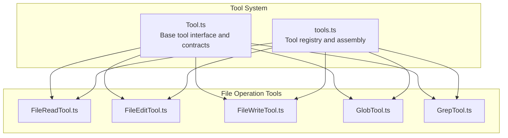
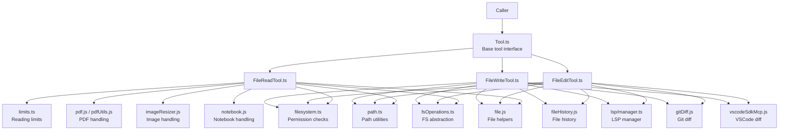
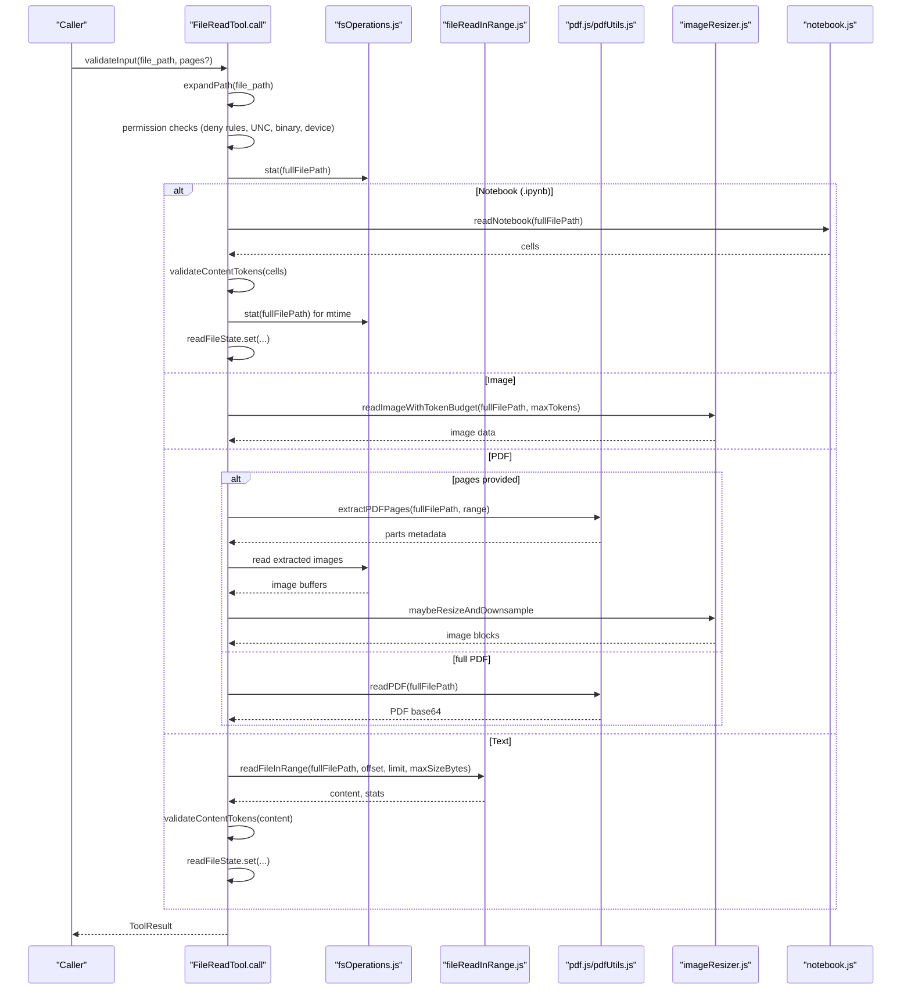
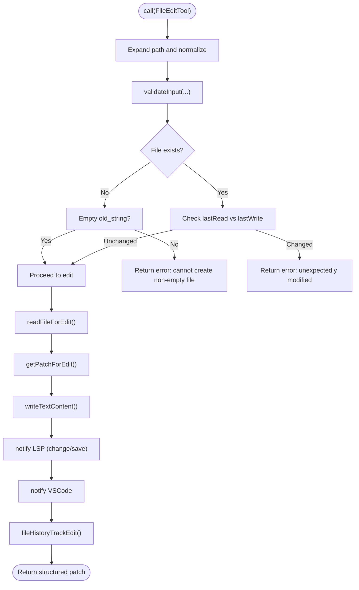
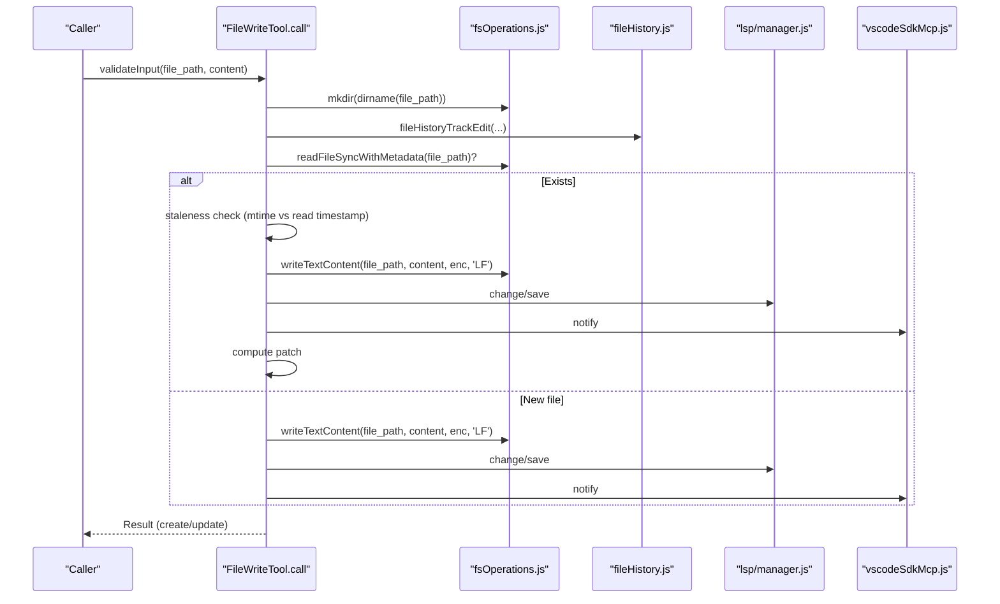
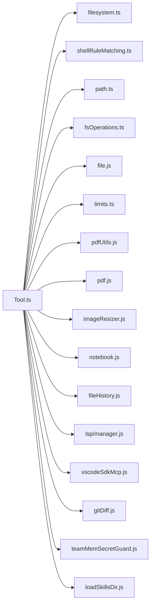

# File Operation Tools

<cite>
**Referenced Files in This Document**
- [tools.ts](file://restored-src/src/tools.ts)
- [Tool.ts](file://restored-src/src/Tool.ts)
- [FileReadTool.ts](file://restored-src/src/tools/FileReadTool/FileReadTool.ts)
- [FileEditTool.ts](file://restored-src/src/tools/FileEditTool/FileEditTool.ts)
- [FileWriteTool.ts](file://restored-src/src/tools/FileWriteTool/FileWriteTool.ts)
- [GlobTool.ts](file://restored-src/src/tools/GlobTool/GlobTool.ts)
- [GrepTool.ts](file://restored-src/src/tools/GrepTool/GrepTool.ts)
- [filesystem.ts](file://restored-src/src/utils/permissions/filesystem.ts)
- [shellRuleMatching.ts](file://restored-src/src/utils/permissions/shellRuleMatching.ts)
- [limits.ts](file://restored-src/src/tools/FileReadTool/limits.ts)
- [path.ts](file://restored-src/src/utils/path.ts)
- [file.ts](file://restored-src/src/utils/file.js)
- [fsOperations.ts](file://restored-src/src/utils/fsOperations.js)
- [pdfUtils.ts](file://restored-src/src/utils/pdfUtils.js)
- [pdf.js](file://restored-src/src/utils/pdf.js)
- [imageResizer.ts](file://restored-src/src/utils/imageResizer.js)
- [notebook.js](file://restored-src/src/utils/notebook.js)
- [fileOperationAnalytics.ts](file://restored-src/src/utils/fileOperationAnalytics.js)
- [envUtils.ts](file://restored-src/src/utils/envUtils.js)
- [errors.ts](file://restored-src/src/utils/errors.js)
- [fileRead.ts](file://restored-src/src/utils/fileRead.js)
- [diff.ts](file://restored-src/src/utils/diff.js)
- [fileHistory.ts](file://restored-src/src/utils/fileHistory.js)
- [lsp/manager.ts](file://restored-src/src/services/lsp/manager.js)
- [vscodeSdkMcp.ts](file://restored-src/src/services/mcp/vscodeSdkMcp.js)
- [gitDiff.ts](file://restored-src/src/utils/gitDiff.js)
- [teamMemSecretGuard.ts](file://restored-src/src/services/teamMemorySync/teamMemSecretGuard.js)
- [loadSkillsDir.js](file://restored-src/src/skills/loadSkillsDir.js)
- [memoryFileDetection.js](file://restored-src/src/utils/memoryFileDetection.js)
- [messages.js](file://restored-src/src/utils/messages.js)
- [tokenEstimation.js](file://restored-src/src/services/tokenEstimation.js)
- [files.ts](file://restored-src/src/constants/files.js)
- [apiLimits.ts](file://restored-src/src/constants/apiLimits.js)
- [fileReadInRange.ts](file://restored-src/src/utils/readFileInRange.js)
</cite>

## Table of Contents
1. [Introduction](#introduction)
2. [Project Structure](#project-structure)
3. [Core Components](#core-components)
4. [Architecture Overview](#architecture-overview)
5. [Detailed Component Analysis](#detailed-component-analysis)
6. [Dependency Analysis](#dependency-analysis)
7. [Performance Considerations](#performance-considerations)
8. [Troubleshooting Guide](#troubleshooting-guide)
9. [Conclusion](#conclusion)

## Introduction
This document provides comprehensive technical documentation for the file operation tools: FileReadTool, FileEditTool, FileWriteTool, GlobTool, and GrepTool. It explains file system operations, path validation, content processing, and search functionality. It also covers permissions, security considerations, file size and token limits, encoding handling, binary file support, error handling, and integration with the permission system and sandboxing mechanisms.

## Project Structure
The file operation tools are part of the broader tool ecosystem. The central Tool interface defines the contract for all tools, while the specific tools implement file system operations with robust validation and permission checks.

**Diagram sources**
- [Tool.ts:362-695](file://restored-src/src/Tool.ts#L362-L695)
- [tools.ts:193-251](file://restored-src/src/tools.ts#L193-L251)

**Section sources**
- [tools.ts:1-390](file://restored-src/src/tools.ts#L1-L390)
- [Tool.ts:362-695](file://restored-src/src/Tool.ts#L362-L695)

## Core Components
- FileReadTool: Reads text, images, PDFs, and notebooks with token and size limits, deduplication, and security safeguards.
- FileEditTool: Performs in-place edits with safety checks, quoting preservation, and LSP/VSC integration.
- FileWriteTool: Overwrites or creates files atomically, validates preconditions, and integrates with diagnostics.
- GlobTool: Lists files matching glob patterns with configurable result limits.
- GrepTool: Searches file contents for patterns with configurable result limits.

Key capabilities:
- Path normalization and validation
- Permission gating and rule matching
- Encoding detection and line ending handling
- Token and size limits for safe content ingestion
- Security safeguards (device files, UNC paths, binary file restrictions)
- Integration with LSP, VSCode, Git diffs, and file history

**Section sources**
- [FileReadTool.ts:337-718](file://restored-src/src/tools/FileReadTool/FileReadTool.ts#L337-L718)
- [FileEditTool.ts:86-595](file://restored-src/src/tools/FileEditTool/FileEditTool.ts#L86-L595)
- [FileWriteTool.ts:94-434](file://restored-src/src/tools/FileWriteTool/FileWriteTool.ts#L94-L434)
- [GlobTool.ts](file://restored-src/src/tools/GlobTool/GlobTool.ts)
- [GrepTool.ts](file://restored-src/src/tools/GrepTool/GrepTool.ts)

## Architecture Overview
The tools rely on a shared permission system and utility libraries for path handling, file operations, and analytics. The Tool base class defines the lifecycle, validation, permission checks, and UI rendering hooks.

**Diagram sources**
- [Tool.ts:362-695](file://restored-src/src/Tool.ts#L362-L695)
- [FileReadTool.ts:1-1184](file://restored-src/src/tools/FileReadTool/FileReadTool.ts#L1-L1184)
- [FileEditTool.ts:1-626](file://restored-src/src/tools/FileEditTool/FileEditTool.ts#L1-L626)
- [FileWriteTool.ts:1-435](file://restored-src/src/tools/FileWriteTool/FileWriteTool.ts#L1-L435)
- [filesystem.ts](file://restored-src/src/utils/permissions/filesystem.ts)
- [path.ts](file://restored-src/src/utils/path.ts)
- [fsOperations.ts](file://restored-src/src/utils/fsOperations.js)
- [file.ts](file://restored-src/src/utils/file.js)
- [limits.ts](file://restored-src/src/tools/FileReadTool/limits.ts)
- [pdf.js](file://restored-src/src/utils/pdf.js)
- [pdfUtils.ts](file://restored-src/src/utils/pdfUtils.js)
- [imageResizer.ts](file://restored-src/src/utils/imageResizer.js)
- [notebook.js](file://restored-src/src/utils/notebook.js)
- [fileHistory.ts](file://restored-src/src/utils/fileHistory.js)
- [lsp/manager.ts](file://restored-src/src/services/lsp/manager.js)
- [gitDiff.ts](file://restored-src/src/utils/gitDiff.js)
- [vscodeSdkMcp.ts](file://restored-src/src/services/mcp/vscodeSdkMcp.js)

## Detailed Component Analysis

### FileReadTool
Purpose: Safely read files with support for text, images, PDFs, and notebooks, enforcing size and token limits, deduplication, and security safeguards.

Key behaviors:
- Validates input (pages range, deny rules, binary extensions, blocked device paths)
- Normalizes paths and expands wildcards for permission matching
- Supports partial reads via offset/limit and targeted page ranges for PDFs
- Enforces token and size limits with estimation and fallbacks
- Handles macOS screenshot alternate space variants
- Emits telemetry and analytics events
- Integrates with skills discovery and memory freshness indicators

**Diagram sources**
- [FileReadTool.ts:496-1086](file://restored-src/src/tools/FileReadTool/FileReadTool.ts#L496-L1086)
- [fileReadInRange.ts](file://restored-src/src/utils/readFileInRange.js)
- [pdf.js](file://restored-src/src/utils/pdf.js)
- [pdfUtils.ts](file://restored-src/src/utils/pdfUtils.js)
- [imageResizer.ts](file://restored-src/src/utils/imageResizer.js)
- [notebook.js](file://restored-src/src/utils/notebook.js)

**Section sources**
- [FileReadTool.ts:1-1184](file://restored-src/src/tools/FileReadTool/FileReadTool.ts#L1-L1184)
- [limits.ts](file://restored-src/src/tools/FileReadTool/limits.ts)
- [pdfUtils.ts](file://restored-src/src/utils/pdfUtils.js)
- [pdf.js](file://restored-src/src/utils/pdf.js)
- [imageResizer.ts](file://restored-src/src/utils/imageResizer.js)
- [notebook.js](file://restored-src/src/utils/notebook.js)
- [fileReadInRange.ts](file://restored-src/src/utils/readFileInRange.js)

### FileEditTool
Purpose: Perform in-place edits with safety checks, quoting preservation, and integration with LSP and VSCode.

Key behaviors:
- Validates inputs (old/new strings, replace_all, settings file rules)
- Ensures file has been read and not unexpectedly modified since read
- Prevents edits to notebooks; enforces maximum file size
- Preserves quote style and normalizes line endings
- Atomic write with mkdir and file history backup
- Updates LSP diagnostics and notifies VSCode for diff view
- Computes structured patches and optional Git diffs

**Diagram sources**
- [FileEditTool.ts:387-595](file://restored-src/src/tools/FileEditTool/FileEditTool.ts#L387-L595)
- [fileRead.ts](file://restored-src/src/utils/fileRead.js)
- [diff.ts](file://restored-src/src/utils/diff.js)
- [fileHistory.ts](file://restored-src/src/utils/fileHistory.js)
- [lsp/manager.ts](file://restored-src/src/services/lsp/manager.js)
- [vscodeSdkMcp.ts](file://restored-src/src/services/mcp/vscodeSdkMcp.js)

**Section sources**
- [FileEditTool.ts:1-626](file://restored-src/src/tools/FileEditTool/FileEditTool.ts#L1-L626)
- [diff.ts](file://restored-src/src/utils/diff.js)
- [fileHistory.ts](file://restored-src/src/utils/fileHistory.js)
- [lsp/manager.ts](file://restored-src/src/services/lsp/manager.js)
- [vscodeSdkMcp.ts](file://restored-src/src/services/mcp/vscodeSdkMcp.js)

### FileWriteTool
Purpose: Overwrite or create files atomically, validating preconditions and integrating with diagnostics.

Key behaviors:
- Validates inputs and permissions
- Ensures file has been read and not unexpectedly modified
- Writes full content replacement with explicit line endings
- Notifies LSP and VSCode, computes structured patches for updates
- Tracks file history and logs operations

**Diagram sources**
- [FileWriteTool.ts:223-434](file://restored-src/src/tools/FileWriteTool/FileWriteTool.ts#L223-L434)
- [fileRead.ts](file://restored-src/src/utils/fileRead.js)
- [fileHistory.ts](file://restored-src/src/utils/fileHistory.js)
- [lsp/manager.ts](file://restored-src/src/services/lsp/manager.js)
- [vscodeSdkMcp.ts](file://restored-src/src/services/mcp/vscodeSdkMcp.js)

**Section sources**
- [FileWriteTool.ts:1-435](file://restored-src/src/tools/FileWriteTool/FileWriteTool.ts#L1-L435)

### GlobTool
Purpose: Enumerate files matching glob patterns with configurable result limits.

Key behaviors:
- Validates glob patterns and permissions
- Uses embedded search tools when available, otherwise falls back to dedicated tool
- Applies maxResults limit from context

**Section sources**
- [GlobTool.ts](file://restored-src/src/tools/GlobTool/GlobTool.ts)
- [tools.ts:193-251](file://restored-src/src/tools.ts#L193-L251)

### GrepTool
Purpose: Search file contents for patterns with configurable result limits.

Key behaviors:
- Validates patterns and permissions
- Uses embedded search tools when available, otherwise falls back to dedicated tool
- Applies maxResults limit from context

**Section sources**
- [GrepTool.ts](file://restored-src/src/tools/GrepTool/GrepTool.ts)
- [tools.ts:193-251](file://restored-src/src/tools.ts#L193-L251)

## Dependency Analysis
The tools depend on a shared permission system and utility libraries. The Tool base class centralizes lifecycle hooks, validation, permission checks, and UI rendering.

**Diagram sources**
- [Tool.ts:362-695](file://restored-src/src/Tool.ts#L362-L695)
- [filesystem.ts](file://restored-src/src/utils/permissions/filesystem.ts)
- [shellRuleMatching.ts](file://restored-src/src/utils/permissions/shellRuleMatching.ts)
- [path.ts](file://restored-src/src/utils/path.ts)
- [fsOperations.ts](file://restored-src/src/utils/fsOperations.js)
- [file.ts](file://restored-src/src/utils/file.js)
- [limits.ts](file://restored-src/src/tools/FileReadTool/limits.ts)
- [pdfUtils.ts](file://restored-src/src/utils/pdfUtils.js)
- [pdf.js](file://restored-src/src/utils/pdf.js)
- [imageResizer.ts](file://restored-src/src/utils/imageResizer.js)
- [notebook.js](file://restored-src/src/utils/notebook.js)
- [fileHistory.ts](file://restored-src/src/utils/fileHistory.js)
- [lsp/manager.ts](file://restored-src/src/services/lsp/manager.js)
- [vscodeSdkMcp.ts](file://restored-src/src/services/mcp/vscodeSdkMcp.js)
- [gitDiff.ts](file://restored-src/src/utils/gitDiff.js)
- [teamMemSecretGuard.ts](file://restored-src/src/services/teamMemorySync/teamMemSecretGuard.js)
- [loadSkillsDir.js](file://restored-src/src/skills/loadSkillsDir.js)

**Section sources**
- [Tool.ts:362-695](file://restored-src/src/Tool.ts#L362-L695)
- [filesystem.ts](file://restored-src/src/utils/permissions/filesystem.ts)
- [shellRuleMatching.ts](file://restored-src/src/utils/permissions/shellRuleMatching.ts)
- [path.ts](file://restored-src/src/utils/path.ts)
- [fsOperations.ts](file://restored-src/src/utils/fsOperations.js)
- [file.ts](file://restored-src/src/utils/file.js)
- [limits.ts](file://restored-src/src/tools/FileReadTool/limits.ts)
- [pdfUtils.ts](file://restored-src/src/utils/pdfUtils.js)
- [pdf.js](file://restored-src/src/utils/pdf.js)
- [imageResizer.ts](file://restored-src/src/utils/imageResizer.js)
- [notebook.js](file://restored-src/src/utils/notebook.js)
- [fileHistory.ts](file://restored-src/src/utils/fileHistory.js)
- [lsp/manager.ts](file://restored-src/src/services/lsp/manager.js)
- [vscodeSdkMcp.ts](file://restored-src/src/services/mcp/vscodeSdkMcp.js)
- [gitDiff.ts](file://restored-src/src/utils/gitDiff.js)
- [teamMemSecretGuard.ts](file://restored-src/src/services/teamMemorySync/teamMemSecretGuard.js)
- [loadSkillsDir.js](file://restored-src/src/skills/loadSkillsDir.js)

## Performance Considerations
- Token and size limits: FileReadTool estimates tokens and enforces limits to prevent excessive memory usage and API costs.
- Deduplication: FileReadTool caches recent reads and returns a stub when content is unchanged, reducing repeated I/O and token usage.
- Partial reads: Offset/limit and page ranges enable efficient processing of large files.
- Image compression: Image handling applies resizing and compression to meet token budgets.
- Embedded search: When available, GlobTool and GrepTool use embedded tools to avoid overhead of spawning external processes.
- Atomic writes: FileEditTool and FileWriteTool minimize race conditions by checking staleness and writing atomically.

[No sources needed since this section provides general guidance]

## Troubleshooting Guide
Common issues and resolutions:
- File not found: The tools suggest similar files or paths under the current working directory and provide helpful hints.
- Unexpectedly modified: If the file changed since it was last read, edits are blocked to prevent conflicts.
- Permission denied: Denied by permission settings; adjust rules or request approval.
- UNC paths on Windows: UNC paths are validated to prevent credential leakage; handle them via permissions.
- Binary files: Binary files are not readable by FileReadTool; use appropriate tools for binary analysis.
- Device files: Certain device files are blocked to prevent hangs or infinite output.
- Large files: FileEditTool enforces a maximum file size; split edits or use streaming approaches.
- Notebook edits: Use NotebookEditTool for .ipynb files.
- Encoding issues: FileEditTool and FileWriteTool preserve or normalize line endings; ensure content encoding matches expectations.

**Section sources**
- [FileReadTool.ts:418-651](file://restored-src/src/tools/FileReadTool/FileReadTool.ts#L418-L651)
- [FileEditTool.ts:137-362](file://restored-src/src/tools/FileEditTool/FileEditTool.ts#L137-L362)
- [FileWriteTool.ts:153-222](file://restored-src/src/tools/FileWriteTool/FileWriteTool.ts#L153-L222)
- [errors.ts](file://restored-src/src/utils/errors.js)
- [file.ts](file://restored-src/src/utils/file.js)

## Conclusion
The file operation tools provide a secure, efficient, and integrated way to read, edit, and write files, along with search and listing capabilities. They enforce strong permission checks, handle encoding and binary content appropriately, and integrate with diagnostics and development tools. By leveraging limits, deduplication, and atomic operations, they balance usability with safety and performance.