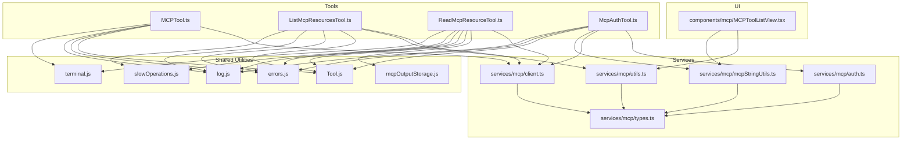
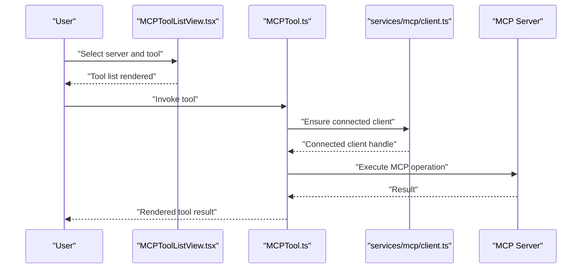
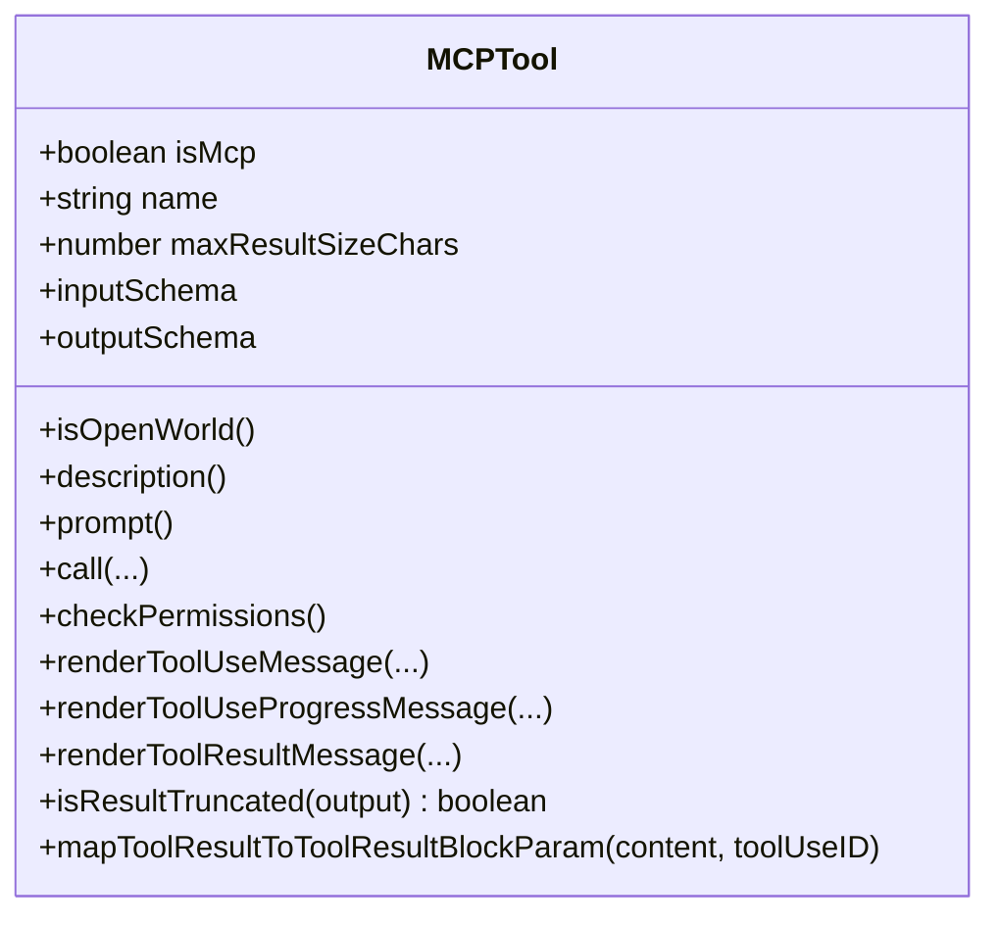
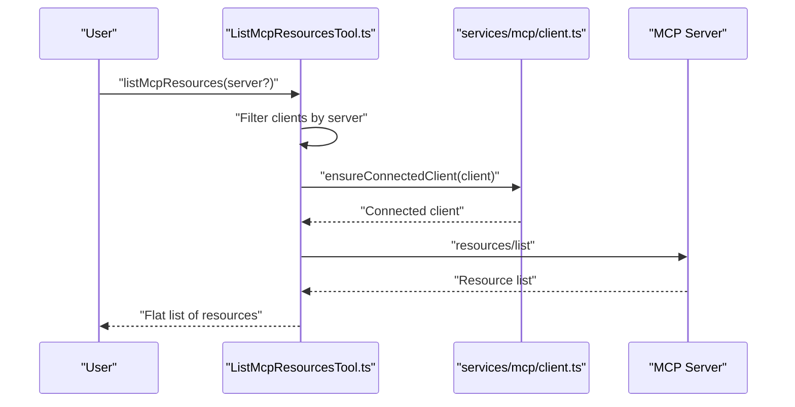
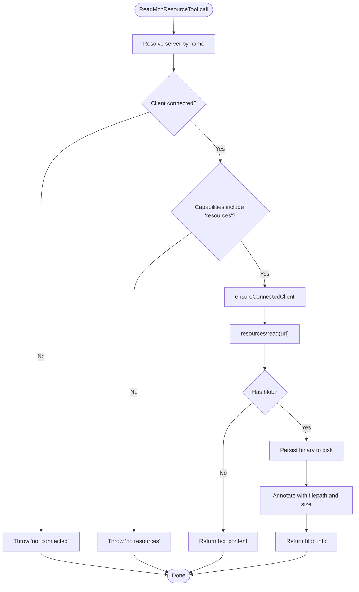
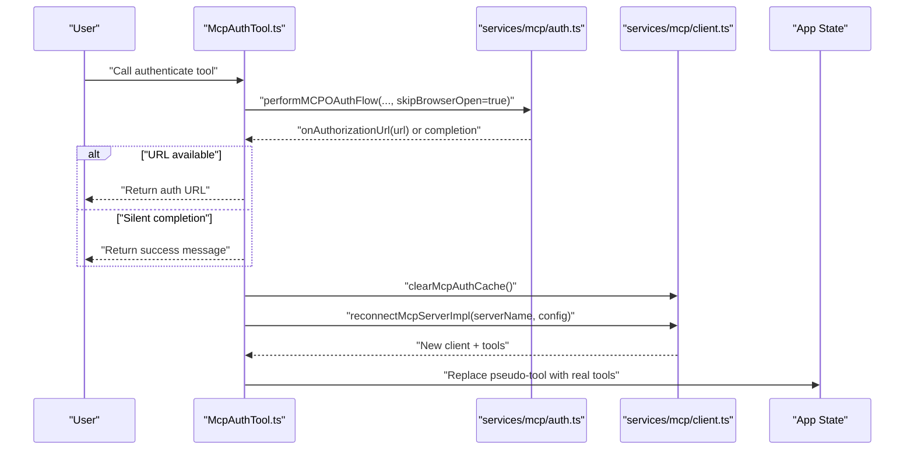
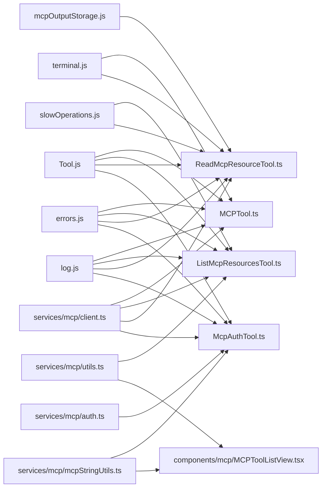

# MCP Integration Tools

<cite>
**Referenced Files in This Document**
- [MCPTool.ts](file://claude_code_src/restored-src/src/tools/MCPTool/MCPTool.ts)
- [ListMcpResourcesTool.ts](file://claude_code_src/restored-src/src/tools/ListMcpResourcesTool/ListMcpResourcesTool.ts)
- [ReadMcpResourceTool.ts](file://claude_code_src/restored-src/src/tools/ReadMcpResourceTool/ReadMcpResourceTool.ts)
- [McpAuthTool.ts](file://claude_code_src/restored-src/src/tools/McpAuthTool/McpAuthTool.ts)
- [MCPToolListView.tsx](file://claude_code_src/restored-src/src/components/mcp/MCPToolListView.tsx)
- [client.ts](file://claude_code_src/restored-src/src/services/mcp/client.ts)
- [auth.ts](file://claude_code_src/restored-src/src/services/mcp/auth.ts)
- [types.ts](file://claude_code_src/restored-src/src/services/mcp/types.ts)
- [mcpStringUtils.ts](file://claude_code_src/restored-src/src/services/mcp/mcpStringUtils.ts)
- [utils.ts](file://claude_code_src/restored-src/src/services/mcp/utils.ts)
- [Tool.js](file://claude_code_src/restored-src/src/Tool.js)
- [errors.js](file://claude_code_src/restored-src/src/utils/errors.js)
- [log.js](file://claude_code_src/restored-src/src/utils/log.js)
- [slowOperations.js](file://claude_code_src/restored-src/src/utils/slowOperations.js)
- [terminal.js](file://claude_code_src/restored-src/src/utils/terminal.js)
- [mcpOutputStorage.js](file://claude_code_src/restored-src/src/utils/mcpOutputStorage.js)
</cite>

## Table of Contents
1. [Introduction](#introduction)
2. [Project Structure](#project-structure)
3. [Core Components](#core-components)
4. [Architecture Overview](#architecture-overview)
5. [Detailed Component Analysis](#detailed-component-analysis)
6. [Dependency Analysis](#dependency-analysis)
7. [Performance Considerations](#performance-considerations)
8. [Troubleshooting Guide](#troubleshooting-guide)
9. [Conclusion](#conclusion)
10. [Appendices](#appendices)

## Introduction
This document explains the Model Context Protocol (MCP) integration tools in the codebase, focusing on MCPTool, ListMcpResourcesTool, ReadMcpResourceTool, and McpAuthTool. It covers MCP protocol implementation, server discovery, resource management, tool registration, authentication mechanisms, protocol compliance, security considerations, permission integration, error handling, and lifecycle management within the built-in tool system.

## Project Structure
The MCP integration spans three primary areas:
- Tools: MCPTool, ListMcpResourcesTool, ReadMcpResourceTool, and McpAuthTool implement the user-facing capabilities.
- Services: MCP client, authentication, types, and utilities orchestrate connections, capability checks, and resource access.
- UI: MCPToolListView renders server-specific tool lists for user selection.

**Diagram sources**
- [MCPTool.ts:1-78](file://claude_code_src/restored-src/src/tools/MCPTool/MCPTool.ts#L1-L78)
- [ListMcpResourcesTool.ts:1-124](file://claude_code_src/restored-src/src/tools/ListMcpResourcesTool/ListMcpResourcesTool.ts#L1-L124)
- [ReadMcpResourceTool.ts:1-159](file://claude_code_src/restored-src/src/tools/ReadMcpResourceTool/ReadMcpResourceTool.ts#L1-L159)
- [McpAuthTool.ts:1-216](file://claude_code_src/restored-src/src/tools/McpAuthTool/McpAuthTool.ts#L1-L216)
- [MCPToolListView.tsx:1-141](file://claude_code_src/restored-src/src/components/mcp/MCPToolListView.tsx#L1-L141)
- [client.ts](file://claude_code_src/restored-src/src/services/mcp/client.ts/client.ts)
- [auth.ts](file://claude_code_src/restored-src/src/services/mcp/auth.ts/auth.ts)
- [types.ts](file://claude_code_src/restored-src/src/services/mcp/types.ts/types.ts)
- [utils.ts](file://claude_code_src/restored-src/src/services/mcp/utils.ts)
- [mcpStringUtils.ts](file://claude_code_src/restored-src/src/services/mcp/mcpStringUtils.ts)
- [Tool.js](file://claude_code_src/restored-src/src/Tool.js)
- [errors.js](file://claude_code_src/restored-src/src/utils/errors.js)
- [log.js](file://claude_code_src/restored-src/src/utils/log.js)
- [slowOperations.js](file://claude_code_src/restored-src/src/utils/slowOperations.js)
- [terminal.js](file://claude_code_src/restored-src/src/utils/terminal.js)
- [mcpOutputStorage.js](file://claude_code_src/restored-src/src/utils/mcpOutputStorage.js)

**Section sources**
- [MCPTool.ts:1-78](file://claude_code_src/restored-src/src/tools/MCPTool/MCPTool.ts#L1-L78)
- [ListMcpResourcesTool.ts:1-124](file://claude_code_src/restored-src/src/tools/ListMcpResourcesTool/ListMcpResourcesTool.ts#L1-L124)
- [ReadMcpResourceTool.ts:1-159](file://claude_code_src/restored-src/src/tools/ReadMcpResourceTool/ReadMcpResourceTool.ts#L1-L159)
- [McpAuthTool.ts:1-216](file://claude_code_src/restored-src/src/tools/McpAuthTool/McpAuthTool.ts#L1-L216)
- [MCPToolListView.tsx:1-141](file://claude_code_src/restored-src/src/components/mcp/MCPToolListView.tsx#L1-L141)

## Core Components
- MCPTool: A generic, open-world MCP tool wrapper that delegates execution to MCP servers. It defines flexible input/output schemas, permission passthrough, and rendering helpers.
- ListMcpResourcesTool: Discovers and lists resources across connected MCP servers with caching and resilient error handling per server.
- ReadMcpResourceTool: Reads a specific resource by URI from a named MCP server, handling text and binary content with safe persistence and MIME-aware labeling.
- McpAuthTool: Dynamically creates an authentication proxy tool for unauthenticated servers, initiating OAuth flows and replacing itself with real tools upon completion.

**Section sources**
- [MCPTool.ts:27-77](file://claude_code_src/restored-src/src/tools/MCPTool/MCPTool.ts#L27-L77)
- [ListMcpResourcesTool.ts:40-123](file://claude_code_src/restored-src/src/tools/ListMcpResourcesTool/ListMcpResourcesTool.ts#L40-L123)
- [ReadMcpResourceTool.ts:49-158](file://claude_code_src/restored-src/src/tools/ReadMcpResourceTool/ReadMcpResourceTool.ts#L49-L158)
- [McpAuthTool.ts:49-215](file://claude_code_src/restored-src/src/tools/McpAuthTool/McpAuthTool.ts#L49-L215)

## Architecture Overview
MCP tools integrate with the built-in tool system via a shared ToolDef interface. MCPTool acts as a container for server-provided tools. ListMcpResourcesTool and ReadMcpResourceTool rely on a managed MCP client that maintains connections, caches resources, and exposes capability checks. McpAuthTool dynamically surfaces authentication actions for servers requiring OAuth.

**Diagram sources**
- [MCPToolListView.tsx:20-134](file://claude_code_src/restored-src/src/components/mcp/MCPToolListView.tsx#L20-L134)
- [MCPTool.ts:27-77](file://claude_code_src/restored-src/src/tools/MCPTool/MCPTool.ts#L27-L77)
- [client.ts](file://claude_code_src/restored-src/src/services/mcp/client.ts/client.ts)

## Detailed Component Analysis

### MCPTool
MCPTool is a thin wrapper that:
- Declares itself as an MCP tool and defers execution to server-side implementations.
- Uses lazy schemas to avoid import cycles and supports unconstrained inputs.
- Provides rendering hooks for tool use, progress, and results.
- Enforces permission behavior via a passthrough decision and truncation checks based on terminal output limits.

**Diagram sources**
- [MCPTool.ts:27-77](file://claude_code_src/restored-src/src/tools/MCPTool/MCPTool.ts#L27-L77)

**Section sources**
- [MCPTool.ts:1-78](file://claude_code_src/restored-src/src/tools/MCPTool/MCPTool.ts#L1-L78)
- [Tool.js](file://claude_code_src/restored-src/src/Tool.js)

### ListMcpResourcesTool
Responsibilities:
- Validates optional server filter and collects clients to process.
- Ensures each client is connected and fetches resources with caching semantics.
- Aggregates results across servers and handles partial failures gracefully.
- Renders results as JSON or a friendly message when empty.

**Diagram sources**
- [ListMcpResourcesTool.ts:66-101](file://claude_code_src/restored-src/src/tools/ListMcpResourcesTool/ListMcpResourcesTool.ts#L66-L101)
- [client.ts](file://claude_code_src/restored-src/src/services/mcp/client.ts/client.ts)

**Section sources**
- [ListMcpResourcesTool.ts:1-124](file://claude_code_src/restored-src/src/tools/ListMcpResourcesTool/ListMcpResourcesTool.ts#L1-L124)
- [errors.js](file://claude_code_src/restored-src/src/utils/errors.js)
- [log.js](file://claude_code_src/restored-src/src/utils/log.js)
- [slowOperations.js](file://claude_code_src/restored-src/src/utils/slowOperations.js)
- [terminal.js](file://claude_code_src/restored-src/src/utils/terminal.js)

### ReadMcpResourceTool
Responsibilities:
- Resolves a specific server and validates connectivity and capabilities.
- Executes the resources/read request against the server.
- Handles binary content by decoding base64 blobs, persisting them safely, and annotating results with file paths and human-readable messages.
- Returns structured content arrays with either text or persisted blob metadata.

**Diagram sources**
- [ReadMcpResourceTool.ts:75-144](file://claude_code_src/restored-src/src/tools/ReadMcpResourceTool/ReadMcpResourceTool.ts#L75-L144)
- [mcpOutputStorage.js](file://claude_code_src/restored-src/src/utils/mcpOutputStorage.js)

**Section sources**
- [ReadMcpResourceTool.ts:1-159](file://claude_code_src/restored-src/src/tools/ReadMcpResourceTool/ReadMcpResourceTool.ts#L1-L159)
- [mcpOutputStorage.js](file://claude_code_src/restored-src/src/utils/mcpOutputStorage.js)
- [terminal.js](file://claude_code_src/restored-src/src/utils/terminal.js)
- [slowOperations.js](file://claude_code_src/restored-src/src/utils/slowOperations.js)

### McpAuthTool
Responsibilities:
- Generates a pseudo-tool for unauthenticated servers to surface the need for OAuth.
- Supports SSE and HTTP transports for OAuth initiation.
- Starts the OAuth flow and, upon completion, triggers reconnection and replaces the pseudo-tool with real tools.
- Provides user-facing messaging indicating whether an auth URL is available or if authentication completed silently.

**Diagram sources**
- [McpAuthTool.ts:85-206](file://claude_code_src/restored-src/src/tools/McpAuthTool/McpAuthTool.ts#L85-L206)
- [auth.ts](file://claude_code_src/restored-src/src/services/mcp/auth.ts/auth.ts)
- [client.ts](file://claude_code_src/restored-src/src/services/mcp/client.ts/client.ts)
- [mcpStringUtils.ts](file://claude_code_src/restored-src/src/services/mcp/mcpStringUtils.ts)

**Section sources**
- [McpAuthTool.ts:1-216](file://claude_code_src/restored-src/src/tools/McpAuthTool/McpAuthTool.ts#L1-L216)
- [auth.ts](file://claude_code_src/restored-src/src/services/mcp/auth.ts/auth.ts)
- [client.ts](file://claude_code_src/restored-src/src/services/mcp/client.ts/client.ts)
- [mcpStringUtils.ts](file://claude_code_src/restored-src/src/services/mcp/mcpStringUtils.ts)
- [log.js](file://claude_code_src/restored-src/src/utils/log.js)
- [errors.js](file://claude_code_src/restored-src/src/utils/errors.js)

## Dependency Analysis
- Tools depend on the shared ToolDef interface and utilities for logging, error extraction, JSON serialization, and terminal truncation.
- ListMcpResourcesTool and ReadMcpResourceTool depend on the MCP client service for connectivity and capability checks.
- McpAuthTool depends on the MCP auth service and client reconnect logic, plus string utilities for tool naming and prefixes.
- UI components depend on MCP utilities for filtering and display name generation.

**Diagram sources**
- [Tool.js](file://claude_code_src/restored-src/src/Tool.js)
- [MCPTool.ts:1-78](file://claude_code_src/restored-src/src/tools/MCPTool/MCPTool.ts#L1-L78)
- [ListMcpResourcesTool.ts:1-124](file://claude_code_src/restored-src/src/tools/ListMcpResourcesTool/ListMcpResourcesTool.ts#L1-L124)
- [ReadMcpResourceTool.ts:1-159](file://claude_code_src/restored-src/src/tools/ReadMcpResourceTool/ReadMcpResourceTool.ts#L1-L159)
- [McpAuthTool.ts:1-216](file://claude_code_src/restored-src/src/tools/McpAuthTool/McpAuthTool.ts#L1-L216)
- [MCPToolListView.tsx:1-141](file://claude_code_src/restored-src/src/components/mcp/MCPToolListView.tsx#L1-L141)
- [client.ts](file://claude_code_src/restored-src/src/services/mcp/client.ts/client.ts)
- [auth.ts](file://claude_code_src/restored-src/src/services/mcp/auth.ts/auth.ts)
- [mcpStringUtils.ts](file://claude_code_src/restored-src/src/services/mcp/mcpStringUtils.ts)
- [utils.ts](file://claude_code_src/restored-src/src/services/mcp/utils.ts)
- [errors.js](file://claude_code_src/restored-src/src/utils/errors.js)
- [log.js](file://claude_code_src/restored-src/src/utils/log.js)
- [slowOperations.js](file://claude_code_src/restored-src/src/utils/slowOperations.js)
- [terminal.js](file://claude_code_src/restored-src/src/utils/terminal.js)
- [mcpOutputStorage.js](file://claude_code_src/restored-src/src/utils/mcpOutputStorage.js)

**Section sources**
- [MCPTool.ts:1-78](file://claude_code_src/restored-src/src/tools/MCPTool/MCPTool.ts#L1-L78)
- [ListMcpResourcesTool.ts:1-124](file://claude_code_src/restored-src/src/tools/ListMcpResourcesTool/ListMcpResourcesTool.ts#L1-L124)
- [ReadMcpResourceTool.ts:1-159](file://claude_code_src/restored-src/src/tools/ReadMcpResourceTool/ReadMcpResourceTool.ts#L1-L159)
- [McpAuthTool.ts:1-216](file://claude_code_src/restored-src/src/tools/McpAuthTool/McpAuthTool.ts#L1-L216)
- [MCPToolListView.tsx:1-141](file://claude_code_src/restored-src/src/components/mcp/MCPToolListView.tsx#L1-L141)

## Performance Considerations
- Resource listing uses LRU caching keyed by server name and is warmed during startup. Cache invalidation occurs on close and resource list change notifications, ensuring freshness without redundant network calls.
- Parallel processing of multiple servers reduces latency when listing resources across many servers.
- Binary content is persisted to disk rather than embedded in JSON, preventing excessive context growth and enabling streaming-like handling of large assets.
- Truncation checks limit result sizes to protect terminal output and context windows.

[No sources needed since this section provides general guidance]

## Troubleshooting Guide
Common scenarios and resolutions:
- Server not found: The tools validate server names and list available servers in error messages. Confirm the server name and ensure it is configured and connected.
- Not connected: Ensure the server is connected before invoking read operations. The tools explicitly check client state and capabilities.
- No resources capability: Verify that the server advertises the resources capability before attempting reads.
- Partial failures in listing: The listing tool aggregates results and logs errors per server, allowing partial successes even if some servers fail.
- Authentication issues: Use the McpAuthTool to initiate OAuth when a server requires authentication. For unsupported transports, follow manual steps indicated by the tool’s output.

**Section sources**
- [ListMcpResourcesTool.ts:73-77](file://claude_code_src/restored-src/src/tools/ListMcpResourcesTool/ListMcpResourcesTool.ts#L73-L77)
- [ReadMcpResourceTool.ts:80-92](file://claude_code_src/restored-src/src/tools/ReadMcpResourceTool/ReadMcpResourceTool.ts#L80-L92)
- [McpAuthTool.ts:89-108](file://claude_code_src/restored-src/src/tools/McpAuthTool/McpAuthTool.ts#L89-L108)
- [errors.js](file://claude_code_src/restored-src/src/utils/errors.js)
- [log.js](file://claude_code_src/restored-src/src/utils/log.js)

## Conclusion
The MCP integration tools provide a robust, permission-aware, and resilient way to discover, access, and authenticate MCP servers. They leverage caching, capability checks, and safe binary handling to deliver a secure and efficient developer experience while remaining integrated with the broader tool system.

[No sources needed since this section summarizes without analyzing specific files]

## Appendices

### Practical Examples

- Server configuration and discovery
  - Configure servers with supported transports (HTTP/SSE/stdio). The tools filter and connect to available servers, surfacing errors when filters do not match any configured server.
  - Use the list tool to enumerate resources across all or a specific server.

- Tool discovery and invocation
  - The UI lists server-specific tools and allows selection. The selected tool is invoked through the built-in tool system, which routes to the appropriate MCP client.

- Resource access patterns
  - For text resources, read operations return decoded content directly.
  - For binary resources, content is persisted to disk with a derived filename and MIME type, and the result includes a human-readable annotation with the saved path.

- Authentication flow
  - When a server requires OAuth, a pseudo-authentication tool is surfaced. Calling it initiates the OAuth flow and, upon completion, swaps in the real tools.

**Section sources**
- [ListMcpResourcesTool.ts:66-101](file://claude_code_src/restored-src/src/tools/ListMcpResourcesTool/ListMcpResourcesTool.ts#L66-L101)
- [ReadMcpResourceTool.ts:75-144](file://claude_code_src/restored-src/src/tools/ReadMcpResourceTool/ReadMcpResourceTool.ts#L75-L144)
- [McpAuthTool.ts:85-206](file://claude_code_src/restored-src/src/tools/McpAuthTool/McpAuthTool.ts#L85-L206)
- [MCPToolListView.tsx:20-134](file://claude_code_src/restored-src/src/components/mcp/MCPToolListView.tsx#L20-L134)

### Security Considerations
- Transport limitations: OAuth is only initiated for supported transports (SSE/HTTP). Unsupported transports require manual authentication steps.
- Capability gating: Read operations enforce that the server supports resources before attempting reads.
- Binary handling: Binary content is decoded and persisted securely, with results annotated to avoid embedding large payloads in context.
- Permission handling: Tools declare permission behavior suitable for MCP operations, and McpAuthTool grants explicit permission for authentication actions.

**Section sources**
- [McpAuthTool.ts:89-108](file://claude_code_src/restored-src/src/tools/McpAuthTool/McpAuthTool.ts#L89-L108)
- [ReadMcpResourceTool.ts:90-92](file://claude_code_src/restored-src/src/tools/ReadMcpResourceTool/ReadMcpResourceTool.ts#L90-L92)
- [mcpOutputStorage.js](file://claude_code_src/restored-src/src/utils/mcpOutputStorage.js)

### Protocol Compliance and Lifecycle
- Protocol compliance: Tools invoke standard MCP methods (e.g., resources/read) and validate capabilities before use.
- Lifecycle: Servers are managed by the client service, which handles connection, capability negotiation, cache invalidation, and reconnect on failure. Authentication transitions trigger reconnection and tool replacement.

**Section sources**
- [ReadMcpResourceTool.ts:95-101](file://claude_code_src/restored-src/src/tools/ReadMcpResourceTool/ReadMcpResourceTool.ts#L95-L101)
- [client.ts](file://claude_code_src/restored-src/src/services/mcp/client.ts/client.ts)
- [types.ts](file://claude_code_src/restored-src/src/services/mcp/types.ts/types.ts)