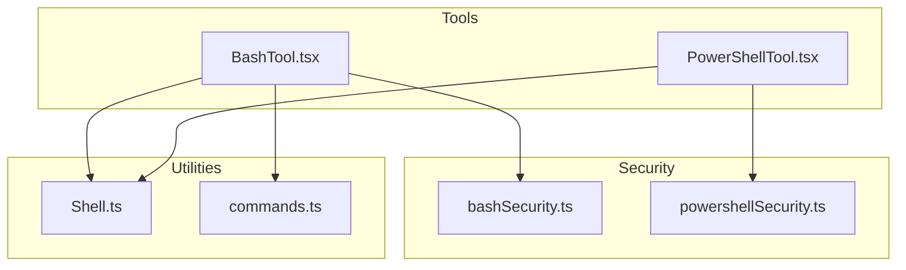
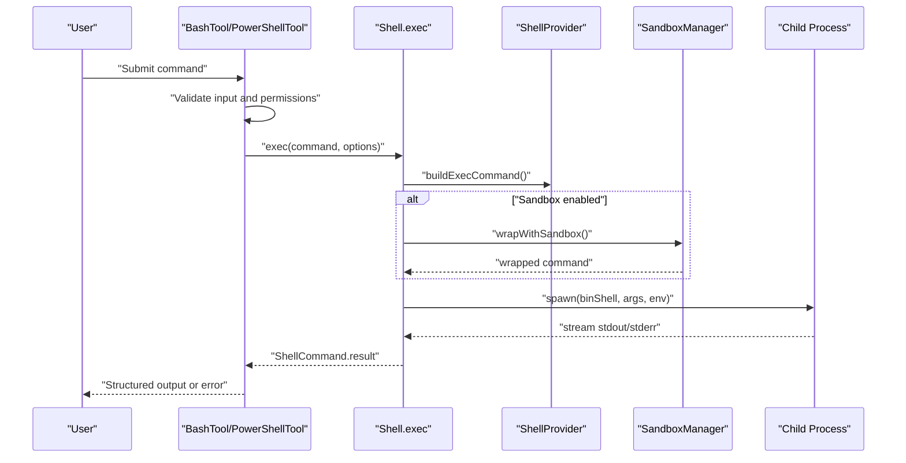
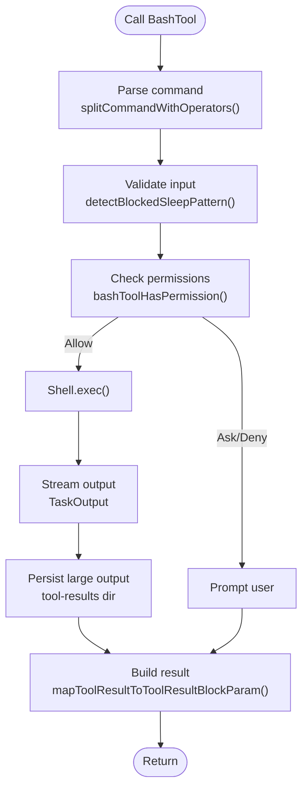
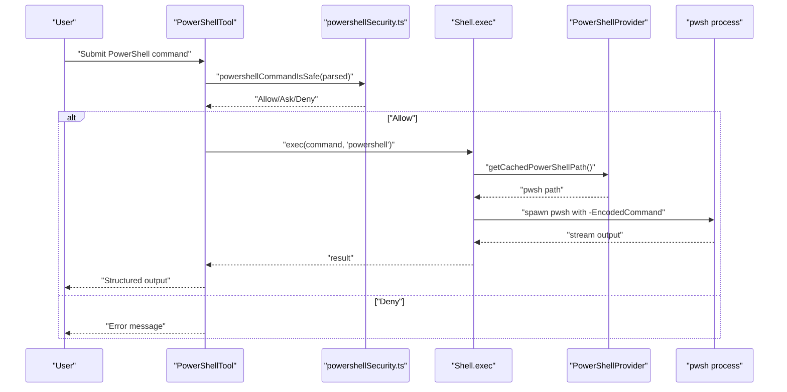
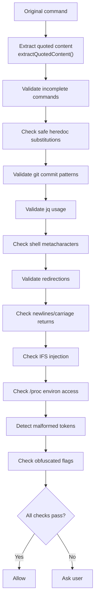
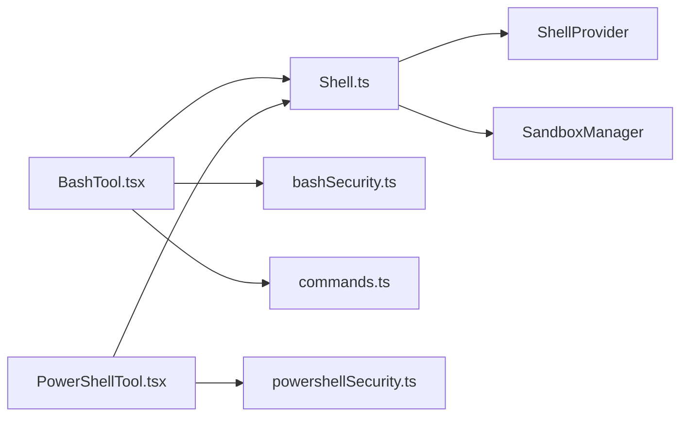

# Shell Command Tools

<cite>
**Referenced Files in This Document**
- [BashTool.tsx](file://claude_code_src/restored-src/src/tools/BashTool/BashTool.tsx)
- [PowerShellTool.tsx](file://claude_code_src/restored-src/src/tools/PowerShellTool/PowerShellTool.tsx)
- [bashSecurity.ts](file://claude_code_src/restored-src/src/tools/BashTool/bashSecurity.ts)
- [powershellSecurity.ts](file://claude_code_src/restored-src/src/tools/PowerShellTool/powershellSecurity.ts)
- [Shell.ts](file://claude_code_src/restored-src/src/utils/Shell.ts)
- [commands.ts](file://claude_code_src/restored-src/src/utils/bash/commands.ts)
</cite>

## Table of Contents
1. [Introduction](#introduction)
2. [Project Structure](#project-structure)
3. [Core Components](#core-components)
4. [Architecture Overview](#architecture-overview)
5. [Detailed Component Analysis](#detailed-component-analysis)
6. [Dependency Analysis](#dependency-analysis)
7. [Performance Considerations](#performance-considerations)
8. [Troubleshooting Guide](#troubleshooting-guide)
9. [Conclusion](#conclusion)

## Introduction
This document explains the shell command tools architecture with a focus on BashTool and PowerShellTool. It covers command execution, parsing, security mechanisms, environment management, validation, and safeguards. Practical examples demonstrate command chaining, output processing, and cross-platform considerations. Security topics include command injection prevention, path validation, and permission management.

## Project Structure
The shell tools live under the tools directory with dedicated modules for BashTool and PowerShellTool. Shared utilities for shell execution, command parsing, and security reside in the utils directory.

**Diagram sources**
- [BashTool.tsx:1-1200](file://claude_code_src/restored-src/src/tools/BashTool/BashTool.tsx#L1-1200)
- [PowerShellTool.tsx:1-1200](file://claude_code_src/restored-src/src/tools/PowerShellTool/PowerShellTool.tsx#L1-1200)
- [bashSecurity.ts:1-1200](file://claude_code_src/restored-src/src/tools/BashTool/bashSecurity.ts#L1-1200)
- [powershellSecurity.ts:1-1091](file://claude_code_src/restored-src/src/tools/PowerShellTool/powershellSecurity.ts#L1-1091)
- [Shell.ts:1-475](file://claude_code_src/restored-src/src/utils/Shell.ts#L1-475)
- [commands.ts:1-800](file://claude_code_src/restored-src/src/utils/bash/commands.ts#L1-800)

**Section sources**
- [BashTool.tsx:1-1200](file://claude_code_src/restored-src/src/tools/BashTool/BashTool.tsx#L1-1200)
- [PowerShellTool.tsx:1-1200](file://claude_code_src/restored-src/src/tools/PowerShellTool/PowerShellTool.tsx#L1-1200)
- [Shell.ts:1-475](file://claude_code_src/restored-src/src/utils/Shell.ts#L1-475)
- [commands.ts:1-800](file://claude_code_src/restored-src/src/utils/bash/commands.ts#L1-800)

## Core Components
- BashTool: Provides a robust tool for executing Bash commands with advanced parsing, permission checks, sandboxing, and UI integration.
- PowerShellTool: Provides a tool for executing PowerShell commands with AST-based security validation, sandboxing, and Windows-specific safeguards.
- Shell Utility: Centralizes shell discovery, provider abstraction, sandbox wrapping, and process spawning with environment controls.
- Bash Command Utilities: Implements safe command parsing, operator splitting, redirection extraction, and prefix-based allowlists.

Key responsibilities:
- Execution orchestration and streaming
- Permission gating and read-only detection
- Security validation and injection prevention
- Environment isolation and sandboxing
- Output processing and persistence

**Section sources**
- [BashTool.tsx:420-820](file://claude_code_src/restored-src/src/tools/BashTool/BashTool.tsx#L420-820)
- [PowerShellTool.tsx:272-662](file://claude_code_src/restored-src/src/tools/PowerShellTool/PowerShellTool.tsx#L272-662)
- [Shell.ts:181-442](file://claude_code_src/restored-src/src/utils/Shell.ts#L181-442)
- [commands.ts:85-369](file://claude_code_src/restored-src/src/utils/bash/commands.ts#L85-369)

## Architecture Overview
The tools integrate with a provider-based shell execution layer. Both BashTool and PowerShellTool use the Shell utility to spawn processes, manage environment overrides, and optionally wrap commands in a sandbox. Security validations occur before execution, and output is streamed or persisted depending on size.

**Diagram sources**
- [BashTool.tsx:624-723](file://claude_code_src/restored-src/src/tools/BashTool/BashTool.tsx#L624-723)
- [PowerShellTool.tsx:437-658](file://claude_code_src/restored-src/src/tools/PowerShellTool/PowerShellTool.tsx#L437-658)
- [Shell.ts:181-442](file://claude_code_src/restored-src/src/utils/Shell.ts#L181-442)

## Detailed Component Analysis

### BashTool
BashTool orchestrates Bash command execution with:
- Command parsing and categorization (search/read/silent)
- Permission checks and read-only detection
- Sandbox-aware execution and background task management
- Output processing, persistence, and image handling
- Safety guards for sleep patterns and backgrounding

**Diagram sources**
- [BashTool.tsx:524-723](file://claude_code_src/restored-src/src/tools/BashTool/BashTool.tsx#L524-723)
- [commands.ts:85-249](file://claude_code_src/restored-src/src/utils/bash/commands.ts#L85-249)
- [Shell.ts:181-442](file://claude_code_src/restored-src/src/utils/Shell.ts#L181-442)

Key features:
- Collapsible UI for search/read/list commands
- Silent command detection to optimize UI messaging
- Auto-backgrounding for long-running commands with safeguards
- Image output detection and compression
- Git operation tracking and analytics

Practical examples:
- Command chaining: `ls -la | grep ".ts"` is categorized as search/read
- Output processing: Large outputs are persisted to tool-results and truncated if needed
- Background execution: Use `run_in_background: true` for long-running tasks

**Section sources**
- [BashTool.tsx:95-217](file://claude_code_src/restored-src/src/tools/BashTool/BashTool.tsx#L95-217)
- [BashTool.tsx:524-723](file://claude_code_src/restored-src/src/tools/BashTool/BashTool.tsx#L524-723)
- [commands.ts:85-249](file://claude_code_src/restored-src/src/utils/bash/commands.ts#L85-249)

### PowerShellTool
PowerShellTool provides:
- AST-based security validation for PowerShell commands
- Windows-specific sandbox policy enforcement
- Read-only detection and permission gating
- Real-time streaming and background task support
- Image output handling and persistence

**Diagram sources**
- [PowerShellTool.tsx:352-436](file://claude_code_src/restored-src/src/tools/PowerShellTool/PowerShellTool.tsx#L352-436)
- [powershellSecurity.ts:1042-1091](file://claude_code_src/restored-src/src/tools/PowerShellTool/powershellSecurity.ts#L1042-1091)
- [Shell.ts:148-154](file://claude_code_src/restored-src/src/utils/Shell.ts#L148-154)

Windows sandbox policy:
- On native Windows, sandboxing is unavailable; PowerShellTool refuses execution if enterprise policy requires sandboxing.

Practical examples:
- Download cradles: `Invoke-WebRequest ... | Invoke-Expression` flagged
- Dynamic command names: `& ${function:Invoke-Expression}` flagged
- Nested PowerShell: `pwsh -EncodedCommand ...` flagged

**Section sources**
- [PowerShellTool.tsx:219-222](file://claude_code_src/restored-src/src/tools/PowerShellTool/PowerShellTool.tsx#L219-222)
- [PowerShellTool.tsx:352-436](file://claude_code_src/restored-src/src/tools/PowerShellTool/PowerShellTool.tsx#L352-436)
- [powershellSecurity.ts:1042-1091](file://claude_code_src/restored-src/src/tools/PowerShellTool/powershellSecurity.ts#L1042-1091)

### Security Mechanisms

#### Bash Security Validation
BashTool employs layered validation:
- Incomplete command detection
- Safe heredoc-in-substitution patterns
- Git commit message validation
- jq command restrictions
- Shell metacharacters and dangerous patterns
- Redirection validation
- Newline and carriage return checks
- IFS injection and proc environ access detection
- Malformed token injection detection
- Obfuscated flags detection

**Diagram sources**
- [bashSecurity.ts:233-1200](file://claude_code_src/restored-src/src/tools/BashTool/bashSecurity.ts#L233-1200)
- [commands.ts:12-81](file://claude_code_src/restored-src/src/utils/bash/commands.ts#L12-81)

#### PowerShell Security Validation
PowerShellTool uses AST-based checks:
- Invoke-Expression and dynamic command names
- Encoded command parameters
- PowerShell re-invocation
- Download cradles and utilities
- Add-Type, COM objects, and type literals
- Dangerous script block usage
- Subexpressions, expandable strings, splatting, stop-parsing
- Member invocations and environment variable manipulation
- Module loading and runtime state manipulation
- WMI/CIM process spawning

**Section sources**
- [powershellSecurity.ts:1042-1091](file://claude_code_src/restored-src/src/tools/PowerShellTool/powershellSecurity.ts#L1042-1091)
- [PowerShellTool.tsx:375-377](file://claude_code_src/restored-src/src/tools/PowerShellTool/PowerShellTool.tsx#L375-377)

### Command Parsing and Execution Safeguards
- Bash command parsing:
  - Placeholder injection to prevent injection attacks
  - Line continuation joining with backslash handling
  - Heredoc extraction and restoration
  - Operator splitting and control operator filtering
  - Static redirection target validation
- Execution safeguards:
  - Environment snapshot and overrides
  - Sandbox wrapping for POSIX-compatible shells
  - Pipe mode for real-time streaming
  - Working directory tracking and recovery
  - Abort handling and cleanup

**Section sources**
- [commands.ts:12-249](file://claude_code_src/restored-src/src/utils/bash/commands.ts#L12-249)
- [Shell.ts:181-442](file://claude_code_src/restored-src/src/utils/Shell.ts#L181-442)

### Shell Environment Management
- Shell discovery prioritizes user preferences and executables
- Provider abstraction for shell-specific argument building
- Environment overrides and session isolation
- Working directory persistence across commands
- Sandbox temp directory management

**Section sources**
- [Shell.ts:73-137](file://claude_code_src/restored-src/src/utils/Shell.ts#L73-137)
- [Shell.ts:139-154](file://claude_code_src/restored-src/src/utils/Shell.ts#L139-154)

### Cross-Platform Compatibility
- POSIX shells (bash/zsh) on Unix-like systems
- PowerShell on Windows with native binary support
- Windows sandbox policy enforcement
- Path normalization and conversion for cross-platform operations

**Section sources**
- [Shell.ts:148-154](file://claude_code_src/restored-src/src/utils/Shell.ts#L148-154)
- [PowerShellTool.tsx:219-222](file://claude_code_src/restored-src/src/tools/PowerShellTool/PowerShellTool.tsx#L219-222)

## Dependency Analysis
The tools depend on shared utilities for shell execution and security. BashTool relies on Bash-specific parsing and security modules, while PowerShellTool depends on AST-based security validation.

**Diagram sources**
- [BashTool.tsx:1-1200](file://claude_code_src/restored-src/src/tools/BashTool/BashTool.tsx#L1-1200)
- [PowerShellTool.tsx:1-1200](file://claude_code_src/restored-src/src/tools/PowerShellTool/PowerShellTool.tsx#L1-1200)
- [bashSecurity.ts:1-1200](file://claude_code_src/restored-src/src/tools/BashTool/bashSecurity.ts#L1-1200)
- [powershellSecurity.ts:1-1091](file://claude_code_src/restored-src/src/tools/PowerShellTool/powershellSecurity.ts#L1-1091)
- [Shell.ts:1-475](file://claude_code_src/restored-src/src/utils/Shell.ts#L1-475)
- [commands.ts:1-800](file://claude_code_src/restored-src/src/utils/bash/commands.ts#L1-800)

**Section sources**
- [BashTool.tsx:1-1200](file://claude_code_src/restored-src/src/tools/BashTool/BashTool.tsx#L1-1200)
- [PowerShellTool.tsx:1-1200](file://claude_code_src/restored-src/src/tools/PowerShellTool/PowerShellTool.tsx#L1-1200)
- [Shell.ts:1-475](file://claude_code_src/restored-src/src/utils/Shell.ts#L1-475)

## Performance Considerations
- Streaming vs file mode: Use pipe mode for real-time output to avoid disk I/O overhead
- Background tasks: Long-running commands should be backgrounded to keep UI responsive
- Output truncation: Large outputs are truncated and persisted to reduce memory usage
- Command categorization: Search/read/silent detection optimizes UI and reduces unnecessary processing

## Troubleshooting Guide
Common issues and resolutions:
- Command not found: Verify shell availability and PATH; ensure proper shell detection
- Permission denied: Review security validation results and adjust allowlist rules
- Output not appearing: Check background task IDs and persisted output paths
- Windows sandbox refusal: Confirm enterprise policy allows unsandboxed execution
- Interrupted commands: Use abort signals and verify interruption reasons

**Section sources**
- [Shell.ts:234-238](file://claude_code_src/restored-src/src/utils/Shell.ts#L234-238)
- [PowerShellTool.tsx:354-360](file://claude_code_src/restored-src/src/tools/PowerShellTool/PowerShellTool.tsx#L354-360)
- [BashTool.tsx:684-723](file://claude_code_src/restored-src/src/tools/BashTool/BashTool.tsx#L684-723)

## Conclusion
BashTool and PowerShellTool provide secure, cross-platform shell execution with strong validation, sandboxing, and output handling. Their architecture emphasizes safety through layered validation, environment isolation, and robust parsing. Following the guidelines and examples in this document ensures reliable and secure shell operations across diverse environments.