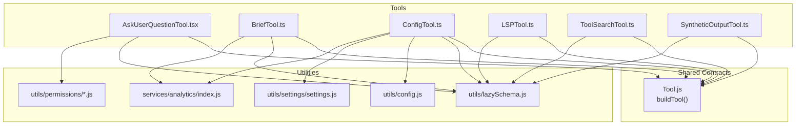
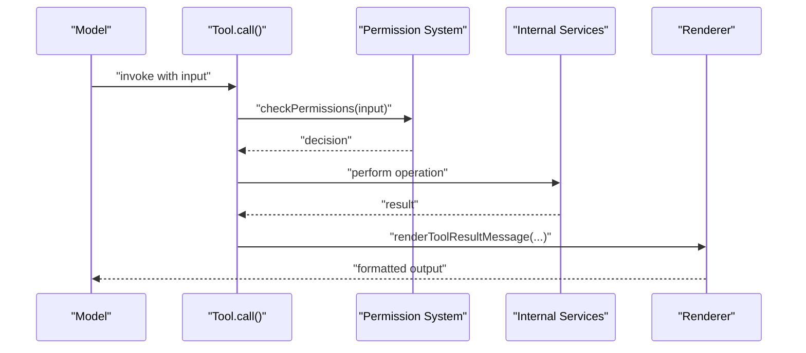
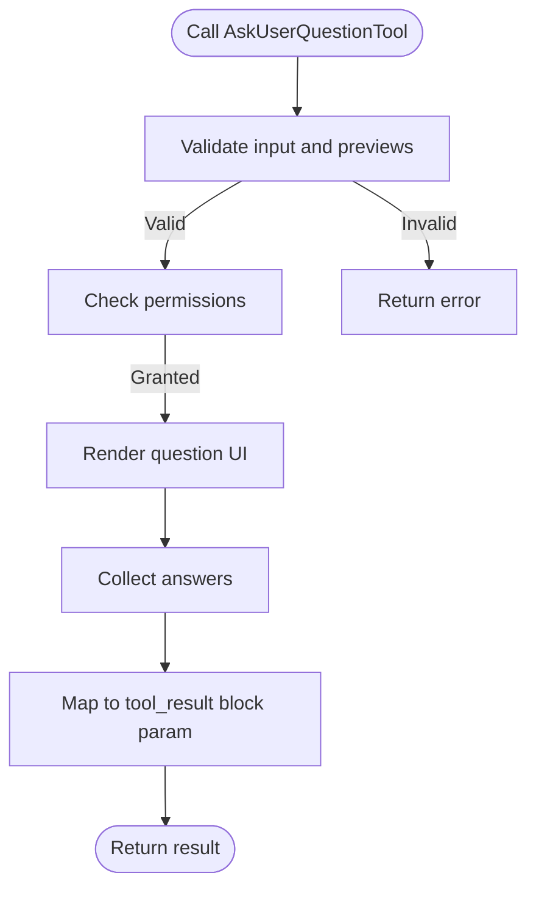
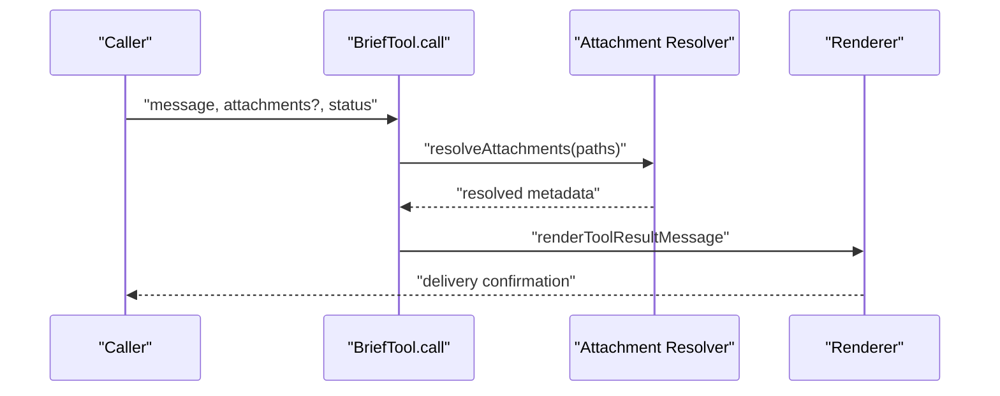
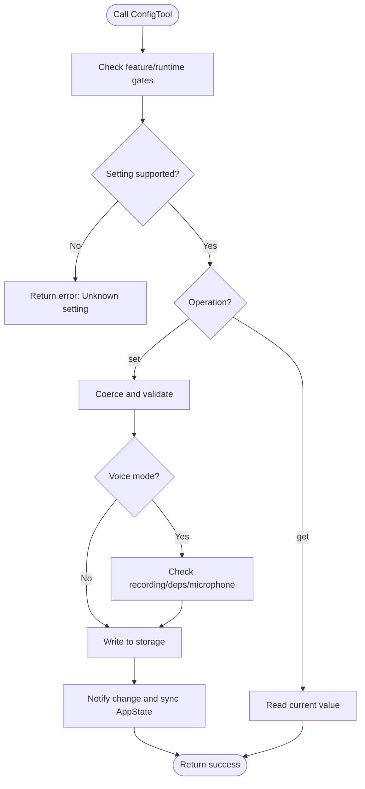
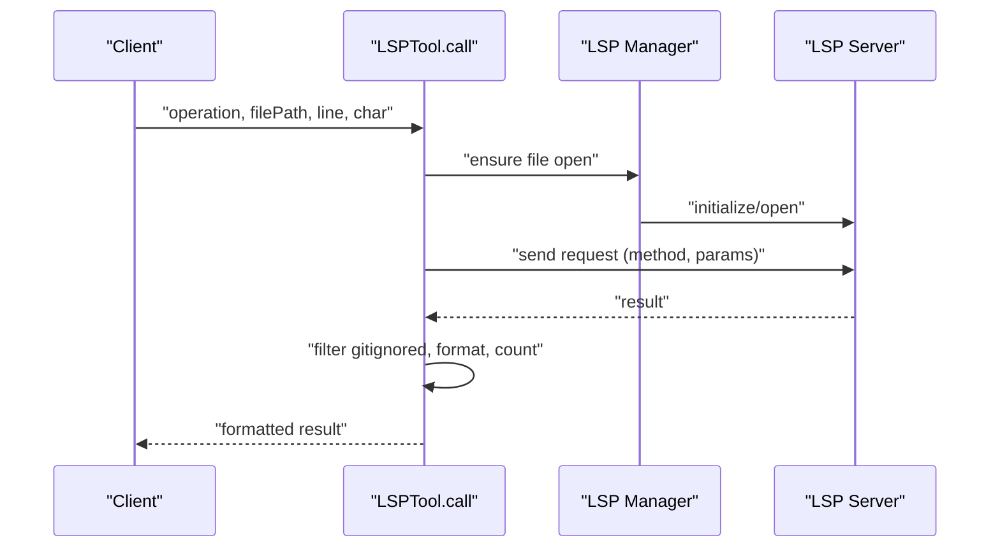
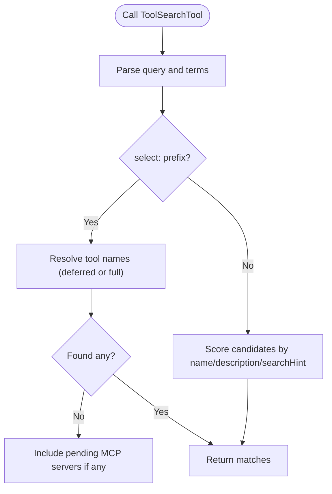
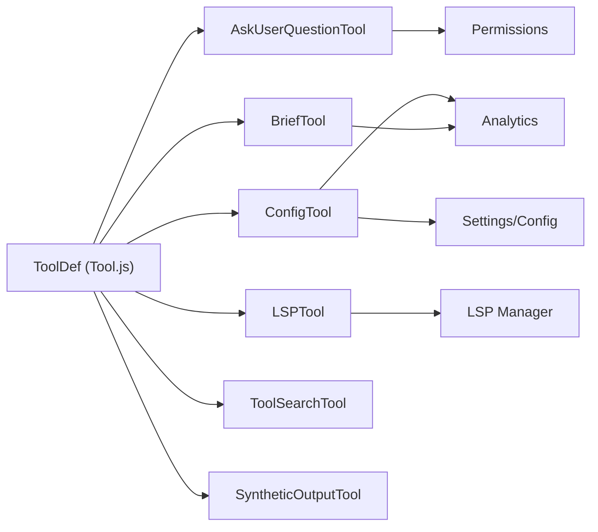

# Specialized and Utility Tools

<cite>
**Referenced Files in This Document**
- [AskUserQuestionTool.tsx](file://claude_code_src/restored-src/src/tools/AskUserQuestionTool/AskUserQuestionTool.tsx)
- [BriefTool.ts](file://claude_code_src/restored-src/src/tools/BriefTool/BriefTool.ts)
- [ConfigTool.ts](file://claude_code_src/restored-src/src/tools/ConfigTool/ConfigTool.ts)
- [LSPTool.ts](file://claude_code_src/restored-src/src/tools/LSPTool/LSPTool.ts)
- [ToolSearchTool.ts](file://claude_code_src/restored-src/src/tools/ToolSearchTool/ToolSearchTool.ts)
- [SyntheticOutputTool.ts](file://claude_code_src/restored-src/src/tools/SyntheticOutputTool/SyntheticOutputTool.ts)
</cite>

## Table of Contents
1. [Introduction](#introduction)
2. [Project Structure](#project-structure)
3. [Core Components](#core-components)
4. [Architecture Overview](#architecture-overview)
5. [Detailed Component Analysis](#detailed-component-analysis)
6. [Dependency Analysis](#dependency-analysis)
7. [Performance Considerations](#performance-considerations)
8. [Troubleshooting Guide](#troubleshooting-guide)
9. [Conclusion](#conclusion)

## Introduction
This document explains five specialized and utility tools: AskUserQuestionTool, BriefTool, ConfigTool, LSPTool, ToolSearchTool, and SyntheticOutputTool. It covers purpose, implementation, configuration options, integration patterns, security/performance considerations, and dynamic tool loading. Practical usage scenarios, chaining patterns, and discovery mechanisms are included to help both developers and operators integrate these tools effectively.

## Project Structure
These tools live under the tools directory and follow a consistent pattern:
- Each tool defines input/output schemas using a lazy Zod schema wrapper for performance.
- They implement a ToolDef contract via a builder utility, exposing metadata (name, search hints), permission checks, rendering hooks, and a call handler.
- Many tools integrate with internal services (analytics, permissions, LSP manager, settings) and UI rendering helpers.

**Diagram sources**
- [AskUserQuestionTool.tsx:109-245](file://claude_code_src/restored-src/src/tools/AskUserQuestionTool/AskUserQuestionTool.tsx#L109-L245)
- [BriefTool.ts:136-204](file://claude_code_src/restored-src/src/tools/BriefTool/BriefTool.ts#L136-L204)
- [ConfigTool.ts:67-434](file://claude_code_src/restored-src/src/tools/ConfigTool/ConfigTool.ts#L67-L434)
- [LSPTool.ts:127-422](file://claude_code_src/restored-src/src/tools/LSPTool/LSPTool.ts#L127-L422)
- [ToolSearchTool.ts:304-471](file://claude_code_src/restored-src/src/tools/ToolSearchTool/ToolSearchTool.ts#L304-L471)
- [SyntheticOutputTool.ts](file://claude_code_src/restored-src/src/tools/SyntheticOutputTool/SyntheticOutputTool.ts)

**Section sources**
- [AskUserQuestionTool.tsx:109-245](file://claude_code_src/restored-src/src/tools/AskUserQuestionTool/AskUserQuestionTool.tsx#L109-L245)
- [BriefTool.ts:136-204](file://claude_code_src/restored-src/src/tools/BriefTool/BriefTool.ts#L136-L204)
- [ConfigTool.ts:67-434](file://claude_code_src/restored-src/src/tools/ConfigTool/ConfigTool.ts#L67-L434)
- [LSPTool.ts:127-422](file://claude_code_src/restored-src/src/tools/LSPTool/LSPTool.ts#L127-L422)
- [ToolSearchTool.ts:304-471](file://claude_code_src/restored-src/src/tools/ToolSearchTool/ToolSearchTool.ts#L304-L471)

## Core Components
- AskUserQuestionTool: Interactive multi-question chooser with preview and annotations; designed for permission gating and UX-driven decisions.
- BriefTool: Primary user-facing output channel; sends messages with optional attachments and logs analytics.
- ConfigTool: Reads/writes global and user settings with validation, coercion, and runtime feature gating.
- LSPTool: Code intelligence operations (definitions, references, hover, symbols, call hierarchy) integrated with an LSP server manager and permission checks.
- ToolSearchTool: Deferred tool discovery and selection by keywords or direct tool name; supports MCP server names and scoring heuristics.
- SyntheticOutputTool: Placeholder tool for synthetic outputs; useful for testing and scaffolding.

**Section sources**
- [AskUserQuestionTool.tsx:109-245](file://claude_code_src/restored-src/src/tools/AskUserQuestionTool/AskUserQuestionTool.tsx#L109-L245)
- [BriefTool.ts:136-204](file://claude_code_src/restored-src/src/tools/BriefTool/BriefTool.ts#L136-L204)
- [ConfigTool.ts:67-434](file://claude_code_src/restored-src/src/tools/ConfigTool/ConfigTool.ts#L67-L434)
- [LSPTool.ts:127-422](file://claude_code_src/restored-src/src/tools/LSPTool/LSPTool.ts#L127-L422)
- [ToolSearchTool.ts:304-471](file://claude_code_src/restored-src/src/tools/ToolSearchTool/ToolSearchTool.ts#L304-L471)
- [SyntheticOutputTool.ts](file://claude_code_src/restored-src/src/tools/SyntheticOutputTool/SyntheticOutputTool.ts)

## Architecture Overview
The tools adhere to a common contract and lifecycle:
- Schema definition: Lazy Zod schemas minimize startup cost.
- Permission gating: Tools declare read-only or write intent and request permission when needed.
- Rendering: Tools provide UI render hooks for tool-use and results.
- Execution: Tools call internal services (LSP manager, analytics, settings) and return structured outputs.

**Diagram sources**
- [LSPTool.ts:210-223](file://claude_code_src/restored-src/src/tools/LSPTool/LSPTool.ts#L210-L223)
- [ConfigTool.ts:98-107](file://claude_code_src/restored-src/src/tools/ConfigTool/ConfigTool.ts#L98-L107)
- [BriefTool.ts:184-185](file://claude_code_src/restored-src/src/tools/BriefTool/BriefTool.ts#L184-L185)

## Detailed Component Analysis

### AskUserQuestionTool
Purpose:
- Presents a set of multiple-choice questions to the user, optionally with previews and annotations. Designed for permission gating and UX decisions.

Key behaviors:
- Input schema enforces uniqueness of questions and option labels.
- Validates HTML preview content when enabled.
- Respects channels feature flags to avoid hanging in non-TUI contexts.
- Renders a user-facing result message summarizing answers.

Security and permissions:
- Requires user interaction; permission decision is “ask” for user-facing prompts.
- Validates preview content to prevent full HTML documents and disallowed tags.

Performance:
- Uses lazy schemas and defers execution.

Usage patterns:
- Chain after reasoning steps that require user choice.
- Combine with annotations to capture free-form notes.

**Diagram sources**
- [AskUserQuestionTool.tsx:158-181](file://claude_code_src/restored-src/src/tools/AskUserQuestionTool/AskUserQuestionTool.tsx#L158-L181)
- [AskUserQuestionTool.tsx:182-188](file://claude_code_src/restored-src/src/tools/AskUserQuestionTool/AskUserQuestionTool.tsx#L182-L188)
- [AskUserQuestionTool.tsx:209-223](file://claude_code_src/restored-src/src/tools/AskUserQuestionTool/AskUserQuestionTool.tsx#L209-L223)

**Section sources**
- [AskUserQuestionTool.tsx:109-245](file://claude_code_src/restored-src/src/tools/AskUserQuestionTool/AskUserQuestionTool.tsx#L109-L245)

### BriefTool
Purpose:
- Primary user-facing output channel. Sends messages with optional attachments and logs analytics.

Key behaviors:
- Determines entitlement and activation via feature flags and opt-in.
- Validates attachment paths; resolves metadata asynchronously.
- Logs analytics events for proactive vs normal status.

Security and permissions:
- Read-only tool; permission decision is implicit for reads.

Performance:
- Attachments are optional; UI renders a message with attachment count.

Usage patterns:
- Use as the default output channel for chat views.
- Chain with other tools to summarize results.

**Diagram sources**
- [BriefTool.ts:186-203](file://claude_code_src/restored-src/src/tools/BriefTool/BriefTool.ts#L186-L203)

**Section sources**
- [BriefTool.ts:136-204](file://claude_code_src/restored-src/src/tools/BriefTool/BriefTool.ts#L136-L204)

### ConfigTool
Purpose:
- Get or set global/user settings with validation, coercion, and runtime feature gating.

Key behaviors:
- Supports “get” and “set” operations.
- Handles special values like “default” for certain keys.
- Validates booleans, enumerations, and async validations (e.g., model API checks).
- Integrates with voice mode gating and microphone permissions.
- Updates AppState when needed for immediate UI effects.

Security and permissions:
- Read-only when getting; asks for permission when setting.
- Enforces runtime gates for voice mode and killswitches.

Performance:
- Uses memoization for tool descriptions and caches deferred tool names.

Usage patterns:
- Use to configure models, themes, permissions, and remote control behavior.
- Chain with ToolSearchTool to discover and select tools dynamically.

**Diagram sources**
- [ConfigTool.ts:111-411](file://claude_code_src/restored-src/src/tools/ConfigTool/ConfigTool.ts#L111-L411)

**Section sources**
- [ConfigTool.ts:67-434](file://claude_code_src/restored-src/src/tools/ConfigTool/ConfigTool.ts#L67-L434)

### LSPTool
Purpose:
- Provides code intelligence operations (definitions, references, hover, symbols, call hierarchy) via an LSP server.

Key behaviors:
- Validates file existence and type; filters gitignored results.
- Opens files in the LSP server if not already open; enforces a maximum file size.
- Two-phase call hierarchy retrieval (prepare then fetch).
- Formats results uniformly for UI rendering.

Security and permissions:
- Requires read permission for file access.
- Skips filesystem operations for UNC paths to prevent credential leakage.

Performance:
- Batches git check-ignore calls and filters results to reduce noise.
- Uses lazy schemas and defers execution.

Usage patterns:
- Chain with editor integrations to enrich context.
- Use for diagnostics, refactoring, and navigation.

**Diagram sources**
- [LSPTool.ts:224-414](file://claude_code_src/restored-src/src/tools/LSPTool/LSPTool.ts#L224-L414)

**Section sources**
- [LSPTool.ts:127-422](file://claude_code_src/restored-src/src/tools/LSPTool/LSPTool.ts#L127-L422)

### ToolSearchTool
Purpose:
- Discover and select deferred tools by keywords or exact names; supports MCP server names and scoring heuristics.

Key behaviors:
- Parses tool names (MCP and CamelCase), compiles regex patterns, and scores matches.
- Supports “select:” prefix for direct selection and comma-separated multi-select.
- Memoizes tool descriptions to speed up repeated searches.
- Logs analytics on outcomes and includes pending MCP servers when no matches are found.

Security and permissions:
- Read-only tool; no permission prompt required.

Performance:
- Caches tool descriptions keyed by deferred tool set; invalidates when tools change.

Usage patterns:
- Use as a launcher to bring deferred tools into scope.
- Chain with ToolSearchTool to dynamically choose tools based on context.

**Diagram sources**
- [ToolSearchTool.ts:328-434](file://claude_code_src/restored-src/src/tools/ToolSearchTool/ToolSearchTool.ts#L328-L434)

**Section sources**
- [ToolSearchTool.ts:304-471](file://claude_code_src/restored-src/src/tools/ToolSearchTool/ToolSearchTool.ts#L304-L471)

### SyntheticOutputTool
Purpose:
- Provides a placeholder tool for synthetic outputs; useful for testing and scaffolding.

Key behaviors:
- Minimal implementation suitable for controlled testing scenarios.

Security and permissions:
- Typically read-only; permission behavior depends on implementation.

Performance:
- No heavy operations; minimal overhead.

**Section sources**
- [SyntheticOutputTool.ts](file://claude_code_src/restored-src/src/tools/SyntheticOutputTool/SyntheticOutputTool.ts)

## Dependency Analysis
- Shared contracts: All tools depend on a common ToolDef builder and lifecycle hooks.
- Utilities: Lazy schemas, permissions, analytics, and settings/config utilities are reused across tools.
- Internal services: LSPTool integrates with the LSP manager; ConfigTool integrates with settings and analytics; BriefTool integrates with analytics and attachment resolution.

**Diagram sources**
- [AskUserQuestionTool.tsx:109-245](file://claude_code_src/restored-src/src/tools/AskUserQuestionTool/AskUserQuestionTool.tsx#L109-L245)
- [BriefTool.ts:136-204](file://claude_code_src/restored-src/src/tools/BriefTool/BriefTool.ts#L136-L204)
- [ConfigTool.ts:67-434](file://claude_code_src/restored-src/src/tools/ConfigTool/ConfigTool.ts#L67-L434)
- [LSPTool.ts:127-422](file://claude_code_src/restored-src/src/tools/LSPTool/LSPTool.ts#L127-L422)
- [ToolSearchTool.ts:304-471](file://claude_code_src/restored-src/src/tools/ToolSearchTool/ToolSearchTool.ts#L304-L471)

**Section sources**
- [AskUserQuestionTool.tsx:109-245](file://claude_code_src/restored-src/src/tools/AskUserQuestionTool/AskUserQuestionTool.tsx#L109-L245)
- [BriefTool.ts:136-204](file://claude_code_src/restored-src/src/tools/BriefTool/BriefTool.ts#L136-L204)
- [ConfigTool.ts:67-434](file://claude_code_src/restored-src/src/tools/ConfigTool/ConfigTool.ts#L67-L434)
- [LSPTool.ts:127-422](file://claude_code_src/restored-src/src/tools/LSPTool/LSPTool.ts#L127-L422)
- [ToolSearchTool.ts:304-471](file://claude_code_src/restored-src/src/tools/ToolSearchTool/ToolSearchTool.ts#L304-L471)

## Performance Considerations
- Lazy schemas: Reduce startup cost by deferring schema construction until needed.
- Memoization: ToolSearchTool caches tool descriptions keyed by the current deferred tool set.
- Batching: LSPTool batches git check-ignore calls to reduce overhead.
- Concurrency safety: Most tools are concurrency-safe; ensure shared resources (e.g., LSP server) are accessed safely.
- Result size limits: Tools specify max result sizes to prevent oversized outputs.

[No sources needed since this section provides general guidance]

## Troubleshooting Guide
Common issues and resolutions:
- AskUserQuestionTool
  - Preview validation failures: Ensure preview is an HTML fragment (no html/body/doctype) and avoid script/style tags when previewFormat is set to HTML.
  - Channels feature flag: When channels are active, the tool is disabled to avoid hanging in non-TUI contexts.
- BriefTool
  - Attachment resolution failures: Verify paths and permissions; ensure attachments are readable.
  - Opt-in not active: Brief requires explicit opt-in or assistant mode to be enabled.
- ConfigTool
  - Unknown setting: Confirm the setting is supported and gated appropriately (e.g., voiceEnabled behind runtime gates).
  - Validation errors: Fix values according to options or async validation feedback.
  - Voice mode prerequisites: Ensure microphone access and dependencies are available.
- LSPTool
  - File not found or not a file: Verify the path and permissions.
  - No LSP server available: Indicates unsupported file type or server initialization issues.
  - Gitignored results filtered: Adjust .gitignore or search differently.
- ToolSearchTool
  - No matches found: Check pending MCP servers; search may return pending servers in the result.
  - Cache invalidation: Tool descriptions cache is invalidated when deferred tools change.

**Section sources**
- [AskUserQuestionTool.tsx:158-181](file://claude_code_src/restored-src/src/tools/AskUserQuestionTool/AskUserQuestionTool.tsx#L158-L181)
- [BriefTool.ts:126-134](file://claude_code_src/restored-src/src/tools/BriefTool/BriefTool.ts#L126-L134)
- [ConfigTool.ts:116-130](file://claude_code_src/restored-src/src/tools/ConfigTool/ConfigTool.ts#L116-L130)
- [LSPTool.ts:155-209](file://claude_code_src/restored-src/src/tools/LSPTool/LSPTool.ts#L155-L209)
- [ToolSearchTool.ts:422-433](file://claude_code_src/restored-src/src/tools/ToolSearchTool/ToolSearchTool.ts#L422-L433)

## Conclusion
These specialized and utility tools form a cohesive toolkit for user interaction, configuration, code intelligence, and dynamic tool discovery. By leveraging shared contracts, permission systems, and internal services, they provide a consistent, secure, and performant interface for integrating AI-assisted workflows. Use them together to create powerful, adaptive experiences tailored to your environment and user needs.