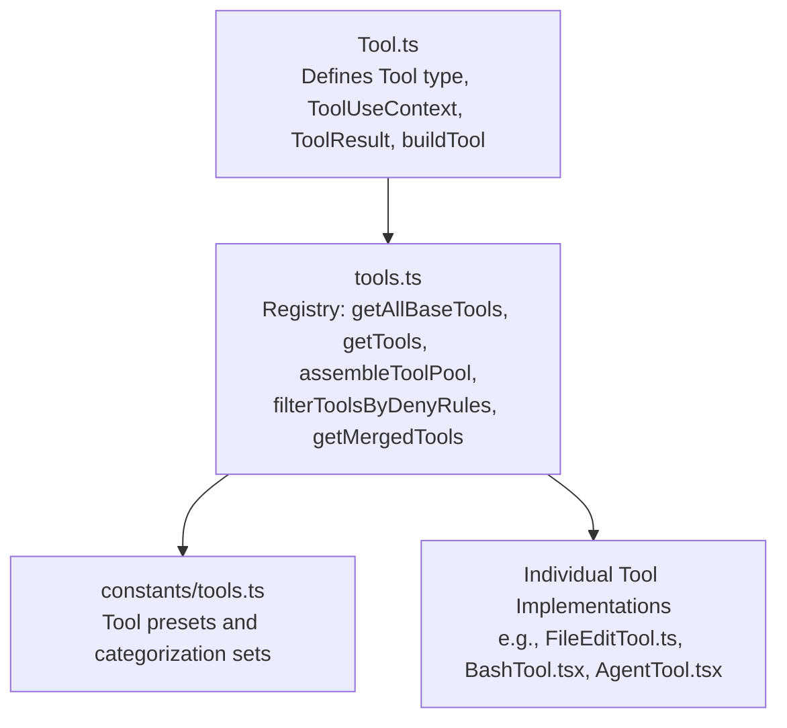
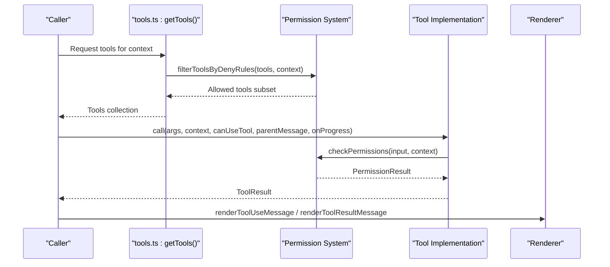
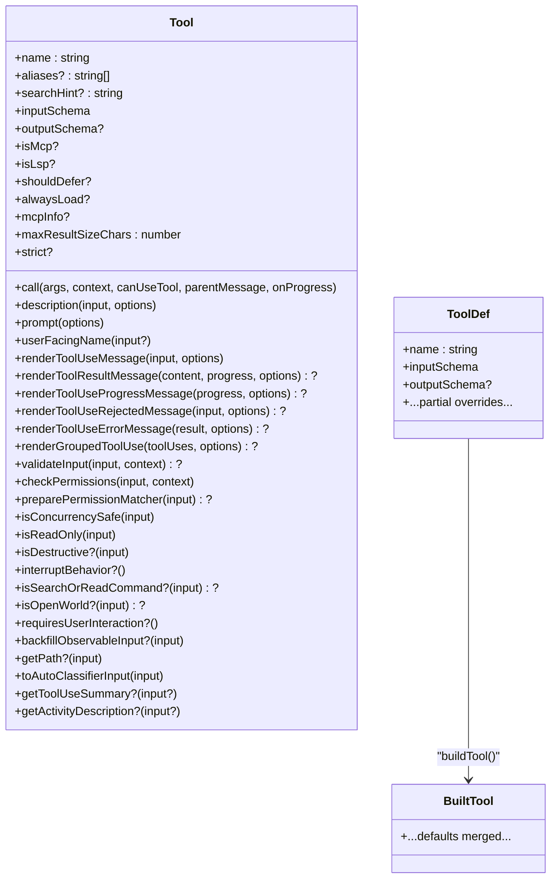
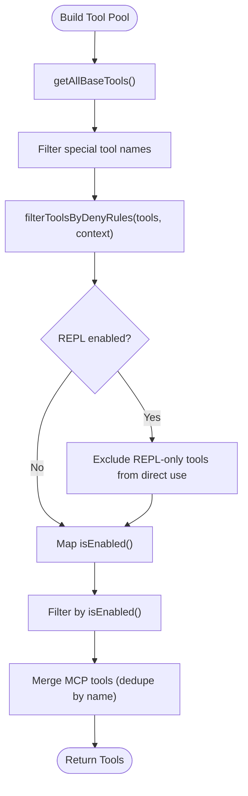
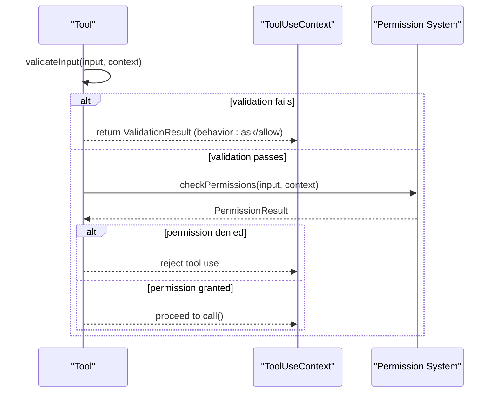
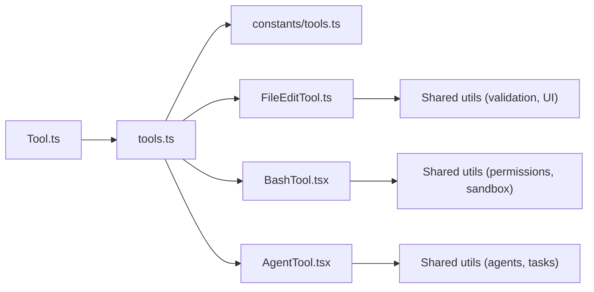

# Tool Interface Design

<cite>
**Referenced Files in This Document**
- [Tool.ts](file://claude_code_src/restored-src/src/Tool.ts)
- [tools.ts](file://claude_code_src/restored-src/src/tools.ts)
- [tools.ts (constants)](file://claude_code_src/restored-src/src/constants/tools.ts)
- [FileEditTool.ts](file://claude_code_src/restored-src/src/tools/FileEditTool/FileEditTool.ts)
- [BashTool.tsx](file://claude_code_src/restored-src/src/tools/BashTool/BashTool.tsx)
- [AgentTool.tsx](file://claude_code_src/restored-src/src/tools/AgentTool/AgentTool.tsx)
</cite>

## Table of Contents
1. [Introduction](#introduction)
2. [Project Structure](#project-structure)
3. [Core Components](#core-components)
4. [Architecture Overview](#architecture-overview)
5. [Detailed Component Analysis](#detailed-component-analysis)
6. [Dependency Analysis](#dependency-analysis)
7. [Performance Considerations](#performance-considerations)
8. [Troubleshooting Guide](#troubleshooting-guide)
9. [Conclusion](#conclusion)

## Introduction
This document explains the tool interface design and architecture used across the system. It focuses on the Tool abstract class structure, lifecycle methods, standardized interface, registration patterns, metadata requirements, the tool factory pattern, categorization and filtering, permission integration, and practical implementation strategies. It also covers naming conventions, discovery mechanisms, and the relationship between tools and the permission system.

## Project Structure
The tool system is centered around a core interface definition and a registry that assembles tools from built-in implementations and external sources (MCP). Tools are grouped under a central registry that supports conditional inclusion, permission-based filtering, and merging with MCP tools.

**Diagram sources**
- [Tool.ts:1-793](file://claude_code_src/restored-src/src/Tool.ts#L1-L793)
- [tools.ts:1-390](file://claude_code_src/restored-src/src/tools.ts#L1-L390)
- [tools.ts (constants):1-113](file://claude_code_src/restored-src/src/constants/tools.ts#L1-L113)

**Section sources**
- [Tool.ts:1-793](file://claude_code_src/restored-src/src/Tool.ts#L1-L793)
- [tools.ts:1-390](file://claude_code_src/restored-src/src/tools.ts#L1-L390)
- [tools.ts (constants):1-113](file://claude_code_src/restored-src/src/constants/tools.ts#L1-L113)

## Core Components
- Tool type and standardized interface: Defines the canonical contract for tools, including lifecycle methods, metadata, permission hooks, and rendering helpers.
- ToolUseContext: Provides runtime context for tool execution, including options, state, IO callbacks, and environment.
- ToolResult: Standardizes tool outputs and optional side effects (new messages, context modifiers).
- Tool factory (buildTool): Supplies safe defaults for commonly stubbed methods and ensures consistent behavior across tools.
- Tool registry: Centralized assembly of tools, including conditional inclusion, permission filtering, and merging with MCP tools.

Key responsibilities:
- Enforce a consistent tool contract across implementations.
- Provide defaults and safety behaviors for permission, concurrency, and classification.
- Support tool discovery, filtering, and composition.

**Section sources**
- [Tool.ts:362-792](file://claude_code_src/restored-src/src/Tool.ts#L362-L792)
- [Tool.ts:783-792](file://claude_code_src/restored-src/src/Tool.ts#L783-L792)
- [tools.ts:193-390](file://claude_code_src/restored-src/src/tools.ts#L193-L390)

## Architecture Overview
The tool architecture separates concerns between interface definition, registry orchestration, and implementation specifics. The registry composes tools from multiple sources, filters them according to environment and permissions, and merges with MCP tools. Tools expose metadata and lifecycle methods that integrate with the permission system and UI rendering.

**Diagram sources**
- [tools.ts:262-327](file://claude_code_src/restored-src/src/tools.ts#L262-L327)
- [Tool.ts:500-503](file://claude_code_src/restored-src/src/Tool.ts#L500-L503)
- [Tool.ts:379-385](file://claude_code_src/restored-src/src/Tool.ts#L379-L385)

## Detailed Component Analysis

### Tool Abstract Class and Factory Pattern
The Tool interface defines a comprehensive contract for tool implementations. The factory function buildTool merges a partial tool definition with safe defaults for frequently used methods, ensuring consistent behavior and reducing boilerplate.

Highlights:
- Lifecycle methods: call, description, prompt, userFacingName, renderToolUseMessage, renderToolResultMessage, etc.
- Metadata: name, aliases, searchHint, shouldDefer, alwaysLoad, maxResultSizeChars, strict, isMcp, isLsp.
- Permission hooks: validateInput, checkPermissions, preparePermissionMatcher.
- Concurrency and safety: isConcurrencySafe, isReadOnly, isDestructive, interruptBehavior.
- Classification and UI: toAutoClassifierInput, getToolUseSummary, getActivityDescription, renderToolUseProgressMessage, renderToolUseRejectedMessage, renderToolUseErrorMessage, renderGroupedToolUse.
- Discovery and filtering: toolMatchesName, findToolByName.

Factory defaults:
- isEnabled: true
- isConcurrencySafe: false
- isReadOnly: false
- isDestructive: false
- checkPermissions: allow with updatedInput
- toAutoClassifierInput: empty string
- userFacingName: derived from name

**Diagram sources**
- [Tool.ts:362-792](file://claude_code_src/restored-src/src/Tool.ts#L362-L792)
- [Tool.ts:783-792](file://claude_code_src/restored-src/src/Tool.ts#L783-L792)

**Section sources**
- [Tool.ts:362-792](file://claude_code_src/restored-src/src/Tool.ts#L362-L792)
- [Tool.ts:783-792](file://claude_code_src/restored-src/src/Tool.ts#L783-L792)

### Tool Registration Patterns and Discovery
The registry aggregates tools from multiple sources and applies environment-driven inclusion and permission-based filtering.

Key functions:
- getAllBaseTools: Builds the exhaustive list of built-in tools respecting feature flags and environment variables.
- getTools: Applies mode filtering, REPL visibility rules, and permission deny rules.
- assembleToolPool: Merges built-in and MCP tools, deduplicating by name with built-ins taking precedence.
- getMergedTools: Returns combined list of built-in and MCP tools.
- filterToolsByDenyRules: Filters tools based on deny rules using the same matcher as runtime permission checks.

**Diagram sources**
- [tools.ts:193-390](file://claude_code_src/restored-src/src/tools.ts#L193-L390)

**Section sources**
- [tools.ts:193-390](file://claude_code_src/restored-src/src/tools.ts#L193-L390)

### Tool Categorization and Filtering
Tool categorization is expressed via constants that define allowed/disallowed sets for different modes and contexts.

- ALL_AGENT_DISALLOWED_TOOLS: Tools disallowed for agents.
- CUSTOM_AGENT_DISALLOWED_TOOLS: Extends disallowed set for custom agents.
- ASYNC_AGENT_ALLOWED_TOOLS: Tools allowed for async agents.
- IN_PROCESS_TEAMMATE_ALLOWED_TOOLS: Tools allowed only for in-process teammates.
- COORDINATOR_MODE_ALLOWED_TOOLS: Tools allowed in coordinator mode.

These sets guide filtering and availability in different agent contexts.

**Section sources**
- [tools.ts (constants):36-113](file://claude_code_src/restored-src/src/constants/tools.ts#L36-L113)

### Permission Integration System
Tools integrate with the permission system through:
- validateInput: Validates inputs and can request user interaction or adjust input.
- checkPermissions: Applies tool-specific permission logic; defaults to allowing with updated input.
- preparePermissionMatcher: Enables hook-based permission matching for patterns like wildcard rules.
- filterToolsByDenyRules: Removes tools matched by blanket deny rules before the model sees them.

**Diagram sources**
- [Tool.ts:489-503](file://claude_code_src/restored-src/src/Tool.ts#L489-L503)
- [tools.ts:262-269](file://claude_code_src/restored-src/src/tools.ts#L262-L269)

**Section sources**
- [Tool.ts:489-503](file://claude_code_src/restored-src/src/Tool.ts#L489-L503)
- [tools.ts:262-269](file://claude_code_src/restored-src/src/tools.ts#L262-L269)

### Practical Examples of Tool Interface Implementation
- FileEditTool: Demonstrates input validation, permission checks, path expansion, and UI rendering helpers. It exposes metadata like searchHint, strict mode, and classification input for auto-classifier.
- BashTool: Implements search/read detection for UI collapsing, silent command detection, and extensive permission and sandboxing logic. It integrates with task orchestration and progress rendering.
- AgentTool: Manages agent lifecycle, background execution, progress tracking, and multi-agent spawning. It composes with other tools via assembleToolPool and respects permission contexts.

Implementation patterns:
- Use buildTool to define minimal required fields and rely on defaults for optional methods.
- Implement validateInput to enforce constraints and user interaction needs.
- Implement checkPermissions to integrate with filesystem and environment rules.
- Provide user-facing metadata (userFacingName, getActivityDescription, getToolUseSummary) for UI and telemetry.
- Expose classification input via toAutoClassifierInput for security monitoring.

**Section sources**
- [FileEditTool.ts:86-200](file://claude_code_src/restored-src/src/tools/FileEditTool/FileEditTool.ts#L86-L200)
- [BashTool.tsx:1-200](file://claude_code_src/restored-src/src/tools/BashTool/BashTool.tsx#L1-L200)
- [AgentTool.tsx:196-200](file://claude_code_src/restored-src/src/tools/AgentTool/AgentTool.tsx#L196-L200)

### Tool Naming Conventions and Metadata Requirements
Naming and metadata:
- name: Required unique identifier for the tool.
- aliases?: Optional alternate names for backward compatibility.
- searchHint?: Short capability phrase for keyword matching in search.
- shouldDefer?: Defer loading until ToolSearch is used.
- alwaysLoad?: Never defer; include in initial schema.
- maxResultSizeChars: Controls result persistence behavior.
- strict?: Enables stricter adherence to instructions and schemas.
- isMcp/isLsp?: Flags for tool type categorization.

Discovery helpers:
- toolMatchesName: Matches by primary name or alias.
- findToolByName: Locates a tool by name or alias.

**Section sources**
- [Tool.ts:348-361](file://claude_code_src/restored-src/src/Tool.ts#L348-L361)
- [Tool.ts:456-472](file://claude_code_src/restored-src/src/Tool.ts#L456-L472)

### Tool Composition Strategies
- Grouped rendering: renderGroupedToolUse allows aggregating multiple tool uses for concise display.
- Tool pools: assembleToolPool merges built-in and MCP tools deterministically, preserving prompt-cache stability and precedence.
- Presets and filtering: getToolsForDefaultPreset and getTools apply environment and permission constraints to produce tailored tool sets.

**Section sources**
- [tools.ts:345-367](file://claude_code_src/restored-src/src/tools.ts#L345-L367)
- [tools.ts:179-183](file://claude_code_src/restored-src/src/tools.ts#L179-L183)
- [tools.ts:271-327](file://claude_code_src/restored-src/src/tools.ts#L271-L327)

## Dependency Analysis
The tool system exhibits low coupling and high cohesion:
- Tool.ts defines the interface and factory; implementations depend on it but not on each other.
- tools.ts orchestrates assembly and filtering; it depends on constants and permission utilities.
- Individual tools depend on shared utilities for validation, rendering, and environment checks.

**Diagram sources**
- [Tool.ts:1-793](file://claude_code_src/restored-src/src/Tool.ts#L1-L793)
- [tools.ts:1-390](file://claude_code_src/restored-src/src/tools.ts#L1-L390)
- [tools.ts (constants):1-113](file://claude_code_src/restored-src/src/constants/tools.ts#L1-L113)

**Section sources**
- [Tool.ts:1-793](file://claude_code_src/restored-src/src/Tool.ts#L1-L793)
- [tools.ts:1-390](file://claude_code_src/restored-src/src/tools.ts#L1-L390)
- [tools.ts (constants):1-113](file://claude_code_src/restored-src/src/constants/tools.ts#L1-L113)

## Performance Considerations
- Prompt-cache stability: Sorting tool lists by name and deduplicating preserves cache keys and avoids invalidation when MCP tools are added.
- Conditional inclusion: Feature flags and environment variables prune unused tools at build time to reduce overhead.
- Result size limits: maxResultSizeChars controls persistence thresholds to prevent large outputs from bloating memory and storage.
- Permission checks: Early deny filtering reduces unnecessary tool invocations.

## Troubleshooting Guide
Common issues and resolutions:
- Tool not appearing: Verify isEnabled(), environment flags, and permission deny rules. Use getTools() to inspect the effective tool set.
- Permission denials: Implement or refine validateInput and checkPermissions; ensure preparePermissionMatcher handles patterns correctly.
- UI rendering anomalies: Confirm renderToolUseMessage and renderToolResultMessage return appropriate nodes; use getToolUseSummary and getActivityDescription for concise summaries.
- MCP tool conflicts: Use assembleToolPool to merge MCP tools while preserving built-in precedence and avoiding duplicates.

**Section sources**
- [tools.ts:271-327](file://claude_code_src/restored-src/src/tools.ts#L271-L327)
- [Tool.ts:489-503](file://claude_code_src/restored-src/src/Tool.ts#L489-L503)

## Conclusion
The tool interface design provides a robust, extensible foundation for building capabilities across the system. The standardized Tool contract, safe factory defaults, and centralized registry enable consistent behavior, strong permission integration, and flexible composition. By adhering to naming conventions, implementing required lifecycle methods, and leveraging categorization and filtering, developers can deliver secure, user-friendly tools that integrate seamlessly with the broader ecosystem.