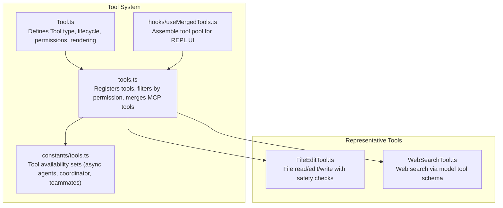
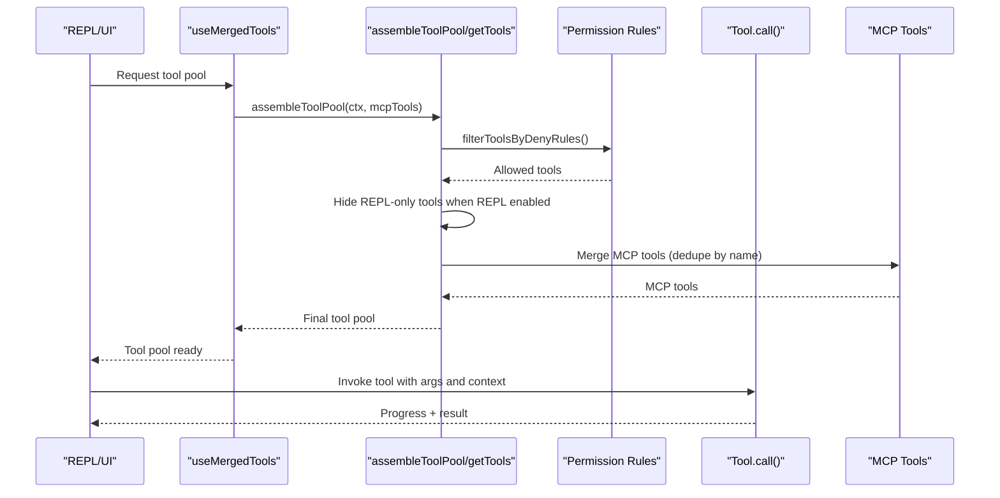
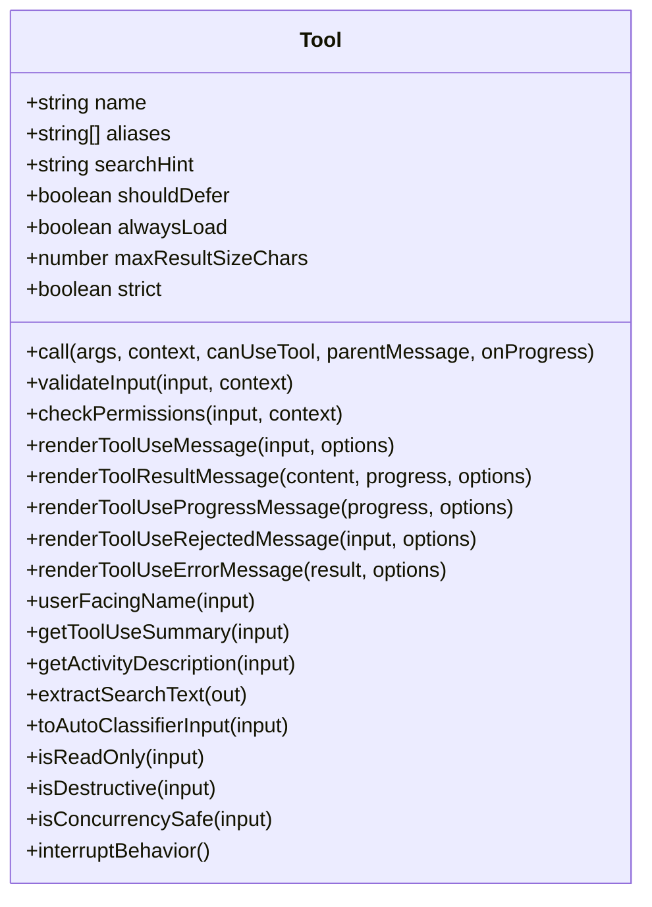
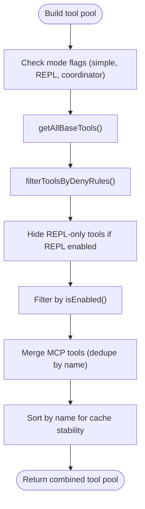
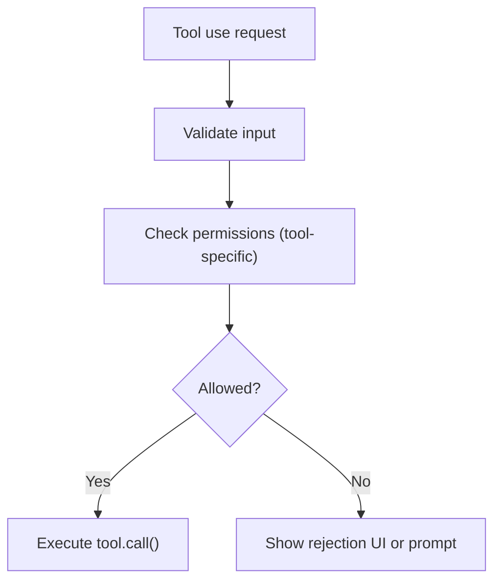
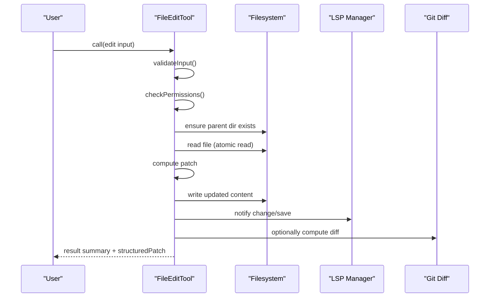
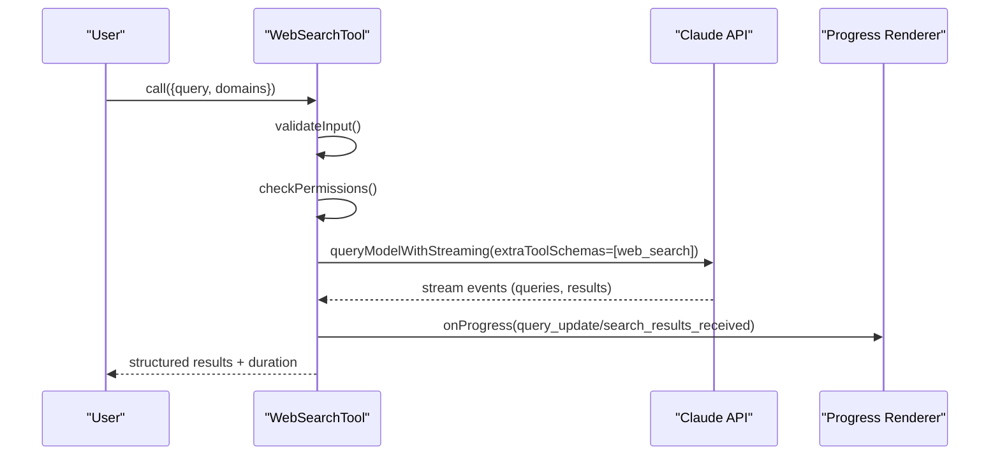
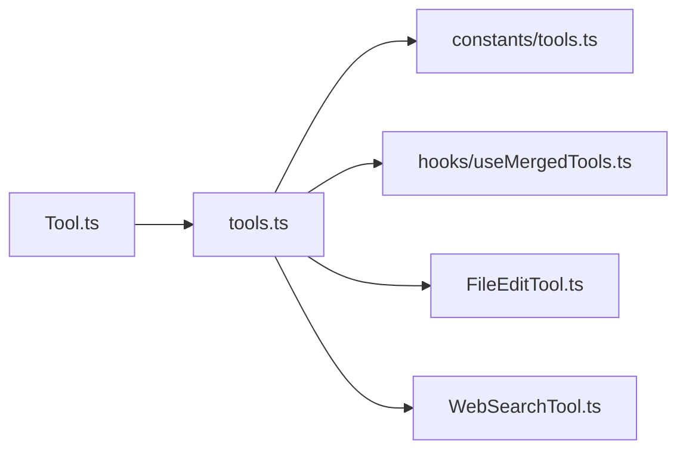

# Tool System

<cite>
**Referenced Files in This Document**
- [tools.ts](file://src/tools.ts)
- [Tool.ts](file://src/Tool.ts)
- [tools.ts (constants)](file://src/constants/tools.ts)
- [useMergedTools.ts](file://src/hooks/useMergedTools.ts)
- [FileEditTool.ts](file://src/tools/FileEditTool/FileEditTool.ts)
- [WebSearchTool.ts](file://src/tools/WebSearchTool/WebSearchTool.ts)
</cite>

## Table of Contents
1. [Introduction](#introduction)
2. [Project Structure](#project-structure)
3. [Core Components](#core-components)
4. [Architecture Overview](#architecture-overview)
5. [Detailed Component Analysis](#detailed-component-analysis)
6. [Dependency Analysis](#dependency-analysis)
7. [Performance Considerations](#performance-considerations)
8. [Troubleshooting Guide](#troubleshooting-guide)
9. [Conclusion](#conclusion)
10. [Appendices](#appendices)

## Introduction
This document explains the tool system architecture and implementation used by the application. It covers the tool interface design, execution lifecycle, permission integration, categorization, composition patterns, and custom tool development. It also provides practical examples of tool usage, chaining, and extension patterns, along with performance optimization, error handling, and security considerations. The system includes a broad set of specialized tools spanning file operations, shell commands, web search, task management, agent coordination, and MCP integrations.

## Project Structure
The tool system is centered around a shared tool interface and a registry that assembles built-in tools and MCP tools. Key areas:
- Tool interface and lifecycle: [Tool.ts](file://src/Tool.ts)
- Tool registry and composition: [tools.ts](file://src/tools.ts)
- Tool availability and categorization: [tools.ts (constants)](file://src/constants/tools.ts)
- UI hook for assembling tool pools in REPL: [useMergedTools.ts](file://src/hooks/useMergedTools.ts)
- Representative tool implementations:
  - File editing: [FileEditTool.ts](file://src/tools/FileEditTool/FileEditTool.ts)
  - Web search: [WebSearchTool.ts](file://src/tools/WebSearchTool/WebSearchTool.ts)

**Diagram sources**
- [Tool.ts:362-695](file://src/Tool.ts#L362-L695)
- [tools.ts:193-367](file://src/tools.ts#L193-L367)
- [constants/tools.ts:36-112](file://src/constants/tools.ts#L36-L112)
- [useMergedTools.ts:20-44](file://src/hooks/useMergedTools.ts#L20-L44)
- [FileEditTool.ts:86-595](file://src/tools/FileEditTool/FileEditTool.ts#L86-L595)
- [WebSearchTool.ts:152-435](file://src/tools/WebSearchTool/WebSearchTool.ts#L152-L435)

**Section sources**
- [tools.ts:193-367](file://src/tools.ts#L193-L367)
- [Tool.ts:362-695](file://src/Tool.ts#L362-L695)
- [constants/tools.ts:36-112](file://src/constants/tools.ts#L36-L112)
- [useMergedTools.ts:20-44](file://src/hooks/useMergedTools.ts#L20-L44)

## Core Components
- Tool interface: A strongly-typed contract that defines how tools behave, validate inputs, request permissions, render progress/results, and integrate with the execution context. See [Tool.ts:362-695](file://src/Tool.ts#L362-L695).
- Tool registry: Centralized assembly of built-in tools, conditional tools, and MCP tools, with permission filtering and deduplication. See [tools.ts:193-367](file://src/tools.ts#L193-L367).
- Tool categorization: Sets that constrain which tools are allowed in specific modes (async agents, teammates, coordinator). See [constants/tools.ts:36-112](file://src/constants/tools.ts#L36-L112).
- UI tool pool assembly: A React hook that merges initial tools, MCP tools, and permission-filtered built-ins. See [useMergedTools.ts:20-44](file://src/hooks/useMergedTools.ts#L20-L44).

Key capabilities:
- Execution lifecycle: validateInput → checkPermissions → call → renderToolUseMessage → renderToolResultMessage
- Permission integration: ToolPermissionContext, deny/allow/ask rules, and MCP server prefixes
- Composition: Built-in tools + MCP tools, with deterministic ordering and deduplication
- Defer loading: Some tools are deferred until searched for by name

**Section sources**
- [Tool.ts:362-695](file://src/Tool.ts#L362-L695)
- [tools.ts:193-367](file://src/tools.ts#L193-L367)
- [constants/tools.ts:36-112](file://src/constants/tools.ts#L36-L112)
- [useMergedTools.ts:20-44](file://src/hooks/useMergedTools.ts#L20-L44)

## Architecture Overview
The tool system is designed around a shared interface and a central registry that:
- Builds a base tool list respecting environment and feature flags
- Filters tools by permission deny rules
- Hides primitive tools in REPL mode when REPL is enabled
- Merges MCP tools with built-in tools, deduplicating by name and preserving order stability
- Exposes convenience functions for simple modes and tool search scenarios

**Diagram sources**
- [useMergedTools.ts:20-44](file://src/hooks/useMergedTools.ts#L20-L44)
- [tools.ts:345-367](file://src/tools.ts#L345-L367)
- [tools.ts:262-327](file://src/tools.ts#L262-L327)

**Section sources**
- [useMergedTools.ts:20-44](file://src/hooks/useMergedTools.ts#L20-L44)
- [tools.ts:345-367](file://src/tools.ts#L345-L367)
- [tools.ts:262-327](file://src/tools.ts#L262-L327)

## Detailed Component Analysis

### Tool Interface Design
The Tool type defines:
- Metadata: name, aliases, searchHint, maxResultSizeChars, strict, alwaysLoad, shouldDefer, mcpInfo
- Lifecycle: call(args, context, canUseTool, parentMessage, onProgress)
- Validation and permissions: validateInput, checkPermissions
- Rendering: renderToolUseMessage, renderToolResultMessage, renderToolUseProgressMessage, renderToolUseRejectedMessage, renderToolUseErrorMessage
- Observability: userFacingName, getToolUseSummary, getActivityDescription, extractSearchText
- Safety: isReadOnly, isDestructive, isConcurrencySafe, interruptBehavior
- Auto-classifier integration: toAutoClassifierInput
- MCP integration: inputJSONSchema, mcpInfo

Defaults are provided for common methods to ensure consistent behavior across tools.

**Diagram sources**
- [Tool.ts:362-695](file://src/Tool.ts#L362-L695)

**Section sources**
- [Tool.ts:362-695](file://src/Tool.ts#L362-L695)

### Tool Registry and Composition
The registry:
- Provides getAllBaseTools() that assembles built-in tools with conditional inclusion based on environment and feature flags
- Filters tools by deny rules and isEnabled()
- Hides REPL-only tools when REPL is enabled
- Merges MCP tools with built-in tools, deduplicating by name and sorting for prompt-cache stability
- Exposes convenience functions for simple modes and tool search scenarios

**Diagram sources**
- [tools.ts:193-367](file://src/tools.ts#L193-L367)

**Section sources**
- [tools.ts:193-367](file://src/tools.ts#L193-L367)

### Permission Integration
- ToolPermissionContext carries permission mode, additional working directories, and rule sets (alwaysAllow, alwaysDeny, alwaysAsk)
- filterToolsByDenyRules removes tools denied by blanket rules
- Tools implement checkPermissions for tool-specific logic
- MCP server-prefix rules can strip tools before the model sees them

**Diagram sources**
- [tools.ts:262-269](file://src/tools.ts#L262-L269)
- [Tool.ts:500-503](file://src/Tool.ts#L500-L503)

**Section sources**
- [tools.ts:262-269](file://src/tools.ts#L262-L269)
- [Tool.ts:500-503](file://src/Tool.ts#L500-L503)

### Representative Tool: FileEditTool
Highlights:
- Validates inputs (path existence, quoting, uniqueness, size limits)
- Enforces permissions for file edits
- Atomic read-modify-write with backup and LSP notifications
- Integrates with file history and git diff computation
- Renders concise summaries and diffs

**Diagram sources**
- [FileEditTool.ts:137-362](file://src/tools/FileEditTool/FileEditTool.ts#L137-L362)
- [FileEditTool.ts:387-574](file://src/tools/FileEditTool/FileEditTool.ts#L387-L574)

**Section sources**
- [FileEditTool.ts:86-595](file://src/tools/FileEditTool/FileEditTool.ts#L86-L595)

### Representative Tool: WebSearchTool
Highlights:
- Defers loading until searched for by name
- Validates domain allow/block lists
- Streams model responses and emits progress events for queries and results
- Aggregates results into a structured output with timing

**Diagram sources**
- [WebSearchTool.ts:235-253](file://src/tools/WebSearchTool/WebSearchTool.ts#L235-L253)
- [WebSearchTool.ts:254-399](file://src/tools/WebSearchTool/WebSearchTool.ts#L254-L399)

**Section sources**
- [WebSearchTool.ts:152-435](file://src/tools/WebSearchTool/WebSearchTool.ts#L152-L435)

### Tool Categories and Modes
- Async agent allowed tools: a curated subset of read/search/edit operations
- In-process teammate allowed tools: task CRUD and messaging
- Coordinator mode allowed tools: agent management and output
- Disallowed sets: prevent recursion and unsafe operations in restricted contexts

**Section sources**
- [constants/tools.ts:36-112](file://src/constants/tools.ts#L36-L112)

### Tool Chaining and Composition Patterns
- Chain multiple tools by invoking them sequentially in a workflow
- Use ToolSearchTool to discover and select tools dynamically when enabled
- Compose tools with MCP resources for extended capabilities
- Use group rendering for non-verbose consolidation of multiple tool uses

[No sources needed since this section provides general guidance]

## Dependency Analysis
The tool system exhibits low coupling and high cohesion:
- Tool.ts defines the interface; tools.ts implements assembly and filtering
- constants/tools.ts centralizes categorization rules
- useMergedTools.ts orchestrates UI tool pool assembly
- Individual tools depend on shared utilities for validation, permissions, and rendering

**Diagram sources**
- [Tool.ts:362-695](file://src/Tool.ts#L362-L695)
- [tools.ts:193-367](file://src/tools.ts#L193-L367)
- [constants/tools.ts:36-112](file://src/constants/tools.ts#L36-L112)
- [useMergedTools.ts:20-44](file://src/hooks/useMergedTools.ts#L20-L44)
- [FileEditTool.ts:86-595](file://src/tools/FileEditTool/FileEditTool.ts#L86-L595)
- [WebSearchTool.ts:152-435](file://src/tools/WebSearchTool/WebSearchTool.ts#L152-L435)

**Section sources**
- [tools.ts:193-367](file://src/tools.ts#L193-L367)
- [constants/tools.ts:36-112](file://src/constants/tools.ts#L36-L112)
- [useMergedTools.ts:20-44](file://src/hooks/useMergedTools.ts#L20-L44)

## Performance Considerations
- Prompt cache stability: Sorting tools by name and deduplicating preserves cache breakpoints
- Streaming progress: Tools like WebSearchTool emit incremental progress to improve perceived responsiveness
- Result size limits: Tools can cap result sizes to avoid excessive memory usage
- Concurrency safety: isConcurrencySafe allows the system to optimize scheduling
- Conditional inclusion: Environment and feature flags reduce tool surface and improve startup performance

[No sources needed since this section provides general guidance]

## Troubleshooting Guide
Common issues and resolutions:
- Permission denials: Review ToolPermissionContext and deny rules; use checkPermissions suggestions to add rules
- Tool not appearing: Verify isEnabled() and mode filtering; ensure REPL-only tools are hidden when REPL is enabled
- Large file edits: Respect MAX_EDIT_FILE_SIZE and consider streaming alternatives
- Stale file state: Ensure files are read before editing; the system validates timestamps and content
- Web search failures: Validate domain lists and ensure provider/model supports web search

**Section sources**
- [tools.ts:262-327](file://src/tools.ts#L262-L327)
- [FileEditTool.ts:137-362](file://src/tools/FileEditTool/FileEditTool.ts#L137-L362)
- [WebSearchTool.ts:235-253](file://src/tools/WebSearchTool/WebSearchTool.ts#L235-L253)

## Conclusion
The tool system provides a robust, extensible framework for integrating diverse capabilities while maintaining strong security, performance, and usability guarantees. Its modular design, clear lifecycle, and permission-aware composition enable both simple and advanced workflows, from basic file editing to complex agent orchestration and MCP integrations.

## Appendices

### Practical Usage Examples
- Using FileEditTool: Provide file_path, old_string/new_string, and replace_all; the tool validates, computes a patch, writes atomically, notifies LSP, and returns a structured result
- Using WebSearchTool: Provide a query with optional domain allow/block lists; the tool streams progress and returns aggregated results with timing

[No sources needed since this section provides general guidance]

### Developer Documentation: Creating a Custom Tool
Steps:
1. Define input/output schemas using Zod or JSON schema
2. Implement validateInput and checkPermissions
3. Implement call with progress callbacks and return a ToolResult
4. Add rendering methods for messages and progress
5. Register the tool in the registry and apply mode/category rules as appropriate

[No sources needed since this section provides general guidance]