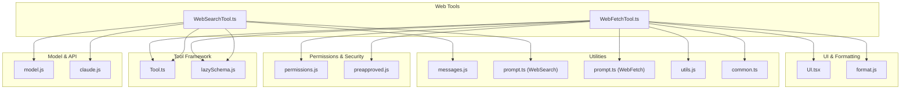
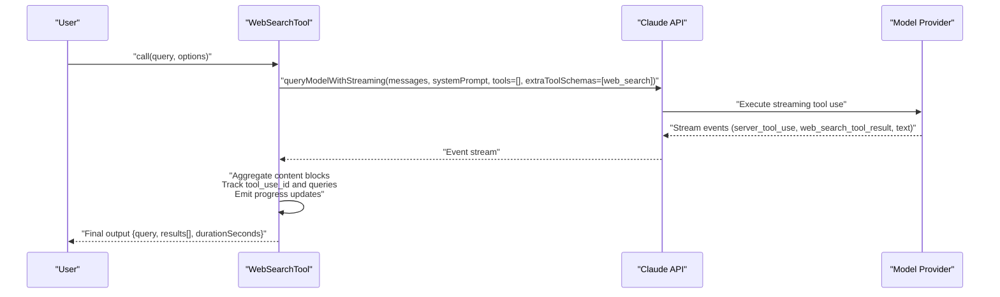
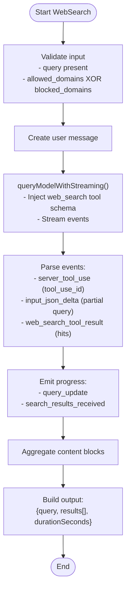
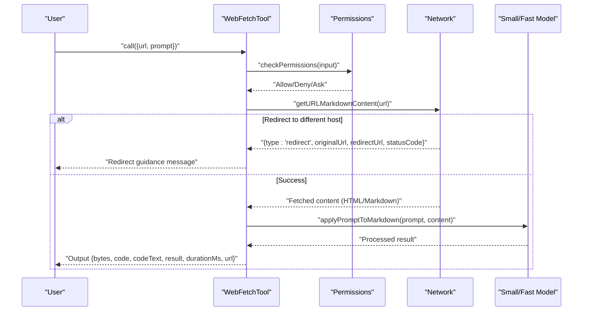
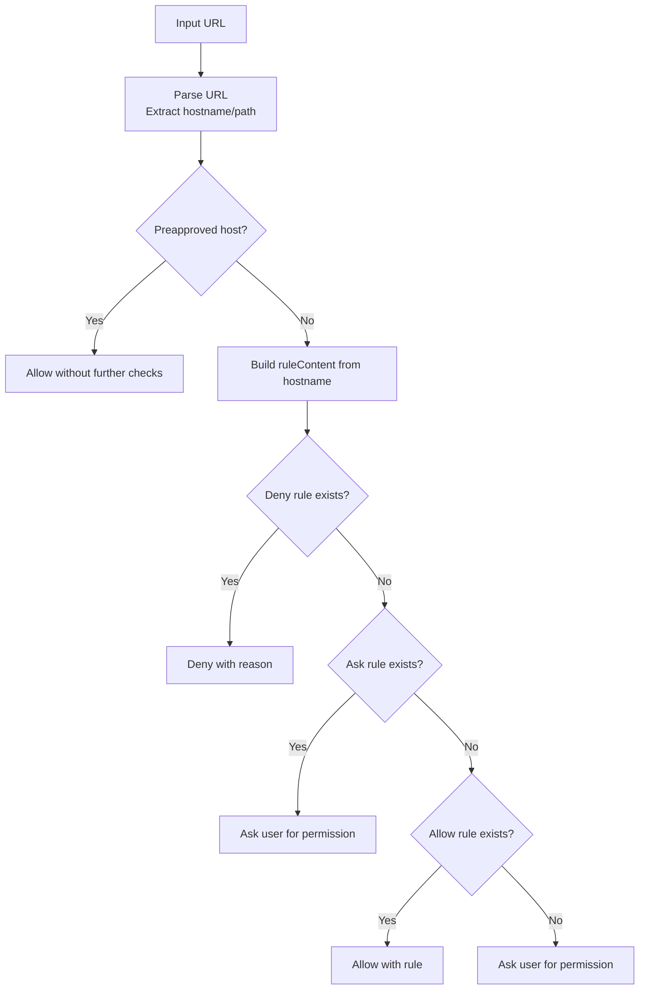
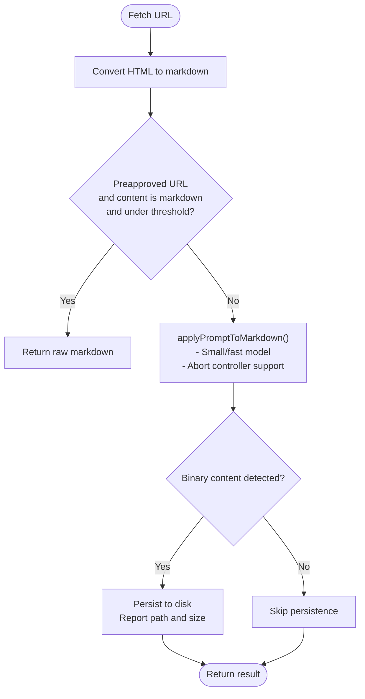
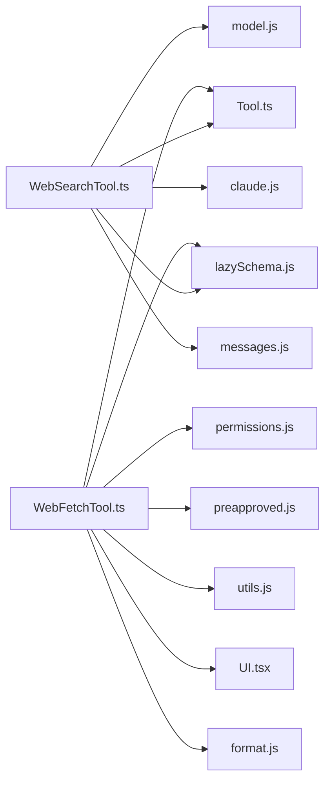

# Web Search and Fetch Tools

<cite>
**Referenced Files in This Document**
- [WebSearchTool.ts](file://claude_code_src/restored-src/src/tools/WebSearchTool/WebSearchTool.ts)
- [prompt.ts](file://claude_code_src/restored-src/src/tools/WebSearchTool/prompt.ts)
- [WebFetchTool.ts](file://claude_code_src/restored-src/src/tools/WebFetchTool/WebFetchTool.ts)
- [prompt.ts](file://claude_code_src/restored-src/src/tools/WebFetchTool/prompt.ts)
- [UI.tsx](file://claude_code_src/restored-src/src/tools/WebFetchTool/UI.tsx)
- [utils.js](file://claude_code_src/restored-src/src/tools/WebFetchTool/utils.js)
- [preapproved.js](file://claude_code_src/restored-src/src/tools/WebFetchTool/preapproved.js)
- [Tool.ts](file://claude_code_src/restored-src/src/Tool.ts)
- [permissions.js](file://claude_code_src/restored-src/src/utils/permissions/permissions.js)
- [model.js](file://claude_code_src/restored-src/src/utils/model/model.js)
- [claude.js](file://claude_code_src/restored-src/src/services/api/claude.js)
- [messages.js](file://claude_code_src/restored-src/src/utils/messages.js)
- [lazySchema.js](file://claude_code_src/restored-src/src/utils/lazySchema.js)
- [format.js](file://claude_code_src/restored-src/src/utils/format.js)
- [common.ts](file://claude_code_src/restored-src/src/constants/common.ts)
</cite>

## Table of Contents
1. [Introduction](#introduction)
2. [Project Structure](#project-structure)
3. [Core Components](#core-components)
4. [Architecture Overview](#architecture-overview)
5. [Detailed Component Analysis](#detailed-component-analysis)
6. [Dependency Analysis](#dependency-analysis)
7. [Performance Considerations](#performance-considerations)
8. [Troubleshooting Guide](#troubleshooting-guide)
9. [Conclusion](#conclusion)
10. [Appendices](#appendices)

## Introduction
This document provides comprehensive documentation for the Web Search and Fetch tools, focusing on WebSearchTool and WebFetchTool. It explains web scraping capabilities, URL processing, content extraction, security measures, request validation, content filtering, integration with computer use capabilities, browser automation patterns, rate limiting, proxy support, and web accessibility considerations. Practical examples demonstrate how to perform web searches, fetch pages, and analyze content.

## Project Structure
The tools are implemented as part of the broader tool framework and integrate with permission systems, model providers, and UI rendering utilities.

**Diagram sources**
- [WebSearchTool.ts:1-436](file://claude_code_src/restored-src/src/tools/WebSearchTool/WebSearchTool.ts#L1-L436)
- [WebFetchTool.ts:1-319](file://claude_code_src/restored-src/src/tools/WebFetchTool/WebFetchTool.ts#L1-L319)
- [Tool.ts](file://claude_code_src/restored-src/src/Tool.ts)
- [permissions.js](file://claude_code_src/restored-src/src/utils/permissions/permissions.js)
- [preapproved.js](file://claude_code_src/restored-src/src/tools/WebFetchTool/preapproved.js)
- [model.js](file://claude_code_src/restored-src/src/utils/model/model.js)
- [claude.js](file://claude_code_src/restored-src/src/services/api/claude.js)
- [messages.js](file://claude_code_src/restored-src/src/utils/messages.js)
- [lazySchema.js](file://claude_code_src/restored-src/src/utils/lazySchema.js)
- [format.js](file://claude_code_src/restored-src/src/utils/format.js)
- [prompt.ts:1-34](file://claude_code_src/restored-src/src/tools/WebSearchTool/prompt.ts#L1-L34)
- [prompt.ts:1-21](file://claude_code_src/restored-src/src/tools/WebFetchTool/prompt.ts#L1-L21)
- [utils.js](file://claude_code_src/restored-src/src/tools/WebFetchTool/utils.js)
- [common.ts](file://claude_code_src/restored-src/src/constants/common.ts)

**Section sources**
- [WebSearchTool.ts:1-436](file://claude_code_src/restored-src/src/tools/WebSearchTool/WebSearchTool.ts#L1-L436)
- [WebFetchTool.ts:1-319](file://claude_code_src/restored-src/src/tools/WebFetchTool/WebFetchTool.ts#L1-L319)

## Core Components
- WebSearchTool: Performs web searches using a streaming model interface, returning structured results with links and optional commentary. It enforces domain filters and validates input constraints.
- WebFetchTool: Retrieves content from a specified URL, converts HTML to markdown, applies a prompt using a small/fast model, and returns the processed result. It includes permission checks, redirect handling, caching, and binary content persistence.

Key capabilities:
- Input validation and schema enforcement
- Permission gating with allow/deny/ask rules
- Streaming progress reporting for search operations
- Content extraction and summarization
- Redirect detection and guidance
- Binary content saving and notification
- Read-only operation mode

**Section sources**
- [WebSearchTool.ts:25-67](file://claude_code_src/restored-src/src/tools/WebSearchTool/WebSearchTool.ts#L25-L67)
- [WebFetchTool.ts:24-48](file://claude_code_src/restored-src/src/tools/WebFetchTool/WebFetchTool.ts#L24-L48)

## Architecture Overview
The tools are built using a common tool definition interface and leverage shared utilities for permissions, model selection, and UI rendering.

**Diagram sources**
- [WebSearchTool.ts:254-399](file://claude_code_src/restored-src/src/tools/WebSearchTool/WebSearchTool.ts#L254-L399)
- [claude.js](file://claude_code_src/restored-src/src/services/api/claude.js)
- [model.js](file://claude_code_src/restored-src/src/utils/model/model.js)

## Detailed Component Analysis

### WebSearchTool
Responsibilities:
- Validates input (query length, domain filter exclusivity)
- Builds a tool schema with allowed/blocked domains and a maximum usage cap
- Streams model responses to track progress and emit structured results
- Aggregates results into a normalized output format
- Enforces provider-specific enablement conditions

Processing logic:
- Creates a user message requesting a web search
- Configures streaming with tool schema injection
- Parses stream events to extract tool use IDs, queries, and search results
- Produces a final output combining text commentary and link lists

**Diagram sources**
- [WebSearchTool.ts:254-399](file://claude_code_src/restored-src/src/tools/WebSearchTool/WebSearchTool.ts#L254-L399)

**Section sources**
- [WebSearchTool.ts:25-67](file://claude_code_src/restored-src/src/tools/WebSearchTool/WebSearchTool.ts#L25-L67)
- [WebSearchTool.ts:76-84](file://claude_code_src/restored-src/src/tools/WebSearchTool/WebSearchTool.ts#L76-L84)
- [WebSearchTool.ts:86-150](file://claude_code_src/restored-src/src/tools/WebSearchTool/WebSearchTool.ts#L86-L150)
- [WebSearchTool.ts:152-435](file://claude_code_src/restored-src/src/tools/WebSearchTool/WebSearchTool.ts#L152-L435)
- [prompt.ts:1-34](file://claude_code_src/restored-src/src/tools/WebSearchTool/prompt.ts#L1-L34)

### WebFetchTool
Responsibilities:
- Validates URL format
- Checks preapproved hosts and builds permission rule content from URL host
- Fetches URL content, converting HTML to markdown
- Applies a prompt to extract or summarize information using a small/fast model
- Handles redirects to different hosts and informs the user
- Persists binary content to disk and reports the path
- Renders progress and results in the UI

**Diagram sources**
- [WebFetchTool.ts:104-180](file://claude_code_src/restored-src/src/tools/WebFetchTool/WebFetchTool.ts#L104-L180)
- [WebFetchTool.ts:208-299](file://claude_code_src/restored-src/src/tools/WebFetchTool/WebFetchTool.ts#L208-L299)
- [utils.js](file://claude_code_src/restored-src/src/tools/WebFetchTool/utils.js)
- [preapproved.js](file://claude_code_src/restored-src/src/tools/WebFetchTool/preapproved.js)

**Section sources**
- [WebFetchTool.ts:24-48](file://claude_code_src/restored-src/src/tools/WebFetchTool/WebFetchTool.ts#L24-L48)
- [WebFetchTool.ts:104-180](file://claude_code_src/restored-src/src/tools/WebFetchTool/WebFetchTool.ts#L104-L180)
- [WebFetchTool.ts:191-204](file://claude_code_src/restored-src/src/tools/WebFetchTool/WebFetchTool.ts#L191-L204)
- [WebFetchTool.ts:208-299](file://claude_code_src/restored-src/src/tools/WebFetchTool/WebFetchTool.ts#L208-L299)
- [UI.tsx:1-49](file://claude_code_src/restored-src/src/tools/WebFetchTool/UI.tsx#L1-L49)
- [prompt.ts:1-21](file://claude_code_src/restored-src/src/tools/WebFetchTool/prompt.ts#L1-L21)

### Permission and Security Model
- Preapproved hosts bypass permission checks for specific URLs
- Permission decisions are derived from deny/ask/allow rules keyed by hostname or raw input
- Authentication warnings emphasize that authenticated/private URLs will fail
- Suggestions provide quick-add rules for granting access

**Diagram sources**
- [WebFetchTool.ts:104-180](file://claude_code_src/restored-src/src/tools/WebFetchTool/WebFetchTool.ts#L104-L180)
- [permissions.js](file://claude_code_src/restored-src/src/utils/permissions/permissions.js)
- [preapproved.js](file://claude_code_src/restored-src/src/tools/WebFetchTool/preapproved.js)

**Section sources**
- [WebFetchTool.ts:50-64](file://claude_code_src/restored-src/src/tools/WebFetchTool/WebFetchTool.ts#L50-L64)
- [WebFetchTool.ts:104-180](file://claude_code_src/restored-src/src/tools/WebFetchTool/WebFetchTool.ts#L104-L180)
- [prompt.ts:181-190](file://claude_code_src/restored-src/src/tools/WebFetchTool/prompt.ts#L181-L190)

### Content Extraction and Processing
- HTML to markdown conversion is performed during fetching
- For preapproved markdown content below a threshold, raw content is returned
- Otherwise, a small/fast model processes the content according to the provided prompt
- Binary content (e.g., PDFs) is saved to disk with a mime-derived extension and reported to the user

**Diagram sources**
- [WebFetchTool.ts:261-285](file://claude_code_src/restored-src/src/tools/WebFetchTool/WebFetchTool.ts#L261-L285)
- [utils.js](file://claude_code_src/restored-src/src/tools/WebFetchTool/utils.js)

**Section sources**
- [WebFetchTool.ts:261-285](file://claude_code_src/restored-src/src/tools/WebFetchTool/WebFetchTool.ts#L261-L285)
- [utils.js](file://claude_code_src/restored-src/src/tools/WebFetchTool/utils.js)

## Dependency Analysis
- Both tools depend on the common tool definition interface and lazy schema utilities
- WebSearchTool integrates with model providers and the Claude API streaming interface
- WebFetchTool depends on permission utilities, preapproved host lists, and content processing utilities
- UI rendering utilities format progress and results for display

**Diagram sources**
- [WebSearchTool.ts:1-436](file://claude_code_src/restored-src/src/tools/WebSearchTool/WebSearchTool.ts#L1-L436)
- [WebFetchTool.ts:1-319](file://claude_code_src/restored-src/src/tools/WebFetchTool/WebFetchTool.ts#L1-L319)
- [Tool.ts](file://claude_code_src/restored-src/src/Tool.ts)
- [lazySchema.js](file://claude_code_src/restored-src/src/utils/lazySchema.js)
- [model.js](file://claude_code_src/restored-src/src/utils/model/model.js)
- [claude.js](file://claude_code_src/restored-src/src/services/api/claude.js)
- [messages.js](file://claude_code_src/restored-src/src/utils/messages.js)
- [permissions.js](file://claude_code_src/restored-src/src/utils/permissions/permissions.js)
- [preapproved.js](file://claude_code_src/restored-src/src/tools/WebFetchTool/preapproved.js)
- [utils.js](file://claude_code_src/restored-src/src/tools/WebFetchTool/utils.js)
- [UI.tsx:1-49](file://claude_code_src/restored-src/src/tools/WebFetchTool/UI.tsx#L1-L49)
- [format.js](file://claude_code_src/restored-src/src/utils/format.js)

**Section sources**
- [WebSearchTool.ts:1-436](file://claude_code_src/restored-src/src/tools/WebSearchTool/WebSearchTool.ts#L1-L436)
- [WebFetchTool.ts:1-319](file://claude_code_src/restored-src/src/tools/WebFetchTool/WebFetchTool.ts#L1-L319)

## Performance Considerations
- Streaming search: WebSearchTool streams model responses to provide incremental progress updates, reducing perceived latency
- Deferred execution: Tools mark themselves as deferred to optimize scheduling
- Small/fast model: WebFetchTool uses a smaller model for content processing to reduce latency and cost
- Caching: WebFetchTool includes a self-cleaning cache for repeated access to the same URL
- Binary persistence: Large or binary content is persisted to disk to avoid large in-memory payloads

[No sources needed since this section provides general guidance]

## Troubleshooting Guide
Common issues and resolutions:
- Invalid URL: Validation rejects malformed URLs; ensure fully qualified URLs with proper scheme
- Redirect to different host: When a redirect changes the host, the tool returns a guidance message with the new URL to use
- Authenticated/private URLs: These will fail; prefer MCP-provided authenticated tools when available
- Domain filters conflict: Allowed and blocked domains cannot be specified simultaneously
- Permission denials: Add explicit allow/deny rules or accept ask prompts to grant access

**Section sources**
- [WebFetchTool.ts:191-204](file://claude_code_src/restored-src/src/tools/WebFetchTool/WebFetchTool.ts#L191-L204)
- [WebFetchTool.ts:216-249](file://claude_code_src/restored-src/src/tools/WebFetchTool/WebFetchTool.ts#L216-L249)
- [WebFetchTool.ts:181-190](file://claude_code_src/restored-src/src/tools/WebFetchTool/WebFetchTool.ts#L181-L190)
- [WebSearchTool.ts:244-252](file://claude_code_src/restored-src/src/tools/WebSearchTool/WebSearchTool.ts#L244-L252)
- [WebFetchTool.ts:123-173](file://claude_code_src/restored-src/src/tools/WebFetchTool/WebFetchTool.ts#L123-L173)

## Conclusion
WebSearchTool and WebFetchTool provide robust, secure, and efficient mechanisms for web search and content retrieval. They enforce strict input validation, permission controls, and safe defaults while offering powerful content extraction and summarization capabilities. Their integration with streaming APIs, permission systems, and UI rendering ensures a responsive and transparent user experience.

[No sources needed since this section summarizes without analyzing specific files]

## Appendices

### Practical Examples

- Web search with domain filtering:
  - Input: query, allowed_domains, blocked_domains
  - Behavior: Executes search constrained to allowed domains or excludes blocked ones
  - Output: Mixed results with text commentary and link lists

- Fetch and extract from a URL:
  - Input: url, prompt
  - Behavior: Fetches content, converts to markdown, applies prompt using a small model
  - Output: Extracted or summarized result, plus metadata and duration

- Handling redirects:
  - If the URL redirects to a different host, the tool returns a guidance message with the new URL to use

- Using preapproved hosts:
  - For preapproved hosts and markdown content under a threshold, raw content is returned without additional processing

**Section sources**
- [WebSearchTool.ts:25-37](file://claude_code_src/restored-src/src/tools/WebSearchTool/WebSearchTool.ts#L25-L37)
- [WebSearchTool.ts:76-84](file://claude_code_src/restored-src/src/tools/WebSearchTool/WebSearchTool.ts#L76-L84)
- [WebFetchTool.ts:24-48](file://claude_code_src/restored-src/src/tools/WebFetchTool/WebFetchTool.ts#L24-L48)
- [WebFetchTool.ts:216-249](file://claude_code_src/restored-src/src/tools/WebFetchTool/WebFetchTool.ts#L216-L249)
- [WebFetchTool.ts:261-285](file://claude_code_src/restored-src/src/tools/WebFetchTool/WebFetchTool.ts#L261-L285)

### Rate Limiting, Proxy Support, and Accessibility
- Rate limiting: The tools rely on provider-side limits and streaming to manage throughput; consider batching and deferral strategies
- Proxy support: No explicit proxy configuration is exposed in the tools; network-level proxies may be configured externally
- Accessibility: Content is converted to markdown for easier processing; binary content is persisted for inspection; UI renders progress and results clearly

[No sources needed since this section provides general guidance]