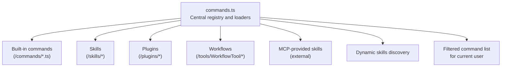
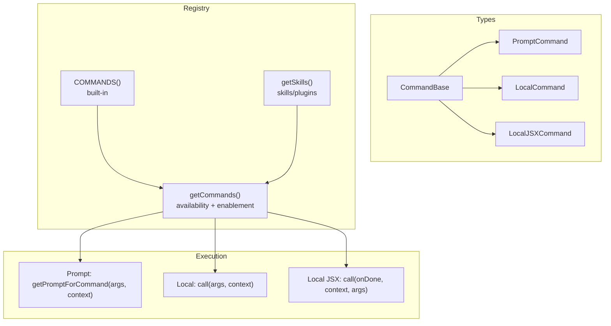
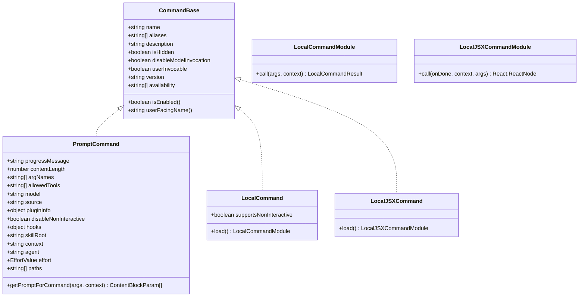
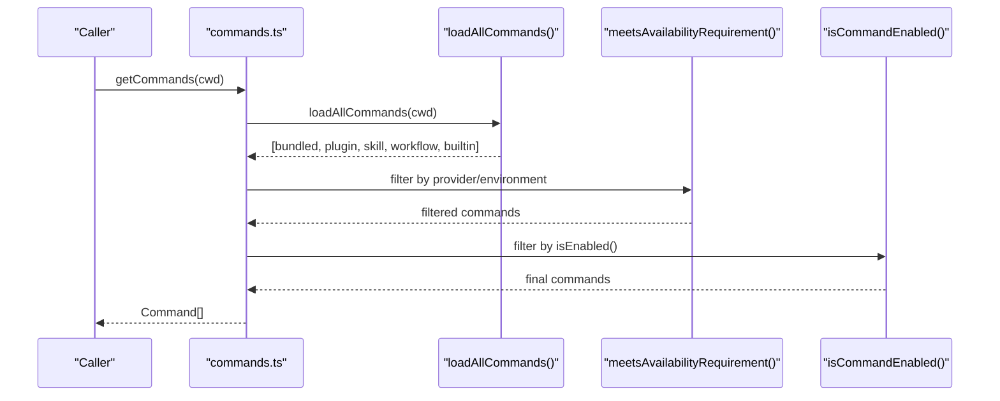
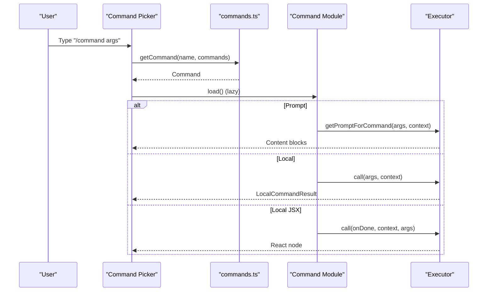
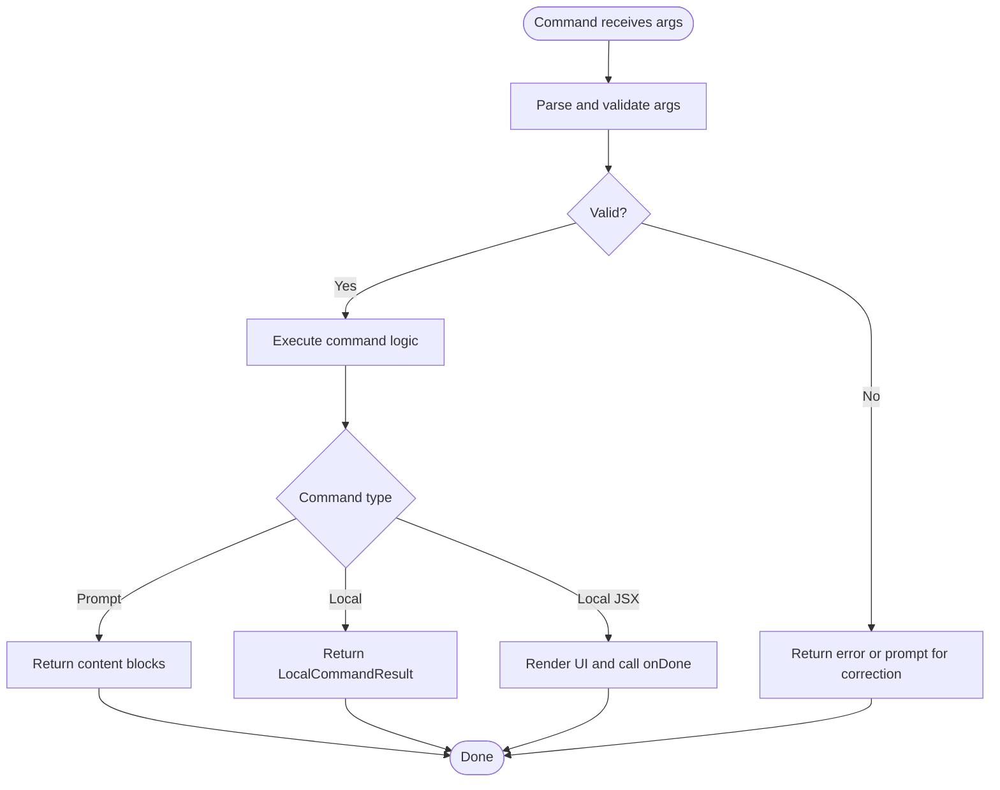
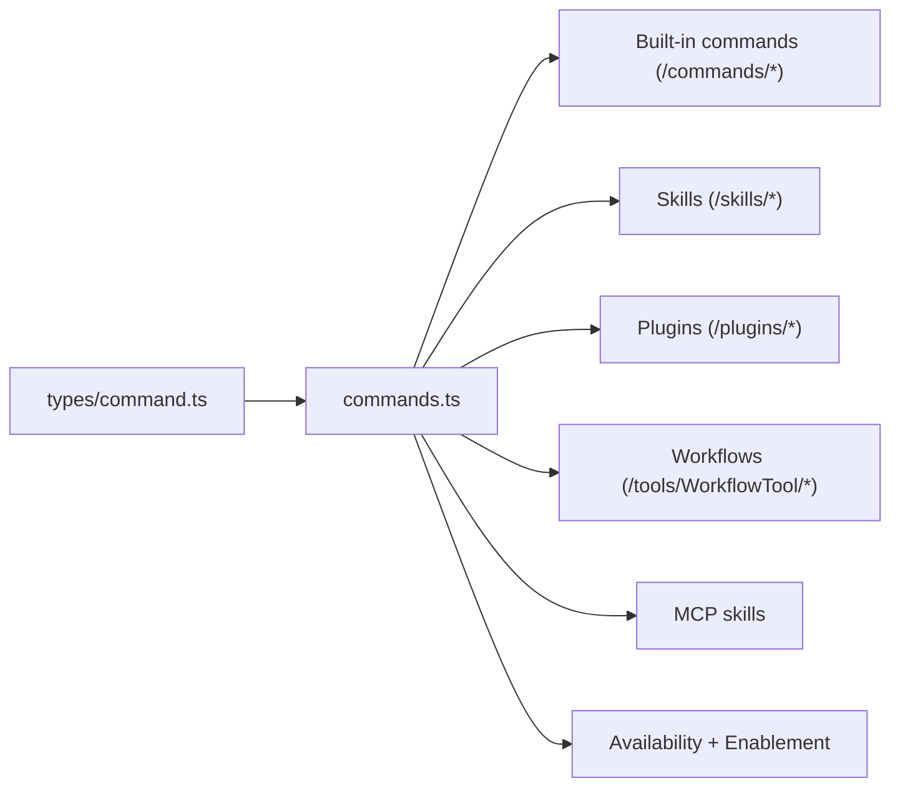

# Command Development

<cite>
**Referenced Files in This Document**
- [commands.ts](file://claude_code_src/restored-src/src/commands.ts)
- [command.ts](file://claude_code_src/restored-src/src/types/command.ts)
- [index.ts](file://claude_code_src/restored-src/src/commands/clear/index.ts)
- [index.ts](file://claude_code_src/restored-src/src/commands/branch/index.ts)
- [index.ts](file://claude_code_src/restored-src/src/commands/context/index.ts)
- [init.ts](file://claude_code_src/restored-src/src/commands/init.ts)
- [index.ts](file://claude_code_src/restored-src/src/commands/add-dir/index.ts)
- [index.ts](file://claude_code_src/restored-src/src/commands/feedback/index.ts)
- [index.ts](file://claude_code_src/restored-src/src/commands/help/index.ts)
</cite>

## Table of Contents
1. [Introduction](#introduction)
2. [Project Structure](#project-structure)
3. [Core Components](#core-components)
4. [Architecture Overview](#architecture-overview)
5. [Detailed Component Analysis](#detailed-component-analysis)
6. [Dependency Analysis](#dependency-analysis)
7. [Performance Considerations](#performance-considerations)
8. [Troubleshooting Guide](#troubleshooting-guide)
9. [Conclusion](#conclusion)
10. [Appendices](#appendices)

## Introduction
This document explains how to develop custom commands for the Claude Code Python IDE. It covers the command architecture, registration process, execution lifecycle, and the command interface. You will learn how to define commands, handle parameters and return values, compose commands, manage context, and integrate with the existing command ecosystem. It also includes testing strategies, debugging techniques, performance considerations, and security and permission handling.

## Project Structure
Commands are organized under a dedicated commands directory and registered centrally. The central registry aggregates built-in commands, skills, plugins, and workflows, then filters them by availability and enablement.

**Diagram sources**
- [commands.ts:258-346](file://claude_code_src/restored-src/src/commands.ts#L258-L346)
- [commands.ts:449-469](file://claude_code_src/restored-src/src/commands.ts#L449-L469)

**Section sources**
- [commands.ts:258-346](file://claude_code_src/restored-src/src/commands.ts#L258-L346)
- [commands.ts:449-469](file://claude_code_src/restored-src/src/commands.ts#L449-L469)

## Core Components
- Command types and interfaces:
  - Prompt commands: expand into model prompts and can be invoked by the model.
  - Local commands: execute locally in the terminal UI and return text or compact results.
  - Local JSX commands: render interactive UI and return React nodes.
- Central registry:
  - Aggregates commands from multiple sources.
  - Applies availability gating and enablement checks.
  - Provides helpers to find, format descriptions, and filter commands for remote/bridge contexts.

Key responsibilities:
- Define the Command interface and variants.
- Register commands and lazily load heavy implementations.
- Filter commands by provider/environment and runtime enablement.
- Provide convenience APIs for command discovery and safety checks.

**Section sources**
- [command.ts:16-217](file://claude_code_src/restored-src/src/types/command.ts#L16-L217)
- [commands.ts:258-346](file://claude_code_src/restored-src/src/commands.ts#L258-L346)
- [commands.ts:476-517](file://claude_code_src/restored-src/src/commands.ts#L476-L517)

## Architecture Overview
The command system is layered:
- Types define the contract for commands and results.
- Registration aggregates sources and exposes filtered lists.
- Execution routes to prompt expansion, local execution, or JSX rendering depending on the command type.

**Diagram sources**
- [command.ts:205-206](file://claude_code_src/restored-src/src/types/command.ts#L205-L206)
- [command.ts:53-56](file://claude_code_src/restored-src/src/types/command.ts#L53-L56)
- [command.ts:62-72](file://claude_code_src/restored-src/src/types/command.ts#L62-L72)
- [command.ts:131-142](file://claude_code_src/restored-src/src/types/command.ts#L131-L142)
- [commands.ts:258-346](file://claude_code_src/restored-src/src/commands.ts#L258-L346)
- [commands.ts:476-517](file://claude_code_src/restored-src/src/commands.ts#L476-L517)

## Detailed Component Analysis

### Command Interface and Result Types
- PromptCommand
  - Purpose: Expand into model prompts.
  - Fields include progress messaging, content length, allowed tools, model, source, hooks, context mode, agent type, effort, and path filters.
  - Execution: getPromptForCommand(args, context) returns content blocks for the model.
- LocalCommand
  - Purpose: Local execution with non-interactive support.
  - Execution: load() returns a module with call(args, context) -> LocalCommandResult.
  - Result types: text, compact, skip.
- LocalJSXCommand
  - Purpose: Interactive UI rendering.
  - Execution: load() returns a module with call(onDone, context, args) -> React node.
  - Context augments ToolUseContext with UI hooks and options.

**Diagram sources**
- [command.ts:16-217](file://claude_code_src/restored-src/src/types/command.ts#L16-L217)

**Section sources**
- [command.ts:16-217](file://claude_code_src/restored-src/src/types/command.ts#L16-L217)

### Registration and Availability Filtering
- Built-in commands are collected in a memoized list and merged with skills, plugins, and workflows.
- Availability gating evaluates provider/environment requirements before enablement checks.
- Enablement checks consider feature flags, environment variables, and runtime conditions.
- Dynamic skills are inserted after plugin skills and before built-ins, with de-duplication.

**Diagram sources**
- [commands.ts:476-517](file://claude_code_src/restored-src/src/commands.ts#L476-L517)
- [commands.ts:417-443](file://claude_code_src/restored-src/src/commands.ts#L417-L443)
- [commands.ts:210-211](file://claude_code_src/restored-src/src/commands.ts#L210-L211)

**Section sources**
- [commands.ts:417-443](file://claude_code_src/restored-src/src/commands.ts#L417-L443)
- [commands.ts:476-517](file://claude_code_src/restored-src/src/commands.ts#L476-L517)

### Execution Lifecycle
- Prompt commands: getPromptForCommand(args, context) returns content blocks for the model. Progress and content length inform UX and token estimation.
- Local commands: load() defers heavy imports; call(args, context) returns a LocalCommandResult (text, compact, or skip).
- Local JSX commands: load() defers UI-heavy modules; call(onDone, context, args) renders UI and can stream updates via onDone callbacks.

**Diagram sources**
- [commands.ts:688-719](file://claude_code_src/restored-src/src/commands.ts#L688-L719)
- [command.ts:53-56](file://claude_code_src/restored-src/src/types/command.ts#L53-L56)
- [command.ts:62-72](file://claude_code_src/restored-src/src/types/command.ts#L62-L72)
- [command.ts:131-142](file://claude_code_src/restored-src/src/types/command.ts#L131-L142)

**Section sources**
- [command.ts:53-56](file://claude_code_src/restored-src/src/types/command.ts#L53-L56)
- [command.ts:62-72](file://claude_code_src/restored-src/src/types/command.ts#L62-L72)
- [command.ts:131-142](file://claude_code_src/restored-src/src/types/command.ts#L131-L142)

### Parameter Handling and Return Values
- Arguments: passed as a single string to commands. Parsing and validation are the responsibility of the command implementation.
- Prompt commands: return content blocks suitable for model consumption.
- Local commands: return LocalCommandResult with type text, compact, or skip. Compact results carry a compaction result and optional display text.
- Local JSX commands: render UI and communicate outcomes via onDone(result?, options?) with display modes and optional meta messages.

**Diagram sources**
- [command.ts:16-24](file://claude_code_src/restored-src/src/types/command.ts#L16-L24)
- [command.ts:53-56](file://claude_code_src/restored-src/src/types/command.ts#L53-L56)
- [command.ts:117-126](file://claude_code_src/restored-src/src/types/command.ts#L117-L126)

**Section sources**
- [command.ts:16-24](file://claude_code_src/restored-src/src/types/command.ts#L16-L24)
- [command.ts:53-56](file://claude_code_src/restored-src/src/types/command.ts#L53-L56)
- [command.ts:117-126](file://claude_code_src/restored-src/src/types/command.ts#L117-L126)

### Building Interactive Commands with Input Validation and Feedback
- Use LocalJSX commands for interactive experiences. Defer heavy imports via load().
- Validate inputs early and provide clear feedback via onDone with display modes and optional meta messages.
- Respect isEnabled() and availability gating to avoid exposing commands users cannot use.

Examples in this codebase:
- Branch command with argument hint and conditional aliasing.
- Context command pair: one for interactive sessions, one for non-interactive sessions.
- Feedback command with environment-based enablement checks.

**Section sources**
- [index.ts:1-15](file://claude_code_src/restored-src/src/commands/branch/index.ts#L1-L15)
- [index.ts:1-25](file://claude_code_src/restored-src/src/commands/context/index.ts#L1-L25)
- [index.ts:1-27](file://claude_code_src/restored-src/src/commands/feedback/index.ts#L1-L27)

### Prompt Commands: Example Pattern
- Init command demonstrates a prompt command that dynamically selects between old and new prompts based on feature flags and environment variables.
- It sets progress messaging and returns a text content block for the model.

**Section sources**
- [init.ts:226-257](file://claude_code_src/restored-src/src/commands/init.ts#L226-L257)

### Command Composition Patterns
- Chain commands by invoking one command’s result as input to another. For prompt commands, chain by structuring content blocks to guide the model to perform subsequent actions.
- For local commands, orchestrate execution order by awaiting results and passing outcomes to downstream commands.
- Use context modes and agent types for forked execution when commands need isolated budgets or sub-agent behavior.

**Section sources**
- [command.ts:42-48](file://claude_code_src/restored-src/src/types/command.ts#L42-L48)

### Context Management
- Prompt commands can specify context modes ('inline' or 'fork') and agent types for sub-agent execution.
- Path filters allow visibility only when the model interacts with specific files.
- Hooks and skill roots enable contextual resource scoping for command execution.

**Section sources**
- [command.ts:42-52](file://claude_code_src/restored-src/src/types/command.ts#L42-L52)

### Security, Permissions, and Provider Availability
- Availability gating ensures commands are only shown to eligible users (e.g., claude.ai subscribers or direct Console API key users).
- Enablement checks can hide commands based on environment variables or feature flags.
- Some commands are sensitive and redacted from conversation history.

**Section sources**
- [commands.ts:417-443](file://claude_code_src/restored-src/src/commands.ts#L417-L443)
- [command.ts:175-203](file://claude_code_src/restored-src/src/types/command.ts#L175-L203)

### Integration with the Existing Command Ecosystem
- Built-in commands are aggregated with skills, plugins, and workflows.
- Dynamic skills are inserted between plugin skills and built-ins, with de-duplication.
- MCP-provided skills can be filtered and exposed to the model when appropriate.

**Section sources**
- [commands.ts:449-469](file://claude_code_src/restored-src/src/commands.ts#L449-L469)
- [commands.ts:547-559](file://claude_code_src/restored-src/src/commands.ts#L547-L559)

## Dependency Analysis
The registry depends on:
- Centralized command types.
- Lazy-loading modules for commands.
- Availability and enablement checks.
- External sources: skills, plugins, workflows, and MCP-provided commands.

**Diagram sources**
- [command.ts:205-206](file://claude_code_src/restored-src/src/types/command.ts#L205-L206)
- [commands.ts:258-346](file://claude_code_src/restored-src/src/commands.ts#L258-L346)
- [commands.ts:449-469](file://claude_code_src/restored-src/src/commands.ts#L449-L469)

**Section sources**
- [commands.ts:258-346](file://claude_code_src/restored-src/src/commands.ts#L258-L346)
- [commands.ts:449-469](file://claude_code_src/restored-src/src/commands.ts#L449-L469)

## Performance Considerations
- Lazy loading: Use load() to defer heavy imports until commands are invoked.
- Memoization: The registry caches expensive loads keyed by working directory.
- Avoid unnecessary dynamic imports and UI rendering until needed.
- Keep prompt content length accurate to improve token estimation and throughput.

**Section sources**
- [index.ts:16-16](file://claude_code_src/restored-src/src/commands/clear/index.ts#L16-L16)
- [commands.ts:449-469](file://claude_code_src/restored-src/src/commands.ts#L449-L469)

## Troubleshooting Guide
- Command not found: Verify the command name, aliases, and that it is enabled and available for the current user.
- Command not appearing: Check availability gating and isEnabled() conditions.
- Heavy command slow to start: Confirm lazy loading is used and not bypassed.
- Remote/bridge safety: Ensure commands are in REMOTE_SAFE_COMMANDS or BRIDGE_SAFE_COMMANDS when needed.

**Section sources**
- [commands.ts:688-719](file://claude_code_src/restored-src/src/commands.ts#L688-L719)
- [commands.ts:619-686](file://claude_code_src/restored-src/src/commands.ts#L619-L686)

## Conclusion
Custom commands in the Claude Code Python IDE follow a clear, extensible architecture. By defining the appropriate command type, registering it in the central registry, and leveraging lazy loading, you can deliver robust, secure, and user-friendly commands. Use availability and enablement checks to tailor commands to users, and apply composition patterns to build powerful workflows.

## Appendices

### Appendix A: Minimal Command Templates
- Prompt command: Provide a getPromptForCommand implementation and set progress messaging and content length.
- Local command: Provide a load() that returns a module with call(args, context) returning LocalCommandResult.
- Local JSX command: Provide a load() that returns a module with call(onDone, context, args) rendering UI.

**Section sources**
- [command.ts:53-56](file://claude_code_src/restored-src/src/types/command.ts#L53-L56)
- [command.ts:62-72](file://claude_code_src/restored-src/src/types/command.ts#L62-L72)
- [command.ts:131-142](file://claude_code_src/restored-src/src/types/command.ts#L131-L142)

### Appendix B: Example Commands in This Codebase
- Clear: Minimal metadata with lazy load.
- Branch: Interactive command with argument hint and conditional aliasing.
- Context: Dual-mode commands for interactive and non-interactive sessions.
- Feedback: Environment-aware enablement checks.
- Help: Simple interactive command.

**Section sources**
- [index.ts:1-20](file://claude_code_src/restored-src/src/commands/clear/index.ts#L1-L20)
- [index.ts:1-15](file://claude_code_src/restored-src/src/commands/branch/index.ts#L1-L15)
- [index.ts:1-25](file://claude_code_src/restored-src/src/commands/context/index.ts#L1-L25)
- [index.ts:1-27](file://claude_code_src/restored-src/src/commands/feedback/index.ts#L1-L27)
- [index.ts:1-11](file://claude_code_src/restored-src/src/commands/help/index.ts#L1-L11)