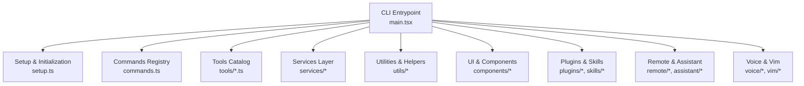
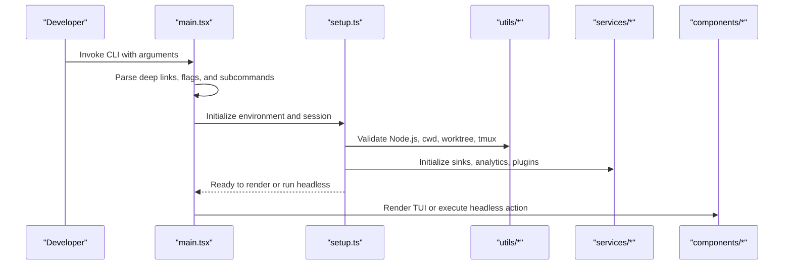
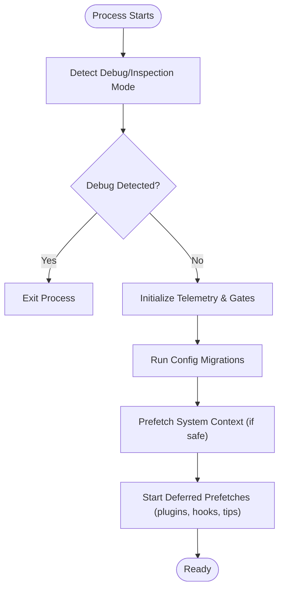
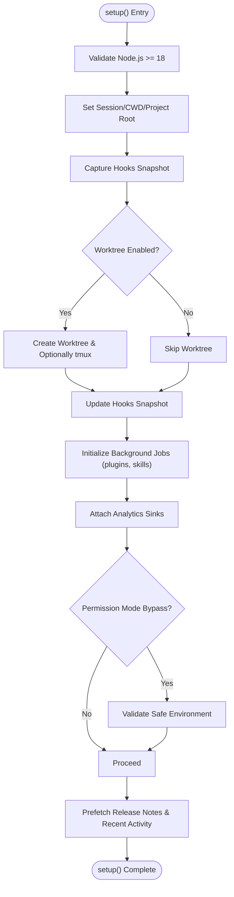
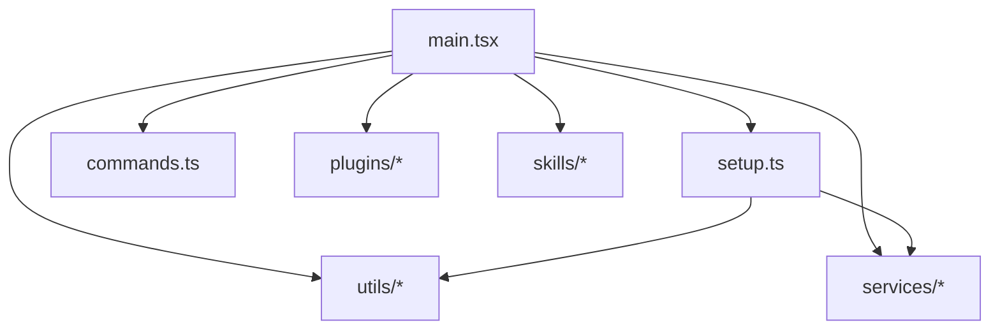

# Contribution Guidelines

<cite>
**Referenced Files in This Document**
- [README.md](file://README.md)
- [main.tsx](file://restored-src/src/main.tsx)
- [setup.ts](file://restored-src/src/setup.ts)
</cite>

## Table of Contents
1. [Introduction](#introduction)
2. [Project Structure](#project-structure)
3. [Core Components](#core-components)
4. [Architecture Overview](#architecture-overview)
5. [Detailed Component Analysis](#detailed-component-analysis)
6. [Dependency Analysis](#dependency-analysis)
7. [Performance Considerations](#performance-considerations)
8. [Troubleshooting Guide](#troubleshooting-guide)
9. [Conclusion](#conclusion)
10. [Appendices](#appendices)

## Introduction
This document defines contribution guidelines for the Claude Code Python IDE development community. It consolidates environment setup, build and test expectations, code style and formatting, linting, pull request process, review and merge criteria, debugging and profiling, workflow best practices, documentation and release standards, governance, maintainer responsibilities, and community interaction guidelines. The content is derived from the repository’s structure and key runtime entry points to ensure accuracy and practicality for contributors.

## Project Structure
The repository is a large TypeScript/React codebase organized by functional domains:
- CLI entry and orchestration
- Commands and tools
- Services (API, MCP, analytics)
- Utilities (auth, git, platform, telemetry)
- UI and components (Ink-based TUI)
- Plugins and skills systems
- Remote and assistant modes
- Voice and vim integrations

**Diagram sources**
- [main.tsx](file://restored-src/src/main.tsx)
- [setup.ts](file://restored-src/src/setup.ts)

**Section sources**
- [README.md](file://README.md)

## Core Components
- CLI Entrypoint: Initializes telemetry, parses deep links and special commands, sets up environment, and branches into interactive or headless flows.
- Setup and Initialization: Validates Node.js version, prepares messaging sockets, restores terminal backups, manages worktrees and tmux, prefetches data, and initializes analytics sinks.
- Commands and Tools: Central registry and implementations for actions like commit, review, config, and many domain-specific tools.
- Services: API clients, MCP integration, analytics, policy limits, OAuth, and plugin/skill management.
- Utilities: Environment detection, platform helpers, auth, git, diagnostics, and performance profiling.
- UI and Components: Ink-based terminal UI, dialogs, prompts, and reusable component libraries.
- Plugins and Skills: Extensibility via bundled and installed plugins and skills.

**Section sources**
- [main.tsx](file://restored-src/src/main.tsx)
- [setup.ts](file://restored-src/src/setup.ts)

## Architecture Overview
The runtime architecture emphasizes:
- Early environment checks and trust establishment
- Deferred prefetches to optimize startup
- Feature flags for optional modes (assistant, coordinator, SSH, etc.)
- Modular initialization of analytics, plugins, and services
- Safe handling of permissions and sandbox environments

**Diagram sources**
- [main.tsx](file://restored-src/src/main.tsx)
- [setup.ts](file://restored-src/src/setup.ts)

## Detailed Component Analysis

### CLI Entrypoint and Startup Flow
Key responsibilities:
- Profiling and checkpointing
- Debugging detection and controlled exits
- Telemetry and analytics gates
- Migration and settings initialization
- Deferred prefetches and background tasks

**Diagram sources**
- [main.tsx](file://restored-src/src/main.tsx)

**Section sources**
- [main.tsx](file://restored-src/src/main.tsx)

### Setup and Environment Initialization
Key responsibilities:
- Node.js version validation
- Messaging socket setup (optional)
- Terminal backup restoration
- Worktree creation and tmux session management
- Hook configuration snapshots and watchers
- Plugin and skill initialization
- Permission mode validation and safety checks
- Release notes and recent activity prefetch

**Diagram sources**
- [setup.ts](file://restored-src/src/setup.ts)

**Section sources**
- [setup.ts](file://restored-src/src/setup.ts)

### Commands and Tools
- Commands are registered centrally and dispatched based on CLI arguments.
- Tools encapsulate domain actions (e.g., Bash, FileEdit, Grep, MCP) with standardized interfaces.
- Plugin and skill systems extend capabilities dynamically.

[No sources needed since this subsection summarizes structure without analyzing specific files]

### Services and Integrations
- API clients, MCP servers, analytics, OAuth, and policy limits are initialized during setup and used across the app lifecycle.
- Remote sessions and assistant modes rely on dedicated managers and transport layers.

[No sources needed since this subsection summarizes structure without analyzing specific files]

## Dependency Analysis
- Entrypoint dependencies: Telemetry, analytics gates, bootstrap state, commands registry, and utilities.
- Setup dependencies: Environment checks, messaging, hooks, plugins, skills, and diagnostics.
- Coupling: Low coupling between modules via centralized registries and utilities; high cohesion within services and tools.

**Diagram sources**
- [main.tsx](file://restored-src/src/main.tsx)
- [setup.ts](file://restored-src/src/setup.ts)

**Section sources**
- [main.tsx](file://restored-src/src/main.tsx)
- [setup.ts](file://restored-src/src/setup.ts)

## Performance Considerations
- Use deferred prefetches to avoid blocking first render.
- Leverage profiling checkpoints to identify bottlenecks.
- Respect feature flags to disable non-essential work in headless or simple modes.
- Minimize synchronous filesystem operations during critical startup paths.

[No sources needed since this section provides general guidance]

## Troubleshooting Guide

Common environment and startup issues:
- Node.js version too low: The setup enforces a minimum version and exits with an error if not met.
- Debug/inspection mode detected: The CLI exits early to prevent unsafe debugging scenarios.
- Permission mode bypass validation failures: Certain environments (root without sandbox, or unsandboxed with internet) are rejected for security.
- Worktree creation failures: Errors are surfaced when not in a git repository without a suitable hook configured.
- Messaging socket setup: Optional; failures are logged and do not block normal operation.

Operational checks:
- Verify terminal backup restoration messages and follow prompts to restore settings if interrupted.
- Confirm hooks snapshot capture and watcher initialization succeed.
- Review analytics sink attachment and telemetry events for session health.

**Section sources**
- [setup.ts](file://restored-src/src/setup.ts)
- [main.tsx](file://restored-src/src/main.tsx)

## Conclusion
These contribution guidelines align development practices with the repository’s architecture and runtime behavior. By following environment setup, initialization, and validation steps, contributors can ensure reliable builds, predictable performance, and secure operation across diverse environments.

[No sources needed since this section summarizes without analyzing specific files]

## Appendices

### Development Environment Setup
- Node.js: Ensure Node.js version meets the minimum requirement enforced by setup.
- Optional: Install tmux for worktree sessions; configure messaging socket path if needed.
- Optional: Configure terminal backups for seamless restoration.

**Section sources**
- [setup.ts](file://restored-src/src/setup.ts)

### Build and Test Expectations
- No explicit build scripts were identified in the repository. Contributions should validate:
  - Runtime behavior via CLI invocation
  - Setup and initialization paths
  - Worktree and tmux workflows
  - Plugin and skill loading
- Unit/integration tests are not present in the repository snapshot; contributions should include manual verification aligned with the CLI flows.

[No sources needed since this subsection summarizes structure without analyzing specific files]

### Code Style, Linting, and Formatting
- No linting or formatting configuration files were found in the repository snapshot.
- Contributors should adopt consistent TypeScript/React style and formatting practices appropriate for the project’s scale and maintainability.

[No sources needed since this subsection summarizes structure without analyzing specific files]

### Pull Request Process, Review Criteria, and Merge Requirements
- Branch from the latest default branch and keep commits focused.
- Include rationale and impact in PR descriptions.
- Ensure no regressions in CLI startup, setup, and core flows.
- For breaking changes, document migration steps and deprecation notices.
- Obtain approvals from maintainers before merging.

[No sources needed since this subsection summarizes process without analyzing specific files]

### Debugging and Profiling
- Use profiling checkpoints to locate slow paths during startup.
- Prefer deferred prefetches for non-critical work.
- Validate permission mode and environment constraints before enabling risky features.

**Section sources**
- [main.tsx](file://restored-src/src/main.tsx)
- [setup.ts](file://restored-src/src/setup.ts)

### Documentation Standards, Changelog, and Releases
- Documentation updates should reflect CLI behavior, setup steps, and environment requirements.
- Changelog entries should summarize user-visible changes and migration notes.
- Release procedures should include validating Node.js compatibility and environment safeguards.

[No sources needed since this subsection summarizes process without analyzing specific files]

### Project Governance, Maintainer Responsibilities, and Community Interaction
- Maintainers review PRs, ensure adherence to environment and performance requirements, and coordinate releases.
- Community interaction should emphasize respectful collaboration, clear communication, and constructive feedback.

[No sources needed since this subsection summarizes governance without analyzing specific files]