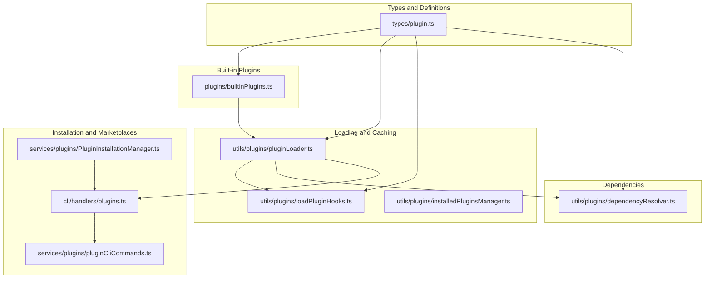
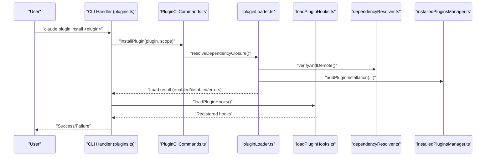
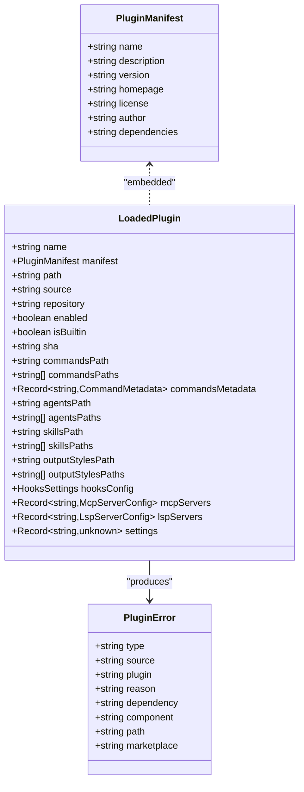
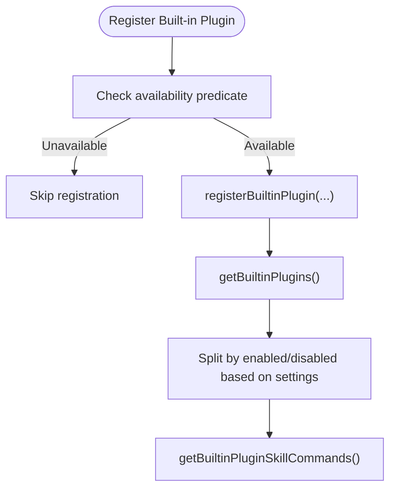
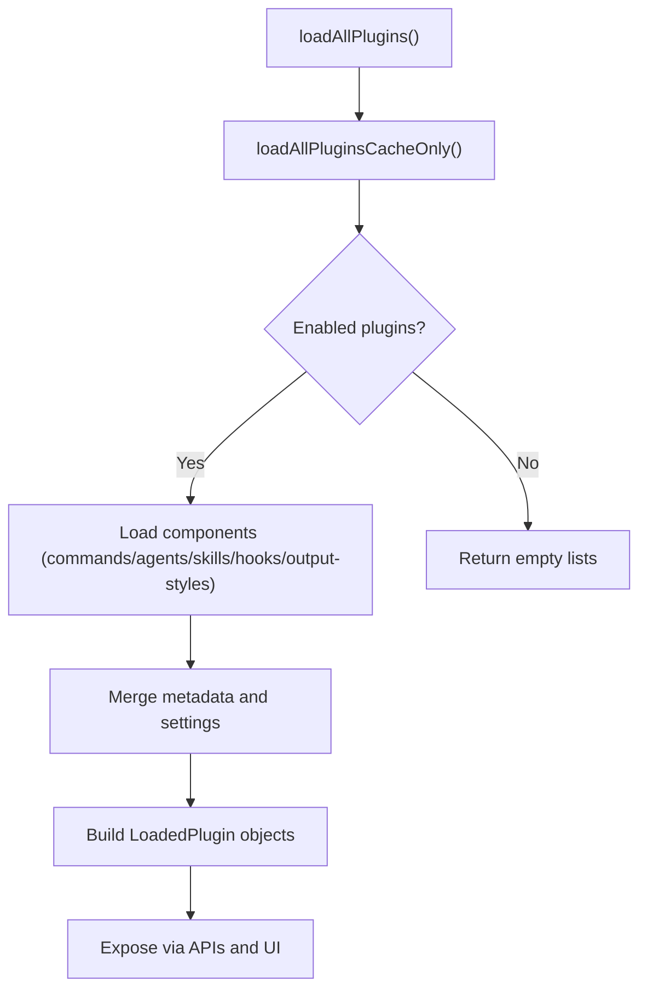
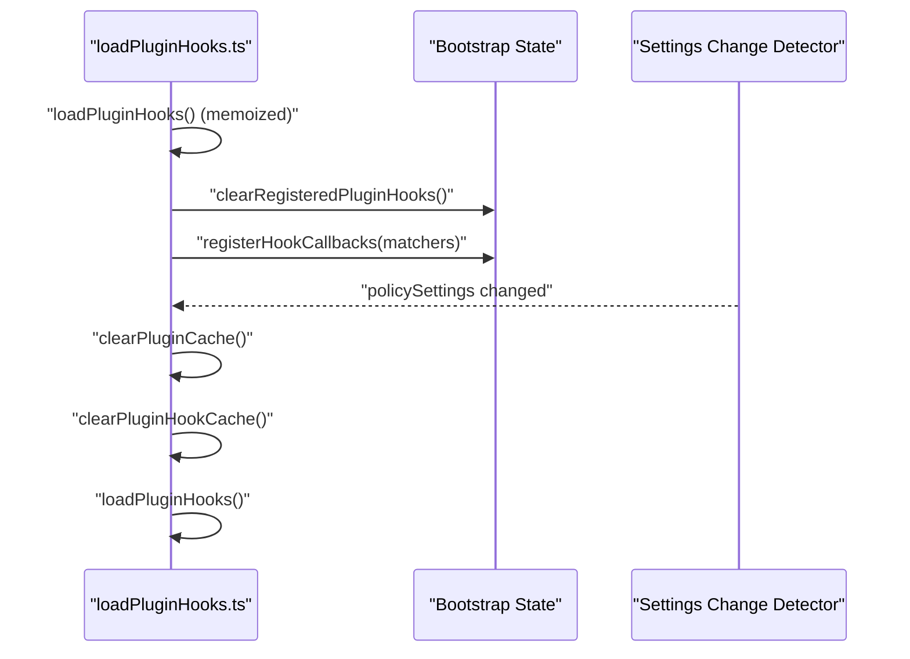
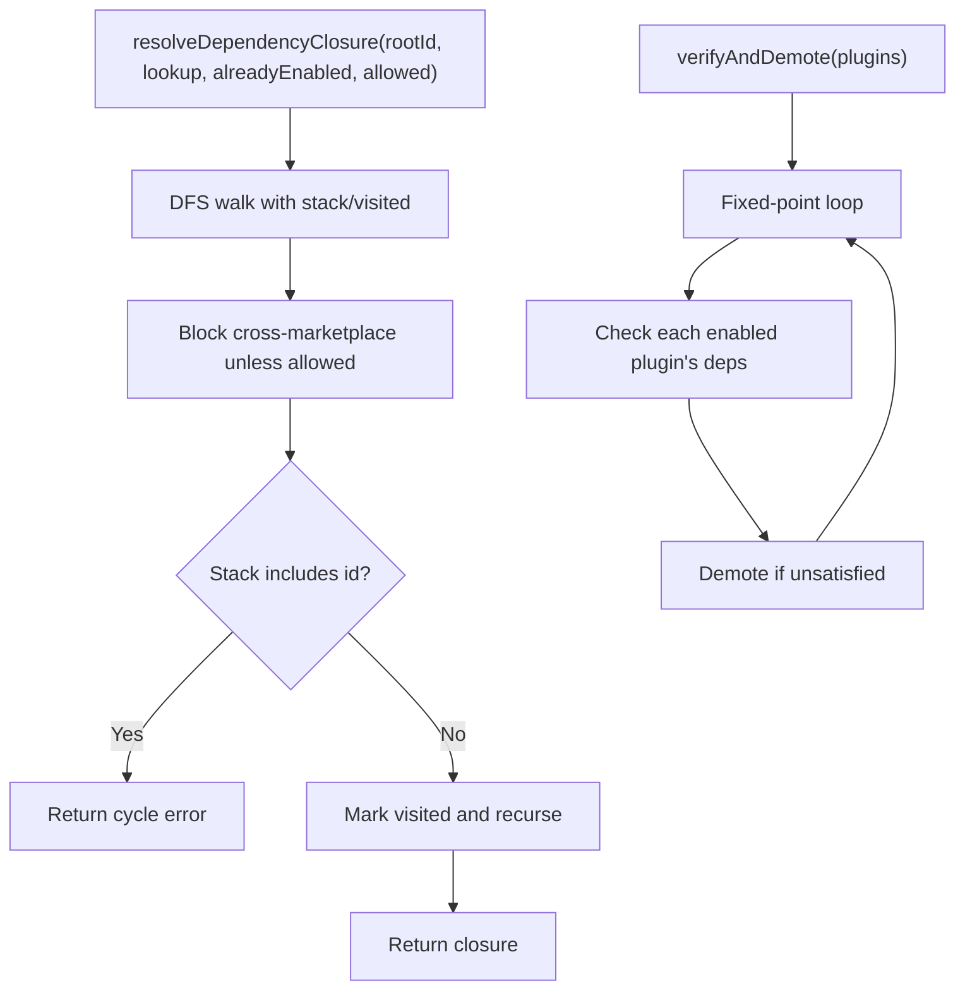
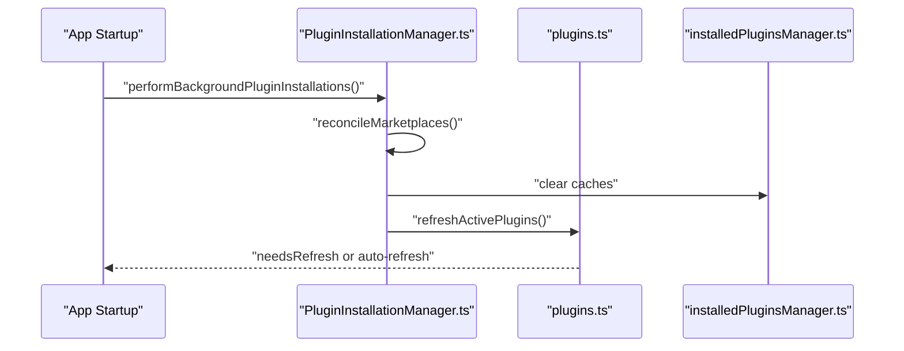
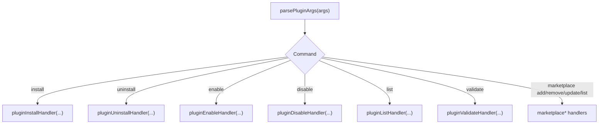
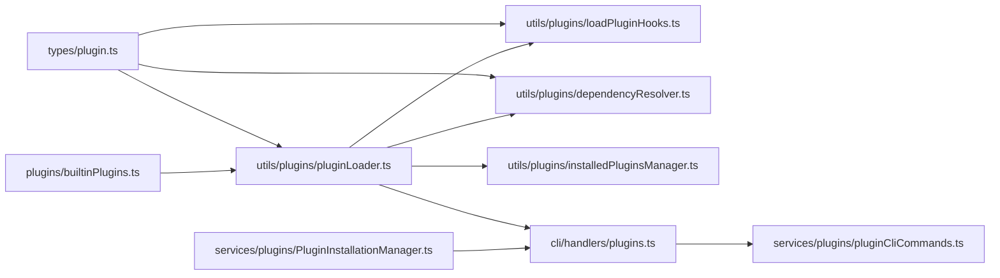

# Plugin Development

<cite>
**Referenced Files in This Document**
- [builtinPlugins.ts](file://claude_code_src/restored-src/src/plugins/builtinPlugins.ts)
- [plugin.ts](file://claude_code_src/restored-src/src/types/plugin.ts)
- [PluginInstallationManager.ts](file://claude_code_src/restored-src/src/services/plugins/PluginInstallationManager.ts)
- [installedPluginsManager.ts](file://claude_code_src/restored-src/src/utils/plugins/installedPluginsManager.ts)
- [dependencyResolver.ts](file://claude_code_src/restored-src/src/utils/plugins/dependencyResolver.ts)
- [loadPluginHooks.ts](file://claude_code_src/restored-src/src/utils/plugins/loadPluginHooks.ts)
- [pluginLoader.ts](file://claude_code_src/restored-src/src/utils/plugins/pluginLoader.ts)
- [plugins.ts](file://claude_code_src/restored-src/src/cli/handlers/plugins.ts)
- [parseArgs.ts](file://claude_code_src/restored-src/src/commands/plugin/parseArgs.ts)
- [pluginCliCommands.ts](file://claude_code_src/restored-src/src/services/plugins/pluginCliCommands.ts)
</cite>

## Table of Contents
1. [Introduction](#introduction)
2. [Project Structure](#project-structure)
3. [Core Components](#core-components)
4. [Architecture Overview](#architecture-overview)
5. [Detailed Component Analysis](#detailed-component-analysis)
6. [Dependency Analysis](#dependency-analysis)
7. [Performance Considerations](#performance-considerations)
8. [Troubleshooting Guide](#troubleshooting-guide)
9. [Conclusion](#conclusion)
10. [Appendices](#appendices)

## Introduction
This document explains how to develop plugins for the Claude Code Python IDE. It covers the plugin architecture, discovery and loading mechanisms, installation and marketplace integration, command and tool registration, hook system, configuration and versioning, security and sandboxing, performance optimization, debugging, testing, and distribution/maintenance. Practical, code-backed guidance is provided with precise references to the source files that implement each capability.

## Project Structure
The plugin system spans several subsystems:
- Types and definitions for plugins and manifests
- Built-in plugin registry
- Plugin loader and caching
- Dependency resolution
- Hook registration and hot reload
- Installation and marketplace management
- CLI handlers for plugin operations
- Utilities for installed plugin state and versioning

**Diagram sources**
- [plugin.ts:1-364](file://claude_code_src/restored-src/src/types/plugin.ts#L1-L364)
- [builtinPlugins.ts:1-160](file://claude_code_src/restored-src/src/plugins/builtinPlugins.ts#L1-L160)
- [pluginLoader.ts:1-800](file://claude_code_src/restored-src/src/utils/plugins/pluginLoader.ts#L1-L800)
- [loadPluginHooks.ts:1-288](file://claude_code_src/restored-src/src/utils/plugins/loadPluginHooks.ts#L1-L288)
- [installedPluginsManager.ts:1-800](file://claude_code_src/restored-src/src/utils/plugins/installedPluginsManager.ts#L1-L800)
- [dependencyResolver.ts:1-306](file://claude_code_src/restored-src/src/utils/plugins/dependencyResolver.ts#L1-L306)
- [PluginInstallationManager.ts:1-185](file://claude_code_src/restored-src/src/services/plugins/PluginInstallationManager.ts#L1-L185)
- [plugins.ts:1-800](file://claude_code_src/restored-src/src/cli/handlers/plugins.ts#L1-L800)
- [pluginCliCommands.ts:1-200](file://claude_code_src/restored-src/src/services/plugins/pluginCliCommands.ts#L1-L200)

**Section sources**
- [plugin.ts:1-364](file://claude_code_src/restored-src/src/types/plugin.ts#L1-L364)
- [builtinPlugins.ts:1-160](file://claude_code_src/restored-src/src/plugins/builtinPlugins.ts#L1-L160)
- [pluginLoader.ts:1-800](file://claude_code_src/restored-src/src/utils/plugins/pluginLoader.ts#L1-L800)
- [loadPluginHooks.ts:1-288](file://claude_code_src/restored-src/src/utils/plugins/loadPluginHooks.ts#L1-L288)
- [installedPluginsManager.ts:1-800](file://claude_code_src/restored-src/src/utils/plugins/installedPluginsManager.ts#L1-L800)
- [dependencyResolver.ts:1-306](file://claude_code_src/restored-src/src/utils/plugins/dependencyResolver.ts#L1-L306)
- [PluginInstallationManager.ts:1-185](file://claude_code_src/restored-src/src/services/plugins/PluginInstallationManager.ts#L1-L185)
- [plugins.ts:1-800](file://claude_code_src/restored-src/src/cli/handlers/plugins.ts#L1-L800)
- [pluginCliCommands.ts:1-200](file://claude_code_src/restored-src/src/services/plugins/pluginCliCommands.ts#L1-L200)

## Core Components
- Plugin types and error model define the shape of plugin metadata, components (commands, agents, skills, hooks, output styles), and standardized error reporting.
- Built-in plugins are shipped with the CLI and can be toggled by users; they appear in the plugin UI and can provide skills, hooks, and MCP servers.
- Plugin loader discovers plugins from marketplaces and session-only sources, validates manifests, loads components, and manages caches.
- Dependency resolver enforces security and correctness by computing dependency closures and verifying runtime dependencies.
- Hook loader registers plugin-provided hooks and supports hot reload when settings change.
- Installation manager coordinates background marketplace and plugin installations and refreshes active plugins.
- CLI handlers implement plugin commands (list, install, uninstall, enable, disable, validate, marketplace add/remove/update/list) and integrate with installation and CLI commands.

**Section sources**
- [plugin.ts:1-364](file://claude_code_src/restored-src/src/types/plugin.ts#L1-L364)
- [builtinPlugins.ts:1-160](file://claude_code_src/restored-src/src/plugins/builtinPlugins.ts#L1-L160)
- [pluginLoader.ts:1-800](file://claude_code_src/restored-src/src/utils/plugins/pluginLoader.ts#L1-L800)
- [dependencyResolver.ts:1-306](file://claude_code_src/restored-src/src/utils/plugins/dependencyResolver.ts#L1-L306)
- [loadPluginHooks.ts:1-288](file://claude_code_src/restored-src/src/utils/plugins/loadPluginHooks.ts#L1-L288)
- [PluginInstallationManager.ts:1-185](file://claude_code_src/restored-src/src/services/plugins/PluginInstallationManager.ts#L1-L185)
- [plugins.ts:1-800](file://claude_code_src/restored-src/src/cli/handlers/plugins.ts#L1-L800)
- [pluginCliCommands.ts:1-200](file://claude_code_src/restored-src/src/services/plugins/pluginCliCommands.ts#L1-L200)

## Architecture Overview
The plugin architecture centers on a loader that discovers plugins from multiple sources, validates them, and exposes commands, agents, skills, hooks, and MCP/LSP integrations. Dependencies are resolved with security constraints, and hooks are hot-reloadable. Installation and marketplace management operate in the background and can trigger plugin refreshes.

**Diagram sources**
- [plugins.ts:667-701](file://claude_code_src/restored-src/src/cli/handlers/plugins.ts#L667-L701)
- [pluginCliCommands.ts:1-200](file://claude_code_src/restored-src/src/services/plugins/pluginCliCommands.ts#L1-L200)
- [pluginLoader.ts:1-800](file://claude_code_src/restored-src/src/utils/plugins/pluginLoader.ts#L1-L800)
- [dependencyResolver.ts:1-306](file://claude_code_src/restored-src/src/utils/plugins/dependencyResolver.ts#L1-L306)
- [loadPluginHooks.ts:1-288](file://claude_code_src/restored-src/src/utils/plugins/loadPluginHooks.ts#L1-L288)
- [installedPluginsManager.ts:1-800](file://claude_code_src/restored-src/src/utils/plugins/installedPluginsManager.ts#L1-L800)

## Detailed Component Analysis

### Plugin Types and Error Model
- Defines plugin manifest, loaded plugin representation, component types, and a rich error model with typed categories for better diagnostics and user guidance.
- Provides helper to convert typed errors into user-facing messages.

**Diagram sources**
- [plugin.ts:1-364](file://claude_code_src/restored-src/src/types/plugin.ts#L1-L364)

**Section sources**
- [plugin.ts:1-364](file://claude_code_src/restored-src/src/types/plugin.ts#L1-L364)

### Built-in Plugin Registry
- Registers built-in plugins that ship with the CLI and can be enabled/disabled by users.
- Exposes helpers to detect built-in IDs, enumerate enabled/disabled, and convert skills to commands.

**Diagram sources**
- [builtinPlugins.ts:1-160](file://claude_code_src/restored-src/src/plugins/builtinPlugins.ts#L1-L160)

**Section sources**
- [builtinPlugins.ts:1-160](file://claude_code_src/restored-src/src/plugins/builtinPlugins.ts#L1-L160)

### Plugin Loading and Discovery
- Discovers plugins from marketplaces and session-only sources.
- Validates manifests, loads components (commands, agents, skills, hooks, output styles), and manages caches.
- Supports versioned cache paths, seed caches, and ZIP cache mode for performance.
- Handles git subdirectory extraction, npm package installation, and shallow clones for efficiency.

**Diagram sources**
- [pluginLoader.ts:1-800](file://claude_code_src/restored-src/src/utils/plugins/pluginLoader.ts#L1-L800)

**Section sources**
- [pluginLoader.ts:1-800](file://claude_code_src/restored-src/src/utils/plugins/pluginLoader.ts#L1-L800)

### Hook System and Hot Reload
- Converts plugin-provided hook configurations into native matchers and registers them.
- Supports hot reload when plugin-affecting settings change, clearing caches and re-registering hooks atomically.

**Diagram sources**
- [loadPluginHooks.ts:1-288](file://claude_code_src/restored-src/src/utils/plugins/loadPluginHooks.ts#L1-L288)

**Section sources**
- [loadPluginHooks.ts:1-288](file://claude_code_src/restored-src/src/utils/plugins/loadPluginHooks.ts#L1-L288)

### Dependency Resolution
- Computes dependency closures with cycle detection and cross-marketplace restrictions.
- Verifies runtime dependencies and demotes broken plugins deterministically.

**Diagram sources**
- [dependencyResolver.ts:1-306](file://claude_code_src/restored-src/src/utils/plugins/dependencyResolver.ts#L1-L306)

**Section sources**
- [dependencyResolver.ts:1-306](file://claude_code_src/restored-src/src/utils/plugins/dependencyResolver.ts#L1-L306)

### Installation and Marketplace Management
- Background installation manager reconciles marketplaces and auto-refreshes plugins when new marketplaces are installed.
- CLI handlers implement plugin lifecycle commands and marketplace management.

**Diagram sources**
- [PluginInstallationManager.ts:1-185](file://claude_code_src/restored-src/src/services/plugins/PluginInstallationManager.ts#L1-L185)
- [plugins.ts:1-800](file://claude_code_src/restored-src/src/cli/handlers/plugins.ts#L1-L800)
- [installedPluginsManager.ts:1-800](file://claude_code_src/restored-src/src/utils/plugins/installedPluginsManager.ts#L1-L800)

**Section sources**
- [PluginInstallationManager.ts:1-185](file://claude_code_src/restored-src/src/services/plugins/PluginInstallationManager.ts#L1-L185)
- [plugins.ts:1-800](file://claude_code_src/restored-src/src/cli/handlers/plugins.ts#L1-L800)
- [installedPluginsManager.ts:1-800](file://claude_code_src/restored-src/src/utils/plugins/installedPluginsManager.ts#L1-L800)

### Plugin CLI Commands and Parsing
- Parses plugin subcommands and dispatches to handlers for install, uninstall, enable, disable, list, validate, and marketplace operations.
- Handlers log analytics and manage error reporting.

**Diagram sources**
- [parseArgs.ts:1-104](file://claude_code_src/restored-src/src/commands/plugin/parseArgs.ts#L1-L104)
- [plugins.ts:1-800](file://claude_code_src/restored-src/src/cli/handlers/plugins.ts#L1-L800)
- [pluginCliCommands.ts:1-200](file://claude_code_src/restored-src/src/services/plugins/pluginCliCommands.ts#L1-L200)

**Section sources**
- [parseArgs.ts:1-104](file://claude_code_src/restored-src/src/commands/plugin/parseArgs.ts#L1-L104)
- [plugins.ts:1-800](file://claude_code_src/restored-src/src/cli/handlers/plugins.ts#L1-L800)
- [pluginCliCommands.ts:1-200](file://claude_code_src/restored-src/src/services/plugins/pluginCliCommands.ts#L1-L200)

## Dependency Analysis
- Coupling: The loader depends on types, schemas, marketplace helpers, and settings; hooks depend on loader outputs and settings change detector; installation manager depends on marketplace reconciliation and plugin loader.
- Cohesion: Each module focuses on a single responsibility—loading, hooks, dependencies, installation, or CLI.
- External dependencies: Git, npm, filesystem operations, and memoization for caching.

**Diagram sources**
- [plugin.ts:1-364](file://claude_code_src/restored-src/src/types/plugin.ts#L1-L364)
- [builtinPlugins.ts:1-160](file://claude_code_src/restored-src/src/plugins/builtinPlugins.ts#L1-L160)
- [pluginLoader.ts:1-800](file://claude_code_src/restored-src/src/utils/plugins/pluginLoader.ts#L1-L800)
- [loadPluginHooks.ts:1-288](file://claude_code_src/restored-src/src/utils/plugins/loadPluginHooks.ts#L1-L288)
- [dependencyResolver.ts:1-306](file://claude_code_src/restored-src/src/utils/plugins/dependencyResolver.ts#L1-L306)
- [installedPluginsManager.ts:1-800](file://claude_code_src/restored-src/src/utils/plugins/installedPluginsManager.ts#L1-L800)
- [plugins.ts:1-800](file://claude_code_src/restored-src/src/cli/handlers/plugins.ts#L1-L800)
- [pluginCliCommands.ts:1-200](file://claude_code_src/restored-src/src/services/plugins/pluginCliCommands.ts#L1-L200)
- [PluginInstallationManager.ts:1-185](file://claude_code_src/restored-src/src/services/plugins/PluginInstallationManager.ts#L1-L185)

**Section sources**
- [plugin.ts:1-364](file://claude_code_src/restored-src/src/types/plugin.ts#L1-L364)
- [pluginLoader.ts:1-800](file://claude_code_src/restored-src/src/utils/plugins/pluginLoader.ts#L1-L800)
- [loadPluginHooks.ts:1-288](file://claude_code_src/restored-src/src/utils/plugins/loadPluginHooks.ts#L1-L288)
- [dependencyResolver.ts:1-306](file://claude_code_src/restored-src/src/utils/plugins/dependencyResolver.ts#L1-L306)
- [installedPluginsManager.ts:1-800](file://claude_code_src/restored-src/src/utils/plugins/installedPluginsManager.ts#L1-L800)
- [plugins.ts:1-800](file://claude_code_src/restored-src/src/cli/handlers/plugins.ts#L1-L800)
- [pluginCliCommands.ts:1-200](file://claude_code_src/restored-src/src/services/plugins/pluginCliCommands.ts#L1-L200)
- [PluginInstallationManager.ts:1-185](file://claude_code_src/restored-src/src/services/plugins/PluginInstallationManager.ts#L1-L185)

## Performance Considerations
- Caching: Memoized loaders and caches minimize repeated filesystem and network operations.
- Versioned cache: Uses versioned directories to avoid conflicts and enable fast lookups.
- ZIP cache: Converts directories to ZIP for compact storage and faster I/O.
- Shallow clones and sparse-checkout: Reduces bandwidth and disk usage for large repositories.
- Fixed-point dependency verification: Ensures stability and avoids cascading failures.

[No sources needed since this section provides general guidance]

## Troubleshooting Guide
Common issues and diagnostics:
- Plugin not found in marketplace: Check marketplace configuration and installation status; use list and validate commands.
- Dependency unsatisfied: Review dependency declarations and enabled state; use reverse-dependency hints.
- Hook load failures: Inspect hook configuration and hot reload behavior.
- Network/Git errors: Validate URLs and credentials; check timeouts and policies.
- Versioning problems: Ensure version pinning and cache paths are correct.

Operational tips:
- Use the plugin list command to inspect installed and enabled plugins, including session-only plugins.
- Validate manifests and plugin contents to catch issues early.
- Trigger reloads when settings or marketplace configurations change.

**Section sources**
- [plugins.ts:156-444](file://claude_code_src/restored-src/src/cli/handlers/plugins.ts#L156-L444)
- [plugin.ts:101-364](file://claude_code_src/restored-src/src/types/plugin.ts#L101-L364)
- [loadPluginHooks.ts:255-287](file://claude_code_src/restored-src/src/utils/plugins/loadPluginHooks.ts#L255-L287)
- [dependencyResolver.ts:177-234](file://claude_code_src/restored-src/src/utils/plugins/dependencyResolver.ts#L177-L234)

## Conclusion
The Claude Code plugin system offers a robust, secure, and extensible framework for building and distributing plugins. By leveraging typed manifests, dependency resolution, hot-reloadable hooks, and background installation, developers can deliver powerful integrations that enhance the IDE. Following the guidelines in this document ensures reliable development, testing, and deployment of high-quality plugins.

[No sources needed since this section summarizes without analyzing specific files]

## Appendices

### A. Plugin API Interfaces Overview
- Manifest and metadata: Define plugin identity, version, dependencies, and optional assets.
- Components: Commands, agents, skills, hooks, and output styles.
- Error model: Typed errors for improved diagnostics and user messaging.
- Hook system: Event-driven callbacks with hot reload support.
- Installation: Scoped installs (user/project/local/session), marketplace reconciliation, and refresh flows.

**Section sources**
- [plugin.ts:1-364](file://claude_code_src/restored-src/src/types/plugin.ts#L1-L364)
- [loadPluginHooks.ts:1-288](file://claude_code_src/restored-src/src/utils/plugins/loadPluginHooks.ts#L1-L288)
- [pluginLoader.ts:1-800](file://claude_code_src/restored-src/src/utils/plugins/pluginLoader.ts#L1-L800)

### B. Step-by-Step Tutorial: Creating a Custom Plugin
Note: The following steps reference implementation locations rather than reproducing code.

1. Define plugin metadata
- Create a manifest file and describe plugin identity, version, and dependencies.
- Reference: [plugin.ts:1-116](file://claude_code_src/restored-src/src/types/plugin.ts#L1-L116)

2. Implement commands and skills
- Place command and skill definitions under the plugin’s directory structure.
- Reference: [pluginLoader.ts:10-33](file://claude_code_src/restored-src/src/utils/plugins/pluginLoader.ts#L10-L33)

3. Integrate hooks
- Provide hook configurations and rely on automatic registration and hot reload.
- Reference: [loadPluginHooks.ts:28-157](file://claude_code_src/restored-src/src/utils/plugins/loadPluginHooks.ts#L28-L157)

4. Manage dependencies
- Declare dependencies and rely on dependency resolution and verification.
- Reference: [dependencyResolver.ts:95-159](file://claude_code_src/restored-src/src/utils/plugins/dependencyResolver.ts#L95-L159)

5. Test and validate
- Use the validate command to check manifest and content.
- Reference: [plugins.ts:100-154](file://claude_code_src/restored-src/src/cli/handlers/plugins.ts#L100-L154)

6. Install and distribute
- Choose installation scope and use CLI commands to install/uninstall/enable/disable.
- Reference: [plugins.ts:667-801](file://claude_code_src/restored-src/src/cli/handlers/plugins.ts#L667-L801), [pluginCliCommands.ts:48-96](file://claude_code_src/restored-src/src/services/plugins/pluginCliCommands.ts#L48-L96)

7. Monitor and maintain
- Observe plugin list, handle marketplace updates, and refresh when needed.
- Reference: [PluginInstallationManager.ts:60-184](file://claude_code_src/restored-src/src/services/plugins/PluginInstallationManager.ts#L60-L184)

**Section sources**
- [plugin.ts:1-116](file://claude_code_src/restored-src/src/types/plugin.ts#L1-L116)
- [loadPluginHooks.ts:28-157](file://claude_code_src/restored-src/src/utils/plugins/loadPluginHooks.ts#L28-L157)
- [dependencyResolver.ts:95-159](file://claude_code_src/restored-src/src/utils/plugins/dependencyResolver.ts#L95-L159)
- [plugins.ts:100-154](file://claude_code_src/restored-src/src/cli/handlers/plugins.ts#L100-L154)
- [plugins.ts:667-801](file://claude_code_src/restored-src/src/cli/handlers/plugins.ts#L667-L801)
- [pluginCliCommands.ts:48-96](file://claude_code_src/restored-src/src/services/plugins/pluginCliCommands.ts#L48-L96)
- [PluginInstallationManager.ts:60-184](file://claude_code_src/restored-src/src/services/plugins/PluginInstallationManager.ts#L60-L184)

### C. Security and Sandboxing
- Cross-marketplace dependency blocking prevents automatic installation across trust boundaries.
- Policy-based marketplace allow/blocklists enforce enterprise controls.
- Hook registration is scoped to plugin roots and hot-reloadable only when settings change.

**Section sources**
- [dependencyResolver.ts:118-132](file://claude_code_src/restored-src/src/utils/plugins/dependencyResolver.ts#L118-L132)
- [loadPluginHooks.ts:255-287](file://claude_code_src/restored-src/src/utils/plugins/loadPluginHooks.ts#L255-L287)

### D. Versioning Strategies
- Versioned cache paths ensure isolation and fast lookups.
- Legacy cache paths are supported for backward compatibility.
- Seed caches can provide pre-populated versions for faster bootstrapping.

**Section sources**
- [pluginLoader.ts:139-188](file://claude_code_src/restored-src/src/utils/plugins/pluginLoader.ts#L139-L188)
- [installedPluginsManager.ts:284-305](file://claude_code_src/restored-src/src/utils/plugins/installedPluginsManager.ts#L284-L305)

### E. Debugging and Testing
- Use validate to check manifests and plugin contents.
- Inspect plugin list for enabled/disabled state, errors, and MCP servers.
- Leverage memoized loaders and caches for repeatable testing scenarios.

**Section sources**
- [plugins.ts:100-154](file://claude_code_src/restored-src/src/cli/handlers/plugins.ts#L100-L154)
- [plugins.ts:156-444](file://claude_code_src/restored-src/src/cli/handlers/plugins.ts#L156-L444)