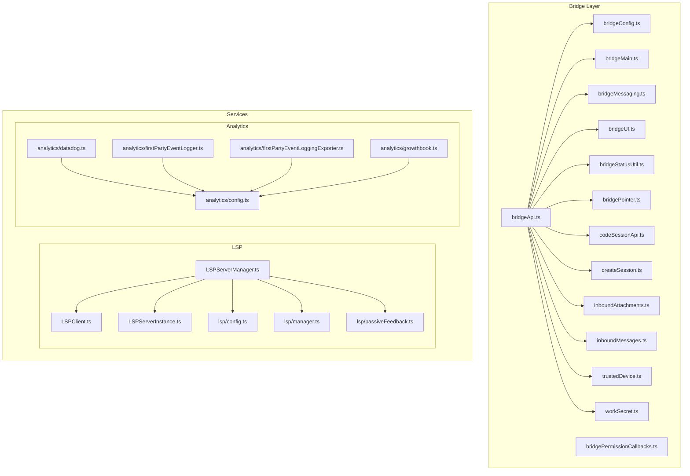
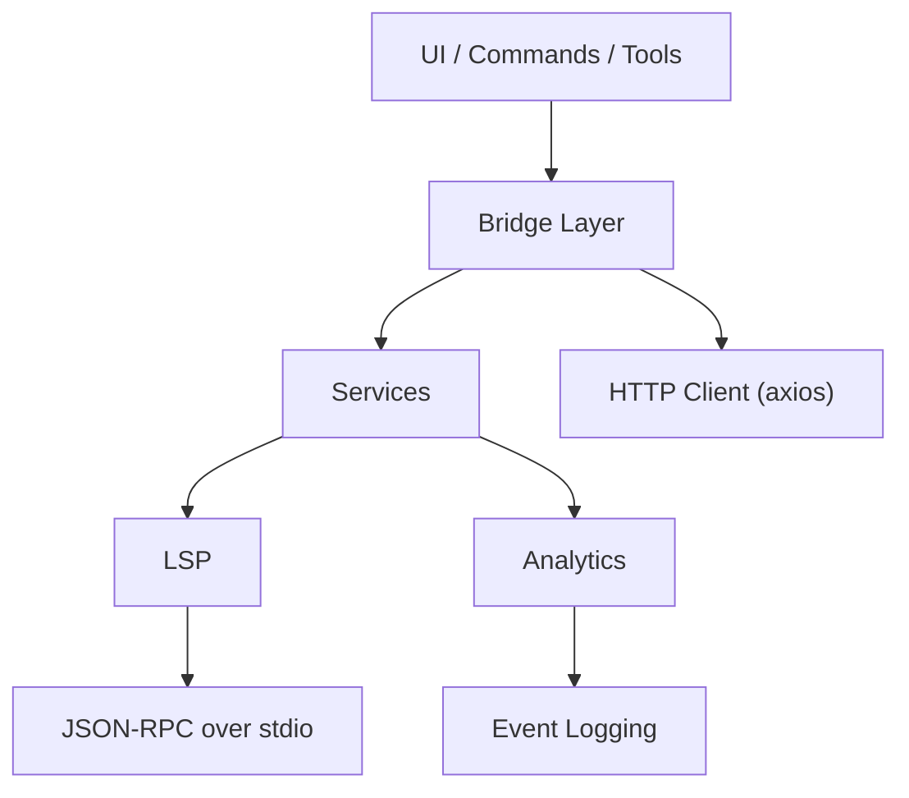
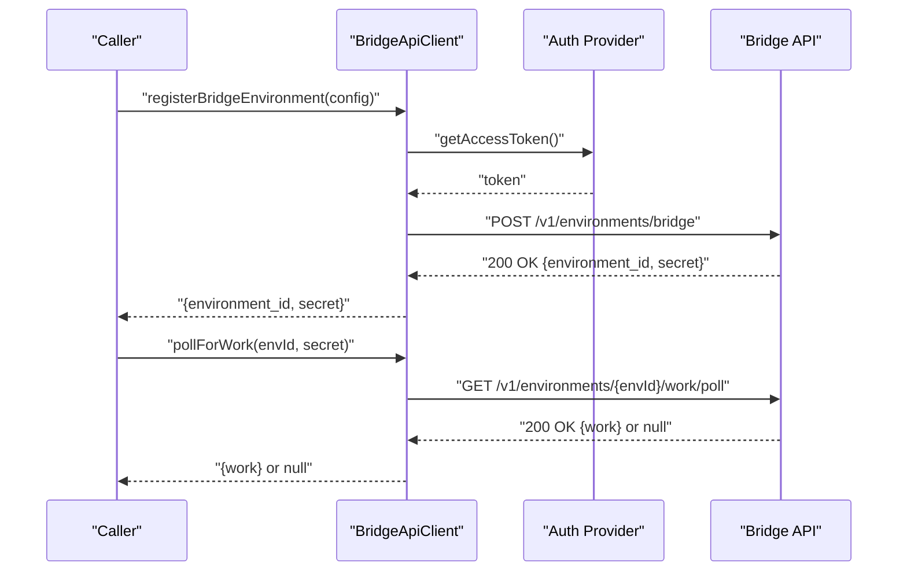
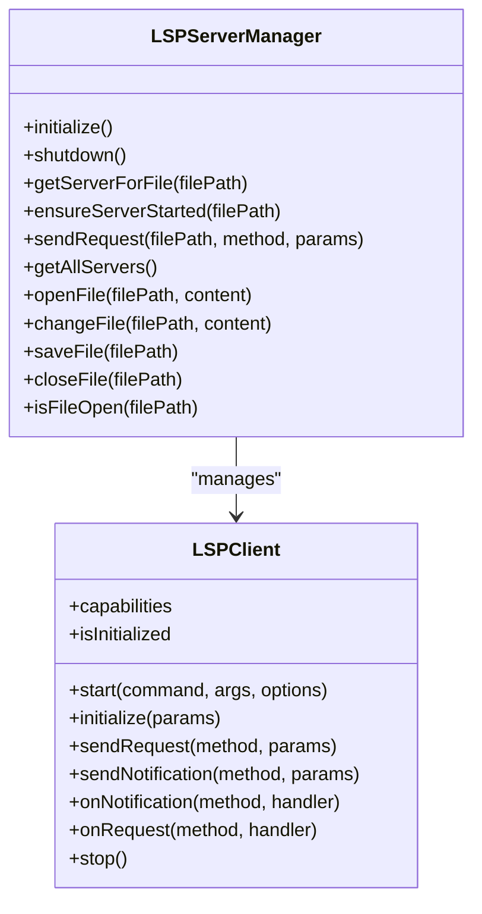
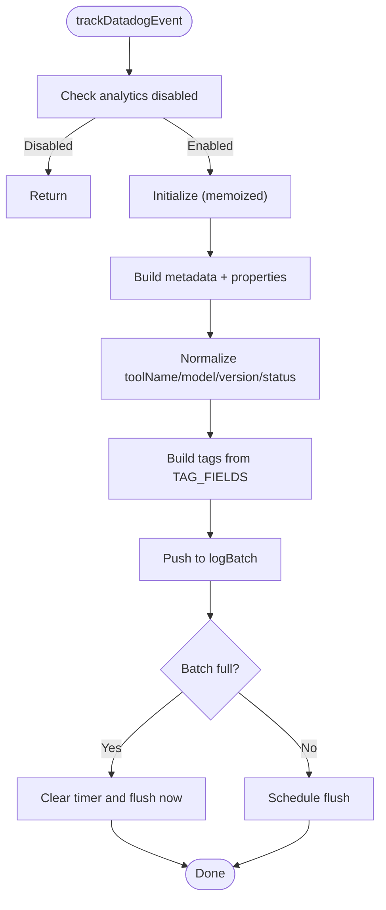
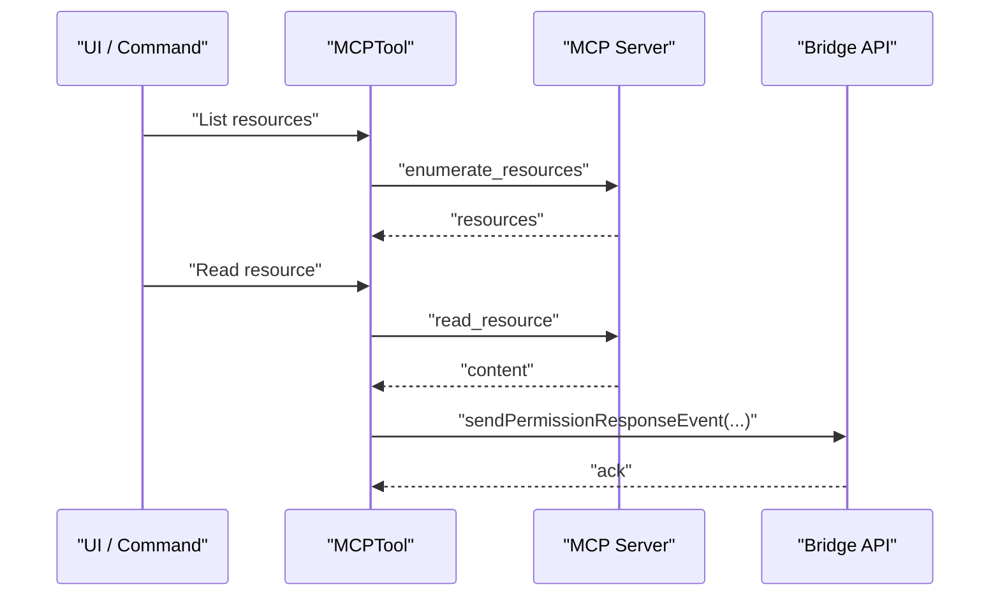
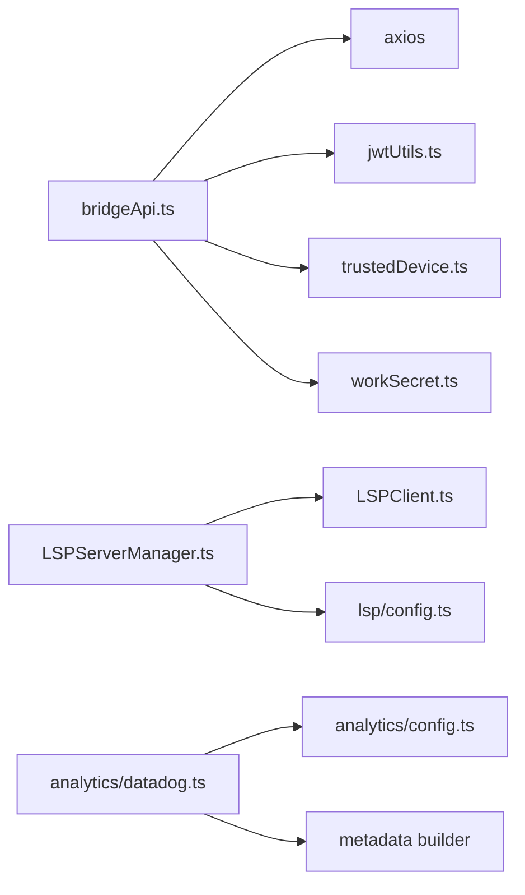

# Service Extension

<cite>
**Referenced Files in This Document**
- [bridgeApi.ts](file://claude_code_src/restored-src/src/bridge/bridgeApi.ts)
- [bridgeConfig.ts](file://claude_code_src/restored-src/src/bridge/bridgeConfig.ts)
- [bridgeEnabled.ts](file://claude_code_src/restored-src/src/bridge/bridgeEnabled.ts)
- [bridgeMain.ts](file://claude_code_src/restored-src/src/bridge/bridgeMain.ts)
- [bridgeMessaging.ts](file://claude_code_src/restored-src/src/bridge/bridgeMessaging.ts)
- [bridgePermissionCallbacks.ts](file://claude_code_src/restored-src/src/bridge/bridgePermissionCallbacks.ts)
- [bridgePointer.ts](file://claude_code_src/restored-src/src/bridge/bridgePointer.ts)
- [bridgeStatusUtil.ts](file://claude_code_src/restored-src/src/bridge/bridgeStatusUtil.ts)
- [bridgeUI.ts](file://claude_code_src/restored-src/src/bridge/bridgeUI.ts)
- [codeSessionApi.ts](file://claude_code_src/restored-src/src/bridge/codeSessionApi.ts)
- [createSession.ts](file://claude_code_src/restored-src/src/bridge/createSession.ts)
- [inboundAttachments.ts](file://claude_code_src/restored-src/src/bridge/inboundAttachments.ts)
- [inboundMessages.ts](file://claude_code_src/restored-src/src/bridge/inboundMessages.ts)
- [jwtUtils.ts](file://claude_code_src/restored-src/src/bridge/jwtUtils.ts)
- [pollConfig.ts](file://claude_code_src/restored-src/src/bridge/pollConfig.ts)
- [pollConfigDefaults.ts](file://claude_code_src/restored-src/src/bridge/pollConfigDefaults.ts)
- [trustedDevice.ts](file://claude_code_src/restored-src/src/bridge/trustedDevice.ts)
- [workSecret.ts](file://claude_code_src/restored-src/src/bridge/workSecret.ts)
- [LSPClient.ts](file://claude_code_src/restored-src/src/services/lsp/LSPClient.ts)
- [LSPServerManager.ts](file://claude_code_src/restored-src/src/services/lsp/LSPServerManager.ts)
- [config.ts](file://claude_code_src/restored-src/src/services/lsp/config.ts)
- [manager.ts](file://claude_code_src/restored-src/src/services/lsp/manager.ts)
- [passiveFeedback.ts](file://claude_code_src/restored-src/src/services/lsp/passiveFeedback.ts)
- [datadog.ts](file://claude_code_src/restored-src/src/services/analytics/datadog.ts)
- [config.ts](file://claude_code_src/restored-src/src/services/analytics/config.ts)
- [firstPartyEventLogger.ts](file://claude_code_src/restored-src/src/services/analytics/firstPartyEventLogger.ts)
- [firstPartyEventLoggingExporter.ts](file://claude_code_src/restored-src/src/services/analytics/firstPartyEventLoggingExporter.ts)
- [growthbook.ts](file://claude_code_src/restored-src/src/services/analytics/growthbook.ts)
- [mcp.ts](file://claude_code_src/restored-src/src/entrypoints/mcp.ts)
- [mcp.ts](file://claude_code_src/restored-src/src/commands/mcp/mcp.ts)
- [mcp.ts](file://claude_code_src/restored-src/src/tools/MCPTool/mcp.ts)
- [mcp.ts](file://claude_code_src/restored-src/src/utils/plugins/lspPluginIntegration.ts)
- [mcp.ts](file://claude_code_src/restored-src/src/utils/plugins/lspRecommendation.ts)
</cite>

## Table of Contents
1. [Introduction](#introduction)
2. [Project Structure](#project-structure)
3. [Core Components](#core-components)
4. [Architecture Overview](#architecture-overview)
5. [Detailed Component Analysis](#detailed-component-analysis)
6. [Dependency Analysis](#dependency-analysis)
7. [Performance Considerations](#performance-considerations)
8. [Troubleshooting Guide](#troubleshooting-guide)
9. [Conclusion](#conclusion)
10. [Appendices](#appendices)

## Introduction
This document explains how to extend services in the Claude Code Python IDE. It focuses on the service architecture, client-server patterns, and integration mechanisms. It documents service interfaces, API contracts, and data exchange formats. It provides examples for extending existing services such as MCP, LSP, analytics, and telemetry. It also covers service configuration, authentication, error handling, testing, monitoring, performance optimization, security, rate limiting, reliability, lifecycle management, hot-swapping, and backward compatibility.

## Project Structure
The repository organizes services under a dedicated services directory and bridges under a bridge directory. Services include:
- LSP: Language Server Protocol client and manager
- Analytics: Telemetry and event logging (Datadog, first-party)
- MCP: Model Context Protocol integration points
- Others: Tools, policies, settings synchronization, voice, and more

**Diagram sources**
- [bridgeApi.ts:1-540](file://claude_code_src/restored-src/src/bridge/bridgeApi.ts#L1-L540)
- [bridgeConfig.ts](file://claude_code_src/restored-src/src/bridge/bridgeConfig.ts)
- [bridgeMain.ts](file://claude_code_src/restored-src/src/bridge/bridgeMain.ts)
- [bridgeMessaging.ts](file://claude_code_src/restored-src/src/bridge/bridgeMessaging.ts)
- [bridgePermissionCallbacks.ts](file://claude_code_src/restored-src/src/bridge/bridgePermissionCallbacks.ts)
- [bridgePointer.ts](file://claude_code_src/restored-src/src/bridge/bridgePointer.ts)
- [bridgeStatusUtil.ts](file://claude_code_src/restored-src/src/bridge/bridgeStatusUtil.ts)
- [bridgeUI.ts](file://claude_code_src/restored-src/src/bridge/bridgeUI.ts)
- [codeSessionApi.ts](file://claude_code_src/restored-src/src/bridge/codeSessionApi.ts)
- [createSession.ts](file://claude_code_src/restored-src/src/bridge/createSession.ts)
- [inboundAttachments.ts](file://claude_code_src/restored-src/src/bridge/inboundAttachments.ts)
- [inboundMessages.ts](file://claude_code_src/restored-src/src/bridge/inboundMessages.ts)
- [trustedDevice.ts](file://claude_code_src/restored-src/src/bridge/trustedDevice.ts)
- [workSecret.ts](file://claude_code_src/restored-src/src/bridge/workSecret.ts)
- [LSPClient.ts:1-448](file://claude_code_src/restored-src/src/services/lsp/LSPClient.ts#L1-L448)
- [LSPServerManager.ts:1-421](file://claude_code_src/restored-src/src/services/lsp/LSPServerManager.ts#L1-L421)
- [config.ts](file://claude_code_src/restored-src/src/services/lsp/config.ts)
- [manager.ts](file://claude_code_src/restored-src/src/services/lsp/manager.ts)
- [passiveFeedback.ts](file://claude_code_src/restored-src/src/services/lsp/passiveFeedback.ts)
- [datadog.ts:1-308](file://claude_code_src/restored-src/src/services/analytics/datadog.ts#L1-L308)
- [config.ts:1-39](file://claude_code_src/restored-src/src/services/analytics/config.ts#L1-L39)
- [firstPartyEventLogger.ts](file://claude_code_src/restored-src/src/services/analytics/firstPartyEventLogger.ts)
- [firstPartyEventLoggingExporter.ts](file://claude_code_src/restored-src/src/services/analytics/firstPartyEventLoggingExporter.ts)
- [growthbook.ts](file://claude_code_src/restored-src/src/services/analytics/growthbook.ts)

**Section sources**
- [bridgeApi.ts:1-540](file://claude_code_src/restored-src/src/bridge/bridgeApi.ts#L1-L540)
- [LSPClient.ts:1-448](file://claude_code_src/restored-src/src/services/lsp/LSPClient.ts#L1-L448)
- [LSPServerManager.ts:1-421](file://claude_code_src/restored-src/src/services/lsp/LSPServerManager.ts#L1-L421)
- [datadog.ts:1-308](file://claude_code_src/restored-src/src/services/analytics/datadog.ts#L1-L308)
- [config.ts:1-39](file://claude_code_src/restored-src/src/services/analytics/config.ts#L1-L39)

## Core Components
- Bridge API client: Provides authenticated HTTP operations against the remote bridge service, with retry-on-401, error categorization, and safety validations for identifiers used in URLs.
- LSP client and manager: Implements a robust JSON-RPC client around a spawned LSP server process, with lifecycle management, capability tracking, lazy handler registration, and file synchronization.
- Analytics (Datadog): Implements batching, tagging, cardinality reduction, and flushing with timeouts and memoized initialization.

Key extension points:
- Adding new bridge endpoints: Extend the Bridge API client with new methods and integrate fatal/error handling.
- Adding new LSP servers: Define server configuration and use the manager to route per-file extension.
- Adding new analytics integrations: Implement event logging with the shared configuration and metadata utilities.

**Section sources**
- [bridgeApi.ts:68-451](file://claude_code_src/restored-src/src/bridge/bridgeApi.ts#L68-L451)
- [LSPClient.ts:51-447](file://claude_code_src/restored-src/src/services/lsp/LSPClient.ts#L51-L447)
- [LSPServerManager.ts:59-420](file://claude_code_src/restored-src/src/services/lsp/LSPServerManager.ts#L59-L420)
- [datadog.ts:130-307](file://claude_code_src/restored-src/src/services/analytics/datadog.ts#L130-L307)

## Architecture Overview
The system follows a layered architecture:
- UI and orchestration layer (commands, tools, hooks)
- Bridge layer for remote control and session management
- Services layer for domain-specific capabilities (LSP, analytics)
- Utilities for configuration, logging, and transport

[No sources needed since this diagram shows conceptual workflow, not actual code structure]

## Detailed Component Analysis

### Bridge API Client
The Bridge API client encapsulates authenticated HTTP operations, including registration, polling, acknowledgment, stop, de-registration, archive, reconnect, heartbeat, and permission events. It enforces safe identifier interpolation, retries on 401 with optional token refresh, and converts non-2xx responses into typed errors.

**Diagram sources**
- [bridgeApi.ts:142-247](file://claude_code_src/restored-src/src/bridge/bridgeApi.ts#L142-L247)

**Section sources**
- [bridgeApi.ts:68-451](file://claude_code_src/restored-src/src/bridge/bridgeApi.ts#L68-L451)

### LSP Client and Manager
The LSP client wraps a spawned server process and exposes JSON-RPC methods. It tracks initialization state, capabilities, and queues handlers until the connection is ready. The manager loads configurations, maps file extensions to servers, ensures servers are started, and synchronizes file open/change/save/close events.

**Diagram sources**
- [LSPClient.ts:21-41](file://claude_code_src/restored-src/src/services/lsp/LSPClient.ts#L21-L41)
- [LSPServerManager.ts:16-43](file://claude_code_src/restored-src/src/services/lsp/LSPServerManager.ts#L16-L43)

**Section sources**
- [LSPClient.ts:51-447](file://claude_code_src/restored-src/src/services/lsp/LSPClient.ts#L51-L447)
- [LSPServerManager.ts:59-420](file://claude_code_src/restored-src/src/services/lsp/LSPServerManager.ts#L59-L420)

### Analytics (Datadog)
The analytics module initializes Datadog conditionally, batches events, normalizes fields, applies cardinality reduction, and flushes on schedule or batch size. It integrates with shared configuration to disable analytics in specific environments.

**Diagram sources**
- [datadog.ts:160-279](file://claude_code_src/restored-src/src/services/analytics/datadog.ts#L160-L279)
- [config.ts:19-27](file://claude_code_src/restored-src/src/services/analytics/config.ts#L19-L27)

**Section sources**
- [datadog.ts:130-307](file://claude_code_src/restored-src/src/services/analytics/datadog.ts#L130-L307)
- [config.ts:1-39](file://claude_code_src/restored-src/src/services/analytics/config.ts#L1-L39)

### MCP Integration Points
MCP-related entrypoints and tools demonstrate how the IDE integrates with MCP servers for resource discovery, reading, and authentication flows. Extensions can reuse similar patterns to add new MCP capabilities.

**Diagram sources**
- [mcp.ts](file://claude_code_src/restored-src/src/tools/MCPTool/mcp.ts)
- [mcp.ts](file://claude_code_src/restored-src/src/entrypoints/mcp.ts)
- [mcp.ts](file://claude_code_src/restored-src/src/commands/mcp/mcp.ts)
- [bridgeApi.ts:419-450](file://claude_code_src/restored-src/src/bridge/bridgeApi.ts#L419-L450)

**Section sources**
- [mcp.ts](file://claude_code_src/restored-src/src/tools/MCPTool/mcp.ts)
- [mcp.ts](file://claude_code_src/restored-src/src/entrypoints/mcp.ts)
- [mcp.ts](file://claude_code_src/restored-src/src/commands/mcp/mcp.ts)
- [bridgeApi.ts:419-450](file://claude_code_src/restored-src/src/bridge/bridgeApi.ts#L419-L450)

## Dependency Analysis
- Bridge API client depends on:
  - Auth provider for tokens
  - Trusted device token provider
  - Debug hooks
  - Axios for HTTP
- LSP manager depends on:
  - LSP client factory
  - Configuration loader
  - File path utilities
- Analytics depends on:
  - Environment configuration
  - Metadata builders
  - Network client

**Diagram sources**
- [bridgeApi.ts:1-10](file://claude_code_src/restored-src/src/bridge/bridgeApi.ts#L1-L10)
- [LSPServerManager.ts:1-11](file://claude_code_src/restored-src/src/services/lsp/LSPServerManager.ts#L1-L11)
- [LSPClient.ts:1-17](file://claude_code_src/restored-src/src/services/lsp/LSPClient.ts#L1-L17)
- [datadog.ts:1-10](file://claude_code_src/restored-src/src/services/analytics/datadog.ts#L1-L10)
- [config.ts:8-9](file://claude_code_src/restored-src/src/services/analytics/config.ts#L8-L9)

**Section sources**
- [bridgeApi.ts:1-540](file://claude_code_src/restored-src/src/bridge/bridgeApi.ts#L1-L540)
- [LSPServerManager.ts:1-421](file://claude_code_src/restored-src/src/services/lsp/LSPServerManager.ts#L1-L421)
- [LSPClient.ts:1-448](file://claude_code_src/restored-src/src/services/lsp/LSPClient.ts#L1-L448)
- [datadog.ts:1-308](file://claude_code_src/restored-src/src/services/analytics/datadog.ts#L1-L308)
- [config.ts:1-39](file://claude_code_src/restored-src/src/services/analytics/config.ts#L1-L39)

## Performance Considerations
- LSP batching and lazy initialization:
  - Handlers are queued until the connection is ready to avoid race conditions.
  - File synchronization minimizes redundant didOpen/didChange sequences.
- Analytics batching and flushing:
  - Events are batched and flushed on size or schedule to reduce network overhead.
  - Memoized initialization avoids repeated setup costs.
- Bridge polling:
  - Empty poll counters and throttled logging reduce noise and CPU usage.
- Recommendations:
  - Tune flush intervals and batch sizes for analytics.
  - Use idle detection to defer non-critical operations.
  - Employ backpressure on frequent polling.

[No sources needed since this section provides general guidance]

## Troubleshooting Guide
- Bridge fatal errors:
  - 401 Unauthorized: Trigger token refresh and retry once; otherwise treat as fatal.
  - 403 Forbidden: Distinguish suppressible vs. functional errors; session expiration detected by error type.
  - 404 Not Found: Remote control may not be available for the organization.
  - 410 Gone: Environment/session expired; prompt restart.
  - 429 Too Many Requests: Throttle polling frequency.
- LSP client:
  - Non-zero exit codes and connection errors are captured and surfaced; onCrash callback enables restart strategies.
  - Initialization failures and request errors are logged with context.
- Analytics:
  - Initialization guarded by environment checks; batch flush errors logged and non-fatal.

**Section sources**
- [bridgeApi.ts:454-508](file://claude_code_src/restored-src/src/bridge/bridgeApi.ts#L454-L508)
- [LSPClient.ts:144-167](file://claude_code_src/restored-src/src/services/lsp/LSPClient.ts#L144-L167)
- [LSPClient.ts:278-286](file://claude_code_src/restored-src/src/services/lsp/LSPClient.ts#L278-L286)
- [datadog.ts:102-119](file://claude_code_src/restored-src/src/services/analytics/datadog.ts#L102-L119)

## Conclusion
Extending services in the IDE centers on well-defined clients and managers:
- Bridge API client for remote control operations with robust authentication and error handling.
- LSP client and manager for language server lifecycle and file synchronization.
- Analytics module for telemetry with batching and cardinality controls.
New services should follow these patterns: clear interfaces, lifecycle management, error categorization, and observability hooks.

[No sources needed since this section summarizes without analyzing specific files]

## Appendices

### Service Extension Playbook
- Define service interface and lifecycle:
  - Expose start/stop, initialize, and request/notification methods.
  - Track state and guard against misuse (e.g., calling request before initialize).
- Integrate with configuration:
  - Load settings from centralized config and environment variables.
  - Respect privacy and provider flags to disable telemetry or features.
- Implement authentication and retries:
  - Use token resolution and retry-on-401 patterns for HTTP services.
  - Enforce safe identifier validation for URL path segments.
- Observability and monitoring:
  - Add event logging with normalized fields and tags.
  - Implement periodic flushes and batch sizing tuned to workload.
- Reliability and resilience:
  - Queue handlers until connections are ready.
  - Graceful shutdown and resource cleanup.
  - Crash detection and restart strategies for long-running processes.
- Security and rate limiting:
  - Validate inputs and sanitize identifiers.
  - Honor 429 responses and back off polling.
  - Enforce trusted device tokens where applicable.
- Testing and validation:
  - Mock HTTP endpoints and LSP processes.
  - Simulate transient failures and verify retry logic.
  - Verify batching and flushing behavior under load.

[No sources needed since this section provides general guidance]