# Tool Development

<cite>
**Referenced Files in This Document**
- [Tool.ts](file://claude_code_src/restored-src/src/Tool.ts)
- [tools.ts](file://claude_code_src/restored-src/src/tools.ts)
- [constants/tools.ts](file://claude_code_src/restored-src/src/constants/tools.ts)
- [utils/api.ts](file://claude_code_src/restored-src/src/utils/api.ts)
- [services/tools/StreamingToolExecutor.ts](file://claude_code_src/restored-src/src/services/tools/StreamingToolExecutor.ts)
- [services/tools/toolExecution.ts](file://claude_code_src/restored-src/src/services/tools/toolExecution.ts)
- [utils/permissions/permissionValidation.ts](file://claude_code_src/restored-src/src/utils/permissions/permissionValidation.ts)
- [utils/permissions/getNextPermissionMode.ts](file://claude_code_src/restored-src/src/utils/permissions/getNextPermissionMode.ts)
- [utils/permissions/PermissionUpdate.ts](file://claude_code_src/restored-src/src/utils/permissions/PermissionUpdate.ts)
- [hooks/useSwarmPermissionPoller.ts](file://claude_code_src/restored-src/src/hooks/useSwarmPermissionPoller.ts)
- [utils/sandbox/sandbox-ui-utils.ts](file://claude_code_src/restored-src/src/utils/sandbox/sandbox-ui-utils.ts)
- [tools/BashTool/shouldUseSandbox.ts](file://claude_code_src/restored-src/src/tools/BashTool/shouldUseSandbox.ts)
- [cli/print.ts](file://claude_code_src/restored-src/src/cli/print.ts)
- [utils/sandbox/sandbox-adapter.ts](file://claude_code_src/restored-src/src/utils/sandbox/sandbox-adapter.ts)
- [tools/FileReadTool/FileReadTool.ts](file://claude_code_src/restored-src/src/tools/FileReadTool/FileReadTool.ts)
- [tools/WebFetchTool/WebFetchTool.ts](file://claude_code_src/restored-src/src/tools/WebFetchTool/WebFetchTool.ts)
</cite>

## Table of Contents
1. [Introduction](#introduction)
2. [Project Structure](#project-structure)
3. [Core Components](#core-components)
4. [Architecture Overview](#architecture-overview)
5. [Detailed Component Analysis](#detailed-component-analysis)
6. [Dependency Analysis](#dependency-analysis)
7. [Performance Considerations](#performance-considerations)
8. [Troubleshooting Guide](#troubleshooting-guide)
9. [Conclusion](#conclusion)
10. [Appendices](#appendices)

## Introduction
This document explains how to implement custom tools in the Claude Code Python IDE. It covers the tool architecture, execution framework, permission system integration, tool interface and schema definitions, result handling patterns, validation and error handling, user feedback mechanisms, tool composition and chaining, state management, security and sandboxing, performance optimization, testing strategies, and debugging techniques. The goal is to provide a practical guide for building robust, secure, and user-friendly tools that integrate seamlessly with the IDE’s runtime and permission model.

## Project Structure
The tool system centers around a core interface and a set of built-in tools, with orchestration handled by an execution engine and permission/permission update utilities. Key areas:
- Core tool interface and builder
- Tool registry and presets
- Tool schema generation for the model
- Execution engine for streaming and concurrency
- Permission system and updates
- Sandbox utilities and policies
- Example tools for file operations, web interactions, and system commands

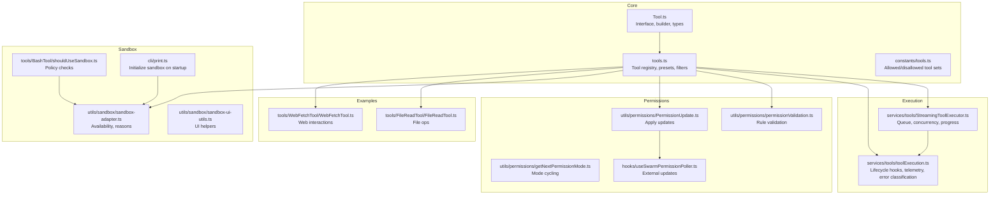

**Diagram sources**
- [Tool.ts:1-793](file://claude_code_src/restored-src/src/Tool.ts#L1-L793)
- [tools.ts:1-390](file://claude_code_src/restored-src/src/tools.ts#L1-L390)
- [constants/tools.ts:1-113](file://claude_code_src/restored-src/src/constants/tools.ts#L1-L113)
- [services/tools/StreamingToolExecutor.ts:123-530](file://claude_code_src/restored-src/src/services/tools/StreamingToolExecutor.ts#L123-L530)
- [services/tools/toolExecution.ts:139-1672](file://claude_code_src/restored-src/src/services/tools/toolExecution.ts#L139-L1672)
- [utils/permissions/permissionValidation.ts:39-262](file://claude_code_src/restored-src/src/utils/permissions/permissionValidation.ts#L39-L262)
- [utils/permissions/getNextPermissionMode.ts:81-101](file://claude_code_src/restored-src/src/utils/permissions/getNextPermissionMode.ts#L81-L101)
- [utils/permissions/PermissionUpdate.ts:45-83](file://claude_code_src/restored-src/src/utils/permissions/PermissionUpdate.ts#L45-L83)
- [hooks/useSwarmPermissionPoller.ts:28-76](file://claude_code_src/restored-src/src/hooks/useSwarmPermissionPoller.ts#L28-L76)
- [utils/sandbox/sandbox-adapter.ts:537-575](file://claude_code_src/restored-src/src/utils/sandbox/sandbox-adapter.ts#L537-L575)
- [utils/sandbox/sandbox-ui-utils.ts:1-12](file://claude_code_src/restored-src/src/utils/sandbox/sandbox-ui-utils.ts#L1-L12)
- [tools/BashTool/shouldUseSandbox.ts:36-69](file://claude_code_src/restored-src/src/tools/BashTool/shouldUseSandbox.ts#L36-L69)
- [cli/print.ts:598-626](file://claude_code_src/restored-src/src/cli/print.ts#L598-L626)
- [tools/FileReadTool/FileReadTool.ts:1-200](file://claude_code_src/restored-src/src/tools/FileReadTool/FileReadTool.ts#L1-L200)
- [tools/WebFetchTool/WebFetchTool.ts:1-200](file://claude_code_src/restored-src/src/tools/WebFetchTool/WebFetchTool.ts#L1-L200)

**Section sources**
- [Tool.ts:1-793](file://claude_code_src/restored-src/src/Tool.ts#L1-L793)
- [tools.ts:1-390](file://claude_code_src/restored-src/src/tools.ts#L1-L390)
- [constants/tools.ts:1-113](file://claude_code_src/restored-src/src/constants/tools.ts#L1-L113)

## Core Components
- Tool interface and builder: Defines the contract for tools, default behaviors, and the builder that fills in safe defaults for optional methods.
- Tool registry and presets: Aggregates built-in tools, filters by environment and permission context, merges with MCP tools, and exposes presets.
- Tool schema generation: Produces model-facing schemas with caching and optional JSON schema overrides for MCP tools.
- Execution engine: Streams tool progress, enforces concurrency, manages in-progress tool IDs, and yields results.
- Permission system: Validates rules, transitions modes, applies updates, and handles external permission responses.
- Sandbox utilities: Enforces platform and policy constraints, surfaces reasons when sandbox is unavailable, and integrates with CLI initialization.

Key responsibilities:
- Tool interface: call, description, input/output schemas, validation, permissions, rendering, grouping, and metadata.
- Builder: ensures consistent defaults and type safety.
- Registry: filters, deduplication, and merging of built-in and MCP tools.
- Executor: maintains queue, concurrency, progress, and completion state.
- Permissions: rule validation, mode cycling, and applying updates.
- Sandbox: availability checks, policy enforcement, and UI cleanup.

**Section sources**
- [Tool.ts:362-792](file://claude_code_src/restored-src/src/Tool.ts#L362-L792)
- [tools.ts:189-390](file://claude_code_src/restored-src/src/tools.ts#L189-L390)
- [utils/api.ts:119-151](file://claude_code_src/restored-src/src/utils/api.ts#L119-L151)
- [services/tools/StreamingToolExecutor.ts:123-530](file://claude_code_src/restored-src/src/services/tools/StreamingToolExecutor.ts#L123-L530)
- [utils/permissions/permissionValidation.ts:39-262](file://claude_code_src/restored-src/src/utils/permissions/permissionValidation.ts#L39-L262)
- [utils/permissions/getNextPermissionMode.ts:81-101](file://claude_code_src/restored-src/src/utils/permissions/getNextPermissionMode.ts#L81-L101)
- [utils/permissions/PermissionUpdate.ts:45-83](file://claude_code_src/restored-src/src/utils/permissions/PermissionUpdate.ts#L45-L83)
- [utils/sandbox/sandbox-adapter.ts:537-575](file://claude_code_src/restored-src/src/utils/sandbox/sandbox-adapter.ts#L537-L575)

## Architecture Overview
The tool system is designed around a central interface and a modular execution pipeline:
- Tools declare capabilities and behavior via the Tool interface.
- The registry constructs the effective tool pool, respecting environment flags, permission contexts, and MCP tools.
- The execution engine streams progress, enforces concurrency, and yields results.
- Permission and sandbox systems gate tool execution and inform the model and UI.

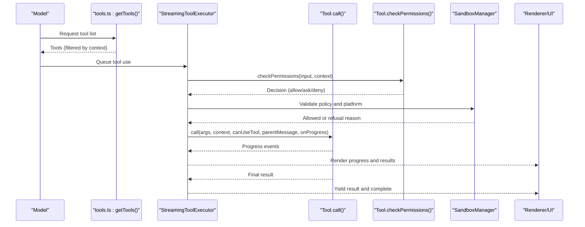

**Diagram sources**
- [tools.ts:271-327](file://claude_code_src/restored-src/src/tools.ts#L271-L327)
- [services/tools/StreamingToolExecutor.ts:265-490](file://claude_code_src/restored-src/src/services/tools/StreamingToolExecutor.ts#L265-L490)
- [Tool.ts:489-503](file://claude_code_src/restored-src/src/Tool.ts#L489-L503)
- [utils/sandbox/sandbox-adapter.ts:537-575](file://claude_code_src/restored-src/src/utils/sandbox/sandbox-adapter.ts#L537-L575)
- [cli/print.ts:598-626](file://claude_code_src/restored-src/src/cli/print.ts#L598-L626)

## Detailed Component Analysis

### Tool Interface and Builder
The Tool interface defines the contract for all tools, including:
- Core lifecycle: call, description, prompt, user-facing name, and optional metadata.
- Schema definitions: inputSchema (Zod) and optional inputJSONSchema for MCP tools.
- Validation and permissions: validateInput and checkPermissions.
- Rendering: renderToolUseMessage, renderToolResultMessage, grouped rendering, and error/rejection UI hooks.
- Behavior flags: isReadOnly, isDestructive, isConcurrencySafe, interruptBehavior, and search hints.
- Execution metadata: maxResultSizeChars, strict mode, and activity summaries.

The builder fills in safe defaults for optional methods and ensures consistent behavior across tools.

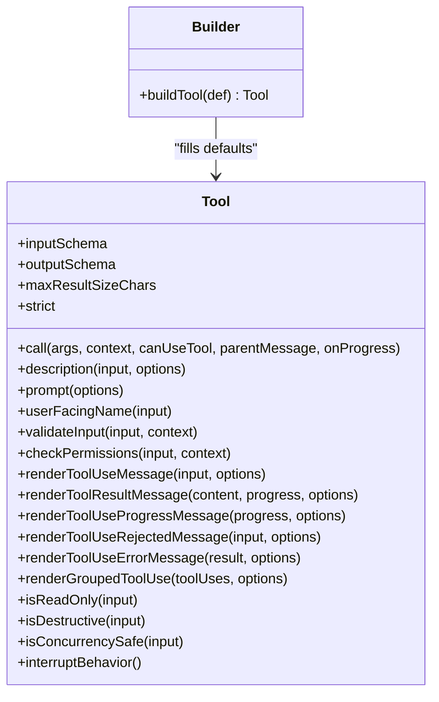

**Diagram sources**
- [Tool.ts:362-792](file://claude_code_src/restored-src/src/Tool.ts#L362-L792)

**Section sources**
- [Tool.ts:362-792](file://claude_code_src/restored-src/src/Tool.ts#L362-L792)

### Tool Registry, Presets, and Filtering
The registry:
- Provides tool presets and resolves default tool lists.
- Constructs the full base tool set, respecting environment flags and feature gates.
- Filters tools by deny rules, REPL visibility, and enablement checks.
- Merges built-in tools with MCP tools, deduplicating by name with built-ins taking precedence.
- Exposes convenience functions to assemble the tool pool and get merged tools.

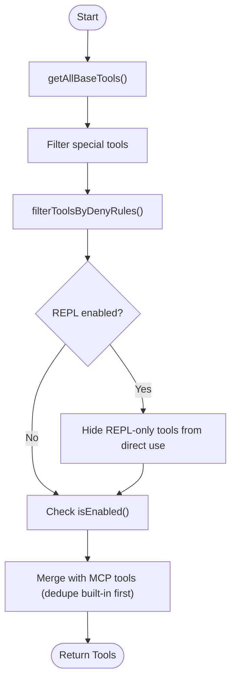

**Diagram sources**
- [tools.ts:189-390](file://claude_code_src/restored-src/src/tools.ts#L189-L390)

**Section sources**
- [tools.ts:189-390](file://claude_code_src/restored-src/src/tools.ts#L189-L390)
- [constants/tools.ts:36-113](file://claude_code_src/restored-src/src/constants/tools.ts#L36-L113)

### Tool Schema Generation for the Model
Schema generation:
- Builds a stable, session-cached schema for each tool to avoid mid-session drift.
- Uses a cache key that includes inputJSONSchema when present to preserve cache stability for MCP tools.
- Supports defer loading and cache control options.

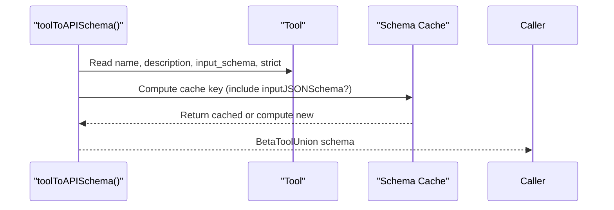

**Diagram sources**
- [utils/api.ts:119-151](file://claude_code_src/restored-src/src/utils/api.ts#L119-L151)

**Section sources**
- [utils/api.ts:119-151](file://claude_code_src/restored-src/src/utils/api.ts#L119-L151)

### Execution Engine: Streaming, Concurrency, and Progress
The execution engine:
- Maintains a queue of tool calls and determines if a tool can execute based on concurrency.
- Executes tools, streams progress, and yields completed results.
- Tracks in-progress tool use IDs and updates interruptibility state.
- Integrates with context modifiers and hooks for pre/post execution.

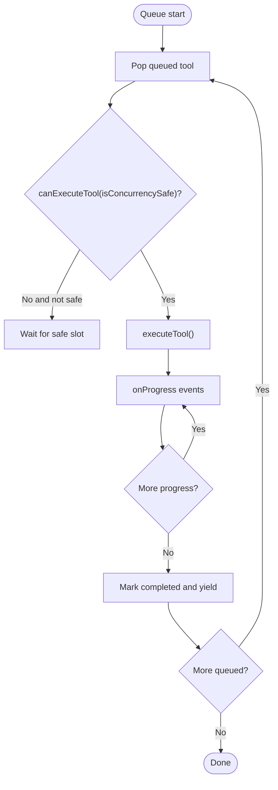

**Diagram sources**
- [services/tools/StreamingToolExecutor.ts:123-530](file://claude_code_src/restored-src/src/services/tools/StreamingToolExecutor.ts#L123-L530)

**Section sources**
- [services/tools/StreamingToolExecutor.ts:123-530](file://claude_code_src/restored-src/src/services/tools/StreamingToolExecutor.ts#L123-L530)

### Permission System Integration
Permission system:
- Validates rule format and content, including parentheses matching and empty parentheses detection.
- Computes next permission mode and prepares context transitions.
- Applies permission updates (set mode, add rules) and logs changes.
- Polls external permission updates and invokes callbacks safely.

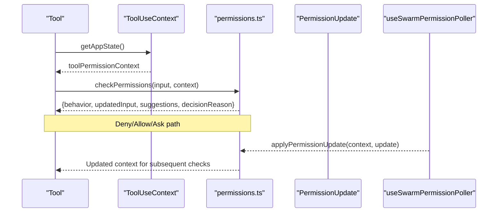

**Diagram sources**
- [utils/permissions/permissionValidation.ts:39-262](file://claude_code_src/restored-src/src/utils/permissions/permissionValidation.ts#L39-L262)
- [utils/permissions/getNextPermissionMode.ts:81-101](file://claude_code_src/restored-src/src/utils/permissions/getNextPermissionMode.ts#L81-L101)
- [utils/permissions/PermissionUpdate.ts:45-83](file://claude_code_src/restored-src/src/utils/permissions/PermissionUpdate.ts#L45-L83)
- [hooks/useSwarmPermissionPoller.ts:28-76](file://claude_code_src/restored-src/src/hooks/useSwarmPermissionPoller.ts#L28-L76)

**Section sources**
- [utils/permissions/permissionValidation.ts:39-262](file://claude_code_src/restored-src/src/utils/permissions/permissionValidation.ts#L39-L262)
- [utils/permissions/getNextPermissionMode.ts:81-101](file://claude_code_src/restored-src/src/utils/permissions/getNextPermissionMode.ts#L81-L101)
- [utils/permissions/PermissionUpdate.ts:45-83](file://claude_code_src/restored-src/src/utils/permissions/PermissionUpdate.ts#L45-L83)
- [hooks/useSwarmPermissionPoller.ts:28-76](file://claude_code_src/restored-src/src/hooks/useSwarmPermissionPoller.ts#L28-L76)

### Sandbox and Security Policies
Sandbox utilities:
- Determine if sandboxing is enabled and supported, and surface reasons when unavailable.
- Enforce platform-specific policies (e.g., Windows native vs. POSIX sandboxes).
- Integrate with CLI initialization to initialize sandbox and forward network permission requests.

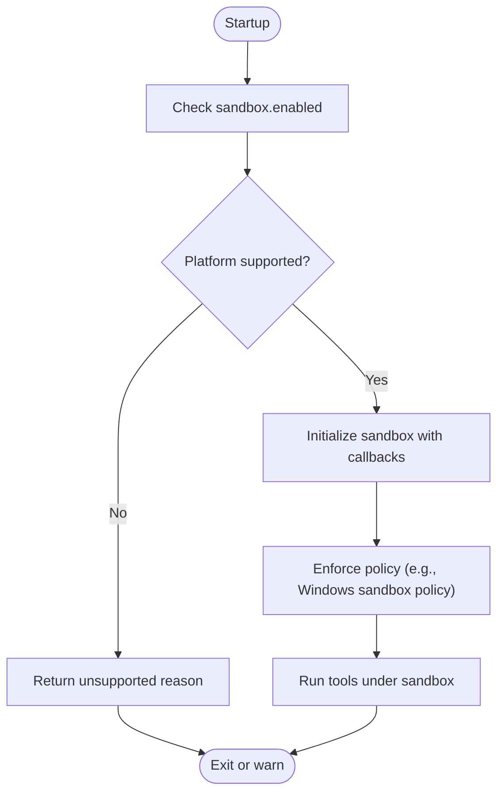

**Diagram sources**
- [utils/sandbox/sandbox-adapter.ts:537-575](file://claude_code_src/restored-src/src/utils/sandbox/sandbox-adapter.ts#L537-L575)
- [tools/BashTool/shouldUseSandbox.ts:36-69](file://claude_code_src/restored-src/src/tools/BashTool/shouldUseSandbox.ts#L36-L69)
- [cli/print.ts:598-626](file://claude_code_src/restored-src/src/cli/print.ts#L598-L626)

**Section sources**
- [utils/sandbox/sandbox-adapter.ts:537-575](file://claude_code_src/restored-src/src/utils/sandbox/sandbox-adapter.ts#L537-L575)
- [tools/BashTool/shouldUseSandbox.ts:36-69](file://claude_code_src/restored-src/src/tools/BashTool/shouldUseSandbox.ts#L36-L69)
- [cli/print.ts:598-626](file://claude_code_src/restored-src/src/cli/print.ts#L598-L626)

### Example Tools: File Operations, System Commands, Web Interactions, and Custom Workflows

#### File Operations: FileReadTool
Highlights:
- Validates device paths and macOS screenshot path variants.
- Registers listeners for file reads and tracks analytics.
- Enforces token and size limits, with exceptions for images and notebooks.
- Implements permission checks for filesystem access and provides user-facing UI.

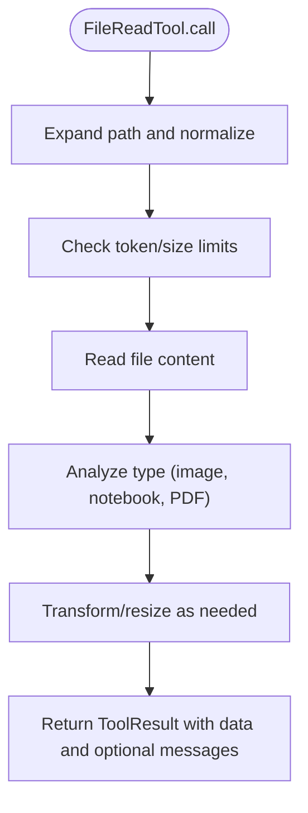

**Diagram sources**
- [tools/FileReadTool/FileReadTool.ts:1-200](file://claude_code_src/restored-src/src/tools/FileReadTool/FileReadTool.ts#L1-L200)

**Section sources**
- [tools/FileReadTool/FileReadTool.ts:1-200](file://claude_code_src/restored-src/src/tools/FileReadTool/FileReadTool.ts#L1-L200)

#### Web Interactions: WebFetchTool
Highlights:
- Validates URL input and checks preapproved hosts.
- Derives permission rule content from hostname and checks allow/deny/ask rules.
- Defers loading and provides a concise tool use summary and activity description.

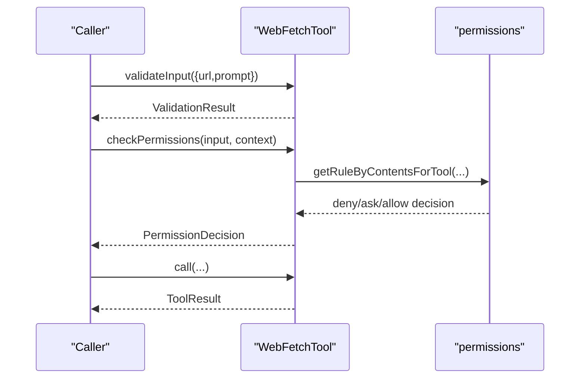

**Diagram sources**
- [tools/WebFetchTool/WebFetchTool.ts:191-200](file://claude_code_src/restored-src/src/tools/WebFetchTool/WebFetchTool.ts#L191-L200)
- [tools/WebFetchTool/WebFetchTool.ts:104-180](file://claude_code_src/restored-src/src/tools/WebFetchTool/WebFetchTool.ts#L104-L180)

**Section sources**
- [tools/WebFetchTool/WebFetchTool.ts:1-200](file://claude_code_src/restored-src/src/tools/WebFetchTool/WebFetchTool.ts#L1-L200)

#### System Commands: BashTool (policy and sandbox)
Highlights:
- Platform-specific sandbox policy checks and user-facing refusal messaging.
- Excluded command patterns and compound command splitting for sandbox enforcement.

**Section sources**
- [tools/BashTool/shouldUseSandbox.ts:36-69](file://claude_code_src/restored-src/src/tools/BashTool/shouldUseSandbox.ts#L36-L69)
- [tools/PowerShellTool/PowerShellTool.tsx:207-222](file://claude_code_src/restored-src/src/tools/PowerShellTool/PowerShellTool.tsx#L207-L222)

### Tool Composition, Chaining, and State Management
- Concurrency control: Non-concurrent tools block subsequent tools until completion; concurrent tools may run in parallel.
- Grouped rendering: Tools can render grouped summaries for non-verbose mode.
- State management: In-progress tool IDs, interruptibility state, and content replacement budgets are tracked in the ToolUseContext.
- Lifecycle hooks: Pre/post tool use hooks and permission hooks integrate with the execution pipeline.

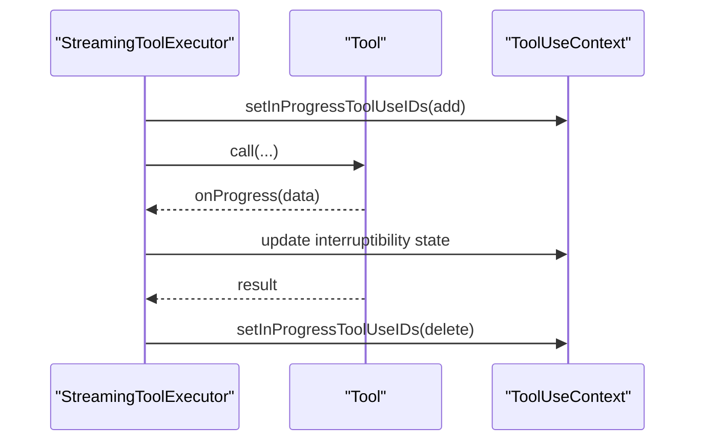

**Diagram sources**
- [services/tools/StreamingToolExecutor.ts:265-490](file://claude_code_src/restored-src/src/services/tools/StreamingToolExecutor.ts#L265-L490)

**Section sources**
- [services/tools/StreamingToolExecutor.ts:123-530](file://claude_code_src/restored-src/src/services/tools/StreamingToolExecutor.ts#L123-L530)

### Result Handling Patterns and User Feedback
- ToolResult: carries data, optional new messages, and context modifiers.
- Rendering hooks: renderToolUseMessage, renderToolResultMessage, progress, rejected, and error UI.
- Extract search text: transcript search indexing fidelity.
- Grouped tool use: consolidated rendering for multiple instances.

**Section sources**
- [Tool.ts:321-695](file://claude_code_src/restored-src/src/Tool.ts#L321-L695)

### Validation, Error Handling, and Telemetry
- Validation: validateInput returns a structured result with error code and message.
- Error classification: classifyToolError extracts telemetry-safe error categories.
- Telemetry: detailed analytics for tool errors, including request IDs and MCP server details.
- Error UI: renderToolUseErrorMessage provides custom error presentation.

**Section sources**
- [services/tools/toolExecution.ts:139-1672](file://claude_code_src/restored-src/src/services/tools/toolExecution.ts#L139-L1672)
- [Tool.ts:95-101](file://claude_code_src/restored-src/src/Tool.ts#L95-L101)

## Dependency Analysis
- Tool.ts depends on permission types, progress types, and UI components for rendering.
- tools.ts aggregates tool implementations and depends on constants for allowed/disallowed sets.
- Execution engine depends on tool interfaces and context for orchestration.
- Permission utilities depend on rule schemas and update types.
- Sandbox utilities depend on platform detection and settings.

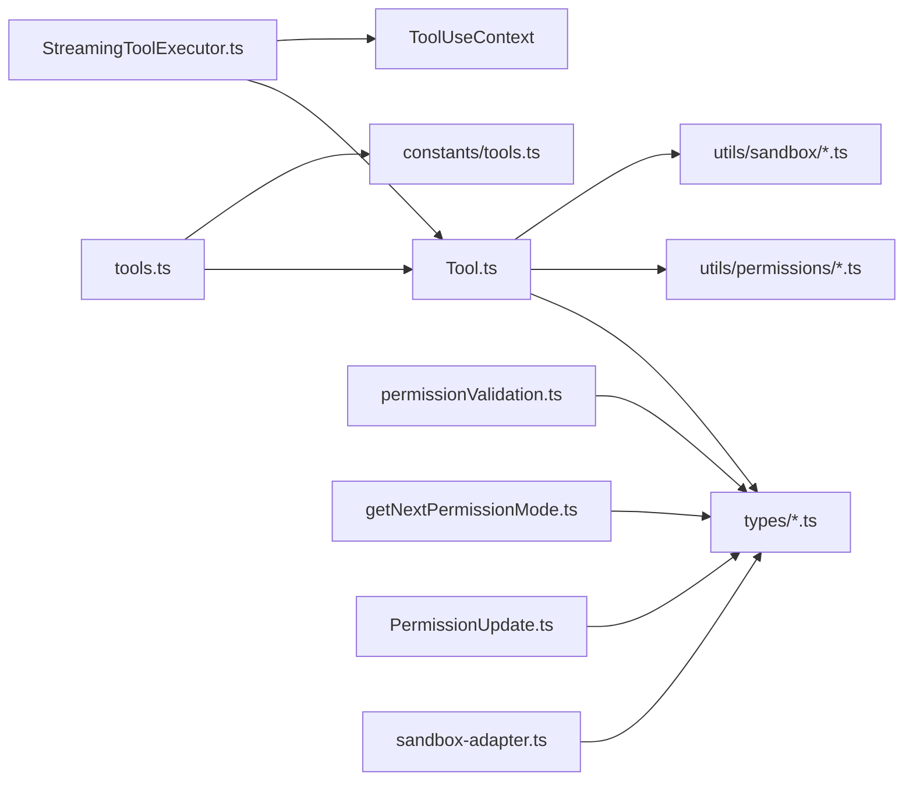

**Diagram sources**
- [Tool.ts:1-793](file://claude_code_src/restored-src/src/Tool.ts#L1-L793)
- [tools.ts:1-390](file://claude_code_src/restored-src/src/tools.ts#L1-L390)
- [constants/tools.ts:1-113](file://claude_code_src/restored-src/src/constants/tools.ts#L1-L113)
- [services/tools/StreamingToolExecutor.ts:123-530](file://claude_code_src/restored-src/src/services/tools/StreamingToolExecutor.ts#L123-L530)
- [utils/permissions/permissionValidation.ts:39-262](file://claude_code_src/restored-src/src/utils/permissions/permissionValidation.ts#L39-L262)
- [utils/permissions/getNextPermissionMode.ts:81-101](file://claude_code_src/restored-src/src/utils/permissions/getNextPermissionMode.ts#L81-L101)
- [utils/permissions/PermissionUpdate.ts:45-83](file://claude_code_src/restored-src/src/utils/permissions/PermissionUpdate.ts#L45-L83)
- [utils/sandbox/sandbox-adapter.ts:537-575](file://claude_code_src/restored-src/src/utils/sandbox/sandbox-adapter.ts#L537-L575)

**Section sources**
- [Tool.ts:1-793](file://claude_code_src/restored-src/src/Tool.ts#L1-L793)
- [tools.ts:1-390](file://claude_code_src/restored-src/src/tools.ts#L1-L390)
- [constants/tools.ts:1-113](file://claude_code_src/restored-src/src/constants/tools.ts#L1-L113)
- [services/tools/StreamingToolExecutor.ts:123-530](file://claude_code_src/restored-src/src/services/tools/StreamingToolExecutor.ts#L123-L530)
- [utils/permissions/permissionValidation.ts:39-262](file://claude_code_src/restored-src/src/utils/permissions/permissionValidation.ts#L39-L262)
- [utils/permissions/getNextPermissionMode.ts:81-101](file://claude_code_src/restored-src/src/utils/permissions/getNextPermissionMode.ts#L81-L101)
- [utils/permissions/PermissionUpdate.ts:45-83](file://claude_code_src/restored-src/src/utils/permissions/PermissionUpdate.ts#L45-L83)
- [utils/sandbox/sandbox-adapter.ts:537-575](file://claude_code_src/restored-src/src/utils/sandbox/sandbox-adapter.ts#L537-L575)

## Performance Considerations
- Prompt cache stability: Sorting and deduplication preserve cache breakpoints for built-in tools.
- Defer loading: Tools can be deferred to reduce initial prompt size; alwaysLoad flag forces immediate inclusion for MCP tools.
- Concurrency: Non-concurrent tools block others to maintain ordering; concurrent tools improve throughput.
- Result size limits: maxResultSizeChars controls persistence thresholds to avoid large payloads.
- Token estimation and limits: File reading limits and token budgets constrain resource usage.

[No sources needed since this section provides general guidance]

## Troubleshooting Guide
Common issues and remedies:
- Permission rule validation failures: Use the validation utility to check rule format and receive suggestions.
- Permission mode cycling: Transition modes to adjust context and strip dangerous permissions.
- External permission updates: Use the swarm poller to apply updates and invoke callbacks safely.
- Sandbox unavailability: Check the adapter for reasons and ensure platform support; CLI prints warnings when sandbox is disabled.
- Tool errors: Classify errors for telemetry and inspect logs; use renderToolUseErrorMessage for user-facing messages.

**Section sources**
- [utils/permissions/permissionValidation.ts:39-262](file://claude_code_src/restored-src/src/utils/permissions/permissionValidation.ts#L39-L262)
- [utils/permissions/getNextPermissionMode.ts:81-101](file://claude_code_src/restored-src/src/utils/permissions/getNextPermissionMode.ts#L81-L101)
- [utils/permissions/PermissionUpdate.ts:45-83](file://claude_code_src/restored-src/src/utils/permissions/PermissionUpdate.ts#L45-L83)
- [hooks/useSwarmPermissionPoller.ts:28-76](file://claude_code_src/restored-src/src/hooks/useSwarmPermissionPoller.ts#L28-L76)
- [utils/sandbox/sandbox-adapter.ts:537-575](file://claude_code_src/restored-src/src/utils/sandbox/sandbox-adapter.ts#L537-L575)
- [services/tools/toolExecution.ts:139-1672](file://claude_code_src/restored-src/src/services/tools/toolExecution.ts#L139-L1672)

## Conclusion
The Claude Code Python IDE provides a robust, extensible tool system with strong defaults, a powerful execution engine, and integrated permission and sandbox controls. By adhering to the Tool interface, leveraging the builder, and integrating with the permission and sandbox utilities, developers can implement secure, user-friendly tools that compose well and scale effectively.

[No sources needed since this section summarizes without analyzing specific files]

## Appendices

### Creating Tools: Step-by-Step Checklist
- Define input/output schemas using Zod or JSON schema for MCP tools.
- Implement call, description, prompt, and user-facing name.
- Add validation and permission checks; derive rule content when needed.
- Implement rendering hooks for messages, progress, rejected, and error UI.
- Mark isReadOnly/isDestructive and isConcurrencySafe appropriately.
- Respect maxResultSizeChars and consider deferring for large outputs.
- Integrate with sandbox policies and platform constraints.
- Test with permission rules, sandbox scenarios, and error paths.

[No sources needed since this section provides general guidance]