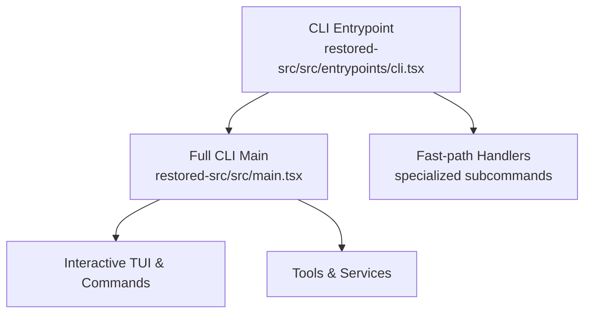
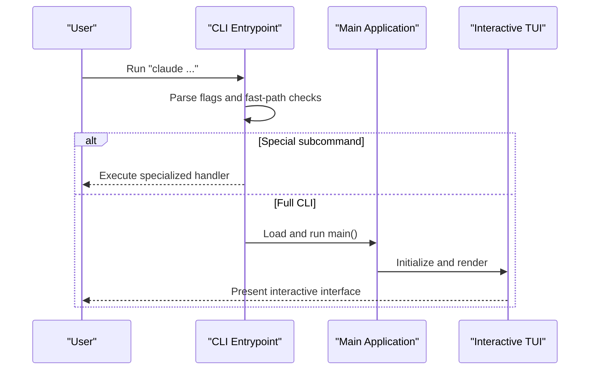
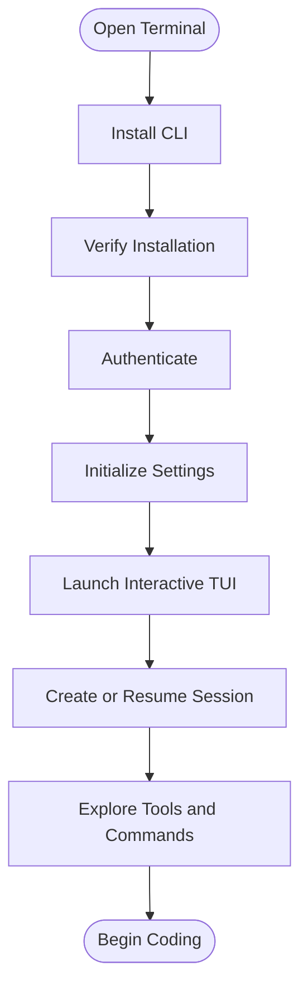
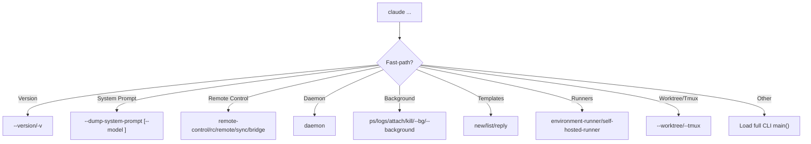
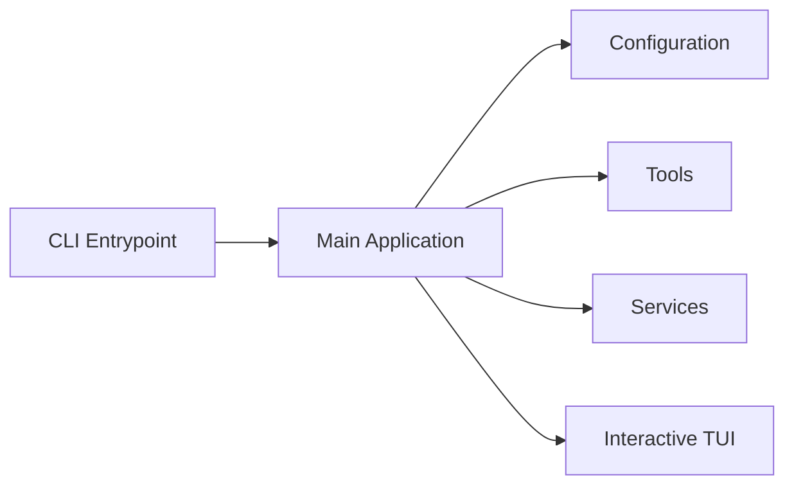

# Getting Started

<cite>
**Referenced Files in This Document**
- [README.md](file://README.md)
- [cli.tsx](file://restored-src/src/entrypoints/cli.tsx)
- [main.tsx](file://restored-src/src/main.tsx)
</cite>

## Table of Contents
1. [Introduction](#introduction)
2. [Project Structure](#project-structure)
3. [Core Components](#core-components)
4. [Architecture Overview](#architecture-overview)
5. [Detailed Component Analysis](#detailed-component-analysis)
6. [Dependency Analysis](#dependency-analysis)
7. [Performance Considerations](#performance-considerations)
8. [Troubleshooting Guide](#troubleshooting-guide)
9. [Conclusion](#conclusion)
10. [Appendices](#appendices)

## Introduction
This guide helps you install, configure, and use the Claude Code Python IDE for the first time. It covers prerequisites, installation, initial setup, CLI usage, and common workflows such as creating sessions and using the terminal interface. It also includes troubleshooting tips and verification steps to ensure a smooth onboarding experience.

## Project Structure
The repository contains a large TypeScript/React codebase that powers the CLI and TUI. The most relevant entry points for getting started are:
- CLI entrypoint: a fast-path dispatcher that routes to specialized handlers or the full CLI
- Main application: the interactive TUI bootstrapper that initializes commands, tools, and services

**Diagram sources**
- [cli.tsx:33-299](file://restored-src/src/entrypoints/cli.tsx#L33-L299)
- [main.tsx:585-800](file://restored-src/src/main.tsx#L585-L800)

**Section sources**
- [README.md:24-42](file://README.md#L24-L42)
- [cli.tsx:33-299](file://restored-src/src/entrypoints/cli.tsx#L33-L299)
- [main.tsx:585-800](file://restored-src/src/main.tsx#L585-L800)

## Core Components
- CLI Entrypoint: Handles fast-path flags and subcommands, then delegates to the full CLI main.
- Main Application: Initializes configuration, analytics, tools, and the interactive TUI.

Key responsibilities:
- Version and system prompt dumps
- Remote control and daemon modes
- Background session management
- Template jobs runner
- Environment/self-hosted runners
- Worktree/Tmux integration
- Deferred prefetches and telemetry

**Section sources**
- [cli.tsx:33-299](file://restored-src/src/entrypoints/cli.tsx#L33-L299)
- [main.tsx:585-800](file://restored-src/src/main.tsx#L585-L800)

## Architecture Overview
The CLI entrypoint performs early checks and routing, then hands off to the main application for interactive sessions. The main application orchestrates configuration, tools, and services.

**Diagram sources**
- [cli.tsx:33-299](file://restored-src/src/entrypoints/cli.tsx#L33-L299)
- [main.tsx:585-800](file://restored-src/src/main.tsx#L585-L800)

## Detailed Component Analysis

### Installation and Setup
- Prerequisites
  - Terminal usage: comfortable with command-line navigation, running commands, and understanding flags.
  - Git familiarity: repository operations, branches, and working trees.
  - Basic Python development concepts: virtual environments, packages, and interpreter basics.
- Installation
  - Install the CLI globally using your preferred package manager.
  - Verify installation by running the version command.
- Initial configuration
  - Configure authentication and environment settings.
  - Review and adjust settings for your workflow (e.g., model selection, permissions).
  - Enable helpful features like MCP servers and skills if desired.

Verification steps:
- Run the version command to confirm installation.
- Confirm that the TUI renders and responds to basic commands.

**Section sources**
- [cli.tsx:36-42](file://restored-src/src/entrypoints/cli.tsx#L36-L42)
- [main.tsx:585-800](file://restored-src/src/main.tsx#L585-L800)

### First-Time User Workflow
- Open the interactive TUI
  - Launch the CLI without flags to enter the interactive mode.
  - The main application initializes configuration, tools, and services, then renders the TUI.
- Create your first session
  - Use the TUI to start a new session or resume an existing one.
  - Choose a model and configure session settings as needed.
- Explore tools and commands
  - Use built-in tools such as Bash, FileEdit, Grep, and others.
  - Try commands like commit, review, config, and more.

[No sources needed since this diagram shows conceptual workflow, not actual code structure]

**Section sources**
- [main.tsx:585-800](file://restored-src/src/main.tsx#L585-L800)

### CLI Interface Usage
Essential commands and flags for new users:
- Version and system prompt
  - Show version: --version or -v
  - Dump system prompt: --dump-system-prompt (with optional --model)
- Remote control and daemon
  - Remote control: remote-control/rc/remote/sync/bridge
  - Daemon: daemon [subcommand]
- Background sessions
  - ps, logs, attach, kill, --bg/--background
- Template jobs
  - new, list, reply
- Environment/self-hosted runners
  - environment-runner, self-hosted-runner
- Worktree/Tmux integration
  - --worktree/--tmux flags
- General flags
  - --bare: minimal startup
  - --settings and --setting-sources: load settings early

**Diagram sources**
- [cli.tsx:36-299](file://restored-src/src/entrypoints/cli.tsx#L36-L299)

**Section sources**
- [cli.tsx:36-299](file://restored-src/src/entrypoints/cli.tsx#L36-L299)

### Creating Sessions
- From the TUI
  - Start a new session or select an existing one.
  - Configure model and permissions as needed.
- From the CLI
  - Use session-related commands and flags to manage sessions in the background.

Common actions:
- Resume a previous session
- Switch models
- Adjust permissions and settings

**Section sources**
- [main.tsx:585-800](file://restored-src/src/main.tsx#L585-L800)

### Using Basic Tools
- BashTool: run shell commands securely
- FileEditTool: edit files with AI assistance
- GrepTool: search within files
- Others: MCP, LSP, REPL, and more

Tips:
- Start with simple commands to become familiar with the toolset.
- Use the TUI’s context and suggestions to guide your workflow.

**Section sources**
- [main.tsx:585-800](file://restored-src/src/main.tsx#L585-L800)

### Navigating the Terminal Interface
- Use keyboard shortcuts to move between panes and input areas.
- Toggle output styles and preferences as needed.
- Access help and hints from the TUI menus.

**Section sources**
- [main.tsx:585-800](file://restored-src/src/main.tsx#L585-L800)

## Dependency Analysis
High-level dependencies between the CLI entrypoint and the main application:

**Diagram sources**
- [cli.tsx:33-299](file://restored-src/src/entrypoints/cli.tsx#L33-L299)
- [main.tsx:585-800](file://restored-src/src/main.tsx#L585-L800)

**Section sources**
- [cli.tsx:33-299](file://restored-src/src/entrypoints/cli.tsx#L33-L299)
- [main.tsx:585-800](file://restored-src/src/main.tsx#L585-L800)

## Performance Considerations
- Use --bare to minimize startup overhead for scripted or headless scenarios.
- Defer prefetches and analytics until after the first render to improve perceived responsiveness.
- Keep environment variables and settings minimal to avoid unnecessary initialization work.

[No sources needed since this section provides general guidance]

## Troubleshooting Guide
Common setup issues and resolutions:
- Authentication errors
  - Ensure you are logged in and your tokens are valid.
  - For remote control features, verify that your organization allows remote control and that your version meets minimum requirements.
- Permission denials
  - Review and adjust permission modes and settings.
  - Use the TUI to manage permissions and policies.
- Environment and runner issues
  - For environment-runner and self-hosted-runner, verify environment variables and network connectivity.
- Version mismatches
  - Use the version command to confirm your installed version and compare with the latest release.

Verification steps:
- Run the version command to confirm installation.
- Test a simple command to ensure the CLI responds.
- Check logs and session status using background session commands.

**Section sources**
- [cli.tsx:108-162](file://restored-src/src/entrypoints/cli.tsx#L108-L162)
- [cli.tsx:164-180](file://restored-src/src/entrypoints/cli.tsx#L164-L180)
- [cli.tsx:182-209](file://restored-src/src/entrypoints/cli.tsx#L182-L209)
- [cli.tsx:224-245](file://restored-src/src/entrypoints/cli.tsx#L224-L245)
- [cli.tsx:247-274](file://restored-src/src/entrypoints/cli.tsx#L247-L274)

## Conclusion
You are now ready to use the Claude Code Python IDE. Start with the interactive TUI, create your first session, and explore the built-in tools. Use the CLI for advanced workflows and automation. Refer to the troubleshooting section if you encounter issues, and verify your installation using the provided commands.

[No sources needed since this section summarizes without analyzing specific files]

## Appendices
- Additional resources
  - Review the TUI menus and help system for contextual guidance.
  - Explore plugins and skills to extend functionality.

[No sources needed since this section provides general guidance]