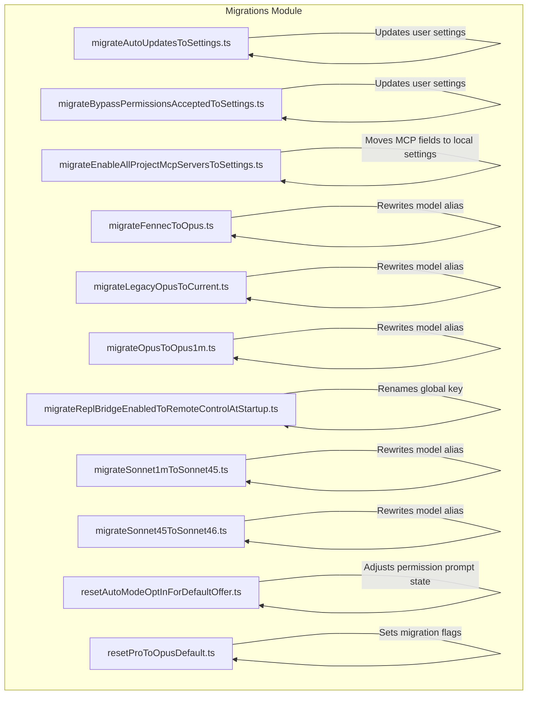
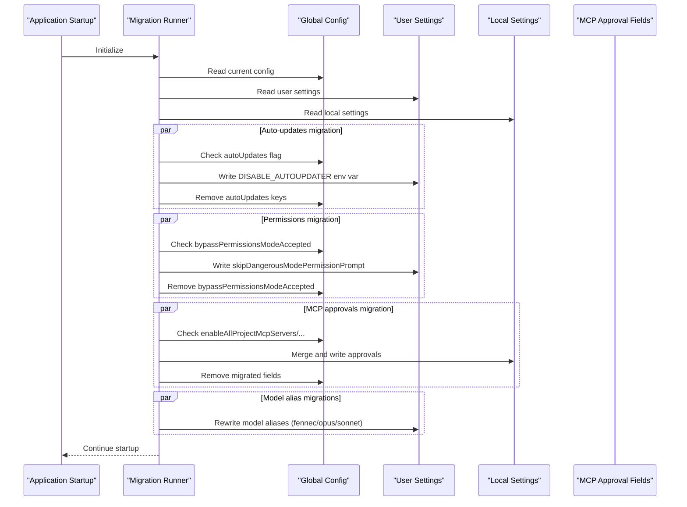

# Migration and Upgrade Guide

<cite>
**Referenced Files in This Document**
- [migrateAutoUpdatesToSettings.ts](file://claude_code_src/restored-src/src/migrations/migrateAutoUpdatesToSettings.ts)
- [migrateBypassPermissionsAcceptedToSettings.ts](file://claude_code_src/restored-src/src/migrations/migrateBypassPermissionsAcceptedToSettings.ts)
- [migrateEnableAllProjectMcpServersToSettings.ts](file://claude_code_src/restored-src/src/migrations/migrateEnableAllProjectMcpServersToSettings.ts)
- [migrateFennecToOpus.ts](file://claude_code_src/restored-src/src/migrations/migrateFennecToOpus.ts)
- [migrateLegacyOpusToCurrent.ts](file://claude_code_src/restored-src/src/migrations/migrateLegacyOpusToCurrent.ts)
- [migrateOpusToOpus1m.ts](file://claude_code_src/restored-src/src/migrations/migrateOpusToOpus1m.ts)
- [migrateReplBridgeEnabledToRemoteControlAtStartup.ts](file://claude_code_src/restored-src/src/migrations/migrateReplBridgeEnabledToRemoteControlAtStartup.ts)
- [migrateSonnet1mToSonnet45.ts](file://claude_code_src/restored-src/src/migrations/migrateSonnet1mToSonnet45.ts)
- [migrateSonnet45ToSonnet46.ts](file://claude_code_src/restored-src/src/migrations/migrateSonnet45ToSonnet46.ts)
- [resetAutoModeOptInForDefaultOffer.ts](file://claude_code_src/restored-src/src/migrations/resetAutoModeOptInForDefaultOffer.ts)
- [resetProToOpusDefault.ts](file://claude_code_src/restored-src/src/migrations/resetProToOpusDefault.ts)
</cite>

## Table of Contents
1. [Introduction](#introduction)
2. [Project Structure](#project-structure)
3. [Core Components](#core-components)
4. [Architecture Overview](#architecture-overview)
5. [Detailed Component Analysis](#detailed-component-analysis)
6. [Dependency Analysis](#dependency-analysis)
7. [Performance Considerations](#performance-considerations)
8. [Troubleshooting Guide](#troubleshooting-guide)
9. [Conclusion](#conclusion)
10. [Appendices](#appendices)

## Introduction
This guide documents version upgrade procedures, breaking changes, and migration scripts for the Claude Code Python IDE. It focuses on configuration migrations, model alias changes, MCP server approvals, and permission-related updates. It also provides step-by-step upgrade instructions, rollback procedures, compatibility checks, and troubleshooting guidance to ensure smooth transitions across versions.

## Project Structure
The migration logic is centralized under the migrations module. Each migration script encapsulates a single responsibility: moving configuration from global/project settings to user settings, updating model aliases, adjusting MCP server approvals, and handling permission prompts. These scripts are designed to be idempotent and safe to run on startup.



**Diagram sources**
- [migrateAutoUpdatesToSettings.ts:1-62](file://claude_code_src/restored-src/src/migrations/migrateAutoUpdatesToSettings.ts#L1-L62)
- [migrateBypassPermissionsAcceptedToSettings.ts:1-41](file://claude_code_src/restored-src/src/migrations/migrateBypassPermissionsAcceptedToSettings.ts#L1-L41)
- [migrateEnableAllProjectMcpServersToSettings.ts:1-119](file://claude_code_src/restored-src/src/migrations/migrateEnableAllProjectMcpServersToSettings.ts#L1-L119)
- [migrateFennecToOpus.ts:1-46](file://claude_code_src/restored-src/src/migrations/migrateFennecToOpus.ts#L1-L46)
- [migrateLegacyOpusToCurrent.ts:1-58](file://claude_code_src/restored-src/src/migrations/migrateLegacyOpusToCurrent.ts#L1-L58)
- [migrateOpusToOpus1m.ts:1-44](file://claude_code_src/restored-src/src/migrations/migrateOpusToOpus1m.ts#L1-L44)
- [migrateReplBridgeEnabledToRemoteControlAtStartup.ts:1-23](file://claude_code_src/restored-src/src/migrations/migrateReplBridgeEnabledToRemoteControlAtStartup.ts#L1-L23)
- [migrateSonnet1mToSonnet45.ts:1-49](file://claude_code_src/restored-src/src/migrations/migrateSonnet1mToSonnet45.ts#L1-L49)
- [migrateSonnet45ToSonnet46.ts:1-68](file://claude_code_src/restored-src/src/migrations/migrateSonnet45ToSonnet46.ts#L1-L68)
- [resetAutoModeOptInForDefaultOffer.ts:1-52](file://claude_code_src/restored-src/src/migrations/resetAutoModeOptInForDefaultOffer.ts#L1-L52)
- [resetProToOpusDefault.ts:1-52](file://claude_code_src/restored-src/src/migrations/resetProToOpusDefault.ts#L1-L52)

**Section sources**
- [migrateAutoUpdatesToSettings.ts:1-62](file://claude_code_src/restored-src/src/migrations/migrateAutoUpdatesToSettings.ts#L1-L62)
- [migrateBypassPermissionsAcceptedToSettings.ts:1-41](file://claude_code_src/restored-src/src/migrations/migrateBypassPermissionsAcceptedToSettings.ts#L1-L41)
- [migrateEnableAllProjectMcpServersToSettings.ts:1-119](file://claude_code_src/restored-src/src/migrations/migrateEnableAllProjectMcpServersToSettings.ts#L1-L119)
- [migrateFennecToOpus.ts:1-46](file://claude_code_src/restored-src/src/migrations/migrateFennecToOpus.ts#L1-L46)
- [migrateLegacyOpusToCurrent.ts:1-58](file://claude_code_src/restored-src/src/migrations/migrateLegacyOpusToCurrent.ts#L1-L58)
- [migrateOpusToOpus1m.ts:1-44](file://claude_code_src/restored-src/src/migrations/migrateOpusToOpus1m.ts#L1-L44)
- [migrateReplBridgeEnabledToRemoteControlAtStartup.ts:1-23](file://claude_code_src/restored-src/src/migrations/migrateReplBridgeEnabledToRemoteControlAtStartup.ts#L1-L23)
- [migrateSonnet1mToSonnet45.ts:1-49](file://claude_code_src/restored-src/src/migrations/migrateSonnet1mToSonnet45.ts#L1-L49)
- [migrateSonnet45ToSonnet46.ts:1-68](file://claude_code_src/restored-src/src/migrations/migrateSonnet45ToSonnet46.ts#L1-L68)
- [resetAutoModeOptInForDefaultOffer.ts:1-52](file://claude_code_src/restored-src/src/migrations/resetAutoModeOptInForDefaultOffer.ts#L1-L52)
- [resetProToOpusDefault.ts:1-52](file://claude_code_src/restored-src/src/migrations/resetProToOpusDefault.ts#L1-L52)

## Core Components
- Migration scripts: Each script targets a specific breaking change or configuration shift. They read current configuration, apply transformations, and write updates to appropriate sources (user, local, or global settings). They are designed to be idempotent and safe to rerun.
- Configuration sources:
  - Global config: persisted across sessions and machines (e.g., ~/.claude.json).
  - User settings: per-user preferences stored in settings.json.
  - Local settings: project-scoped overrides stored in settings.json.
  - Policy settings: managed centrally and merged into effective settings.
- Utilities used by migrations:
  - Settings helpers: read/write settings for specific sources.
  - Config helpers: read/write global/project configs.
  - Analytics/logging: emit telemetry and log errors for diagnostics.

Key responsibilities:
- Model alias migrations: update deprecated model aliases to current ones.
- Permission and prompt migrations: move flags and prompts to appropriate settings.
- MCP server approvals: migrate approval fields from project config to local settings.
- Auto-updater preference: move user preference to environment variable in settings.
- Startup keys: rename internal keys to new names.

**Section sources**
- [migrateAutoUpdatesToSettings.ts:1-62](file://claude_code_src/restored-src/src/migrations/migrateAutoUpdatesToSettings.ts#L1-L62)
- [migrateBypassPermissionsAcceptedToSettings.ts:1-41](file://claude_code_src/restored-src/src/migrations/migrateBypassPermissionsAcceptedToSettings.ts#L1-L41)
- [migrateEnableAllProjectMcpServersToSettings.ts:1-119](file://claude_code_src/restored-src/src/migrations/migrateEnableAllProjectMcpServersToSettings.ts#L1-L119)
- [migrateFennecToOpus.ts:1-46](file://claude_code_src/restored-src/src/migrations/migrateFennecToOpus.ts#L1-L46)
- [migrateLegacyOpusToCurrent.ts:1-58](file://claude_code_src/restored-src/src/migrations/migrateLegacyOpusToCurrent.ts#L1-L58)
- [migrateOpusToOpus1m.ts:1-44](file://claude_code_src/restored-src/src/migrations/migrateOpusToOpus1m.ts#L1-L44)
- [migrateReplBridgeEnabledToRemoteControlAtStartup.ts:1-23](file://claude_code_src/restored-src/src/migrations/migrateReplBridgeEnabledToRemoteControlAtStartup.ts#L1-L23)
- [migrateSonnet1mToSonnet45.ts:1-49](file://claude_code_src/restored-src/src/migrations/migrateSonnet1mToSonnet45.ts#L1-L49)
- [migrateSonnet45ToSonnet46.ts:1-68](file://claude_code_src/restored-src/src/migrations/migrateSonnet45ToSonnet46.ts#L1-L68)
- [resetAutoModeOptInForDefaultOffer.ts:1-52](file://claude_code_src/restored-src/src/migrations/resetAutoModeOptInForDefaultOffer.ts#L1-L52)
- [resetProToOpusDefault.ts:1-52](file://claude_code_src/restored-src/src/migrations/resetProToOpusDefault.ts#L1-L52)

## Architecture Overview
The migration system runs at startup and applies a series of targeted transformations. Each migration reads from a source (global/project/user/local), conditionally transforms data, and writes to the appropriate destination. Some migrations also set completion flags in global config to ensure idempotency.



**Diagram sources**
- [migrateAutoUpdatesToSettings.ts:13-61](file://claude_code_src/restored-src/src/migrations/migrateAutoUpdatesToSettings.ts#L13-L61)
- [migrateBypassPermissionsAcceptedToSettings.ts:14-40](file://claude_code_src/restored-src/src/migrations/migrateBypassPermissionsAcceptedToSettings.ts#L14-L40)
- [migrateEnableAllProjectMcpServersToSettings.ts:17-118](file://claude_code_src/restored-src/src/migrations/migrateEnableAllProjectMcpServersToSettings.ts#L17-L118)
- [migrateFennecToOpus.ts:18-45](file://claude_code_src/restored-src/src/migrations/migrateFennecToOpus.ts#L18-L45)
- [migrateLegacyOpusToCurrent.ts:29-57](file://claude_code_src/restored-src/src/migrations/migrateLegacyOpusToCurrent.ts#L29-L57)
- [migrateOpusToOpus1m.ts:24-43](file://claude_code_src/restored-src/src/migrations/migrateOpusToOpus1m.ts#L24-L43)
- [migrateReplBridgeEnabledToRemoteControlAtStartup.ts:10-22](file://claude_code_src/restored-src/src/migrations/migrateReplBridgeEnabledToRemoteControlAtStartup.ts#L10-L22)
- [migrateSonnet1mToSonnet45.ts:25-48](file://claude_code_src/restored-src/src/migrations/migrateSonnet1mToSonnet45.ts#L25-L48)
- [migrateSonnet45ToSonnet46.ts:29-67](file://claude_code_src/restored-src/src/migrations/migrateSonnet45ToSonnet46.ts#L29-L67)

## Detailed Component Analysis

### Auto-updates Preference Migration
Purpose: Move user-set autoUpdates preference to settings to preserve intent while enabling native auto-updates when allowed.

Behavior:
- Only migrates when autoUpdates is explicitly false and not protected for native.
- Writes DISABLE_AUTOUPDATER to user settings env block.
- Sets process.env.DISABLE_AUTOUPDATER to take effect immediately.
- Removes autoUpdates keys from global config after successful migration.

Idempotency: Skips if already migrated or conditions not met.

Rollback: Remove DISABLE_AUTOUPDATER from user settings env and restore autoUpdates in global config.

Validation: Verify user settings env contains DISABLE_AUTOUPDATER and global config lacks autoUpdates keys.

**Section sources**
- [migrateAutoUpdatesToSettings.ts:13-61](file://claude_code_src/restored-src/src/migrations/migrateAutoUpdatesToSettings.ts#L13-L61)

### Bypass Permissions Accepted Migration
Purpose: Move bypassPermissionsModeAccepted from global config to user settings as skipDangerousModePermissionPrompt.

Behavior:
- Checks global config for bypassPermissionsModeAccepted.
- Writes skipDangerousModePermissionPrompt to user settings if missing.
- Removes bypassPermissionsModeAccepted from global config.

Idempotency: Safe to rerun; migration is skipped if already present in user settings.

Rollback: Remove skipDangerousModePermissionPrompt from user settings and restore bypassPermissionsModeAccepted in global config.

Validation: Confirm presence of skipDangerousModePermissionPrompt in user settings and absence in global config.

**Section sources**
- [migrateBypassPermissionsAcceptedToSettings.ts:14-40](file://claude_code_src/restored-src/src/migrations/migrateBypassPermissionsAcceptedToSettings.ts#L14-L40)

### MCP Server Approvals Migration
Purpose: Move MCP approval fields from project config to local settings for better management.

Behavior:
- Reads project config for enableAllProjectMcpServers, enabledMcpjsonServers, disabledMcpjsonServers.
- Merges arrays to avoid duplicates and writes to local settings.
- Removes migrated fields from project config.

Idempotency: Skips if fields already migrated; merges without duplication.

Rollback: Remove merged fields from local settings and restore original fields in project config.

Validation: Ensure local settings reflect merged approvals and project config is cleaned.

**Section sources**
- [migrateEnableAllProjectMcpServersToSettings.ts:17-118](file://claude_code_src/restored-src/src/migrations/migrateEnableAllProjectMcpServersToSettings.ts#L17-L118)

### Fennec to Opus Alias Migration
Purpose: Rewrite deprecated fennec model aliases to opus equivalents.

Behavior:
- Applies to ant users only.
- Rewrites fennec-latest/fennec-latest[1m]/fennec-fast-latest/opus-4-5-fast to opus/opus[1m].
- Sets fastMode when applicable.

Idempotency: Reads/writes user settings; idempotent without completion flag.

Rollback: Manually revert model string in user settings.

Validation: Confirm model string reflects opus/opus[1m] and fastMode is set when required.

**Section sources**
- [migrateFennecToOpus.ts:18-45](file://claude_code_src/restored-src/src/migrations/migrateFennecToOpus.ts#L18-L45)

### Legacy Opus to Current Migration
Purpose: Clean up explicit legacy Opus 4.0/4.1 model strings for first-party users.

Behavior:
- First-party provider only.
- Remaps legacy strings to 'opus' and records migration timestamp.
- Logs analytics event for tracking.

Idempotency: Only acts on legacy strings; sets timestamp to prevent repeated runs.

Rollback: Restore legacy model string in user settings and clear timestamp.

Validation: Verify user settings model is 'opus' and global config has legacyOpusMigrationTimestamp.

**Section sources**
- [migrateLegacyOpusToCurrent.ts:29-57](file://claude_code_src/restored-src/src/migrations/migrateLegacyOpusToCurrent.ts#L29-L57)

### Opus to Opus 1M Migration
Purpose: Migrate users with 'opus' pinned to 'opus[1m]' when eligible.

Behavior:
- Eligibility depends on feature flags and subscription tiers.
- Only writes if userSettings.model is exactly 'opus'.
- Respects defaults to avoid overriding explicit choices.

Idempotency: Idempotent; only acts when conditions match.

Rollback: Change model back to 'opus' in user settings.

Validation: Confirm model is 'opus[1m]' when eligible; otherwise remains 'opus'.

**Section sources**
- [migrateOpusToOpus1m.ts:24-43](file://claude_code_src/restored-src/src/migrations/migrateOpusToOpus1m.ts#L24-L43)

### REPL Bridge Enabled to Remote Control Migration
Purpose: Rename internal key replBridgeEnabled to remoteControlAtStartup.

Behavior:
- Copies value to new key if old key exists and new key is unset.
- Removes old key from global config.

Idempotency: No-op if new key already exists.

Rollback: Restore replBridgeEnabled and remove remoteControlAtStartup.

Validation: Ensure remoteControlAtStartup is set and replBridgeEnabled is removed.

**Section sources**
- [migrateReplBridgeEnabledToRemoteControlAtStartup.ts:10-22](file://claude_code_src/restored-src/src/migrations/migrateReplBridgeEnabledToRemoteControlAtStartup.ts#L10-L22)

### Sonnet 1M to Sonnet 4.5 Migration
Purpose: Preserve user intent for sonnet[1m] by pinning to explicit Sonnet 4.5.

Behavior:
- Uses completion flag in global config to run once.
- Updates user settings and in-memory override if set.
- Leaves project/local scopes unchanged.

Idempotency: Guarded by completion flag.

Rollback: Remove explicit model and completion flag; restore previous state.

Validation: Confirm user settings model is explicit Sonnet 4.5 1M and completion flag is set.

**Section sources**
- [migrateSonnet1mToSonnet45.ts:25-48](file://claude_code_src/restored-src/src/migrations/migrateSonnet1mToSonnet45.ts#L25-L48)

### Sonnet 4.5 to Sonnet 4.6 Migration
Purpose: Migrate Pro/Max/Team Premium users from explicit Sonnet 4.5 strings to 'sonnet' alias.

Behavior:
- First-party provider and eligible subscriber only.
- Determines 1M variant and writes 'sonnet[1m]' or 'sonnet'.
- Records migration timestamp for notifications.

Idempotency: Idempotent; only acts on matching legacy strings.

Rollback: Restore explicit Sonnet 4.5 string in user settings.

Validation: Verify user settings model is 'sonnet' or 'sonnet[1m]' depending on 1M preference.

**Section sources**
- [migrateSonnet45ToSonnet46.ts:29-67](file://claude_code_src/restored-src/src/migrations/migrateSonnet45ToSonnet46.ts#L29-L67)

### Reset Auto Mode Opt-In for Default Offer
Purpose: Re-surface AutoModeOptInDialog for users who accepted old offer but do not have auto as default.

Behavior:
- Guarded by feature flag and enabled auto mode state.
- Clears skipAutoPermissionPrompt when conditions match.
- Sets completion flag in global config.

Idempotency: One-shot via completion flag.

Rollback: Restore skipAutoPermissionPrompt and clear completion flag.

Validation: Confirm dialog appears again and completion flag is set.

**Section sources**
- [resetAutoModeOptInForDefaultOffer.ts:25-51](file://claude_code_src/restored-src/src/migrations/resetAutoModeOptInForDefaultOffer.ts#L25-L51)

### Reset Pro to Opus Default
Purpose: Auto-migrate Pro first-party users to Opus 4.5 default when applicable.

Behavior:
- First-party provider and Pro subscriber only.
- Skips if user has custom model; otherwise sets completion flag and optionally records timestamp.

Idempotency: Guarded by completion flag.

Rollback: Clear completion flag and restore previous default.

Validation: Confirm completion flag is set and optional timestamp recorded.

**Section sources**
- [resetProToOpusDefault.ts:7-51](file://claude_code_src/restored-src/src/migrations/resetProToOpusDefault.ts#L7-L51)

## Dependency Analysis
- Each migration depends on:
  - Settings utilities for reading/writing settings sources.
  - Config utilities for reading/writing global/project configs.
  - Feature flags and auth utilities for eligibility checks.
  - Analytics/logging for telemetry and error reporting.
- Coupling:
  - Low to moderate; each migration is self-contained.
  - Cohesion: high within each migration script.
- External dependencies:
  - Environment variables (e.g., DISABLE_AUTOUPDATER).
  - Feature flags and analytics services.

```mermaid
graph LR
U["User Settings"] <- --> S["Settings Utils"]
L["Local Settings"] <- --> S
G["Global Config"] <- --> C["Config Utils"]
P["Permissions Utils"] <- --> M["Migrations"]
A["Analytics/Logging"] <- --> M
E["Feature Flags/Auth"] <- --> M
M --> S
M --> C
M --> A
M --> P
M --> E
```

**Diagram sources**
- [migrateAutoUpdatesToSettings.ts:1-62](file://claude_code_src/restored-src/src/migrations/migrateAutoUpdatesToSettings.ts#L1-L62)
- [migrateBypassPermissionsAcceptedToSettings.ts:1-41](file://claude_code_src/restored-src/src/migrations/migrateBypassPermissionsAcceptedToSettings.ts#L1-L41)
- [migrateEnableAllProjectMcpServersToSettings.ts:1-119](file://claude_code_src/restored-src/src/migrations/migrateEnableAllProjectMcpServersToSettings.ts#L1-L119)
- [migrateFennecToOpus.ts:1-46](file://claude_code_src/restored-src/src/migrations/migrateFennecToOpus.ts#L1-L46)
- [migrateLegacyOpusToCurrent.ts:1-58](file://claude_code_src/restored-src/src/migrations/migrateLegacyOpusToCurrent.ts#L1-L58)
- [migrateOpusToOpus1m.ts:1-44](file://claude_code_src/restored-src/src/migrations/migrateOpusToOpus1m.ts#L1-L44)
- [migrateReplBridgeEnabledToRemoteControlAtStartup.ts:1-23](file://claude_code_src/restored-src/src/migrations/migrateReplBridgeEnabledToRemoteControlAtStartup.ts#L1-L23)
- [migrateSonnet1mToSonnet45.ts:1-49](file://claude_code_src/restored-src/src/migrations/migrateSonnet1mToSonnet45.ts#L1-L49)
- [migrateSonnet45ToSonnet46.ts:1-68](file://claude_code_src/restored-src/src/migrations/migrateSonnet45ToSonnet46.ts#L1-L68)
- [resetAutoModeOptInForDefaultOffer.ts:1-52](file://claude_code_src/restored-src/src/migrations/resetAutoModeOptInForDefaultOffer.ts#L1-L52)
- [resetProToOpusDefault.ts:1-52](file://claude_code_src/restored-src/src/migrations/resetProToOpusDefault.ts#L1-L52)

**Section sources**
- [migrateAutoUpdatesToSettings.ts:1-62](file://claude_code_src/restored-src/src/migrations/migrateAutoUpdatesToSettings.ts#L1-L62)
- [migrateBypassPermissionsAcceptedToSettings.ts:1-41](file://claude_code_src/restored-src/src/migrations/migrateBypassPermissionsAcceptedToSettings.ts#L1-L41)
- [migrateEnableAllProjectMcpServersToSettings.ts:1-119](file://claude_code_src/restored-src/src/migrations/migrateEnableAllProjectMcpServersToSettings.ts#L1-L119)
- [migrateFennecToOpus.ts:1-46](file://claude_code_src/restored-src/src/migrations/migrateFennecToOpus.ts#L1-L46)
- [migrateLegacyOpusToCurrent.ts:1-58](file://claude_code_src/restored-src/src/migrations/migrateLegacyOpusToCurrent.ts#L1-L58)
- [migrateOpusToOpus1m.ts:1-44](file://claude_code_src/restored-src/src/migrations/migrateOpusToOpus1m.ts#L1-L44)
- [migrateReplBridgeEnabledToRemoteControlAtStartup.ts:1-23](file://claude_code_src/restored-src/src/migrations/migrateReplBridgeEnabledToRemoteControlAtStartup.ts#L1-L23)
- [migrateSonnet1mToSonnet45.ts:1-49](file://claude_code_src/restored-src/src/migrations/migrateSonnet1mToSonnet45.ts#L1-L49)
- [migrateSonnet45ToSonnet46.ts:1-68](file://claude_code_src/restored-src/src/migrations/migrateSonnet45ToSonnet46.ts#L1-L68)
- [resetAutoModeOptInForDefaultOffer.ts:1-52](file://claude_code_src/restored-src/src/migrations/resetAutoModeOptInForDefaultOffer.ts#L1-L52)
- [resetProToOpusDefault.ts:1-52](file://claude_code_src/restored-src/src/migrations/resetProToOpusDefault.ts#L1-L52)

## Performance Considerations
- Idempotency: All migrations are designed to be safe to rerun and short-circuit when conditions are not met.
- Minimal overhead: Each migration performs small, targeted reads/writes and exits early if no action is needed.
- Logging and analytics: Telemetry helps track migration success and failures without impacting performance.

## Troubleshooting Guide
Common issues and resolutions:
- Migration did not run:
  - Verify eligibility checks (provider, subscriptions, feature flags).
  - Check for errors in analytics/logs.
- Settings not updated:
  - Confirm correct settings source (user vs. merged settings).
  - Ensure environment variables are writable.
- Duplicate MCP approvals:
  - Merge logic deduplicates; verify arrays in local settings.
- Model alias not rewritten:
  - Confirm user type and model string format.
  - Check completion flags for one-shot migrations.
- Rollback:
  - Manually edit settings files to revert changes.
  - Clear completion flags in global config if applicable.

Validation steps:
- Restart the application and confirm settings reflect expected changes.
- Review analytics events for migration outcomes.
- Check logs for error entries.

**Section sources**
- [migrateAutoUpdatesToSettings.ts:55-60](file://claude_code_src/restored-src/src/migrations/migrateAutoUpdatesToSettings.ts#L55-L60)
- [migrateEnableAllProjectMcpServersToSettings.ts:113-117](file://claude_code_src/restored-src/src/migrations/migrateEnableAllProjectMcpServersToSettings.ts#L113-L117)
- [migrateSonnet1mToSonnet45.ts:27-28](file://claude_code_src/restored-src/src/migrations/migrateSonnet1mToSonnet45.ts#L27-L28)
- [migrateSonnet45ToSonnet46.ts:54-60](file://claude_code_src/restored-src/src/migrations/migrateSonnet45ToSonnet46.ts#L54-L60)

## Conclusion
The migration system ensures backward compatibility while modernizing configuration and model aliases. By following the step-by-step upgrade instructions and using the rollback procedures outlined above, users can safely transition across versions with minimal disruption. Regular validation and monitoring of analytics/logs will help identify and resolve issues quickly.

## Appendices

### Step-by-Step Upgrade Instructions
- Backup configuration:
  - Copy global config and settings files to a safe location.
- Run application:
  - Launch the IDE; migrations execute automatically at startup.
- Validate changes:
  - Confirm settings reflect expected updates (e.g., model aliases, MCP approvals, auto-updater env var).
- Monitor telemetry:
  - Review analytics events for migration outcomes.
- Troubleshoot:
  - If issues persist, consult logs and perform manual rollbacks as needed.

### Rollback Procedures
- Auto-updates preference:
  - Remove DISABLE_AUTOUPDATER from user settings env and restore autoUpdates in global config.
- Bypass permissions:
  - Remove skipDangerousModePermissionPrompt from user settings and restore bypassPermissionsModeAccepted in global config.
- MCP approvals:
  - Remove merged fields from local settings and restore original fields in project config.
- Model aliases:
  - Manually revert model strings in user settings.
- Completion flags:
  - Clear completion flags in global config for one-shot migrations.

### Compatibility Checks
- Provider and subscription checks:
  - Ensure provider is first-party and subscriptions meet eligibility criteria for model migrations.
- Feature flags:
  - Confirm feature flags are enabled for targeted migrations.
- Settings sources:
  - Verify correct settings source is used (user vs. merged settings) to avoid unintended promotions.

### Deprecated Features and Timeline
- Model alias deprecations:
  - fennec-* aliases, legacy Opus 4.0/4.1 strings, explicit Sonnet 4.5 variants.
- Internal keys:
  - replBridgeEnabled renamed to remoteControlAtStartup.
- Permission prompts:
  - Bypass permissions accepted moved to skipDangerousModePermissionPrompt.

### Plugin Compatibility
- MCP server approvals:
  - Migrated from project config to local settings; ensure approvals are retained post-migration.
- Environment variables:
  - Auto-updater preference moved to settings env; verify environment is writable.

### API Modifications During Upgrades
- Settings APIs:
  - Use settings utilities to read/write specific sources (user, local).
- Config APIs:
  - Use config utilities to read/write global/project configurations.
- Analytics/logging:
  - Ensure telemetry is enabled to track migration outcomes.