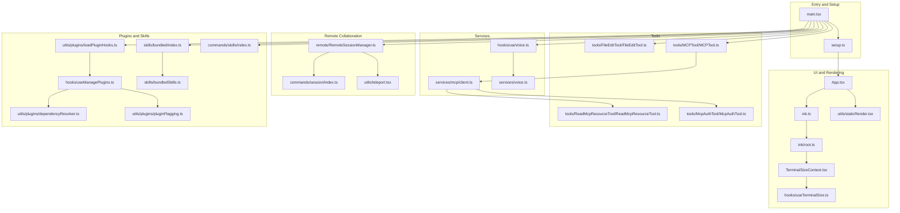
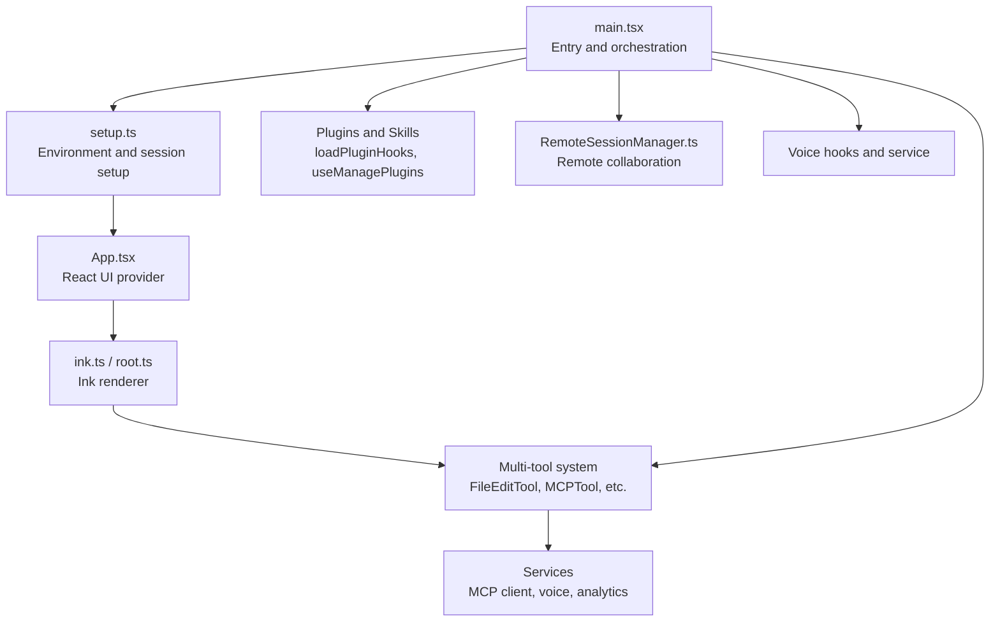
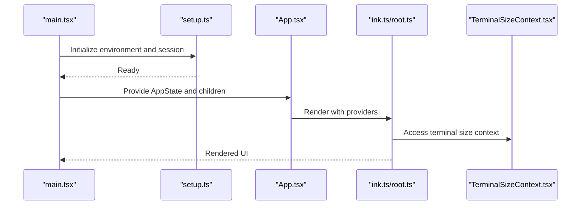
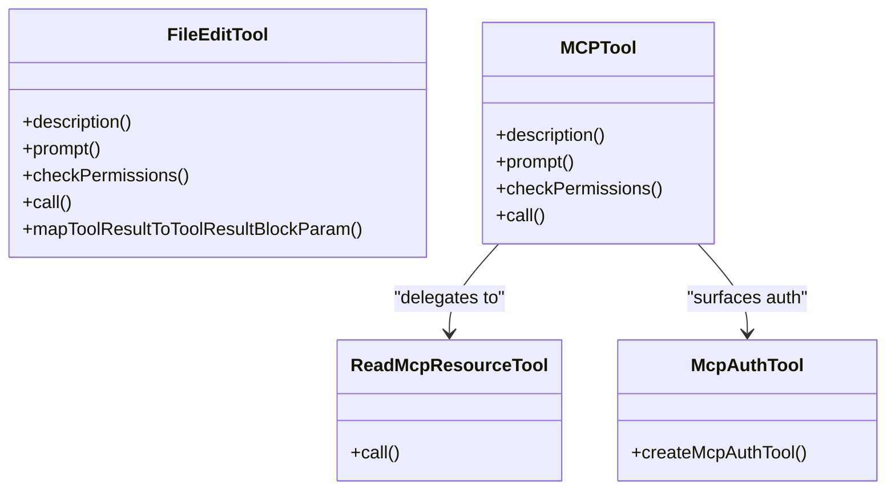
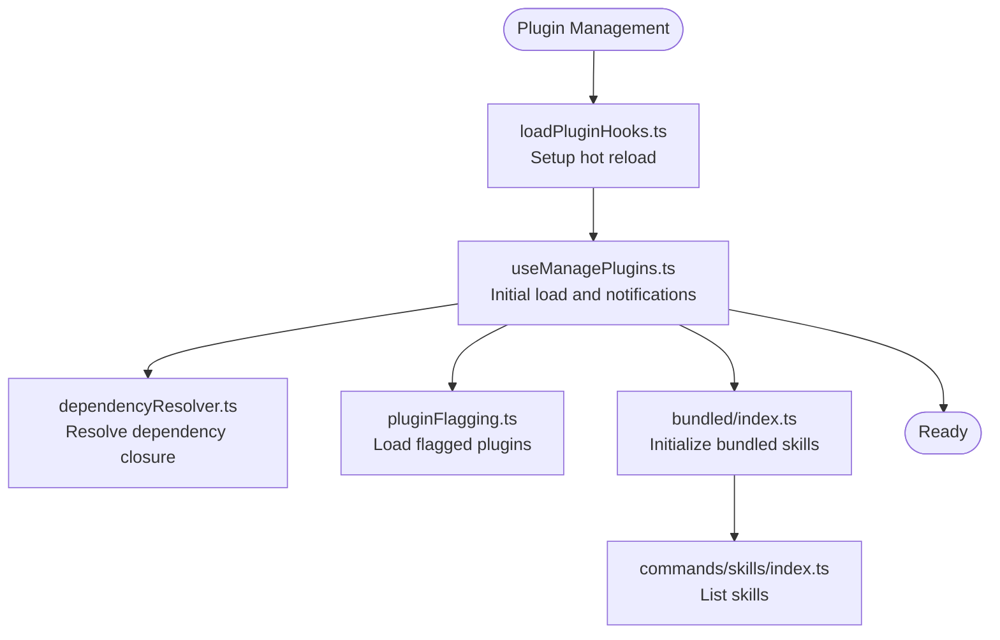
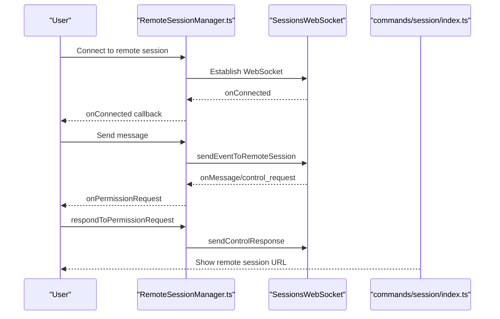
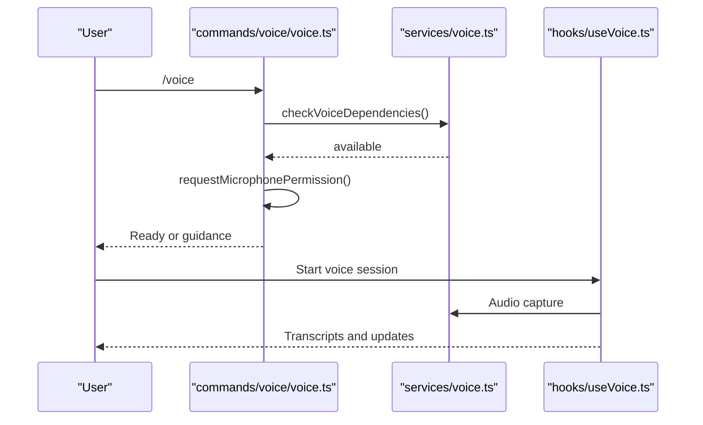
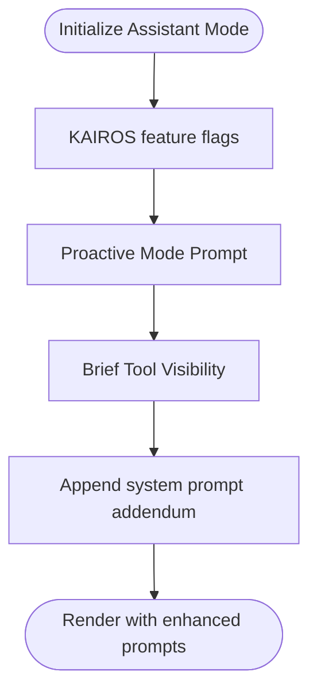
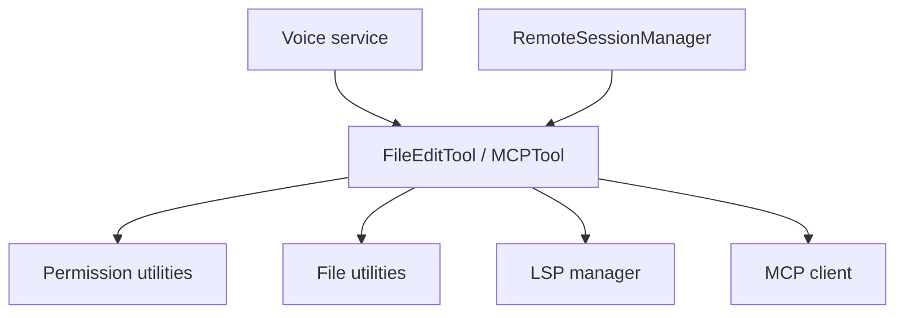

# Project Overview

<cite>
**Referenced Files in This Document**
- [README.md](file://README.md)
- [main.tsx](file://restored-src/src/main.tsx)
- [setup.ts](file://restored-src/src/setup.ts)
- [App.tsx](file://restored-src/src/components/App.tsx)
- [ink.ts](file://restored-src/src/ink.ts)
- [root.ts](file://restored-src/src/ink/root.ts)
- [TerminalSizeContext.tsx](file://restored-src/src/ink/components/TerminalSizeContext.tsx)
- [useTerminalSize.ts](file://restored-src/src/hooks/useTerminalSize.ts)
- [staticRender.tsx](file://restored-src/src/utils/staticRender.tsx)
- [FileEditTool.ts](file://restored-src/src/tools/FileEditTool/FileEditTool.ts)
- [MCPTool.ts](file://restored-src/src/tools/MCPTool/MCPTool.ts)
- [client.ts](file://restored-src/src/services/mcp/client.ts)
- [ReadMcpResourceTool.ts](file://restored-src/src/tools/ReadMcpResourceTool/ReadMcpResourceTool.ts)
- [McpAuthTool.ts](file://restored-src/src/tools/McpAuthTool/McpAuthTool.ts)
- [RemoteSessionManager.ts](file://restored-src/src/remote/RemoteSessionManager.ts)
- [useVoice.ts](file://restored-src/src/hooks/useVoice.ts)
- [voice.ts](file://restored-src/src/services/voice.ts)
- [voice command](file://restored-src/src/commands/voice/voice.ts)
- [usePluginRecommendationBase.tsx](file://restored-src/src/hooks/usePluginRecommendationBase.tsx)
- [loadPluginHooks.ts](file://restored-src/src/utils/plugins/loadPluginHooks.ts)
- [useManagePlugins.ts](file://restored-src/src/hooks/useManagePlugins.ts)
- [dependencyResolver.ts](file://restored-src/src/utils/plugins/dependencyResolver.ts)
- [pluginFlagging.ts](file://restored-src/src/utils/plugins/pluginFlagging.ts)
- [bundled/index.ts](file://restored-src/src/skills/bundled/index.ts)
- [bundledSkills.ts](file://restored-src/src/skills/bundledSkills.ts)
- [index.ts (skills command)](file://restored-src/src/commands/skills/index.ts)
- [index.ts (session command)](file://restored-src/src/commands/session/index.ts)
- [teleport.tsx](file://restored-src/src/utils/teleport.tsx)
- [messages.tsx](file://restored-src/src/components/Messages.tsx)
- [messages.tsx (lines 78–85):78-85](file://restored-src/src/components/Messages.tsx#L78-L85)
- [main.tsx (lines 1033–2209):1033-2209](file://restored-src/src/main.tsx#L1033-L2209)
- [print.ts](file://restored-src/src/cli/print.ts)
- [bridge-kick.ts](file://restored-src/src/commands/bridge-kick.ts)
</cite>

## Table of Contents
1. [Introduction](#introduction)
2. [Project Structure](#project-structure)
3. [Core Components](#core-components)
4. [Architecture Overview](#architecture-overview)
5. [Detailed Component Analysis](#detailed-component-analysis)
6. [Dependency Analysis](#dependency-analysis)
7. [Performance Considerations](#performance-considerations)
8. [Troubleshooting Guide](#troubleshooting-guide)
9. [Conclusion](#conclusion)

## Introduction
Claude Code is an AI-powered Python IDE with a terminal UI and a React-based rendering engine. It is designed for both interactive and headless use, integrating an intelligent assistant, a multi-tool system, a plugin architecture, and remote collaboration features. The project is unofficial and reconstructed from the public npm package for research purposes.

Key characteristics:
- Terminal UI powered by a React-based renderer (Ink)
- Intelligent assistant modes and proactive behavior
- Multi-tool system supporting file editing, shells, notebooks, web search, and MCP protocol
- Plugin and skills ecosystems for extensibility
- Remote collaboration and session sharing
- Voice interaction support
- Unofficial and research-only status

**Section sources**
- [README.md:13-49](file://README.md#L13-L49)

## Project Structure
High-level structure highlights:
- Entry points and bootstrapping: main entry, setup, and initialization
- UI and rendering: React-based terminal UI with Ink
- Tools: file editing, shell, notebook editing, MCP, and more
- Services: MCP client, voice, analytics, policy limits, and more
- Plugins and skills: plugin management, bundled skills, and dynamic skill discovery
- Remote collaboration: remote sessions, permissions, and messaging
- Commands: CLI commands for session, voice, skills, and more

**Diagram sources**
- [main.tsx:585-800](file://restored-src/src/main.tsx#L585-L800)
- [setup.ts:56-120](file://restored-src/src/setup.ts#L56-L120)
- [App.tsx:1-56](file://restored-src/src/components/App.tsx#L1-L56)
- [ink.ts:59-85](file://restored-src/src/ink.ts#L59-L85)
- [root.ts:40-95](file://restored-src/src/ink/root.ts#L40-L95)
- [TerminalSizeContext.tsx:1-7](file://restored-src/src/ink/components/TerminalSizeContext.tsx#L1-L7)
- [useTerminalSize.ts:1-15](file://restored-src/src/hooks/useTerminalSize.ts#L1-L15)
- [staticRender.tsx:53-91](file://restored-src/src/utils/staticRender.tsx#L53-L91)
- [FileEditTool.ts:86-137](file://restored-src/src/tools/FileEditTool/FileEditTool.ts#L86-L137)
- [MCPTool.ts:27-77](file://restored-src/src/tools/MCPTool/MCPTool.ts#L27-L77)
- [client.ts:1791-1826](file://restored-src/src/services/mcp/client.ts#L1791-L1826)
- [ReadMcpResourceTool.ts:49-101](file://restored-src/src/tools/ReadMcpResourceTool/ReadMcpResourceTool.ts#L49-L101)
- [McpAuthTool.ts:49-60](file://restored-src/src/tools/McpAuthTool/McpAuthTool.ts#L49-L60)
- [RemoteSessionManager.ts:95-343](file://restored-src/src/remote/RemoteSessionManager.ts#L95-L343)
- [index.ts (session command):4-16](file://restored-src/src/commands/session/index.ts#L4-L16)
- [teleport.tsx:1163-1190](file://restored-src/src/utils/teleport.tsx#L1163-L1190)
- [loadPluginHooks.ts:255-287](file://restored-src/src/utils/plugins/loadPluginHooks.ts#L255-L287)
- [useManagePlugins.ts:25-54](file://restored-src/src/hooks/useManagePlugins.ts#L25-L54)
- [dependencyResolver.ts:95-104](file://restored-src/src/utils/plugins/dependencyResolver.ts#L95-L104)
- [pluginFlagging.ts:117-144](file://restored-src/src/utils/plugins/pluginFlagging.ts#L117-L144)
- [bundled/index.ts:24-51](file://restored-src/src/skills/bundled/index.ts#L24-L51)
- [bundledSkills.ts:75-122](file://restored-src/src/skills/bundledSkills.ts#L75-L122)
- [index.ts (skills command):3-10](file://restored-src/src/commands/skills/index.ts#L3-L10)
- [useVoice.ts:538-833](file://restored-src/src/hooks/useVoice.ts#L538-L833)
- [voice.ts:24-47](file://restored-src/src/services/voice.ts#L24-L47)
- [voice command:82-112](file://restored-src/src/commands/voice/voice.ts#L82-L112)

**Section sources**
- [main.tsx:585-800](file://restored-src/src/main.tsx#L585-L800)
- [setup.ts:56-120](file://restored-src/src/setup.ts#L56-L120)

## Core Components
- Terminal UI and rendering
  - React-based terminal UI built on Ink, with a managed root and terminal size context
  - Static rendering utilities for non-interactive output
- Intelligent assistant and proactive modes
  - Assistant mode and proactive behavior integrated into system prompts
- Multi-tool system
  - File editing, shell, notebook editing, web search, MCP protocol, and more
- Plugin and skills ecosystems
  - Plugin management with hot reload, dependency resolution, and flagging
  - Bundled skills and dynamic skill discovery
- Remote collaboration
  - Remote session manager, session commands, and teleport utilities
- Voice interaction
  - Voice hooks and service for microphone access and recording

**Section sources**
- [App.tsx:1-56](file://restored-src/src/components/App.tsx#L1-L56)
- [ink.ts:59-85](file://restored-src/src/ink.ts#L59-L85)
- [root.ts:40-95](file://restored-src/src/ink/root.ts#L40-L95)
- [TerminalSizeContext.tsx:1-7](file://restored-src/src/ink/components/TerminalSizeContext.tsx#L1-L7)
- [useTerminalSize.ts:1-15](file://restored-src/src/hooks/useTerminalSize.ts#L1-L15)
- [staticRender.tsx:53-91](file://restored-src/src/utils/staticRender.tsx#L53-L91)
- [main.tsx:1033-2209](file://restored-src/src/main.tsx#L1033-L2209)
- [FileEditTool.ts:86-137](file://restored-src/src/tools/FileEditTool/FileEditTool.ts#L86-L137)
- [MCPTool.ts:27-77](file://restored-src/src/tools/MCPTool/MCPTool.ts#L27-L77)
- [client.ts:1791-1826](file://restored-src/src/services/mcp/client.ts#L1791-L1826)
- [loadPluginHooks.ts:255-287](file://restored-src/src/utils/plugins/loadPluginHooks.ts#L255-L287)
- [useManagePlugins.ts:25-54](file://restored-src/src/hooks/useManagePlugins.ts#L25-L54)
- [dependencyResolver.ts:95-104](file://restored-src/src/utils/plugins/dependencyResolver.ts#L95-L104)
- [pluginFlagging.ts:117-144](file://restored-src/src/utils/plugins/pluginFlagging.ts#L117-L144)
- [bundled/index.ts:24-51](file://restored-src/src/skills/bundled/index.ts#L24-L51)
- [bundledSkills.ts:75-122](file://restored-src/src/skills/bundledSkills.ts#L75-L122)
- [RemoteSessionManager.ts:95-343](file://restored-src/src/remote/RemoteSessionManager.ts#L95-L343)
- [index.ts (session command):4-16](file://restored-src/src/commands/session/index.ts#L4-L16)
- [teleport.tsx:1163-1190](file://restored-src/src/utils/teleport.tsx#L1163-L1190)
- [useVoice.ts:538-833](file://restored-src/src/hooks/useVoice.ts#L538-L833)
- [voice.ts:24-47](file://restored-src/src/services/voice.ts#L24-L47)
- [voice command:82-112](file://restored-src/src/commands/voice/voice.ts#L82-L112)

## Architecture Overview
The system initializes through a main entry that sets up environment, permissions, and telemetry. It then renders a React-based terminal UI and orchestrates tools, plugins, and skills. Remote collaboration is supported via a dedicated remote session manager and related commands.

**Diagram sources**
- [main.tsx:585-800](file://restored-src/src/main.tsx#L585-L800)
- [setup.ts:56-120](file://restored-src/src/setup.ts#L56-L120)
- [App.tsx:1-56](file://restored-src/src/components/App.tsx#L1-L56)
- [ink.ts:59-85](file://restored-src/src/ink.ts#L59-L85)
- [root.ts:40-95](file://restored-src/src/ink/root.ts#L40-L95)
- [FileEditTool.ts:86-137](file://restored-src/src/tools/FileEditTool/FileEditTool.ts#L86-L137)
- [MCPTool.ts:27-77](file://restored-src/src/tools/MCPTool/MCPTool.ts#L27-L77)
- [client.ts:1791-1826](file://restored-src/src/services/mcp/client.ts#L1791-L1826)
- [loadPluginHooks.ts:255-287](file://restored-src/src/utils/plugins/loadPluginHooks.ts#L255-L287)
- [useManagePlugins.ts:25-54](file://restored-src/src/hooks/useManagePlugins.ts#L25-L54)
- [RemoteSessionManager.ts:95-343](file://restored-src/src/remote/RemoteSessionManager.ts#L95-L343)
- [useVoice.ts:538-833](file://restored-src/src/hooks/useVoice.ts#L538-L833)
- [voice.ts:24-47](file://restored-src/src/services/voice.ts#L24-L47)

## Detailed Component Analysis

### Terminal UI and Rendering
- React-based terminal UI with Ink provides a managed root and terminal size context
- Static rendering utilities extract the first frame and render to ANSI strings for non-interactive output
- Terminal focus and viewport utilities integrate with the terminal environment

**Diagram sources**
- [main.tsx:585-800](file://restored-src/src/main.tsx#L585-L800)
- [setup.ts:56-120](file://restored-src/src/setup.ts#L56-L120)
- [App.tsx:1-56](file://restored-src/src/components/App.tsx#L1-L56)
- [ink.ts:59-85](file://restored-src/src/ink.ts#L59-L85)
- [root.ts:40-95](file://restored-src/src/ink/root.ts#L40-L95)
- [TerminalSizeContext.tsx:1-7](file://restored-src/src/ink/components/TerminalSizeContext.tsx#L1-L7)

**Section sources**
- [App.tsx:1-56](file://restored-src/src/components/App.tsx#L1-L56)
- [ink.ts:59-85](file://restored-src/src/ink.ts#L59-L85)
- [root.ts:40-95](file://restored-src/src/ink/root.ts#L40-L95)
- [TerminalSizeContext.tsx:1-7](file://restored-src/src/ink/components/TerminalSizeContext.tsx#L1-L7)
- [useTerminalSize.ts:1-15](file://restored-src/src/hooks/useTerminalSize.ts#L1-L15)
- [staticRender.tsx:53-91](file://restored-src/src/utils/staticRender.tsx#L53-L91)

### Multi-tool System
- FileEditTool enables in-place file editing with permission checks, encoding handling, and LSP integration
- MCPTool provides a generic bridge to MCP protocol tools, delegating execution to MCP clients
- ReadMcpResourceTool reads MCP resources with capability checks and connection validation
- McpAuthTool surfaces authentication requirements for MCP servers

**Diagram sources**
- [FileEditTool.ts:86-137](file://restored-src/src/tools/FileEditTool/FileEditTool.ts#L86-L137)
- [FileEditTool.ts:387-595](file://restored-src/src/tools/FileEditTool/FileEditTool.ts#L387-L595)
- [MCPTool.ts:27-77](file://restored-src/src/tools/MCPTool/MCPTool.ts#L27-L77)
- [ReadMcpResourceTool.ts:49-101](file://restored-src/src/tools/ReadMcpResourceTool/ReadMcpResourceTool.ts#L49-L101)
- [McpAuthTool.ts:49-60](file://restored-src/src/tools/McpAuthTool/McpAuthTool.ts#L49-L60)

**Section sources**
- [FileEditTool.ts:86-137](file://restored-src/src/tools/FileEditTool/FileEditTool.ts#L86-L137)
- [FileEditTool.ts:387-595](file://restored-src/src/tools/FileEditTool/FileEditTool.ts#L387-L595)
- [MCPTool.ts:27-77](file://restored-src/src/tools/MCPTool/MCPTool.ts#L27-L77)
- [ReadMcpResourceTool.ts:49-101](file://restored-src/src/tools/ReadMcpResourceTool/ReadMcpResourceTool.ts#L49-L101)
- [McpAuthTool.ts:49-60](file://restored-src/src/tools/McpAuthTool/McpAuthTool.ts#L49-L60)

### Plugin and Skills Ecosystem
- Plugin management includes hot reload, dependency resolution, and flagged plugin handling
- Bundled skills are initialized at startup and exposed via commands
- Dynamic skill discovery activates skills based on file paths

**Diagram sources**
- [loadPluginHooks.ts:255-287](file://restored-src/src/utils/plugins/loadPluginHooks.ts#L255-L287)
- [useManagePlugins.ts:25-54](file://restored-src/src/hooks/useManagePlugins.ts#L25-L54)
- [dependencyResolver.ts:95-104](file://restored-src/src/utils/plugins/dependencyResolver.ts#L95-L104)
- [pluginFlagging.ts:117-144](file://restored-src/src/utils/plugins/pluginFlagging.ts#L117-L144)
- [bundled/index.ts:24-51](file://restored-src/src/skills/bundled/index.ts#L24-L51)
- [bundledSkills.ts:75-122](file://restored-src/src/skills/bundledSkills.ts#L75-L122)
- [index.ts (skills command):3-10](file://restored-src/src/commands/skills/index.ts#L3-L10)

**Section sources**
- [loadPluginHooks.ts:255-287](file://restored-src/src/utils/plugins/loadPluginHooks.ts#L255-L287)
- [useManagePlugins.ts:25-54](file://restored-src/src/hooks/useManagePlugins.ts#L25-L54)
- [dependencyResolver.ts:95-104](file://restored-src/src/utils/plugins/dependencyResolver.ts#L95-L104)
- [pluginFlagging.ts:117-144](file://restored-src/src/utils/plugins/pluginFlagging.ts#L117-L144)
- [bundled/index.ts:24-51](file://restored-src/src/skills/bundled/index.ts#L24-L51)
- [bundledSkills.ts:75-122](file://restored-src/src/skills/bundledSkills.ts#L75-L122)
- [index.ts (skills command):3-10](file://restored-src/src/commands/skills/index.ts#L3-L10)

### Remote Collaboration
- RemoteSessionManager coordinates WebSocket connections, permission requests, and message forwarding
- Session command exposes remote session details
- Teleport utilities create and manage remote sessions

**Diagram sources**
- [RemoteSessionManager.ts:95-343](file://restored-src/src/remote/RemoteSessionManager.ts#L95-L343)
- [index.ts (session command):4-16](file://restored-src/src/commands/session/index.ts#L4-L16)
- [teleport.tsx:1163-1190](file://restored-src/src/utils/teleport.tsx#L1163-L1190)

**Section sources**
- [RemoteSessionManager.ts:95-343](file://restored-src/src/remote/RemoteSessionManager.ts#L95-L343)
- [index.ts (session command):4-16](file://restored-src/src/commands/session/index.ts#L4-L16)
- [teleport.tsx:1163-1190](file://restored-src/src/utils/teleport.tsx#L1163-L1190)

### Voice Interaction
- Voice hooks and service manage microphone access, recording, and transcription
- Command checks dependencies and requests permissions

**Diagram sources**
- [voice command:82-112](file://restored-src/src/commands/voice/voice.ts#L82-L112)
- [voice.ts:24-47](file://restored-src/src/services/voice.ts#L24-L47)
- [useVoice.ts:538-833](file://restored-src/src/hooks/useVoice.ts#L538-L833)

**Section sources**
- [voice command:82-112](file://restored-src/src/commands/voice/voice.ts#L82-L112)
- [voice.ts:24-47](file://restored-src/src/services/voice.ts#L24-L47)
- [useVoice.ts:538-833](file://restored-src/src/hooks/useVoice.ts#L538-L833)

### Assistant Modes and Proactive Behavior
- Assistant mode and proactive behavior are integrated into system prompts and visibility toggles
- Brief tool and proactive prompts guide the assistant’s actions

**Diagram sources**
- [main.tsx:1033-2209](file://restored-src/src/main.tsx#L1033-L2209)
- [messages.tsx:78-85](file://restored-src/src/components/Messages.tsx#L78-L85)

**Section sources**
- [main.tsx:1033-2209](file://restored-src/src/main.tsx#L1033-L2209)
- [messages.tsx:78-85](file://restored-src/src/components/Messages.tsx#L78-L85)

## Dependency Analysis
- Coupling and cohesion
  - Tools depend on shared permission and file utilities
  - Services encapsulate MCP client logic and voice handling
  - Plugins and skills are loosely coupled via commands and discovery
- External dependencies and integration points
  - MCP protocol integration via client and resource tools
  - Voice service integrates with platform audio capture
  - Remote collaboration relies on WebSocket and HTTP APIs
- Potential circular dependencies
  - Centralized tool registration and UI messaging avoid tight coupling

**Diagram sources**
- [FileEditTool.ts:86-137](file://restored-src/src/tools/FileEditTool/FileEditTool.ts#L86-L137)
- [client.ts:1791-1826](file://restored-src/src/services/mcp/client.ts#L1791-L1826)
- [RemoteSessionManager.ts:95-343](file://restored-src/src/remote/RemoteSessionManager.ts#L95-L343)
- [voice.ts:24-47](file://restored-src/src/services/voice.ts#L24-L47)

**Section sources**
- [FileEditTool.ts:86-137](file://restored-src/src/tools/FileEditTool/FileEditTool.ts#L86-L137)
- [client.ts:1791-1826](file://restored-src/src/services/mcp/client.ts#L1791-L1826)
- [RemoteSessionManager.ts:95-343](file://restored-src/src/remote/RemoteSessionManager.ts#L95-L343)
- [voice.ts:24-47](file://restored-src/src/services/voice.ts#L24-L47)

## Performance Considerations
- Deferred prefetches and background initialization reduce startup latency
- Static rendering extracts the first frame to minimize output overhead
- Terminal-focused rendering avoids unnecessary redraws and flicker

[No sources needed since this section provides general guidance]

## Troubleshooting Guide
Common issues and remedies:
- Remote Control initialization failures in headless mode
  - Inspect bridge state and failure details; use bridge-kick command to simulate failures for testing
- Plugin installation and hot reload
  - Use plugin management hooks and dependency resolver to diagnose conflicts
- Voice recording setup
  - Verify microphone permissions and platform-specific audio dependencies

**Section sources**
- [print.ts:3951-3985](file://restored-src/src/cli/print.ts#L3951-L3985)
- [bridge-kick.ts:40-74](file://restored-src/src/commands/bridge-kick.ts#L40-L74)
- [loadPluginHooks.ts:255-287](file://restored-src/src/utils/plugins/loadPluginHooks.ts#L255-L287)
- [dependencyResolver.ts:95-104](file://restored-src/src/utils/plugins/dependencyResolver.ts#L95-L104)
- [voice command:82-112](file://restored-src/src/commands/voice/voice.ts#L82-L112)

## Conclusion
Claude Code is an advanced terminal-based Python IDE featuring a React-based UI, intelligent assistant modes, a robust multi-tool system, a flexible plugin and skills ecosystem, and strong remote collaboration capabilities. While unofficial and research-only, it demonstrates a sophisticated architecture for AI-assisted development workflows.