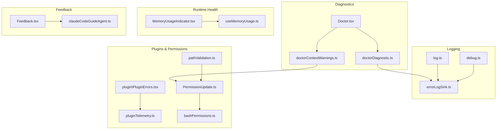
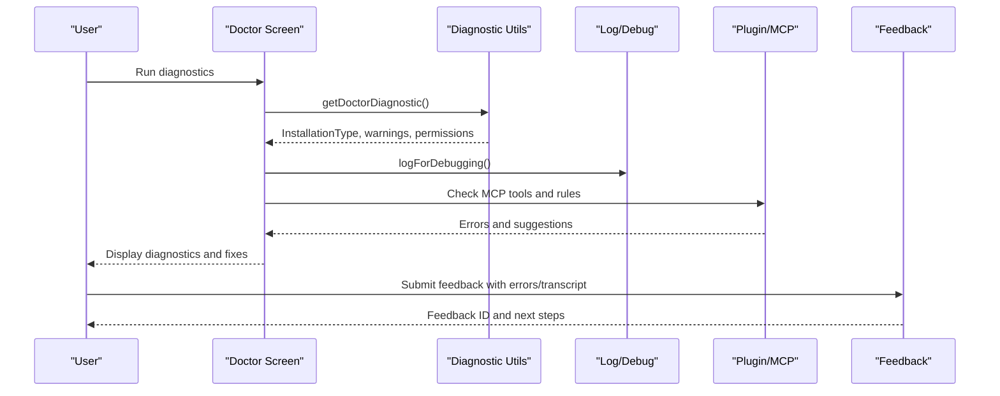
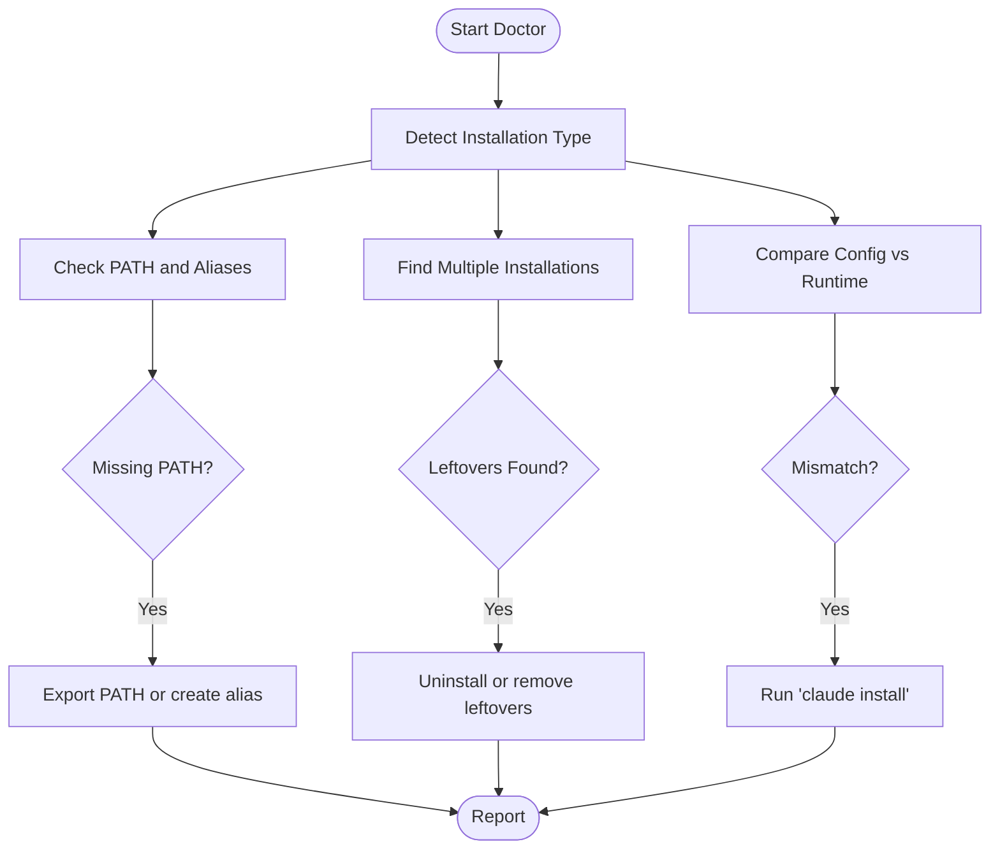
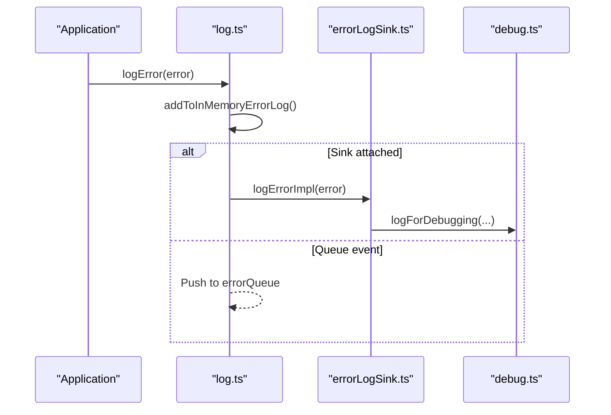
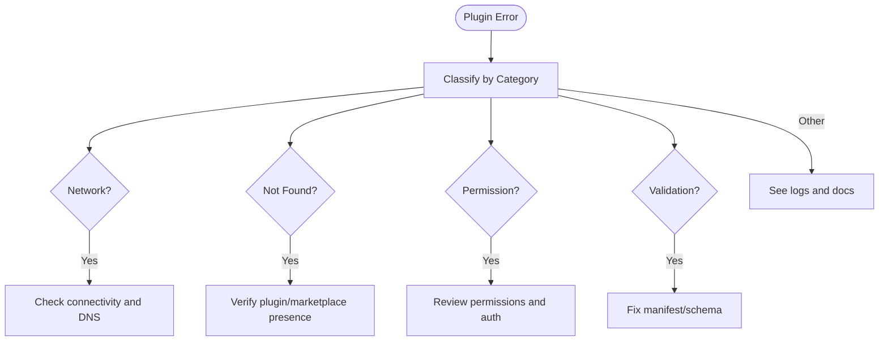
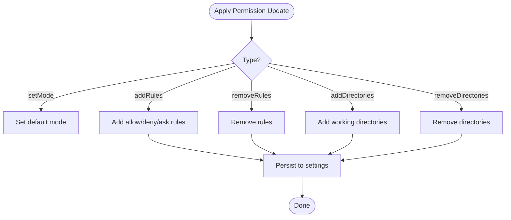
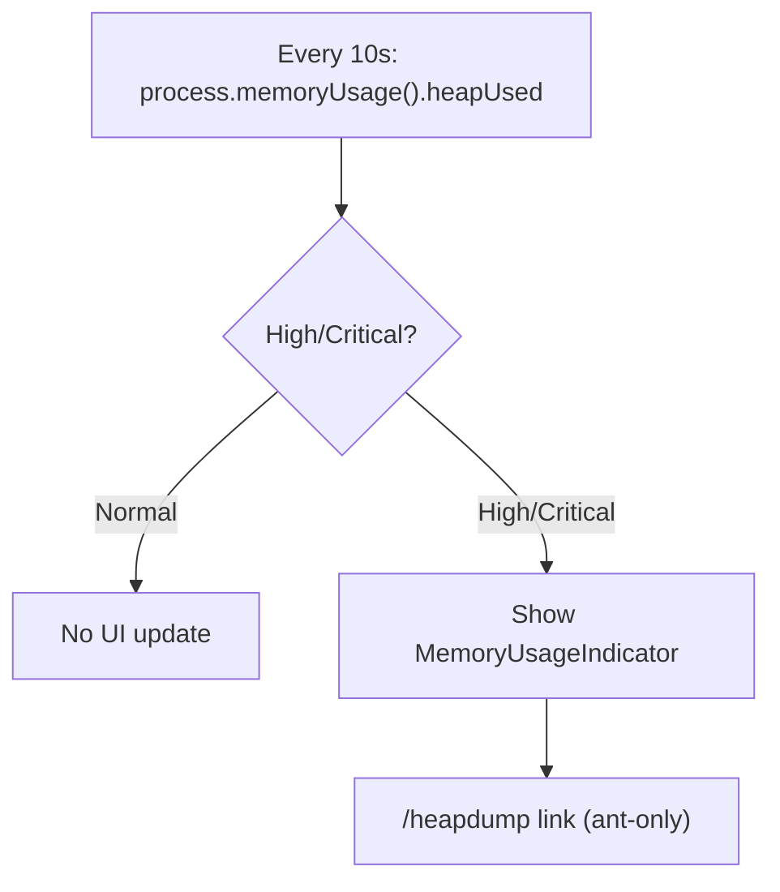
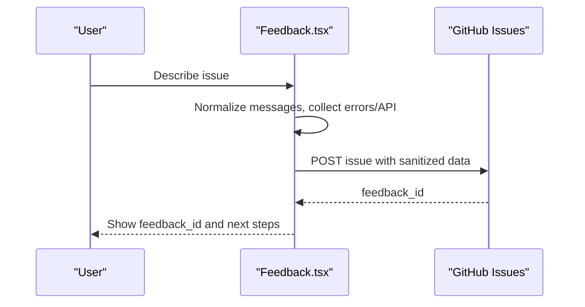
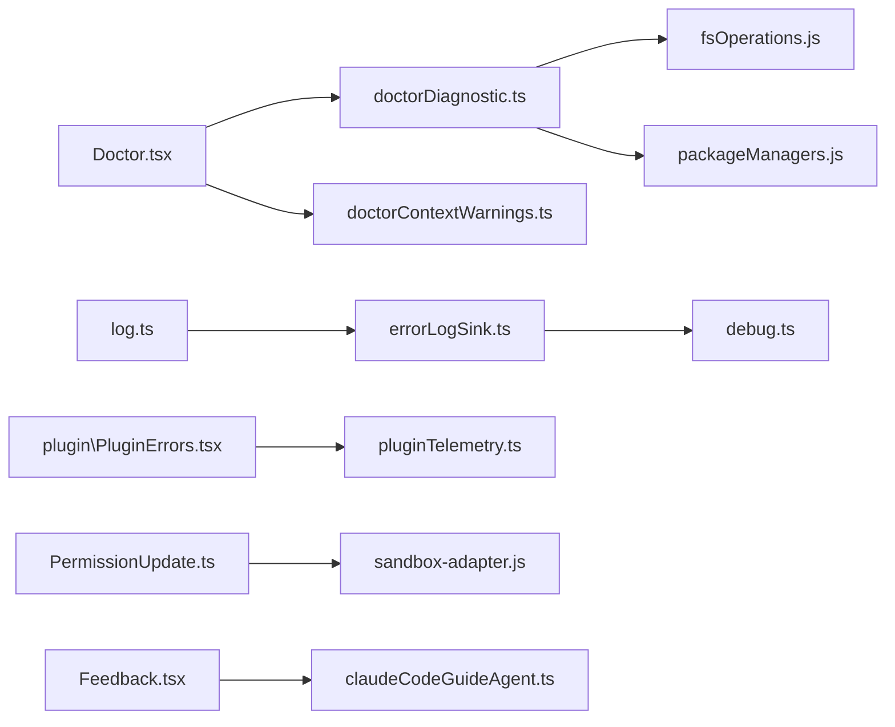

# Troubleshooting and FAQ

<cite>
**Referenced Files in This Document**
- [README.md](file://README.md)
- [Doctor.tsx](file://src/screens/Doctor.tsx)
- [doctorDiagnostic.ts](file://src/utils/doctorDiagnostic.ts)
- [doctorContextWarnings.ts](file://src/utils/doctorContextWarnings.ts)
- [log.ts](file://src/utils/log.ts)
- [errorLogSink.ts](file://src/utils/errorLogSink.ts)
- [debug.ts](file://src/utils/debug.ts)
- [errors.ts](file://src/utils/errors.ts)
- [useMemoryUsage.ts](file://src/hooks/useMemoryUsage.ts)
- [MemoryUsageIndicator.tsx](file://src/components/MemoryUsageIndicator.tsx)
- [installer.ts](file://src/utils/nativeInstaller/installer.ts)
- [pathValidation.ts](file://src/tools/PowerShellTool/pathValidation.ts)
- [plugin\PluginErrors.tsx](file://src/commands/plugin/PluginErrors.tsx)
- [pluginTelemetry.ts](file://src/utils/telemetry/pluginTelemetry.ts)
- [PermissionUpdate.ts](file://src/utils/permissions/PermissionUpdate.ts)
- [bashPermissions.ts](file://src/tools/BashTool/bashPermissions.ts)
- [Feedback.tsx](file://src/components/Feedback.tsx)
- [claudeCodeGuideAgent.ts](file://src/tools/AgentTool/built-in/claudeCodeGuideAgent.ts)
</cite>

## Table of Contents
1. [Introduction](#introduction)
2. [Project Structure](#project-structure)
3. [Core Components](#core-components)
4. [Architecture Overview](#architecture-overview)
5. [Detailed Component Analysis](#detailed-component-analysis)
6. [Dependency Analysis](#dependency-analysis)
7. [Performance Considerations](#performance-considerations)
8. [Troubleshooting Guide](#troubleshooting-guide)
9. [Conclusion](#conclusion)
10. [Appendices](#appendices)

## Introduction
This document provides comprehensive troubleshooting and FAQ guidance for the Claude Code Python IDE. It focuses on diagnosing and resolving installation issues, permission errors, plugin conflicts, and performance problems. It also covers error logging, debug techniques, diagnostic tools, and best practices for reporting bugs and seeking community support.

## Project Structure
The Claude Code IDE is a CLI-driven application with a modular architecture supporting:
- Installation diagnostics and health checks
- Error and debug logging
- Plugin and MCP server management
- Permission and sandbox controls
- Memory usage monitoring
- Feedback and bug reporting

**Diagram sources**
- [Doctor.tsx:100-501](file://src/screens/Doctor.tsx#L100-L501)
- [doctorDiagnostic.ts:514-625](file://src/utils/doctorDiagnostic.ts#L514-L625)
- [doctorContextWarnings.ts:246-265](file://src/utils/doctorContextWarnings.ts#L246-L265)
- [log.ts:158-199](file://src/utils/log.ts#L158-L199)
- [errorLogSink.ts:225-235](file://src/utils/errorLogSink.ts#L225-L235)
- [debug.ts:203-228](file://src/utils/debug.ts#L203-L228)
- [useMemoryUsage.ts:18-39](file://src/hooks/useMemoryUsage.ts#L18-L39)
- [MemoryUsageIndicator.tsx:1-36](file://src/components/MemoryUsageIndicator.tsx#L1-L36)
- [plugin\PluginErrors.tsx:23-123](file://src/commands/plugin/PluginErrors.tsx#L23-L123)
- [pluginTelemetry.ts:238-259](file://src/utils/telemetry/pluginTelemetry.ts#L238-L259)
- [PermissionUpdate.ts:55-83](file://src/utils/permissions/PermissionUpdate.ts#L55-L83)
- [bashPermissions.ts:390-430](file://src/tools/BashTool/bashPermissions.ts#L390-L430)
- [pathValidation.ts:46-61](file://src/tools/PowerShellTool/pathValidation.ts#L46-L61)
- [Feedback.tsx:197-250](file://src/components/Feedback.tsx#L197-L250)
- [claudeCodeGuideAgent.ts:89-96](file://src/tools/AgentTool/built-in/claudeCodeGuideAgent.ts#L89-L96)

**Section sources**
- [README.md:1-49](file://README.md#L1-L49)

## Core Components
- Installation diagnostics and health checks: Detects installation type, PATH issues, multiple installations, and environment configuration mismatches.
- Error logging and debug logging: Centralized sinks for persistent error logs and debug streams with filtering and symlink management.
- Plugin and MCP diagnostics: Classifies plugin errors by category and provides actionable fixes.
- Permission and sandbox controls: Applies permission updates, validates paths, and enforces sandbox rules.
- Memory usage monitoring: Periodically polls memory usage and surfaces high or critical thresholds.
- Feedback and bug reporting: Collects diagnostic data and opens GitHub issues with sanitized content.

**Section sources**
- [Doctor.tsx:100-501](file://src/screens/Doctor.tsx#L100-L501)
- [doctorDiagnostic.ts:514-625](file://src/utils/doctorDiagnostic.ts#L514-L625)
- [log.ts:158-203](file://src/utils/log.ts#L158-L203)
- [errorLogSink.ts:225-235](file://src/utils/errorLogSink.ts#L225-L235)
- [plugin\PluginErrors.tsx:23-123](file://src/commands/plugin/PluginErrors.tsx#L23-L123)
- [pluginTelemetry.ts:238-259](file://src/utils/telemetry/pluginTelemetry.ts#L238-L259)
- [PermissionUpdate.ts:55-83](file://src/utils/permissions/PermissionUpdate.ts#L55-L83)
- [useMemoryUsage.ts:18-39](file://src/hooks/useMemoryUsage.ts#L18-L39)
- [MemoryUsageIndicator.tsx:1-36](file://src/components/MemoryUsageIndicator.tsx#L1-L36)
- [Feedback.tsx:197-250](file://src/components/Feedback.tsx#L197-L250)

## Architecture Overview
The troubleshooting architecture integrates diagnostics, logging, and feedback into a cohesive workflow. The Doctor screen orchestrates installation and context checks, while logging utilities capture errors and debug information. Plugin and permission systems provide targeted remediation guidance.

**Diagram sources**
- [Doctor.tsx:100-501](file://src/screens/Doctor.tsx#L100-L501)
- [doctorDiagnostic.ts:514-625](file://src/utils/doctorDiagnostic.ts#L514-L625)
- [log.ts:158-199](file://src/utils/log.ts#L158-L199)
- [debug.ts:203-228](file://src/utils/debug.ts#L203-L228)
- [plugin\PluginErrors.tsx:23-123](file://src/commands/plugin/PluginErrors.tsx#L23-L123)
- [Feedback.tsx:197-250](file://src/components/Feedback.tsx#L197-L250)

## Detailed Component Analysis

### Installation Diagnostics and Fixes
- Detects installation type (npm-global, npm-local, native, package-manager, development).
- Identifies multiple installations and suggests cleanup.
- Validates PATH for native installs and shell aliases.
- Checks configuration mismatches and provides fixes.
- Surfaces Linux sandbox glob pattern warnings.

**Diagram sources**
- [doctorDiagnostic.ts:514-625](file://src/utils/doctorDiagnostic.ts#L514-L625)
- [Doctor.tsx:100-501](file://src/screens/Doctor.tsx#L100-L501)

**Section sources**
- [doctorDiagnostic.ts:514-625](file://src/utils/doctorDiagnostic.ts#L514-L625)
- [Doctor.tsx:100-501](file://src/screens/Doctor.tsx#L100-L501)

### Error Logging and Debugging
- Centralized error logging to file and in-memory buffers.
- Debug logging with filtering, level control, and symlink to latest log.
- MCP-specific error and debug logging with per-server files.

**Diagram sources**
- [log.ts:158-199](file://src/utils/log.ts#L158-L199)
- [errorLogSink.ts:152-174](file://src/utils/errorLogSink.ts#L152-L174)
- [debug.ts:203-228](file://src/utils/debug.ts#L203-L228)

**Section sources**
- [log.ts:158-203](file://src/utils/log.ts#L158-L203)
- [errorLogSink.ts:152-174](file://src/utils/errorLogSink.ts#L152-L174)
- [debug.ts:203-228](file://src/utils/debug.ts#L203-L228)

### Plugin and MCP Error Classification
- Classifies plugin errors by category (network, not-found, permission, validation).
- Provides actionable suggestions for common plugin issues.
- Integrates with telemetry for categorization.

**Diagram sources**
- [pluginTelemetry.ts:238-259](file://src/utils/telemetry/pluginTelemetry.ts#L238-L259)
- [plugin\PluginErrors.tsx:23-123](file://src/commands/plugin/PluginErrors.tsx#L23-L123)

**Section sources**
- [pluginTelemetry.ts:238-259](file://src/utils/telemetry/pluginTelemetry.ts#L238-L259)
- [plugin\PluginErrors.tsx:23-123](file://src/commands/plugin/PluginErrors.tsx#L23-L123)

### Permission and Sandbox Controls
- Applies permission updates (add/remove rules, directories, modes).
- Validates paths and resolves symlinks for safety.
- Enforces sandbox rules and warns about unsupported glob patterns on Linux.

**Diagram sources**
- [PermissionUpdate.ts:55-83](file://src/utils/permissions/PermissionUpdate.ts#L55-L83)
- [PermissionUpdate.ts:196-342](file://src/utils/permissions/PermissionUpdate.ts#L196-L342)
- [pathValidation.ts:46-61](file://src/tools/PowerShellTool/pathValidation.ts#L46-L61)

**Section sources**
- [PermissionUpdate.ts:55-83](file://src/utils/permissions/PermissionUpdate.ts#L55-L83)
- [PermissionUpdate.ts:196-342](file://src/utils/permissions/PermissionUpdate.ts#L196-L342)
- [pathValidation.ts:46-61](file://src/tools/PowerShellTool/pathValidation.ts#L46-L61)

### Memory Usage Monitoring
- Polls Node.js heap usage every 10 seconds.
- Emits a warning when usage exceeds thresholds.
- Displays formatted size and provides internal links for dumps.

**Diagram sources**
- [useMemoryUsage.ts:18-39](file://src/hooks/useMemoryUsage.ts#L18-L39)
- [MemoryUsageIndicator.tsx:1-36](file://src/components/MemoryUsageIndicator.tsx#L1-L36)

**Section sources**
- [useMemoryUsage.ts:18-39](file://src/hooks/useMemoryUsage.ts#L18-L39)
- [MemoryUsageIndicator.tsx:1-36](file://src/components/MemoryUsageIndicator.tsx#L1-L36)

### Feedback and Bug Reporting
- Collects environment info, transcripts, errors, and last API request.
- Sanitizes content and opens GitHub issues with labels and body formatting.
- Guides users to appropriate channels for 3P service environments.

**Diagram sources**
- [Feedback.tsx:197-250](file://src/components/Feedback.tsx#L197-L250)
- [claudeCodeGuideAgent.ts:89-96](file://src/tools/AgentTool/built-in/claudeCodeGuideAgent.ts#L89-L96)

**Section sources**
- [Feedback.tsx:197-250](file://src/components/Feedback.tsx#L197-L250)
- [claudeCodeGuideAgent.ts:89-96](file://src/tools/AgentTool/built-in/claudeCodeGuideAgent.ts#L89-L96)

## Dependency Analysis
- Diagnostics depend on configuration, environment detection, and filesystem checks.
- Logging depends on buffered writers and filesystem operations.
- Plugin diagnostics rely on telemetry classification and plugin manifests.
- Permission updates depend on settings persistence and sandbox adapters.
- Feedback depends on environment info and GitHub API.

**Diagram sources**
- [Doctor.tsx:100-501](file://src/screens/Doctor.tsx#L100-L501)
- [doctorDiagnostic.ts:514-625](file://src/utils/doctorDiagnostic.ts#L514-L625)
- [doctorContextWarnings.ts:246-265](file://src/utils/doctorContextWarnings.ts#L246-L265)
- [log.ts:158-199](file://src/utils/log.ts#L158-L199)
- [errorLogSink.ts:225-235](file://src/utils/errorLogSink.ts#L225-L235)
- [debug.ts:203-228](file://src/utils/debug.ts#L203-L228)
- [plugin\PluginErrors.tsx:23-123](file://src/commands/plugin/PluginErrors.tsx#L23-L123)
- [pluginTelemetry.ts:238-259](file://src/utils/telemetry/pluginTelemetry.ts#L238-L259)
- [PermissionUpdate.ts:55-83](file://src/utils/permissions/PermissionUpdate.ts#L55-L83)
- [Feedback.tsx:197-250](file://src/components/Feedback.tsx#L197-L250)
- [claudeCodeGuideAgent.ts:89-96](file://src/tools/AgentTool/built-in/claudeCodeGuideAgent.ts#L89-L96)

**Section sources**
- [doctorDiagnostic.ts:514-625](file://src/utils/doctorDiagnostic.ts#L514-L625)
- [log.ts:158-199](file://src/utils/log.ts#L158-L199)
- [errorLogSink.ts:225-235](file://src/utils/errorLogSink.ts#L225-L235)
- [plugin\PluginErrors.tsx:23-123](file://src/commands/plugin/PluginErrors.tsx#L23-L123)
- [pluginTelemetry.ts:238-259](file://src/utils/telemetry/pluginTelemetry.ts#L238-L259)
- [PermissionUpdate.ts:55-83](file://src/utils/permissions/PermissionUpdate.ts#L55-L83)
- [Feedback.tsx:197-250](file://src/components/Feedback.tsx#L197-L250)

## Performance Considerations
- Monitor memory usage: Use the memory hook and indicator to detect high or critical usage.
- Reduce context size: Large CLAUDE.md files, many MCP tools, or extensive agent descriptions increase token usage.
- Optimize plugin usage: Disable unused plugins and resolve duplicate MCP servers.
- Limit output sizes: Control shell and task output limits via environment variables.

[No sources needed since this section provides general guidance]

## Troubleshooting Guide

### Installation Problems
Common symptoms and resolutions:
- Multiple installations detected: Remove orphaned or unused installations to avoid confusion.
- PATH not configured for native installs: Add ~/.local/bin to PATH or create a shell alias.
- Configuration mismatch: Run the installer to align config with runtime.

**Section sources**
- [doctorDiagnostic.ts:526-566](file://src/utils/doctorDiagnostic.ts#L526-L566)
- [doctorDiagnostic.ts:432-484](file://src/utils/doctorDiagnostic.ts#L432-L484)
- [Doctor.tsx:100-501](file://src/screens/Doctor.tsx#L100-L501)

### Permission Errors
Common causes and fixes:
- ENOENT/EACCES/EPERM: Verify file existence, permissions, and directory access.
- BashTool/PowerShellTool path validation: Review wildcard handling and symlink resolution.
- Sandbox glob patterns on Linux: Replace unsupported glob patterns with explicit paths.

**Section sources**
- [errors.ts:186-195](file://src/utils/errors.ts#L186-L195)
- [pathValidation.ts:46-61](file://src/tools/PowerShellTool/pathValidation.ts#L46-L61)
- [doctorDiagnostic.ts:498-512](file://src/utils/doctorDiagnostic.ts#L498-L512)

### Plugin Conflicts and MCP Issues
Common categories and remedies:
- Network errors: Check connectivity and DNS resolution.
- Not found: Confirm plugin/marketplace availability.
- Permission errors: Adjust authentication and access controls.
- Validation errors: Fix manifest or schema issues.
- Duplicate MCP servers: Disable conflicting plugin or remove redundant config.

**Section sources**
- [pluginTelemetry.ts:238-259](file://src/utils/telemetry/pluginTelemetry.ts#L238-L259)
- [plugin\PluginErrors.tsx:23-123](file://src/commands/plugin/PluginErrors.tsx#L23-L123)

### Performance Issues
Symptoms and actions:
- High memory usage: Investigate long-running tasks and reduce context size.
- Slow operations: Limit output sizes and disable heavy plugins.
- Excessive MCP tools: Consolidate servers and prune unused tools.

**Section sources**
- [useMemoryUsage.ts:18-39](file://src/hooks/useMemoryUsage.ts#L18-L39)
- [MemoryUsageIndicator.tsx:1-36](file://src/components/MemoryUsageIndicator.tsx#L1-L36)
- [doctorContextWarnings.ts:119-207](file://src/utils/doctorContextWarnings.ts#L119-L207)

### Error Codes and Messages
- ENOENT: File or directory not found; verify path and permissions.
- EACCES/EPERM: Permission denied; adjust ownership or access.
- ECONNREFUSED/ENOTFOUND: Network connectivity issues; check proxy and DNS.
- Axios 401/403: Authentication failure; re-authenticate or refresh tokens.
- MCP server errors: Inspect server logs and configuration.

**Section sources**
- [errors.ts:139-141](file://src/utils/errors.ts#L139-L141)
- [errors.ts:186-195](file://src/utils/errors.ts#L186-L195)
- [errors.ts:213-238](file://src/utils/errors.ts#L213-L238)
- [errorLogSink.ts:152-174](file://src/utils/errorLogSink.ts#L152-L174)

### Debugging Techniques and Diagnostic Tools
- Enable debug logging: Use --debug or --debug-file to capture detailed logs.
- Filter debug messages: Use --debug=pattern to narrow output.
- View latest debug log: Symlink at ~/.claude/debug/latest.
- Collect in-memory errors: Use getInMemoryErrors() for current session errors.
- Inspect MCP logs: Per-server logs in ~/.claude/mcp-logs/<server>.

**Section sources**
- [debug.ts:44-57](file://src/utils/debug.ts#L44-L57)
- [debug.ts:73-83](file://src/utils/debug.ts#L73-L83)
- [debug.ts:230-236](file://src/utils/debug.ts#L230-L236)
- [log.ts:209-223](file://src/utils/log.ts#L209-L223)
- [errorLogSink.ts:36-38](file://src/utils/errorLogSink.ts#L36-L38)

### Reporting Bugs and Seeking Support
- Use feedback dialog: Summarize the issue and include environment info.
- Include sanitized logs: Provide errors, transcripts, and last API request.
- For 3P services: Use built-in guidance to report issues appropriately.
- Open GitHub issues: The system generates a pre-filled URL with sanitized content.

**Section sources**
- [Feedback.tsx:197-250](file://src/components/Feedback.tsx#L197-L250)
- [claudeCodeGuideAgent.ts:89-96](file://src/tools/AgentTool/built-in/claudeCodeGuideAgent.ts#L89-L96)

### Frequently Asked Questions
- How do I fix PATH issues for native installs? Add ~/.local/bin to PATH or create an alias.
- Why am I seeing duplicate MCP servers? Disable the plugin-provided server or remove the redundant config.
- How do I reduce memory usage? Close large files, disable heavy plugins, and limit context size.
- How do I check my installation health? Run the Doctor screen to see diagnostics and recommendations.

**Section sources**
- [doctorDiagnostic.ts:432-484](file://src/utils/doctorDiagnostic.ts#L432-L484)
- [plugin\PluginErrors.tsx:80-90](file://src/commands/plugin/PluginErrors.tsx#L80-L90)
- [useMemoryUsage.ts:18-39](file://src/hooks/useMemoryUsage.ts#L18-L39)
- [Doctor.tsx:100-501](file://src/screens/Doctor.tsx#L100-L501)

## Conclusion
This guide consolidates practical steps to diagnose and resolve common issues in the Claude Code Python IDE. By leveraging built-in diagnostics, logging, and feedback mechanisms, users can efficiently troubleshoot installation, permission, plugin, and performance concerns while following best practices for reporting bugs and seeking support.

[No sources needed since this section summarizes without analyzing specific files]

## Appendices

### Best Practices
- Keep the IDE updated and aligned with configuration.
- Regularly review diagnostics and warnings.
- Use debug logging only when needed to minimize overhead.
- Sanitize sensitive data before sharing logs or feedback.

[No sources needed since this section provides general guidance]